# 使用 Python 收集 NFL 数据并比较四分卫效率

> 原文：<https://towardsdatascience.com/scraping-nfl-stats-to-compare-quarterback-efficiencies-4989642e02fe?source=collection_archive---------20----------------------->

## 使用 BeautifulSoup 收集 NFL 数据并绘制四分卫的雷达图


Riley McCullough 在 [Unsplash](https://unsplash.com/s/photos/american-football?utm_source=unsplash&utm_medium=referral&utm_content=creditCopyText) 上拍摄的照片

我总是担心试图收集自己的数据，事实上，像 Kaggle 这样的网站聚集了如此高质量的数据集，使得学习这种技能变得不那么必要。然而，这个平台上大量关于数据科学的教育文章帮助我在收集自己的数据集方面取得了进展。很多搜集数据的灵感和方法都来自这里的。

在本文中，我将从 [Pro Football Reference](https://www.pro-football-reference.com/) 中提取 2019–20 NFL 赛季的四分卫统计数据，并使用它们创建雷达图来评估 QB 效率。

# **加载包**

为了打开网页并抓取数据，我们将使用两个模块，`urllib.request`打开 URL，`BeautifulSoup`解析 HTML。

```
# Import scraping modules
from urllib.request import urlopen
from bs4 import BeautifulSoup
```

除了这些包，我们还需要一些包来操作数据，`numpy`和`pandas`，并绘制我们的数据，`matplotlib`。

```
# Import data manipulation modules
import pandas as pd
import numpy as np# Import data visualization modules
import matplotlib as mpl
import matplotlib.pyplot as plt
```

# **刮数据**

我们要导入的数据是 2019 赛季的 NFL 传球数据，可以在这里[找到](https://www.pro-football-reference.com/years/2019/passing.htm)。我们打开站点，并通过以下内容将其传递给`BeautifulSoup`:

```
# URL of page
url = 'https://www.pro-football-reference.com/years/2019/passing.htm'# Open URL and pass to BeautifulSoup
html = urlopen(url)
stats_page = BeautifulSoup(html)
```

请注意，通过将 URL 中的`2019`更改为您选择的年份，我们可以很容易地将所有这些分析调整到以前的年份。

我们将用来抓取页面的两个`BeautifulSoup`函数是`findAll()`和`getText()`，它们基于我们正在抓取的页面的 HTML 返回值。我在下面给出了简化的用例——对于所有的可能性，你应该参考[文档](https://www.crummy.com/software/BeautifulSoup/bs4/doc/)。

```
findAll(name)Parameters
name -- HTML tags to use to parse webpageReturns array of all matches to name tag getText()Returns text from HTML
```

为了使这些有效，我们必须确定页面源中的模式。在我们的例子中，数据在表格中被很好地格式化，所以我们可以找到所有的表格行(`tr`)和列(`td`)，并直接从单元格中提取文本。

首先，我们需要收集列标题，以便稍后在数据框架中使用它们。为此，我们找到页面中的第一个`tr`元素，并从所有表格标题中收集文本(`th`):

```
# Collect table headerscolumn_headers = stats_page.findAll('tr')[0]
column_headers = [i.getText() for i in column_headers.findAll('th')]
```

我们索引第一个元素，因为这是包含列标题的行。我们可以查看我们的结果:

```
print(column_headers)>>> ['Rk', 'Player', 'Tm', 'Age', 'Pos', 'G', 'GS', 'QBrec', 'Cmp', 'Att', 'Cmp%', 'Yds', 'TD', 'TD%', 'Int', 'Int%', '1D', 'Lng', 'Y/A', 'AY/A', 'Y/C', 'Y/G', 'Rate', 'QBR', 'Sk', 'Yds', 'NY/A', 'ANY/A', 'Sk%', '4QC', 'GWD']
```

为了收集实际的数据，我们将首先收集所有的表行(`tr`)并将它们存储在一个数组中。然后，我们遍历每一行，用`getText()`收集每一列中的文本(`td`):

```
# Collect table rows
rows = stats_page.findAll('tr')[1:]# Get stats from each row
qb_stats = []
for i in range(len(rows)):
  qb_stats.append([col.getText() for col in rows[i].findAll('td')])
```

我们跳过第一行，因为这些是我们之前刚刚收集的列标题。当我们检查`qb_stats`列表的第一行时:

```
print(qb_stats[0])>>> ['Jared Goff', 'LAR', '25', 'QB', '16', '16', '9-7-0', '394', '626', '62.9', '4638', '22', '3.5', '16', '2.6', '220', '66', '7.4', '7.0', '11.8', '289.9', '86.5', '', '22', '170', '6.90', '6.46', '3.4', '1', '2']
```

现在，我们可以将标题和统计数据合并到一个`pandas`数据帧中。如果您以前没有使用过`pandas`，它本质上是一个 Excel 电子表格，您可以通过编程来操作，因此它非常适合处理大型数据集。我们注意到上面的`Rk`列在我们的`qb_stats`列表中没有相应的数据——这是因为那些值都是表头，所以我们的`findAll()`函数没有提取它们的数据。无论如何，这些数据对于我们的分析来说都是无关紧要的，因此我们在创建数据帧时会将其忽略。

```
# Create DataFrame from our scraped data
data = pd.DataFrame(qb_stats, columns=column_headers[1:])
```

`columns` —数据框架的列标题(我们省略了`Rk`)

现在，让我们看看数据帧的前五行:

```
# Examine first five rows of data
data.head()
```

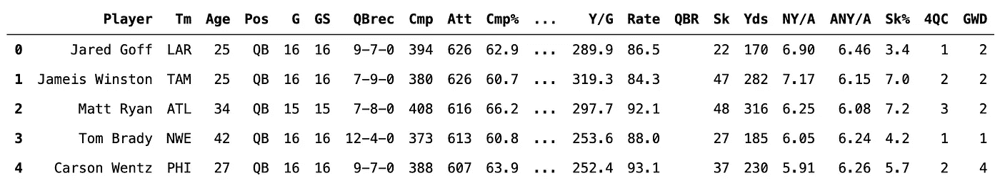

成功！

# **操作和清理数据**

现在，我们可以处理这个数据框中的数据，得到我们需要的东西来制作我们的雷达图。首先，让我们看看集合中的所有列:

```
# View columns in data
data.columns>>> Index(['Player', 'Tm', 'Age', 'Pos', 'G', 'GS', 'QBrec', 'Cmp', 'Att', 'Cmp%', 'Yds', 'TD', 'TD%', 'Int', 'Int%', '1D', 'Lng', 'Y/A', 'AY/A', 'Y/C', 'Y/G', 'Rate', 'QBR', 'Sk', 'Yds', 'NY/A', 'ANY/A', 'Sk%', '4QC', 'GWD'], dtype='object')
```

我们立即看到一个问题—有两个标题为`Yds`的列；一个是传球码，另一个是因为被抢而失去的码。我们可以通过重命名后者来轻松解决这个问题:

```
# Rename sack yards column to `Yds_Sack`
new_columns = data.columns.values
new_columns[-6] = 'Yds_Sack'
data.columns = new_columns
```

现在，让我们再次查看我们的专栏:

```
# View columns in data
data.columns>>> Index(['Player', 'Tm', 'Age', 'Pos', 'G', 'GS', 'QBrec', 'Cmp', 'Att', 'Cmp%', 'Yds', 'TD', 'TD%', 'Int', 'Int%', '1D', 'Lng', 'Y/A', 'AY/A', 'Y/C', 'Y/G', 'Rate', 'QBR', 'Sk', 'Yds_Sack', 'NY/A', 'ANY/A', 'Sk%', '4QC', 'GWD'], dtype='object')
```

我们已经成功地将该列重命名为`Yds_Sack`，并且不再有列名冲突！接下来，让我们确定我们对可视化感兴趣的统计类别。我们将选择:

(1)完成百分比— `Cmp%`

(2)传球码— `Yds`

(3)传球达阵— `TD`

(4)拦截— `Int`

每次试跳 5 码— `Y/A`

(6)及格分数— `Rate`

```
# Select stat categories
categories = ['Cmp%', 'Yds', 'TD', 'Int', 'Y/A', 'Rate']
```

现在，让我们创建一个新的数据框架，作为原始数据的子集，只使用我们选择的类别中的数据。此外，我们将添加球员的名字和球队。

```
# Create data subset for radar chart
data_radar = data[['Player', 'Tm'] + categories]
data_radar.head()
```

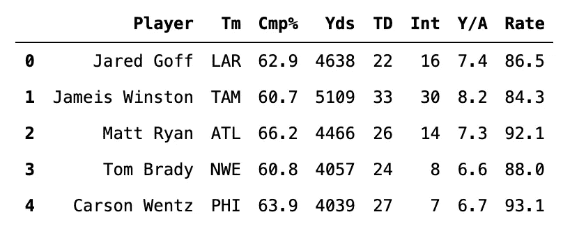

现在我们有了数据子集，让我们检查数据类型，因为我们从 URL 中提取了文本形式的值:

```
# Check data types
data_radar.dtypes>>> Player    object
    Tm        object
    Cmp%      object
    Yds       object
    TD        object
    Int       object
    Y/A       object
    Rate      object
    dtype: object
```

我们所有的数字数据都被存储为对象，所以我们不能操作它们。因此，在我们继续之前，我们必须将所有这些数据转换成数值。为此，我们使用了一个名为`pandas.to_numeric`的函数。

```
# Convert data to numerical values
for i in categories:
  data_radar[i] = pd.to_numeric(data[i])
```

现在，让我们再次检查我们的数据类型:

```
# Check data types
data_radar.dtypes>>> Player     object
    Tm         object
    Cmp%      float64
    Yds       float64
    TD        float64
    Int       float64
    Y/A       float64
    Rate      float64
    dtype: object
```

我们还有最后一项数据清理工作要做。在最初的网站上，他们把装饰性的人物放在有季末成就的球员旁边，比如职业碗(*)或全职业(+)选择。我们将使用`str.replace()`移除这些:

```
# Remove ornamental characters for achievements
data_radar['Player'] = data_radar['Player'].str.replace('*', '')
data_radar['Player'] = data_radar['Player'].str.replace('+', '')
```

让我们把数据过滤到投球距离超过 1500 码的四分卫:

```
# Filter by passing yards
data_radar_filtered = data_radar[data_radar['Yds'] > 1500]
```

现在，对于我们的雷达图，我们想通过百分位数计算每个四分卫的统计排名，这在`pandas`中用`DataFrame.rank(pct=True)`很容易完成。`rank()`函数可以采用其他参数来根据其他参数进行排序，您可以查阅[在线文档](https://pandas.pydata.org/pandas-docs/stable/reference/api/pandas.DataFrame.rank.html)。

此外，我们想翻转我们的拦截排名，因为我们不希望有最多拦截的 QB 有最高的百分位数！

```
# Create columns with percentile rank
for i in categories:
  data_radar_filtered[i + '_Rank'] = 
  data_radar_filtered[i].rank(pct=True)# We need to flip the rank for interceptions
data_radar_filtered['Int_Rank'] = 
1 - data_radar_filtered['Int_Rank']
```

现在我们检查我们的新数据:

```
# Examine data
data_radar_filtered.head()
```

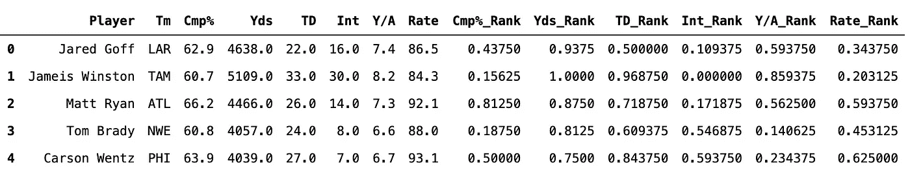

太好了！我们现在可以进行可视化了！

# **生成雷达图**

我们将从编辑一些通用的绘图参数开始。我们将生成一个极坐标图，因此 x 刻度对应于围绕圆的角度，我们将增加轴和刻度标签之间的填充:

```
# General plot parameters
mpl.rcParams['font.family'] = 'Avenir'
mpl.rcParams['font.size'] = 16
mpl.rcParams['axes.linewidth'] = 0
mpl.rcParams['xtick.major.pad'] = 15
```

对于图表中的颜色，我们将使用 NFL 球队颜色的十六进制代码，这些代码是从[链接](https://teamcolorcodes.com/nfl-team-color-codes/)中收集的。

```
team_colors = {'ARI':'#97233f', 'ATL':'#a71930', 'BAL':'#241773', 'BUF':'#00338d', 'CAR':'#0085ca', 'CHI':'#0b162a', 'CIN':'#fb4f14', 'CLE':'#311d00', 'DAL':'#041e42', 'DEN':'#002244', 'DET':'#0076b6', 'GNB':'#203731', 'HOU':'#03202f', 'IND':'#002c5f', 'JAX':'#006778', 'KAN':'#e31837', 'LAC':'#002a5e', 'LAR':'#003594', 'MIA':'#008e97', 'MIN':'#4f2683', 'NWE':'#002244', 'NOR':'#d3bc8d', 'NYG':'#0b2265', 'NYJ':'#125740', 'OAK':'#000000', 'PHI':'#004c54', 'PIT':'#ffb612', 'SFO':'#aa0000', 'SEA':'#002244', 'TAM':'#d50a0a', 'TEN':'#0c2340', 'WAS':'#773141'}
```

我们绘制所有观点的角度将取决于我们所拥有的统计类别的数量。在我们的例子中，我们有 6 个类别，所以我们将每隔 2π/6 弧度或 60 度绘制我们的点。我们可以使用`numpy.linspace()`计算如下:

```
# Calculate angles for radar chart
offset = np.pi/6
angles = np.linspace(0, 2*np.pi, len(categories) + 1) + offset
```

我们添加了`offset`项来调整标签出现在圆上的位置(第一个标签不是 0 弧度，而是出现在π/6)。

当我们绘制数据时，我们需要实际复制第一个类别，这样形状就会自动闭合。如果你注意到当我们计算角度时，我们有 7 个数据点，第一个和最后一个角度对应于圆上的同一点。因此，当我们绘制数据时，我们使用以下内容(我们将把它变成一个函数，所以`player_data`表示我们将传递的一行特定于玩家的数据):

```
# Plot data and fill with team color
ax.plot(angles, np.append(player_data[-(len(angles)-1):], player_data[-(len(angles)-1)]), color=color, linewidth=2)ax.fill(angles, np.append(player_data[-(len(angles)-1):], player_data[-(len(angles)-1)]), color=color, alpha=0.2)
```

上面的代码是有效的，因为我们的类别是数据帧的最后 6 列，所以`len(angles) — 1`对应于这些类别中的第一列(因为 angles 有一个额外的元素)。然后，我们将第一个类别的值附加到该数组的末尾，这样我们就可以关闭该形状。

现在我们可以设置类别名称的标签(因为我们的类别比角度少一个，所以我们省略了最后一个元素):

```
# Set category labels
ax.set_xticks(angles[:-1])
ax.set_xticklabels(categories)
```

最后，我们将在雷达图的顶部添加玩家的名字——我们将文本对象放置在绝对绘图坐标中的(π/2，1.7)处，以便它出现在轴的上方:

```
# Add player name
ax.text(np.pi/2, 1.7, player_data[0], ha='center', va='center', size=18, color=color)
```

我们可以将所有这些放在一起，创建一个辅助函数来生成我们的雷达图，如下所示:

让我们创建另一个助手函数，当给定一个团队输入时，返回 QB 数据的`numpy`数组:

```
# Function to get QB data
def get_qb_data(data, team):
  return np.asarray(data[data['Tm'] == team])[0]
```

# **可视化数据**

**NFC 西**

因为我是 49 人队的超级粉丝，所以我们先来看看 NFC 西区 QBs 的雷达图:

```
# Create figure
fig = plt.figure(figsize=(8, 8), facecolor='white')# Add subplots
ax1 = fig.add_subplot(221, projection='polar', facecolor='#ededed')
ax2 = fig.add_subplot(222, projection='polar', facecolor='#ededed')
ax3 = fig.add_subplot(223, projection='polar', facecolor='#ededed')
ax4 = fig.add_subplot(224, projection='polar', facecolor='#ededed')# Adjust space between subplots
plt.subplots_adjust(hspace=0.8, wspace=0.5)# Get QB data
sf_data = get_qb_data(data_radar_filtered, 'SFO')
sea_data = get_qb_data(data_radar_filtered, 'SEA')
ari_data = get_qb_data(data_radar_filtered, 'ARI')
lar_data = get_qb_data(data_radar_filtered, 'LAR')# Plot QB data
ax1 = create_radar_chart(ax1, angles, lar_data, team_colors['LAR'])
ax2 = create_radar_chart(ax2, angles, ari_data, team_colors['ARI'])
ax3 = create_radar_chart(ax3, angles, sea_data, team_colors['SEA'])
ax4 = create_radar_chart(ax4, angles, sf_data, team_colors['SFO'])plt.show()
```

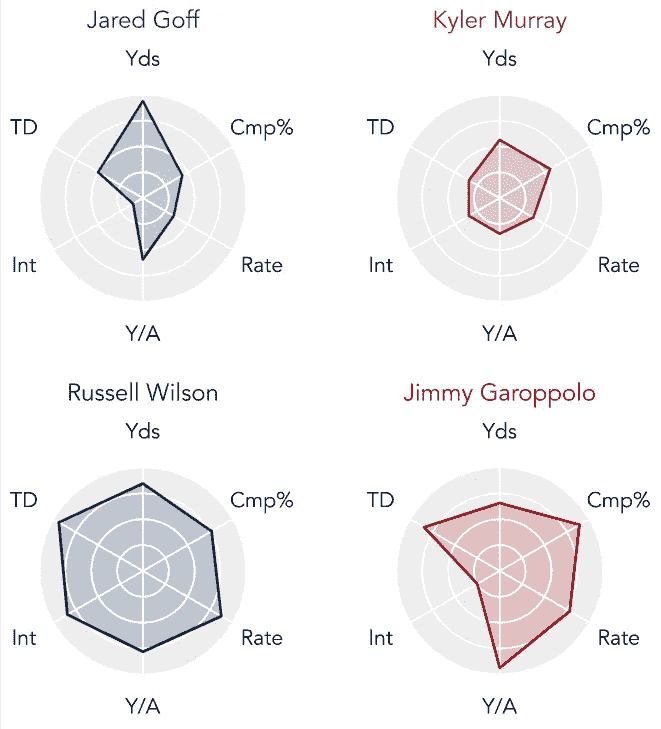

数据似乎支持我们从视力测试中看到的:

1.  Russell Wilson 处于精英水平，在所有统计类别中至少达到 75 个百分点。这个分析也没有考虑到他的扰流能力带来了什么。
2.  吉米·加罗波洛通常是一个可靠的四分卫，但不时会投出一些愚蠢的拦截。
3.  贾里德·戈夫(Jared Goff)获得了很多码，但这似乎并没有转化为大量生产(*即*“空码”)。
4.  凯勒穆雷很难判断，因为他是一个新秀，但他的效率看起来是四个人中最低的。像威尔逊一样，他的机动性在这个情节中没有被考虑。

**MVP 赛**

最有价值球员的争夺(在 QB)在拉塞尔·威尔逊和拉马尔·杰克逊(谁最终获胜)之间展开:

```
# MVP Race
# Create figure
fig = plt.figure(figsize=(8, 4), facecolor='white')# Add subplots
ax1 = fig.add_subplot(121, projection='polar', facecolor='#ededed')
ax2 = fig.add_subplot(122, projection='polar', facecolor='#ededed')# Adjust space between subplots
plt.subplots_adjust(hspace=0.8, wspace=0.5)# Get QB data
bal_data = get_qb_data(data_radar_filtered, 'BAL')
sea_data = get_qb_data(data_radar_filtered, 'SEA')# Plot QB data
ax1 = create_radar_chart(ax1, angles, sea_data, team_colors['SEA'])
ax2 = create_radar_chart(ax2, angles, bal_data, team_colors['BAL'])plt.show()
```

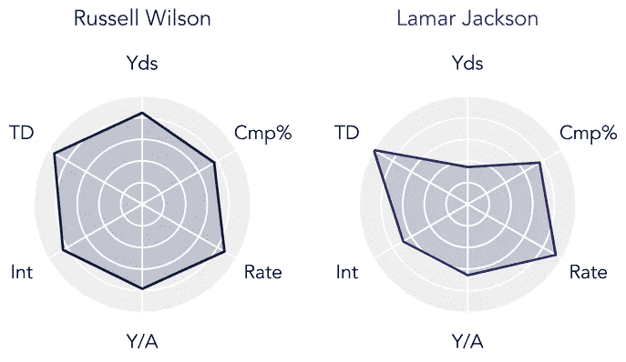

从一个纯粹的传球者的角度来看，拉塞尔·威尔逊有更平衡的数据，但拉马尔·杰克逊显然有更“划算”的传球码数，正如他的传球得分和四分卫得分所显示的那样。此外，拉马尔·杰克逊创造了一个赛季的 QB 冲刺记录，这在这张图表中没有体现出来。

**起草第一轮 QBs 的团队**

四名四分卫在 2020 年 NFL 第一轮选秀中被选中:乔·伯罗(CIN)，图阿·塔戈瓦洛(米娅)，贾斯汀·赫伯特(拉加)，以及(令人惊讶的)乔丹·洛夫(英国)。让我们想象一下这些选秀会取代的四分卫的数据。

```
# 1st Round Draft Picks
# Create figure
fig = plt.figure(figsize=(8, 8), facecolor='white')# Add subplots
ax1 = fig.add_subplot(221, projection='polar', facecolor='#ededed')
ax2 = fig.add_subplot(222, projection='polar', facecolor='#ededed')
ax3 = fig.add_subplot(223, projection='polar', facecolor='#ededed')
ax4 = fig.add_subplot(224, projection='polar', facecolor='#ededed')# Adjust space between subplots
plt.subplots_adjust(hspace=0.8, wspace=0.5)# Get QB data
cin_data = get_qb_data(data_radar_filtered, 'CIN')
mia_data = get_qb_data(data_radar_filtered, 'MIA')
lac_data = get_qb_data(data_radar_filtered, 'LAC')
gnb_data = get_qb_data(data_radar_filtered, 'GNB')# Plot QB data
ax1 = create_radar_chart(ax1, angles, cin_data, team_colors['CIN'])
ax2 = create_radar_chart(ax2, angles, mia_data, team_colors['MIA'])
ax3 = create_radar_chart(ax3, angles, lac_data, team_colors['LAC'])
ax4 = create_radar_chart(ax4, angles, gnb_data, team_colors['GNB'])plt.show()
```

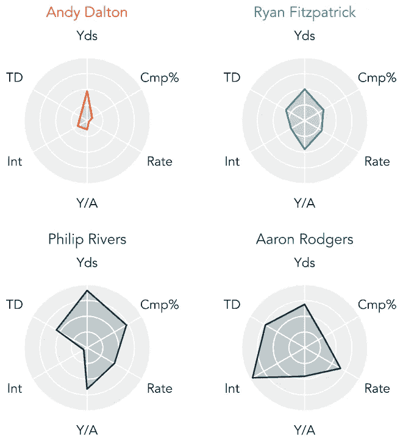

1.  无论从哪方面来看，安迪·道尔顿都经历了一个糟糕的赛季——显然是时候继续前进了
2.  Ryan Fitzpatrick 在所有六个统计指标上都低于平均水平，这个赛季表现平平。考虑到乔什-罗森在菲茨派翠克的比赛中坐冷板凳，热火需要为图阿的未来投资。
3.  菲利普·里弗斯实际上在大多数类别中表现平平，但显然有一些糟糕的决策，从他拦截的次数来看。
4.  Aaron Rodgers 经历了一个似乎高于平均水平的赛季，但从我们对他的高度期望来看，仍然低于平均水平。乔丹的爱情选择对每个人来说都是一个震惊。

# **其他分部**

## **NFC 北方**

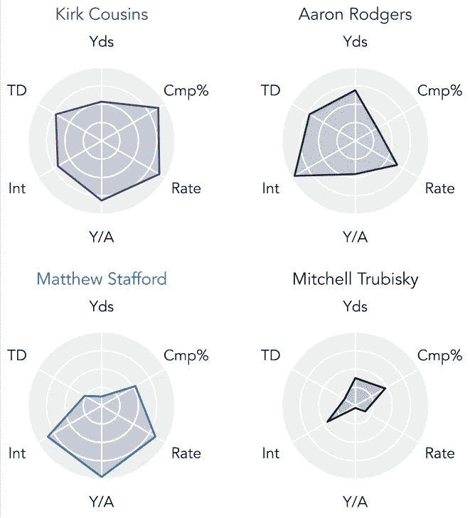

## **NFC 东**

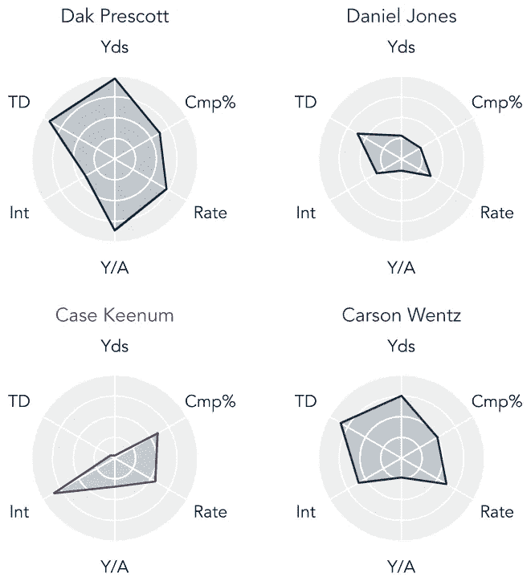

## **NFC South**

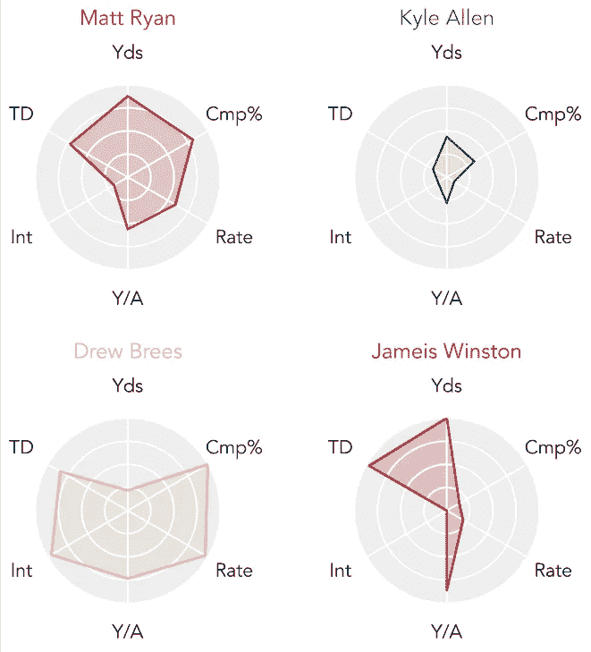

## **亚足联西区**

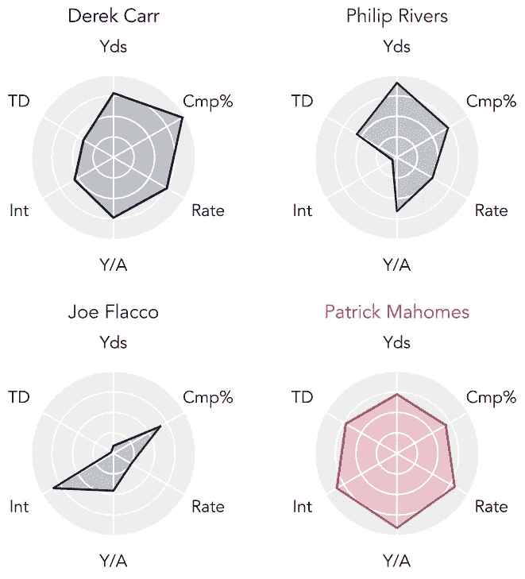

## **AFC 北部**

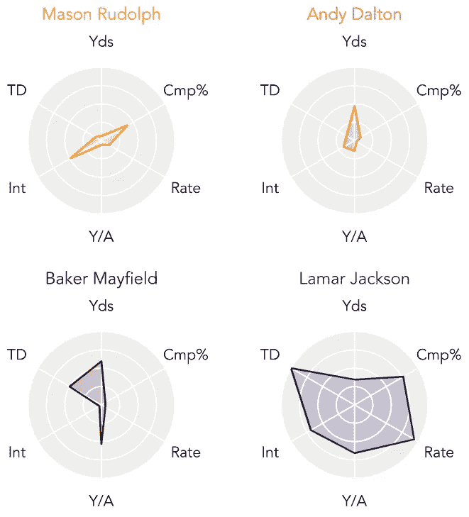

## **亚足联东区**

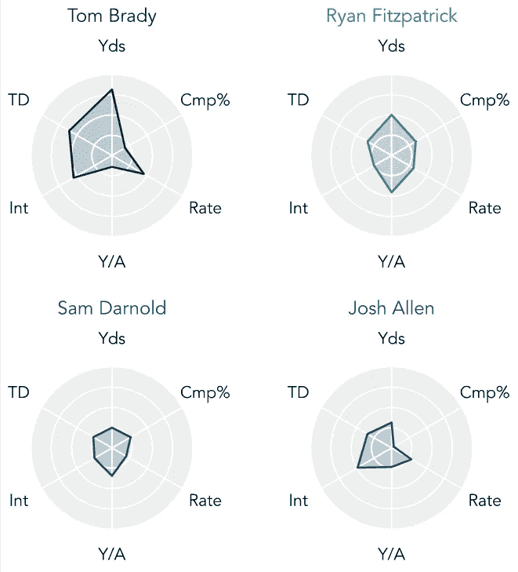

## **亚足联南区**


# **结束语**

正如您所看到的，可能性是无限的——这个框架可以很容易地适用于其他统计数据，如抢断和接收指标。本文使用的 Jupyter 笔记本可以在这个 [Github 资源库](https://github.com/venkatesannaveen/medium-articles)中找到。

感谢您的阅读！我感谢任何反馈，你可以在 [Twitter](https://twitter.com/naveenv_92) 上找到我，并在 [LinkedIn](https://www.linkedin.com/in/naveenvenkatesan/) 上与我联系以获得更多更新和文章。