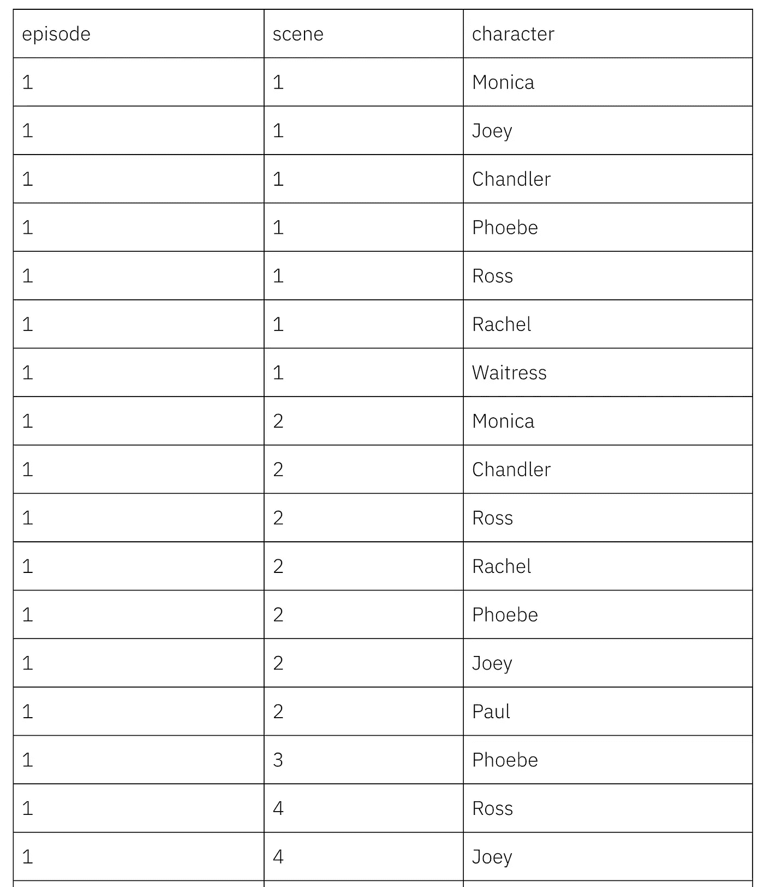

# 从半结构化文档中抓取结构化数据

> 原文：<https://towardsdatascience.com/scraping-structured-data-from-semi-structured-documents-d5fd2927a828?source=collection_archive---------39----------------------->

## 作为建立朋友角色网络项目的一部分，我需要从每一集收集信息

数据科学工具带来的最强大的功能之一是处理非结构化数据并将其转化为可结构化和可分析的数据的能力。任何称职的数据科学家都应该能够从文档中“抓取”数据，无论是来自网络、本地还是任何其他类型的基于文本的资产。

在这篇文章中，我将展示如何抓取电视节目 *Friends* 的在线脚本，目的是为每一集创建一个编号场景表以及这些场景中的角色名称。这是我建立互动*朋友*网络网站[的第一步。这也是一个很好的抓取技术的测试案例，因为剧本都有一定的基本结构，但这种结构并不完全可以预测，编剧并不总是遵循每集相同的格式规则。](https://keithmcnulty.github.io/friends_analysis/play_friends.html)

你可以在我的*朋友*项目的 [Github repo 上找到这项工作的所有最终代码。](https://github.com/keithmcnulty/friends_analysis)

我要刮的脚本可以在这里找到[。如果你点击每一个，你可以看到文件名有一个一致的格式，格式为](https://fangj.github.io/friends/)`[https://fangj.github.io/friends/season/[ss][ee].html](https://fangj.github.io/friends/season/0101.html)`，其中`[ss]`是两位数的季号，`[ee]`是两位数的集号。

为了有效地刮——你需要了解两件事:

1.  您选择的语言的相关抓取包。在我将在这里使用的 R 中，这些包是`rvest`和`xml2`。在 Python 里，大部分人用的都是美汤。如果你想要一个关于如何使用`rvest`和`xml2`抓取网页的深入教程，请看我之前的文章[这里](https://drkeithmcnulty.com/2019/08/16/tidy-web-scraping-in-r%e2%80%8a-%e2%80%8atutorial-and-resources/)，我建议你在阅读这篇文章之前先阅读一下。
2.  使用`regex`(正则表达式*的缩写*)的能力，这是文本搜索的语言。在本文中，我们将更多地关注`regex`。`regex`的语法在不同的平台上可能会有一些不同，但是大部分都非常相似。R 中`regex`的一个很好的备忘单是这里的。`regex`不是一个容易精通的话题——这个世界上很少有真正的`regex`专家——但是大多数数据科学家知道足够多的知识来执行最常见的任务，并且经常在网上搜索他们需要的其余内容。

# 看着老友记的剧本，想出我们需要做什么

让我们提醒自己这里的任务。我们对两件事感兴趣:

*   我们想把一集分成几个场景
*   我们想列出每个场景中出现的所有角色

让我们来看看第一季第一集的网页代码。你可以通过在 Google Chrome 中打开脚本，然后按下 CMD+Option+C(或者 Windows 中的 Ctrl+Shift+C)来打开 Elements 控制台，在这里你可以与页面本身并排查看页面的 HTML。

我们可以立即看到的一件事是，冒号前面的大多数单词都是我们感兴趣的。其实大部分都是在一个场景里说了些什么的角色名。我们还看到包含字符串`"Scene:"`的线条是场景边界的非常可靠的指示器。

我们可能要做的第一件事是在一个列表或节点向量中获取 HTML 代码，这些节点表示文档中不同的格式和文本。因为这将包含每个角色所说的单独的台词，这将对我们的工作非常有帮助。所以我们将使用我们漂亮的抓取包来下载 HTML 代码，将其分解成节点，这样我们就有了一个漂亮整洁的脚本内容向量。

```
library(rvest) # (also automatically loads xml2) url_string <- "https://fangj.github.io/friends/season/0101.html" nodes <- xml2::read_html(url_string) %>% 
  xml2::as_list() %>% 
  unlist()
```

现在，如果你看一下你的`nodes`对象，你会发现它是一个字符向量，包含许多不同的分割部分，但最重要的是它包含脚本中的行，例如:

```
> nodes[16] html.body.font.p 
"[Scene: Central Perk, Chandler, Joey, Phoebe, and Monica are there.]"
```

# 使用正则表达式提取我们需要的内容

为了对我们的任务有用，我们需要创建一个向量，如果该行代表一个场景的开始，则包含单词“New Scene ”,如果该行代表角色所说的话，则包含角色的名称。这将是我们想要做的最好的形式。

我们需要做的第一件事是将任何包含`"Scene:"`的文本字符串交换为字符串`"New Scene"`。我们可以非常简单地在`nodes`向量上使用`ifelse()`，其中我们使用`grepl()`来识别`nodes`中的哪些条目包含字符串`"Scene:"`。

```
nodes <- ifelse(grepl("Scene:", nodes), "New Scene", nodes)
```

我们可以快速检查是否有包含`"New Scene"`的条目。

```
> nodes[nodes == "New Scene"] [1] "New Scene" "New Scene" "New Scene" "New Scene" "New Scene" "New Scene" "New Scene" "New Scene" 
[9] "New Scene" "New Scene" "New Scene" "New Scene" "New Scene" "New Scene" "New Scene"
```

效果很好。现在，你可能也注意到了冒号前面的字符名。因此，这可能是提取字符名称的好方法(虽然它可能会给我们一些脚本中冒号之前的其他内容，但我们可以稍后再处理)。

所以我们要做的是用`regex`告诉 R 我们正在寻找冒号前面的任何东西。我们将如下使用一个*前瞻*字符串:`".+?(?=:)"`。

让我们看看这个字符串，确保我们知道它的意思。`.+?`组件的意思是“查找任意长度的任意文本字符串”。括号中的部分被称为 *lookahead* :它的意思是向前查找该字符串，并找到一个冒号作为下一个字符。因此，这指示 R 查找冒号前面的任何文本字符串并返回它。如果我们将包`stringr`和它的函数`str_extract()`与这个 regex 字符串一起使用，它将遍历`nodes`向量的每个条目，并将其转换为冒号前面的第一个文本字符串。如果没有找到这样的字符串，它将返回一个`NA`值。这对我们来说很好，因为我们知道口语字符名称总是在节点的开始，所以如果我们只取每行中的第一个实例，我们肯定不会错过任何一个。为了安全起见，我们还应该不要弄乱我们已经放入向量中的场景中断:

```
library(stringr) nodes <- ifelse(nodes != "New Scene", 
                stringr::str_extract(nodes, ".+?(?=:)"), 
                nodes)
```

现在让我们看看节点向量中有什么

```
> nodes[sample(100)]
  [1] "Joey"                       NA                         "Chandler"                  
  [4] NA                           "Phoebe"                     "All"                       
  [7] "Chandler"                   NA                           NA                          
 [10] NA                           NA                           NA                          
 [13] NA                           "Joey"                       "Chandler"                  
 [16] NA                           NA                           NA                          
 [19] NA                           "Transcribed by"             NA                          
 [22] "Joey"                       NA                           NA                          
 [25] NA                           NA                           NA                          
 [28] NA                           NA                           NA                          
 [31] "Phoebe"                     NA                           NA                          
 [34] "Monica"                     NA                           NA                          
 [37] NA                           NA                           NA                          
 [40] NA                           "Additional transcribing by" NA                          
 [43] "(Note"                      NA                           NA                          
 [46] NA                           NA                           NA                          
 [49] NA                           NA                           NA                          
 [52] NA                           "Monica"                     NA                          
 [55] NA                           NA                           "New Scene"                 
 [58] "Monica"                     NA                           "Ross"                      
 [61] NA                           NA                           NA                          
 [64] NA                           NA                           "Chandler"                  
 [67] "Joey"                       NA                           NA                          
 [70] "Chandler"                   "Chandler"                   NA                          
 [73] NA                           NA                           NA                          
 [76] NA                           "Written by"                 "Monica"                    
 [79] NA                           NA                           NA                          
 [82] "Ross"                       "Joey"                       "Monica"                    
 [85] NA                           NA                           NA                          
 [88] NA                           NA                           "Chandler"                  
 [91] "Phoebe"                     NA                           NA                          
 [94] "Chandler"                   NA                           NA                          
 [97] NA                           NA                           NA                          
[100] NA
```

所以这是可行的——但是我们有更多的清洁工作要做。例如，我们想要去掉`NA`值。我们还注意到，有一些序言行通常包含单词“by ”,我们可以看到括号中的字符串(如“(注意))似乎已被提取。如果我们不想要它们，我们可以创建一堆特殊的清理命令来清除它们。例如:

```
nodes <- nodes[!is.na(nodes)] # remove NAs

# remove entries with "by" or "(" or "all" irrelevant of the case
nodes <- nodes[!grepl("by|\\(|all", tolower(nodes))]
```

让我们看一个例子:

```
> nodes[sample(10)]
 [1] "Phoebe"    "Monica"    "New Scene" "Chandler"  "Chandler"  "Joey"      "Chandler"  "Monica"   
 [9] "Chandler"  "Phoebe"
```

这看起来不错。当然，我上面做的清理步骤并不完整，我们放在`!grepl("by|\\(|all", tolower(nodes))`中的那个字符串将会随着我们做越来越多的抓取而扩展，以解决解析中的常见故障。但是你明白了。请注意，当您在`regex`字符串中使用字符时，这些字符也被用作“特殊字符”，您需要在它们前面加上一个`\\`来对它们进行转义。我的意思是:R 需要知道你什么时候输入一个`(` -你的字面意思是你正在寻找一个`(`还是你正在启动一个前瞻命令或类似的东西。所以如果你想让一个特殊的字符按字面意思理解——是的，我真的想要一个字面的左括号——你应该在 regex 中把它写成`\\(`。请参考上面的备忘单链接或在线查看 regex 中的特价商品列表。

# 组织我们的产出

让我们假设我们的清理工作已经完成，我们有一个很好的向量，它包含在剧集中说台词的角色的名字或者“新场景”来表示我们正在穿越一个场景边界。我们现在只需要将这个向量转换成一个简单的数据帧，它有三列:`episode`、`scene`和`character`。

剧集编号是显而易见的，我们已经有了角色列表，所以我们真的只需要遍历我们的节点向量，对于每个条目，计算“新场景”之前出现的次数并加 1。我们可以通过以下方式做到这一点:

```
# number each scene
  scene_count <- c()

  for (i in 1:length(nodes)) {
    scene_count[i] <- sum(grepl("New Scene", nodes[1:i])) + 1
  }
```

然后，我们可以通过将三个向量放在一起并删除同一场景中任何重复的字符来最终确定我们的数据帧。我们还可以修正脚本以新场景开始的情况，我们可以一致地将角色名称格式化为标题大小写，以考虑不同的大小写类型:

```
library(tidyverse)

results <- data.frame(episode = 1, scene = scene_count, character = nodes) %>% 
    dplyr::filter(character != "New Scene") %>% 
    dplyr::distinct(episode, scene, character) %>% 
    dplyr::mutate(scene = scene - min(scene) + 1, # set first scene number to 1
                  character = character %>% tolower() %>% tools::toTitleCase()) # title case
```

让我们看看`results`数据框架的一些输出示例:



# 归纳为每一季和每一集的函数

当然，我们这里的目的不是只刮第一集，而是刮每一季的每一集。一名优秀的数据科学家现在将寻求概括他们所做的工作，并将其放入一个函数中，该函数将接受一个季节编号和一集编号，然后抓取该集并返回我们刚刚构建的数据帧。

如果我们看看第一季第一集的格式，我们会发现它在大部分——尽管不是全部——剧集中重复出现。有一些例外:

*   第二季(第三集)的一些情节有不同的格式
*   整个第十季似乎使用了一些不同的 HTML 格式，格式出现在冒号之前，而不是之后。

因此，有必要用`if else`语句扩展上面的代码，以考虑到我们知道格式会有些不同的情况。我们还需要尽可能地扩大我们的清理范围，以考虑到我们解析其他剧集时发生的我们没有预料到的事情。在抓取文本和清理意料之外的结果时，需要一点人力，这是很正常的。最终结果并非 100%无误也是很常见的。数据科学家必须确定什么时候结果足够接近他们需要的，什么时候清理剩余的 1-2%的错误不值得这么做。

[这里](https://github.com/keithmcnulty/friends_analysis/blob/master/edgelist_creation/scrape_friends.R)是我的最后一集抓取功能，我很高兴做我需要的工作。你会看到代码锚围绕着我们上面所做的工作，但是把它扩展到所有的季节和剧集。

现在我们可以用这个简单的命令来抓取第九季第二集:

```
scrape_friends(9, 2)
```

这个功能将会变得非常有用，因为我们将会尝试根据出现在同一个场景中的角色来创建角色网络的边列表。在接下来的文章中，请留意这一点。

最初我是一名纯粹的数学家，后来我成为了一名心理计量学家和数据科学家。我热衷于将所有这些学科的严谨性应用到复杂的人的问题上。我也是一个编码极客和日本 RPG 的超级粉丝。在 [*LinkedIn*](https://www.linkedin.com/in/keith-mcnulty/) *或*[*Twitter*](https://twitter.com/dr_keithmcnulty)*上找我。也可以看看我在*[*drkeithmcnulty.com*](http://drkeithmcnulty.com/)*的博客。*


《老友记》(NBC 提供)