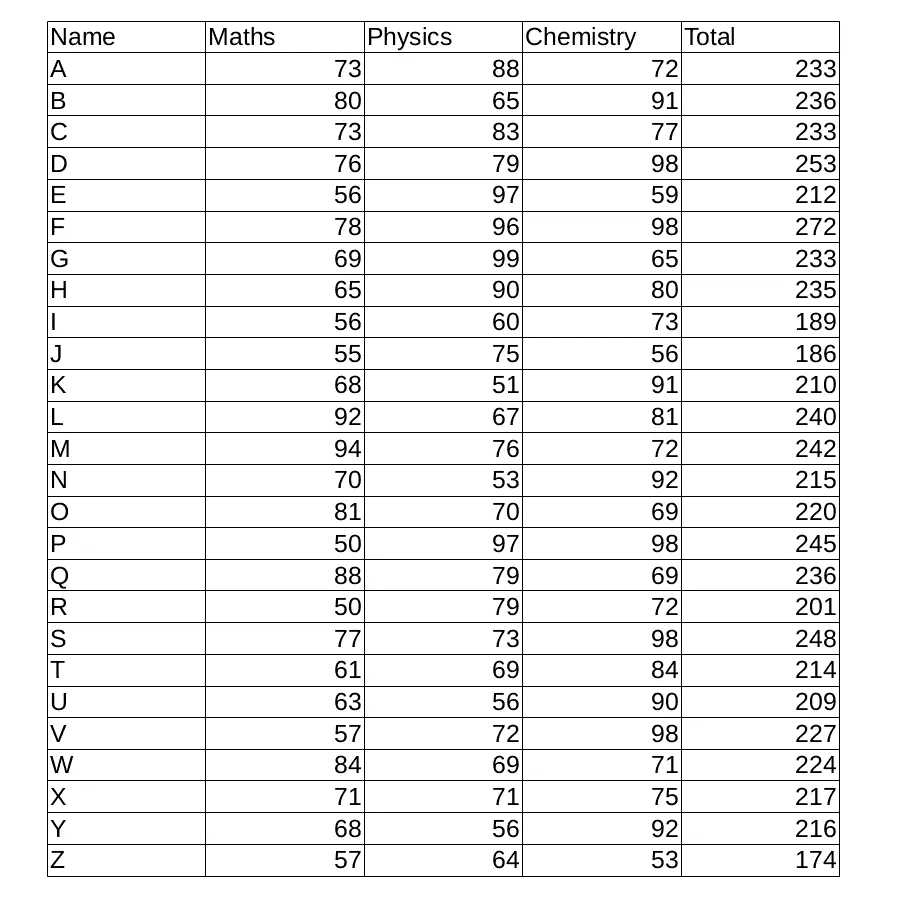
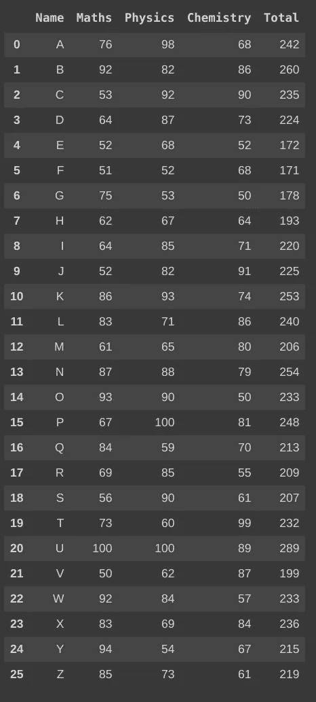
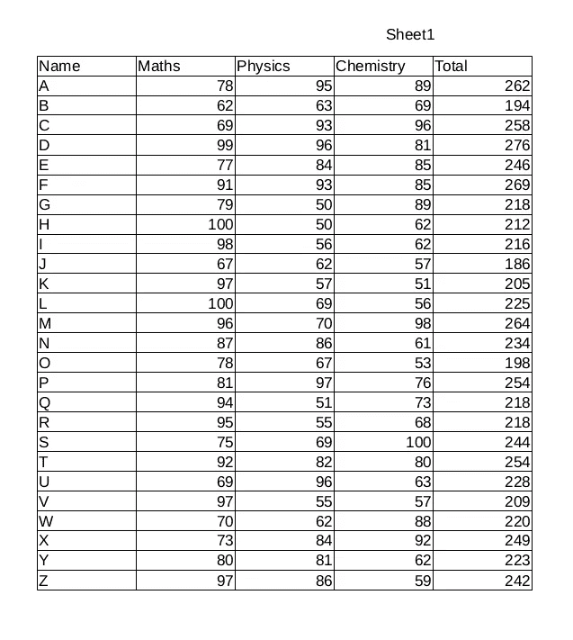
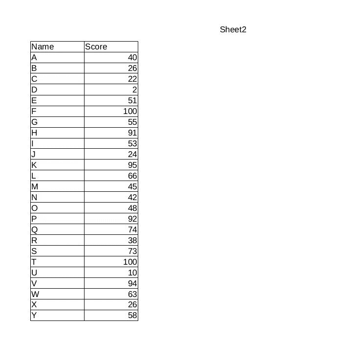
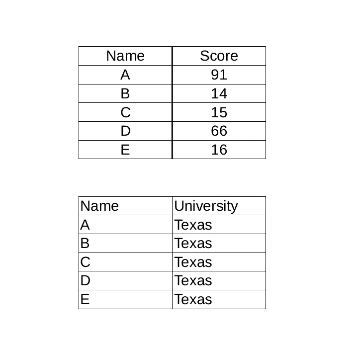
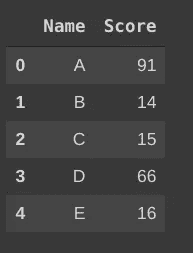

# 从 PDF 表格中提取数据—使用 Python 中的一行代码

> 原文：<https://towardsdatascience.com/scraping-table-data-from-pdf-files-using-a-single-line-in-python-8607880c750?source=collection_archive---------0----------------------->

## 在本文中，您将学习使用 python 从 PDF 文件的表格中提取数据并导出到 CSV/Excel 的最佳方式。


戴维·克洛德在 [Unsplash](https://unsplash.com?utm_source=medium&utm_medium=referral) 上的照片

从 PDF 文件中获取表格不再是一项困难的任务，您可以使用 python 中的一行代码来完成。

# 你将学到什么

1.  安装磁盘库。
2.  正在导入库。
3.  阅读 PDF 文件。
4.  读取 PDF 文件特定页面上的表格。
5.  读取 PDF 文件同一页面上的多个表格。
6.  将 PDF 文件直接转换为 CSV 文件。

# 白板

Tabula 是一个有用的软件包，它不仅允许你从 PDF 文件中抓取表格，还可以将 PDF 文件直接转换成 CSV 文件。

# 所以让我们开始吧…

## 1.安装磁盘库

```
pip install tabula-py
```

## 2.导入 tabula 库

```
import tabula
```

## 3.阅读 PDF 文件

让我们把这个 [**PDF**](https://nbviewer.jupyter.org/github/kuruvasatya/Scraping-Tables-from-PDF/blob/master/data1.pdf) 剪切成熊猫数据帧。



图片由 Satya Ganesh 提供

```
file1 = "[https://nbviewer.jupyter.org/github/kuruvasatya/Scraping-Tables-from-PDF/blob/master/data1.pdf](https://nbviewer.jupyter.org/github/kuruvasatya/Scraping-Tables-from-PDF/blob/master/data1.pdf)"table = tabula.read_pdf(file1,pages=1)table[0]
```

看看上面在 Google Colabs 中执行的代码片段的输出



图片由 Satya Ganesh 提供

# 4.读取 PDF 文件特定页面上的表格。

假设我们需要废弃这个包含多页的 [***PDF 文件***](https://nbviewer.jupyter.org/github/kuruvasatya/Reading-Table-Data-From-PDF/blob/master/data.pdf) 。



图片由 Satya Ganesh 提供



图片由 Satya Ganesh 提供

```
file2 = "[https://nbviewer.jupyter.org/github/kuruvasatya/Reading-Table-Data-From-PDF/blob/master/data.pdf](https://nbviewer.jupyter.org/github/kuruvasatya/Reading-Table-Data-From-PDF/blob/master/data.pdf)"# To read table in first page of PDF file
table1 = tabula.read_pdf(file2 ,**pages=1**)# To read tables in secord page of PDF file
table2 = tabula.read_pdf(file2 ,**pages=2**)print(table1[0])
print(table2[0])
```

# 5.如果一个 PDF 文件的同一个页面上有多个表格怎么办？

假设我们需要抓取这两个表格，它们在一个 [**PDF 文件**](https://nbviewer.jupyter.org/github/kuruvasatya/Reading-Table-Data-From-PDF/blob/master/data3.pdf) 的同一页上。



图片由 Satya Ganesh 提供

```
To read multiple tables we need to add extra parameter**multiple_tables = True** -> Read multiple tables as independent tables
**multiple_tables = False** -> Read multiple tables as single table
```

## 5.1.将多个表作为独立的表读取

```
file3 = "[https://nbviewer.jupyter.org/github/kuruvasatya/Reading-Table-Data-From-PDF/blob/master/data3.pdf](https://nbviewer.jupyter.org/github/kuruvasatya/Reading-Table-Data-From-PDF/blob/master/data3.pdf)"tables = tabula.read_pdf(file3 ,pages=1, **multiple_tables=True**)print(tables[0])
print(tables[1])
```



图片由 Satya Ganesh 提供


图片由 Satya Ganesh 提供

## 5.2 将多个表作为单个表读取

```
tables = tabula.read_pdf(file3 ,pages=1,**multiple_tables=False**)tables[0]
```


图片由 Satya Ganesh 提供

# 6.将 PDF 文件直接转换为 CSV 文件

我们可以使用 tabula 库中的 **convert_into()** 方法将包含表格数据的 PDF 文件直接转换为 CSV 文件。

## 1.将一页 PDF 文件中的表格转换为 CSV 格式

```
# output just the first page tables in the PDF to a CSVtabula.convert_into("pdf_file_name", "Name_of_csv_file.csv")
```

## 2.将 PDF 文件中的所有表格转换为 CSV 格式

```
tabula.convert_into("pdf_file_name","Name_of_csv_file.csv",**all****=****True**)
```

# 结论

我希望您学会了一种使用 python 中的一行代码来抓取 PDF 文件表格的好方法。

查看我的相关文章

[](/scraping-table-data-from-websites-using-a-single-line-in-python-ba898d54e2bc) [## 从网站抓取表格数据—使用 Python 中的一行代码

### 本文将教您如何使用 python 中的一行代码从网站中抓取表格数据。

towardsdatascience.com](/scraping-table-data-from-websites-using-a-single-line-in-python-ba898d54e2bc) [](/impact-of-covid-19-data-visualization-using-python-6f8e3bdc860b) [## 新冠肺炎的影响-使用 Python 进行数据可视化

### 使用 python 在印度地图上可视化冠状病毒爆发的初级方法。当你到达…的终点时

towardsdatascience.com](/impact-of-covid-19-data-visualization-using-python-6f8e3bdc860b) 

# 参考

 [## 表格:将 PDF 中的表格读入数据框架表格文档

### 是 tabula-java 的一个简单的 Python 包装器，可以读取 PDF 的表格。您可以从 PDF 读取表格并转换成…

tabula-py.readthedocs.io](https://tabula-py.readthedocs.io/en/latest/) 

# 感谢阅读😃过得愉快