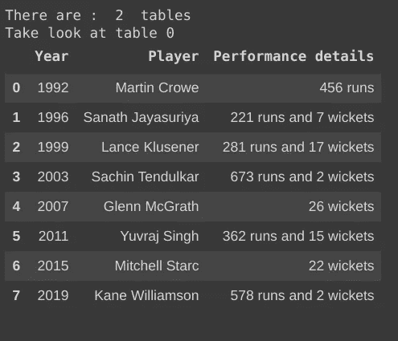
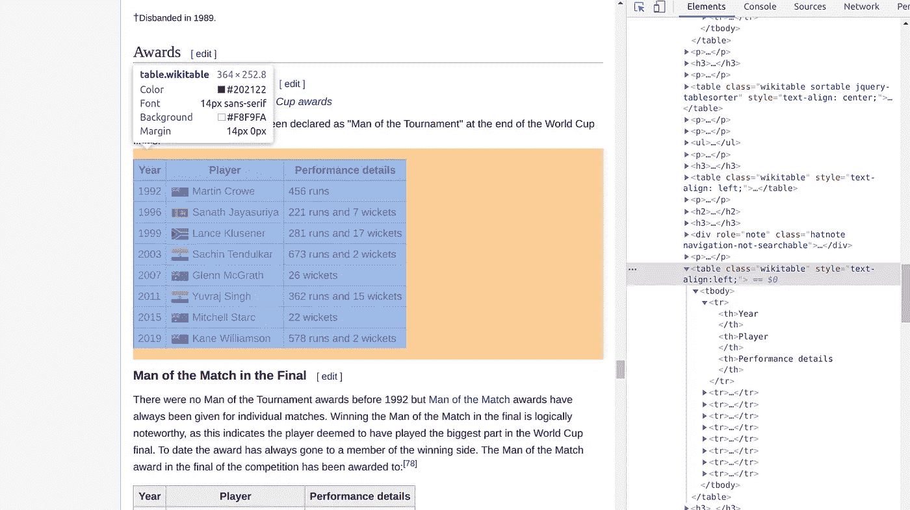

# 从网站抓取表格数据—使用 Python 中的一行代码

> 原文：<https://towardsdatascience.com/scraping-table-data-from-websites-using-a-single-line-in-python-ba898d54e2bc?source=collection_archive---------12----------------------->

## 本文将教您使用 python 中的一行代码从网站中抓取表格数据的最佳方式。


米卡·鲍梅斯特在 [Unsplash](https://unsplash.com?utm_source=medium&utm_medium=referral) 上的照片

# 介绍

D 如今，ata 已经成为最有价值的货币和珍贵商品，你使用它的方式将使你与普通人有所不同。您需要足够聪明来获取这些数据，这些数据在您身边随处可见，在本文中，您将能够学习一种简单的方法，使用 python 中的一行代码从任何网站获取表格数据。

> 对于数据收集，“越快越好”永远是最好的答案——玛丽莎·梅耶尔(雅虎前首席执行官！)

每天都有大量公开生成的数据，最常见的数据类型之一是 HTML 表格，有许多方法可以将这些数据放入笔记本，如使用 **urllib** 和 **BeautifulSoup** 但这是一个漫长而耗时的过程，您可以在一行代码中使用 **pandas** 库来完成相同的任务。

# 我们开始吧

Pandas 库中的 read_html() 方法是一个 web 抓取工具，只需将所需的 URL 作为参数提供给该方法，就可以提取网站上的所有表格。

**先决条件:导入熊猫库**

```
import pandas as pd
```

## **1。获取网站上的所有表格**

只需给出一个 URL 作为参数，就可以获得该特定网站上的所有表格。

```
pandas.**read_html**(URL)
```

**例子**:从维基百科中读取数据

```
#Data about Cricket World cupURL = ["https://en.wikipedia.org/wiki/Cricket_World_Cup](https://en.wikipedia.org/wiki/Cricket_World_Cup)"tables = pd.read_html(URL)print("There are : ",len(tables)," tables")
print("Take look at table 0")
print(tables[0])
```

## 2.从网站上读取特定的表格

如果一个网站上有很多表格，找到你要找的表格将会是一项繁琐的任务，你不能只手动搜索一个表格。为此，我们需要在 **read_html()** 方法中添加一个额外的参数( **match)** 来自动搜索所需的表。

match 属性可以将一个**字符串**或一个**编译的正则表达式**作为它的值

```
pandas.**read_html**(URL,match = ".+")
```

**示例**:使用 match 作为参数来抓取特定的表格

```
URL = "https://en.wikipedia.org/wiki/Cricket_World_Cup"tables = pd.read_html(URL,match="Performance details")print("There are : ",len(tables)," tables")print("Take look at table 0")tables[0]
```



由萨特雅·加内什创作

**注意:**搜索空间缩小，这可能有助于您快速搜索所需的表

## 3.格式化输出

```
Useful attributes  
1\. header    : The row to use to make as the column header.
2\. index_col : The column to use to create the index
3\. skiprows  : Number of rows to skip after parsing column integer
```

## **4。您也可以通过另一种方式瞄准特定的表格**

```
pandas.**read_html**(URL,attrs = {'html_tag' : 'value'})
```

我们可以通过检查表格来直接定位对应于所需表格的 HTML 标签。

**如何检查表格？**

左键点击工作台并选择**检查**选项


图片由 Satya Ganesh 提供

在检查了查找该表专用的相关标签后，我们可以看到`class:'wikitable'`是一个标识该表的标签。



图片由 Satya Ganesh 提供

```
#By using this line of code we can hit the target table directly
pandas.**read_html**(URL,attrs = {'class' : 'wikitable'})
```

# 结论

读完这篇文章后，你将能够很快从任何网站上收集表格数据。

# **参考**

[](https://www.wikipedia.org/) [## 维基百科(一个基于 wiki 技术的多语言的百科全书协作计划ˌ也是一部用不同语言写成的网络百科全书ˌ 其目标及宗旨是为全人类提供自由的百科全书)ˌ开放性的百科全书

### 维基百科是一个免费的在线百科全书，由世界各地的志愿者创建和编辑，由维基媒体托管…

www.wikipedia.org](https://www.wikipedia.org/)  [## pandas.read_html - pandas 0.23.4 文档

pandas.pydata.org](https://pandas.pydata.org/pandas-docs/version/0.23.4/generated/pandas.read_html.html) 

# 你可以在这里找到它的应用…

[](/impact-of-covid-19-data-visualization-using-python-6f8e3bdc860b) [## 新冠肺炎的影响-使用 Python 进行数据可视化

### 使用 python 在印度地图上可视化冠状病毒爆发的初级方法。当你到达…的终点时

towardsdatascience.com](/impact-of-covid-19-data-visualization-using-python-6f8e3bdc860b) 

# 感谢阅读😃过得愉快