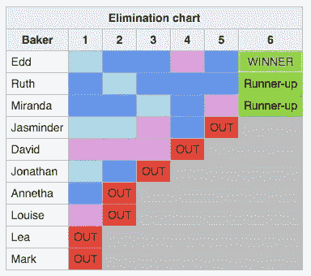
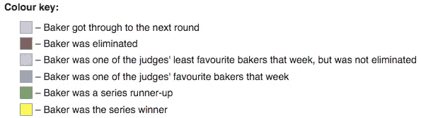
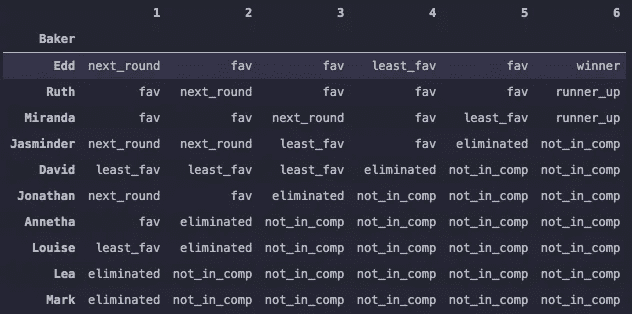
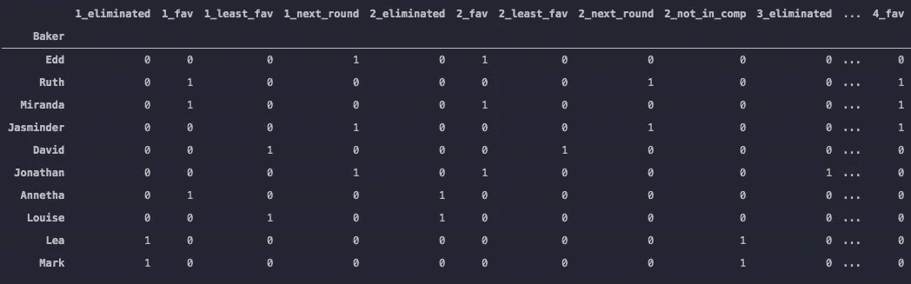
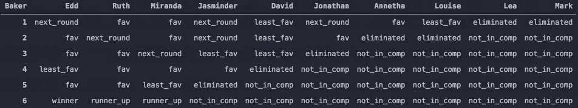
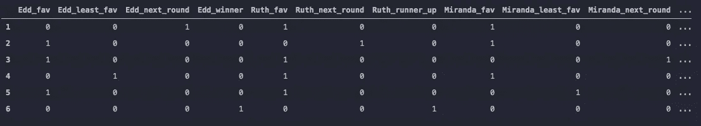

# 抓取没有文本的表格

> 原文：<https://towardsdatascience.com/scraping-tables-without-text-881eb7ba12fc?source=collection_archive---------66----------------------->

## 有时你需要的数据是用颜色显示的，而不是文本。下面是获取数据的方法


安德鲁·雷德利在 [Unsplash](https://unsplash.com?utm_source=medium&utm_medium=referral) 上的照片

过去两周，我讨论了如何从维基百科的某些表格中抓取文本。两周前，我在这里展示了如何从维基百科[抓取部分表格，上周，我在这里](/using-beautifulsoup-on-wikipedia-dd0c620d5861?source=friends_link&sk=ba9fd2d3ddd3d5dc2fab2433f6848b81)展示了如何从多个页面[抓取数据。这一周，我们将解决一个稍微不同的与桌子相关的问题:颜色。](/scraping-from-all-over-wikipedia-4aecadcedf11?source=friends_link&sk=f5f047f39c7a4685afb39e67781cfc22)

如果你只是想从维基百科中抓取一个完整的表格，你可以很容易地使用这个站点来生成一个 csv 文件。当然，你也可以在 python 中使用 Requests 和 BeautifulSoup 来做到这一点，但是坦率地说，当你有一个完全可行的选择时，没有必要重新发明轮子。然而，本周我们将关注英国烘焙大赛第一季[的淘汰赛。](https://en.wikipedia.org/wiki/The_Great_British_Bake_Off_(series_1))

首先，让我们展示一下为什么使用 csv 网站行不通。当您在网站中运行 url 并查看为淘汰图表生成的 csv 时，您会看到以下内容:

```
Baker,1,2,3,4,5,6
Edd,,,,,,WINNER
Ruth,,,,,,Runner-up
Miranda,,,,,,Runner-up
Jasminder,,,,,OUT,
David,,,,OUT,,
Jonathan,,,OUT,,,
Annetha,,OUT,,,,
Louise,,OUT,,,,
Lea,OUT,,,,,
Mark,OUT,,,,,
```

这是表格在实际页面上的样子:



[https://en . Wikipedia . org/wiki/The _ Great _ British _ Bake _ Off _(series _ 1)](https://en.wikipedia.org/wiki/The_Great_British_Bake_Off_(series_1))

显然，csv 文件未能捕捉到此图表上的颜色，正如我们在颜色键中看到的，这些颜色传达了潜在的有价值的信息:



因此，我们必须进入代码以获取所有信息。首先，和往常一样，我们将通过 BeautifulSoup 运行 url，这样我们就可以浏览 html:

```
import requests
from bs4 import BeautifulSoup
import pandas as pd
import reurl = '[https://en.wikipedia.org/wiki/The_Great_British_Bake_Off_(series_1)'](https://en.wikipedia.org/wiki/The_Great_British_Bake_Off_(series_1)')page = requests.get(url)soup = BeautifulSoup(page.content)
```

现在，我们将分离出排除图:

这几行实际上是说，“看看所有的表格，如果标题文本中有‘消除图表’，这就是我们定义的‘elim _ Chart’”

接下来，我们将制作一个包含每列标题的列表。如果我们看一下图表，这个列表应该是这样的:

```
['Baker', '1', '2', '3', '4', '5', '6']
```

要生成该列表，代码如下:

这些行实际上是说，“对于清除图表中标记为 th 的项目，只要项目的文本不以‘Elim’开头(因为我们不想删除‘清除图表’的较大标题)，就将每个项目的文本添加到标题列表中”。rstrip()被添加到末尾，因为在初始列表中，6 后面有一个换行符，这会不必要地使事情复杂化。

换一种方式，我们将查看颜色键并创建一个字典，以便稍后在创建表格时使用。

```
meaning_list = soup.find('b', text=re.compile('Colour key:')).find_all_next('dd', limit = 6)
```

这一行基本上抓取了颜色键中显示的所有颜色信息和分配给它们的文本。通过在搜索文本时使用 re.compile，您不需要有精确的匹配，当您考虑到潜在的不可见字符(如空格和换行符)时，这可以使您的生活容易得多。从这里开始，我们通过执行以下操作来研究该列表:

首先，我们创建两个列表，color_list，它是颜色键中所有颜色的列表，以及 meaning_text_list，它是分配给每种颜色的文本的列表。我们通过对含义列表中每个项目的样式部分进行重新分割来访问颜色，使短语正好在颜色之前，background-color:，一个非捕获组，然后直接捕获它后面的单词。从这里开始，我们将颜色列表中的所有单词全部小写，以避免由于大小写不一致而导致的任何潜在的不匹配。为了获得每个颜色含义的文本，我们分割项目的文本并捕捉破折号后的单词，然后获取结果列表中的最后一个项目。从那里我们将这两个列表压缩到一个字典中，full_text_meaning_dict:

```
{'lightblue': 'Baker got through to the next round',
 'orangered': 'Baker was eliminated',
 'plum': "Baker was one of the judges' least favourite bakers that week, but was not eliminated",
 'cornflowerblue': "Baker was one of the judges' favourite bakers that week",
 'limegreen': 'Baker was a series runner-up',
 'yellow': 'Baker was the series winner'}
```

这样做的一个问题是在处理数据时这些值太长了。可能有更有效的方法，但我只是创建了以下列表:

```
shortened_text_list = ['next_round','eliminated','least_fav','fav','runner_up','winner',]
```

然后我压缩了列表和颜色列表，得到了这本字典:

```
{'lightblue': 'next_round',
 'orangered': 'eliminated',
 'plum': 'least_fav',
 'cornflowerblue': 'fav',
 'limegreen': 'runner_up',
 'yellow': 'winner'}
```

然后我添加了以下条目，silver 定义为 not_in_comp(不在比赛中)，因为它不包含在颜色键中，但在查看表格时是必需的:

```
{'silver':'not_in_comp'}
```

从这里我们可以回到我们的淘汰表。这里提醒一下我们正在看的东西:


我们将通过执行以下操作来清理该表:

太多了，让我们从头到尾看一遍。首先，我们从创建一个行列表开始。这个行列表将是一个字典列表，其中键将是标题，值将是每一行的信息。

然后在接下来的三行中，我们开始查找所有面包师的名字，这是每行的第一项。从这里我们开始一个列表，row，它包含了我们访问过的每个条目的文本，也就是名称。从那里，我们得到每个名字的下六个兄弟姐妹。这六个兄弟姐妹对应于代表每集选手表现的六个不同的列。

从这里开始，我们查看每一行中的每一项(第 7 行)。对于每个项目，我们访问该项目的颜色，并且我们有一个设置为 1 的 col 变量。我们有这个 col 变量，因为有时，如果一个参赛者在连续两集里得到相同的结果(例如，他们连续两周是评委最喜欢的)，代码只会说“创建一个两列宽的评委最喜欢的颜色块。”然而，当我们试图重新创建一个表，并且每行需要六个条目时，事情就变得复杂了。因此，第 12 行和第 13 行表示，“如果代码指定颜色块的宽度大于一列，则使 col 变量等于颜色块跨越的列数。”然后，第 15–17 行将该颜色添加到行列表中，方法是对第 9 行创建的颜色变量进行切片，以便只访问颜色名称，然后在我们创建的定义每种颜色含义的字典中运行该颜色，然后将该颜色乘以 col 变量。这确保了我们创建的每个行列表长度相同，并且表示重复的结果。最后，我们得到一个类似这样的行列表:

```
[{'Baker': 'Edd',
  '1': 'next_round',
  '2': 'fav',
  '3': 'fav',
  '4': 'least_fav',
  '5': 'fav',
  '6': 'winner'},
 {'Baker': 'Ruth',
  '1': 'fav',
  '2': 'next_round',
  '3': 'fav',
  '4': 'fav',
  '5': 'fav',
  '6': 'runner_up'},
 {'Baker': 'Miranda',
  '1': 'fav',
  '2': 'fav',
  '3': 'next_round',
  '4': 'fav',
  '5': 'least_fav',
  '6': 'runner_up'},
 {'Baker': 'Jasminder',
  '1': 'next_round',
  '2': 'next_round',
  '3': 'least_fav',
  '4': 'fav',
  '5': 'eliminated',
  '6': 'not_in_comp'},
 {'Baker': 'David',
  '1': 'least_fav',
  '2': 'least_fav',
  '3': 'least_fav',
  '4': 'eliminated',
  '5': 'not_in_comp',
  '6': 'not_in_comp'},
 {'Baker': 'Jonathan',
  '1': 'next_round',
  '2': 'fav',
  '3': 'eliminated',
  '4': 'not_in_comp',
  '5': 'not_in_comp',
  '6': 'not_in_comp'},
 {'Baker': 'Annetha',
  '1': 'fav',
  '2': 'eliminated',
  '3': 'not_in_comp',
  '4': 'not_in_comp',
  '5': 'not_in_comp',
  '6': 'not_in_comp'},
 {'Baker': 'Louise',
  '1': 'least_fav',
  '2': 'eliminated',
  '3': 'not_in_comp',
  '4': 'not_in_comp',
  '5': 'not_in_comp',
  '6': 'not_in_comp'},
 {'Baker': 'Lea',
  '1': 'eliminated',
  '2': 'not_in_comp',
  '3': 'not_in_comp',
  '4': 'not_in_comp',
  '5': 'not_in_comp',
  '6': 'not_in_comp'},
 {'Baker': 'Mark',
  '1': 'eliminated',
  '2': 'not_in_comp',
  '3': 'not_in_comp',
  '4': 'not_in_comp',
  '5': 'not_in_comp',
  '6': 'not_in_comp'}]
```

从这里开始，我们要做的就是把它变成一个真正的熊猫餐桌，如下所示:

```
df = pd.DataFrame.from_dict(row_list)df.set_index('Baker', *inplace*=True)
```

注意，我将 baker 列设置为索引，因为这对我更有意义。这段代码生成了下表:



现在，这实际上是直接从页面中抓取表格。然而，如果您想要对这些数据进行任何类型的分析，您将不得不创建虚拟变量。如果你不确定虚拟变量是什么，它本质上是一种表示分类数据的数字方式(在这种情况下，一个参赛者在一集里的表现)。在熊猫中，有一个函数叫做 get_dummies。如果我们这样做:

```
pd.get_dummies(df)
```

我们会得到这个:



注意:这只是生成的 25 列的一个示例

第一列中的 1 代表那个人是否在第一集被淘汰，第二列代表那个人是否是评委的最爱，等等。然而，假设你想把焦点放在某个选手何时是最受欢迎的或者刚刚进入下一轮。要做到这一点，可以翻转数据框，使索引变成列，然后执行我前面展示的 get_dummies 函数。在代码中，翻转看起来像这样:

```
t_df = df.transpose()
```

数据帧看起来像这样:



然后创建虚拟变量，如下所示:

```
pd.get_dummies(t_df)
```

这是结果:



从这里开始，您就有了可以处理和分析的数据(尽管六行数据可能并不多)。这就是我们如何获取丰富多彩的非文本表格，并将其处理成实际有价值的数据。