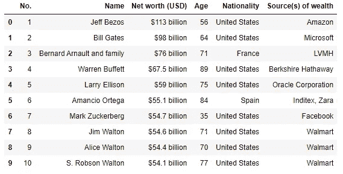
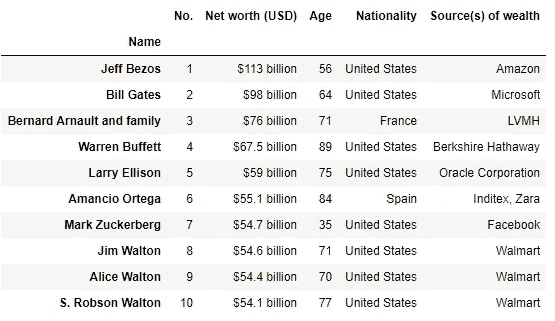
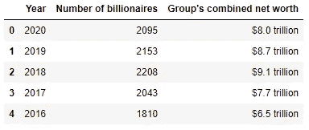
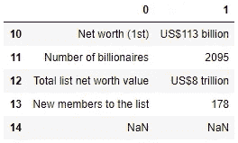
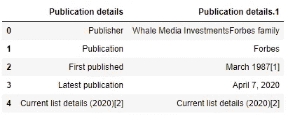

# 用熊猫抓取表格数据

> 原文：<https://towardsdatascience.com/scraping-tabular-data-with-pandas-python-10cf2a133cbf?source=collection_archive---------21----------------------->

## 编程；编排

## 使用 Python 和 Pandas 进行网页抓取


图片来自 [Pixabay](https://pixabay.com/?utm_source=link-attribution&utm_medium=referral&utm_campaign=image&utm_content=731198) 的[自由照片](https://pixabay.com/photos/?utm_source=link-attribution&utm_medium=referral&utm_campaign=image&utm_content=731198)

eb 抓取是一种从网站获取数据的技术。BeautifulSoup 和 Scrapy 是 Python 中两个广泛用于执行 Web 抓取的库。然而，使用这些库可能很麻烦，因为我们需要找到元素标签，从它们中提取文本，然后清理数据。

本文将向您展示一种使用 Pandas 提取表格数据的简单方法。是啊！熊猫！

## **从 HTML 页面提取表格**

对于本教程，我们将从[这个维基百科页面](https://en.wikipedia.org/wiki/The_World%27s_Billionaires)中摘录全球十大亿万富翁的详细信息。

我们将使用 Pandas 库的`[read_html](https://pandas.pydata.org/pandas-docs/stable/reference/api/pandas.read_html.html)`方法来读取 HTML 表。

```
import pandas as pd

url = 'https://en.wikipedia.org/wiki/The_World%27s_Billionaires'

df_list = pd.read_html(url)
```

这个脚本将 HTML 表格返回到 DataFrame 对象列表中。

让我们检查找到的表的总数:

```
len(df_list)

# Output:
# 32
```

要访问特定表，只需访问列表中的元素。例如，
将返回下表:



## 将特定列设置为索引

我们可以通过使用`index_col`参数来选择表索引的特定列。

***例如:***

```
pd.read_html(url, index_col=1)[2]
```

返回下表:



## 返回包含字符串或正则表达式的表格

我们还可以使用`match`参数指定返回包含特定字符串或正则表达式的表列表。

***举例:***

```
pd.read_html(url, match='Number and combined net worth of billionaires by year')[0].head()
```



## 指定要识别为不适用的字符串

我们可以通过使用`na_values`参数来指定要识别为 NA/NaN 的字符串列表。

***例如:***

*   未指定`na_values`:

```
pd.read_html(url)[0].tail()
```


不指定 na_values

*   指定`na_values`后:

```
pd.read_html(
    url, 
    na_values=["Forbes: The World's Billionaires website"]
    )[0].tail()
```



指定 na_values 后

## 其他参数

*   `skiprows`参数允许我们跳过开始的“n”行
*   `header`参数可以用来使指定的行作为列标题

***例如:***

```
pd.read_html(url, skiprows=3, header=0)[0].head()
```



# 结论

在本文中，我们学习了如何使用`read_html`方法轻松地从页面中抓取 HTML 表格。此外，我们还学习了一些重要的参数，这些参数可以进一步帮助我们抓取所需的表。

## 参考

*   [https://pandas . pydata . org/pandas-docs/stable/reference/API/pandas . read _ html . html](https://pandas.pydata.org/pandas-docs/stable/reference/api/pandas.read_html.html)

## 资源

本文中使用的代码片段可以在我的 [GitHub 页面](https://jimit105.github.io/medium-articles/Scraping%20Tabular%20Data%20with%20Pandas.html)上找到。

## 让我们连接

领英:[https://www.linkedin.com/in/jimit105/](https://www.linkedin.com/in/jimit105/)
GitHub:[https://github.com/jimit105](https://github.com/jimit105)
推特:[https://twitter.com/jimit105](https://twitter.com/jimit105)