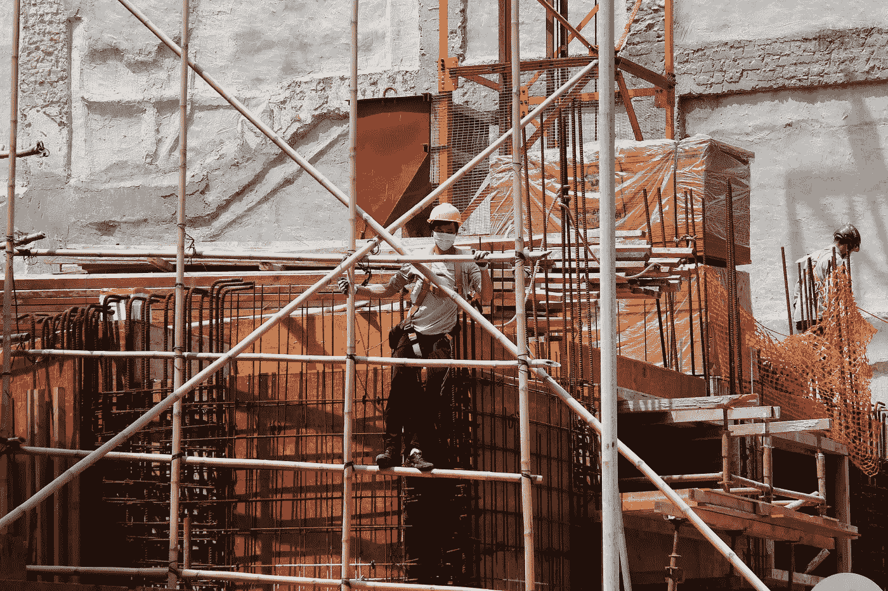
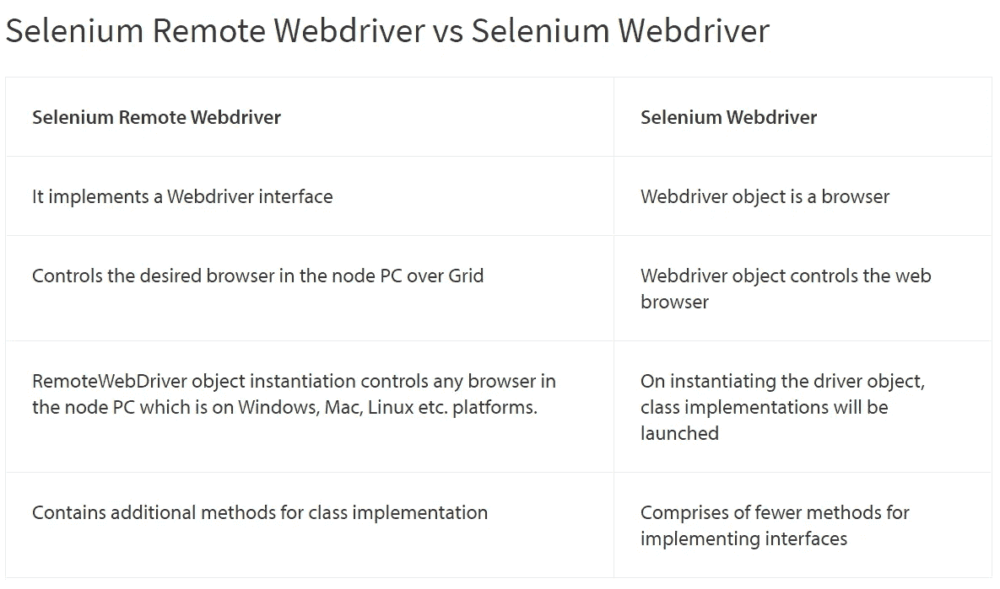
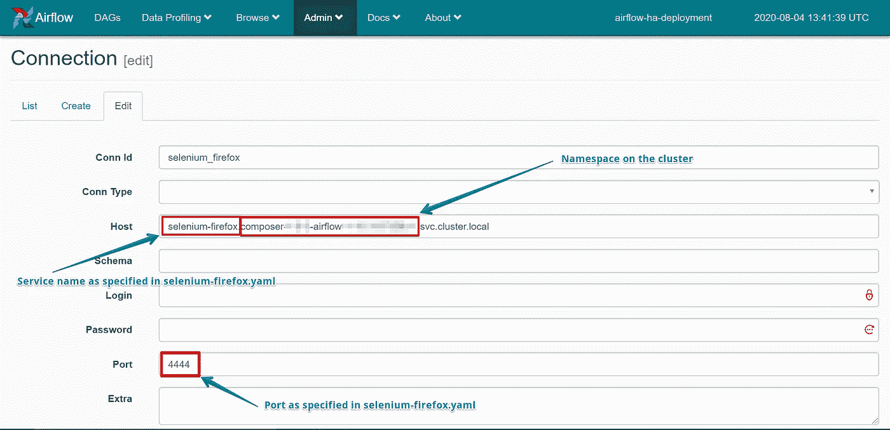
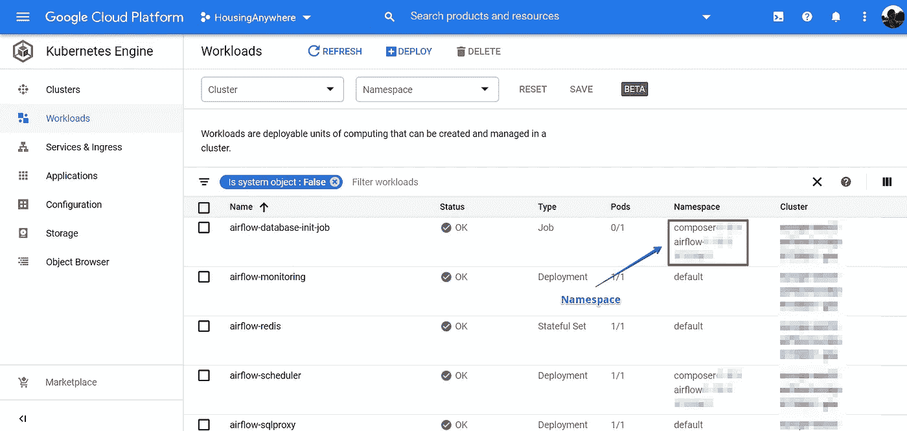

# 在 Google Cloud Composer 上用 Selenium 抓取网页(气流)

> 原文：<https://towardsdatascience.com/scraping-the-web-with-selenium-on-google-cloud-composer-airflow-7f74c211d1a1?source=collection_archive---------13----------------------->



[澳门图片社](https://unsplash.com/@macauphotoagency?utm_source=unsplash&utm_medium=referral&utm_content=creditCopyText)在 [Unsplash](https://unsplash.com/?utm_source=unsplash&utm_medium=referral&utm_content=creditCopyText) 上拍摄的照片

已经有很多不同的资源可以用来使用 Python 创建 web-scraper，这些资源通常基于众所周知的 Python 包*urllib*+*beautiful soup 4*或 *Selenium 的组合。*当您面临抓取大量 javascript 的网页的挑战，或者需要与内容进行一定程度的交互，而这仅仅通过发送 URL 请求是无法实现的，那么 *Selenium* 很可能是您的首选。我不想在这里详细介绍如何设置您的抓取脚本，以及如何以可靠的方式运行它的最佳实践。我只是想参考一下我找到的[这个](/web-scraping-using-selenium-python-8a60f4cf40ab)和[这个](https://medium.com/the-andela-way/introduction-to-web-scraping-using-selenium-7ec377a8cf72)资源特别有帮助。

在这篇文章中，我们想要解决的问题是:**作为一名数据分析师/数据科学家，我如何建立一个协调的、完全受管理的流程，以最少的开发操作来促进 Selenium scraper？**这种设置的主要用例是在云中运行所有抓取作业的托管和预定解决方案。

我们将使用的工具有:

*   **Google Cloud Composer** 用于安排作业和协调工作流程
*   **硒**为框架刮网站
*   **Google Kubernetes 引擎**在云中部署 Selenium 远程驱动程序作为容器化的应用程序

在[*houssinganywhere*](https://housinganywhere.com/)的时候，我们已经在使用*[*Google Cloud Composer*完成许多不同的任务](/testing-airflow-jobs-on-google-cloud-composer-using-pytest-9e0a1198b4cd)。Cloud Composer 是一个非常神奇的工具，可以轻松管理、调度和监控工作流，如**有向无环图**(Dag)。它基于开源框架[*Apache air flow*](https://airflow.apache.org/)并使用纯 Python，这使得它非常适合在数据领域工作的每个人。如果您不是来自 DevOps，那么自行部署气流的准入门槛相对较高，这导致一些云提供商提供托管气流部署，谷歌的 Cloud Composer 就是其中之一。*

*当部署 Selenium 进行 web 抓取时，我们实际上使用了所谓的 Selenium Webdriver。这个 WebDriver 是一个框架，允许你使用代码( *Java，。Net、PHP、Python、Perl、Ruby* 。对于大多数用例，你只需下载一个可以直接与 WebDriver 框架交互的浏览器，例如 [Mozilla Geckodriver 或 ChromeDriver](https://www.edureka.co/blog/selenium-chromedriver-and-geckodriver/) 。抓取脚本将在您的本地上启动一个浏览器实例**，并执行指定的所有动作。在我们的用例中，事情有点复杂，因为我们希望在不使用任何本地资源的情况下，按照循环的时间表运行脚本。为了能够在云中部署和运行 web 抓取脚本，我们需要使用一个*Selenium Remote web driver*(又名 *Selenium Grid* )来代替 Selenium WebDriver。***

**

*来源:[https://www . browser stack . com/guide/difference-between-selenium-remote web driver-and-web driver](https://www.browserstack.com/guide/difference-between-selenium-remotewebdriver-and-webdriver)*

## *使用 Selenium Grid 运行远程 web 浏览器实例*

*Selenium Grid 背后的思想是提供一个框架，允许您通过在一台或多台机器上运行 web 浏览器来运行并行抓取实例。在这种情况下，我们可以利用[提供的独立浏览器](https://hub.docker.com/r/selenium)(请记住，每个可用的浏览器，Firefox、Chrome 和 Opera 都是不同的图像)，它们已经被包装为 Docker 图像。*

*Cloud Composer 在 Google Kubernetes 引擎(GKE)集群上运行 Apache Airflow。此外，它与其他谷歌云产品完全集成。新的 Cloud Composer 环境的创建还附带了一个功能性 UI 和一个云存储桶。所有 Dag、插件、日志和其他所需文件都存储在这个桶中。*

## *在 GKE 上部署并公开远程驱动程序*

*您可以使用下面的 *selenium-firefox.yaml* 文件为 Firefox 独立浏览器部署 docker 映像，并通过运行以下命令在您的资源上应用指定的配置:*

```
*kubectl apply -f selenium-firefox.yaml*
```

*配置文件描述了你想要创建的**类型**的对象，它是**元数据**以及**规格**。*

*我们可以在 Airflow 的管理界面中创建新的连接，然后在我们的插件中访问连接细节。连接细节要么在 yaml 文件中指定，要么可以在 Kubernetes 集群中找到。*

**

*气流连接*

**

*GCP 上的 Kubernetes 发动机*

*建立连接后，我们可以访问我们的抓取脚本(气流插件)中的连接，在那里我们连接到远程浏览器。*

**感谢*[*Massimo Belloni*](https://towardsdatascience.com/@massibelloni)*为实现本项目和本文提供的技术咨询和建议。**