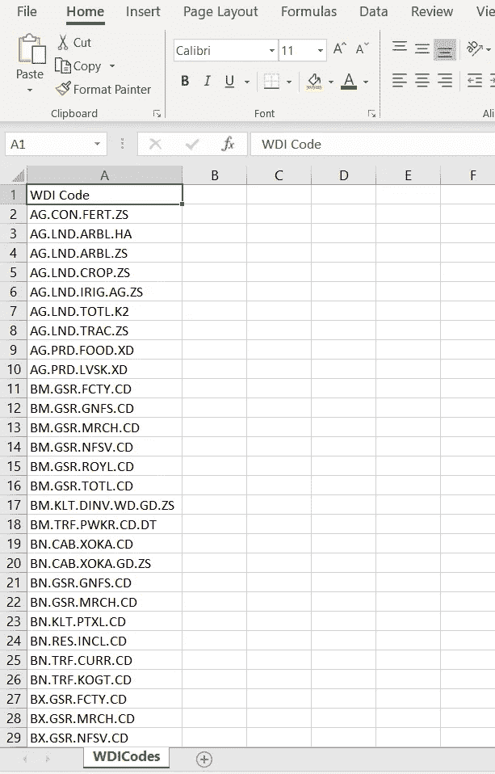
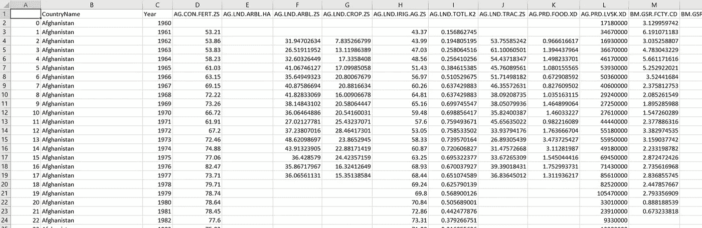

# 使用 Python 抓取世界发展指标(WDI)数据库

> 原文：<https://towardsdatascience.com/scraping-the-world-development-indicators-wdi-database-using-python-632f6b7c8319?source=collection_archive---------27----------------------->

## 本文提供了一个 python 函数的演示，该函数使用 xmltree 包从 WDI 数据库中一次抓取和处理多个序列的最新数据。

世界银行维护的世界发展指标数据库是最强大和最多样化的开放存取数据库之一。该数据库包含各种发展指标的数据集，对于任何有兴趣从数量或质量上研究发展问题的人来说，都是一个分析金矿。

就我个人而言，在我作为研究生的研究工作和作为科学家的职业生涯中，我经常依赖这个数据库。在本文中，我提供了一个脚本的演练，该脚本从 WDI 数据库中抓取数据集并将其保存到 dataframe 中。该脚本利用了 python 中的 xmltree 库，可以非常高效地从 WDI 数据库中抓取最新的可用数据。该脚本是我在过去一年中开发的更广泛的 python 数据处理项目的一部分。此处可进入[项目。因此，不再浪费时间，让我们直接进入代码。](https://github.com/kanishkan91/Python-DataUpdate-DataProcessor-kbn)

首先，让我们了解一下 WDI 网站的数据结构。我们将抓取为世界银行托管不同数据集的 WDI API。https://api.worldbank.org/v2/countries/all/indicators/ WDI API 包含以 xml 格式存储在 url- [的数据](https://api.worldbank.org/v2/countries/all/indicators/)

任何用户都可以使用特定代码访问单个指示器。例如，代码‘AG。“CON.FERT.ZS”代表按国家和年份划分的施肥数据。因此，要访问这些数据，用户需要指定 URL—【https://api.worldbank.org/v2/countries/all/indicators/AG. CON.FERT.ZS 。

因此，第一步是将来自 WDI 的所有代码存储在一个列表中。为了简化，我在一个 csv 中存储了来自 WDI 的 300 个不同数据集的代码。csv 看起来如下所示，



为了使这变得更加容易，我将脚本构造为一个名为 WDIData 的函数。让我们首先从定义函数并在 python 中导入所需的库开始。如上所述，我们将需要 xml etree 包、numpy 和 pandas。我们还需要请求包，因为这是一个刮刀。

```
**def** WDIData():
    **import** numpy **as** np
    **import** requests
    **import** pandas **as** pd
    **import** xml.etree.cElementTree **as** et
```

现在让我们将上面提到的 WDICodes 文件读入一个名为 datadict 的对象。让我们创建一个空的数据帧来存储我们的数据集。

```
datadict = pd.read_csv(**'input\WDI\WDICodes.csv'**, encoding=**"ISO-8859-1"**)df=[]
```

对于 csv 中的每个代码，我们希望提取国家、代码、年份和值。因此，让我们为 WDI 代码创建一个 for 循环，其中我们为每个变量(国家、代码、年份和值)指定空列表。我们还必须创建一个 url 来从 API 请求数据。最后，我们将使用元素树中的“fromstring”函数从 url 中提取数据。

```
**for** row **in** datadict[**'WDI Code'**]:
    #Specify empty lists for required variables
    Countryname = []
    SeriesCode = []
    Year = []
    Value = [] #Create URL for each 
    url = **'http://api.worldbank.org/v2/countries/all/indicators/'** + str(row) + **'/?format=xml&per_page=20000'** #Get data from url and store to a variable r = requests.get(url, stream=**True**)
    root = et.fromstring(r.content)
```

对于每个代码中的数据，我们希望提取所有年份的所有值。这可以很容易地通过使用 for 循环来实现，这些循环使用 python 中 xml 树包内的‘ITER’函数。我们将为循环写 4 个，一个为系列 id、国家名称，一个为年份，一个为值。如果您跟踪上面提到的 URL，您会注意到数据存储在特定的属性中。

```
**for** child **in** root.iter(**"{http://www.worldbank.org}indicator"**):
    SeriesCode.append(child.attrib[**'id'**])
**for** child **in** root.iter(**"{http://www.worldbank.org}country"**):
    Countryname.append(child.text)
**for** child **in** root.iter(**"{http://www.worldbank.org}date"**):
    Year.append(child.text)
**for** child **in** root.iter(**"{http://www.worldbank.org}value"**):
    Value.append((child.text))
```

现在让我们为列表中的每个代码创建一个数据帧。这可以在 pandas 中使用 from_dict 函数来完成。我们还将转置数据集。我们将把代码数据存储到一个名为 test_df 的临时变量中。

```
test_df = pd.DataFrame.from_dict({**'SeriesName'**: SeriesCode,
                                  **'Country'**: Countryname,
                                  **'Year'**: Year,
                                  **'Value'**: Value}, orient=**'index'**)test_df = test_df.transpose()
```

为了最小化数据集的大小，我们将消除值、国家和系列名称中的空值。

```
test_df = test_df[pd.notnull(test_df[**'Value'**])]
test_df = test_df[pd.notnull(test_df[**'Country'**])]
test_df = test_df[pd.notnull(test_df[**'Series'**])]
```

现在，让我们将该代码的数据追加到我们在开始时创建的第一个空数据帧中。让我们使用 pandas 中的 pivot_table 函数从合并的数据集创建一个表。使用 pivot_table 函数的想法是将系列名称存储在列中。

```
df=pd.concat(df)data = pd.pivot_table(df, index=[**'Country'**, **'Year'**], columns=[**'Series'**], values=[**'Value'**],
                      aggfunc=[np.sum])
```

合并数据集存储为数据透视表。让我们将这个表存储为记录。最后，让我们返回数据，完成函数。

```
#Create the pivot table
data = pd.pivot_table(df, index=[**'Country'**, **'Year'**], columns=[**'Series'**], values=[**'Value'**],
                      aggfunc=[np.sum])#Convert the dataframe to records from a pivot table
data = pd.DataFrame(data.to_records())#Complete the function
**return** (data)
```

你有它！最终的数据集如下所示。如上所述，WDI 数据函数可以在 DataUpdate.py 文件[中找到。请随时分享您对该职能的任何反馈。提取一个系列大约需要 5 秒钟，您可以用多达 1000 个文件更新 csv，以提取多个系列的最新数据。](https://github.com/kanishkan91/Python-DataUpdate-DataProcessor-kbn/blob/master/DataUpdate.py)

