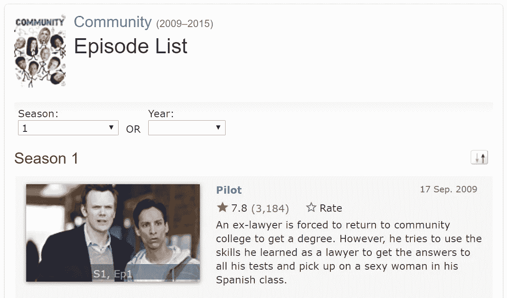
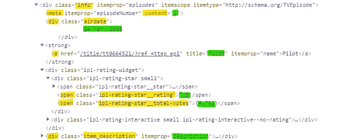
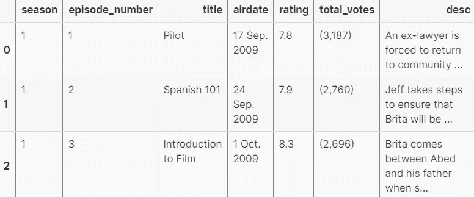

# 如何使用 Python 和 BeautifulSoup 刮电视节目爱普西迪 IMDb 收视率

> 原文：<https://towardsdatascience.com/scraping-tv-show-epsiode-imdb-ratings-using-python-beautifulsoup-7a9e09c4fbe5?source=collection_archive---------25----------------------->

## 简单易行——初学者指南。刮掉你最喜欢的电视节目的收视率！

有大量的教程教你如何从 IMDb 那里获得电影收视率，但我没有看到任何关于电视剧集收视率的教程。因此，对于任何想这样做的人，我专门为此创建了本教程。它主要是为了迎合网络抓取的初学者，因为这些步骤被分解了。如果你想要没有故障的代码，你可以在这里找到它。

Alex Olteanu 有一个精彩的 DataQuest [教程](https://www.dataquest.io/blog/web-scraping-beautifulsoup/)，深入解释了如何从 IMDb 收集 2000 多部电影，这是我学习如何收集这些集的参考。

由于他们的教程已经很好地解释了[识别 URL 结构](https://www.dataquest.io/blog/web-scraping-beautifulsoup/#identifyingtheurlstructure)和理解单个页面的 HTML 结构的基础知识，我已经将这些部分链接起来，如果你还不熟悉的话，建议你阅读它们，因为我不会在这里解释它们。

在*这个*教程中，我将*而不是*赘述他们已经做了什么[1](https://isabella-b.com/blog/scraping-episode-imdb-ratings-tutorial/#fn:1)；相反，我会做许多类似的步骤，但它们将专门针对剧集评级(对任何电视剧都一样)，而不是电影评级。

*这个教程最好在我的网站上看，那里代码更清晰。随意查看* [*这里*](https://isabella-b.com/blog/scraping-episode-imdb-ratings-tutorial/) *。*

# 分解它

首先，你需要导航到你选择的第一季的页面，上面列出了这一季的所有剧集。我将使用的系列是社区。它应该是这样的:



*作者图片*

获取该页面的 url。它应该是这样的结构:

[http://www.imdb.com/title/**TT 1439629**/剧集？季节=1](http://www.imdb.com/title/tt1439629/episodes?season=1)

粗体部分是节目的 ID，如果您不使用社区，它会有所不同。

首先，我们将通过使用`get()`向服务器请求网页的内容，并将服务器的响应存储在变量`response`中，并查看前几行。我们可以看到，`response`里面是网页的 html 代码。

```
from requests import geturl = 'https://www.imdb.com/title/tt1439629/episodes?season=1'response = get(url)print(response.text[:250])
```

# 使用 BeautifulSoup 解析 HTML 内容

接下来，我们将通过创建一个 BeautifulSoup 对象来解析`response.text`，并将该对象分配给`html_soup`。`html.parser`参数表明我们希望使用 Python 内置的 HTML 解析器进行解析。

```
*from* bs4 *import* BeautifulSouphtml_soup = BeautifulSoup(response.text, 'html.parser')
```

**从这部分开始，代码将与电影示例不同。**

**我们将得到的变量是:**

*   剧集标题
*   剧集编号
*   广播日期
*   IMDb 评级
*   总票数
*   剧集描述

让我们看看我们感兴趣的容器。正如您在下面看到的，我们需要的所有信息都在`<div class="info" ...> </div>`中:



*作者图片*

在**黄色的**中是代码的标签/部分，我们将调用这些标签/部分来获取我们试图提取的数据，它们在**绿色的**中。

我们将从页面中抓取`<div class="info" ...> </div>`的所有实例；每集都有一个。

```
episode_containers = html_soup.find_all('div', class_='info')
```

`find_all()`返回了一个`ResultSet`对象–`episode_containers`–这是一个包含所有 25 个`<div class="info" ...> </div>`的列表。

# 提取我们需要的每个变量

阅读 DataQuest 文章的[这部分](https://www.dataquest.io/blog/web-scraping-beautifulsoup/#thenameofthemovie)来理解如何调用标签。

在这里，我们将看到如何从每集的`episode_containters`中提取数据。

`episode_containters[0]`调用`<div class="info" ...> </div>`的第一个实例，即第一集。在第一对变量之后，你将理解调用 html 容器内容的结构。

# 剧集标题

对于标题，我们需要从`<a>`标签中调用`title`属性。

```
episode_containers[0].a['title']
```

`'Pilot'`

# 剧集编号

在`content`属性下的`<meta>`标签中的剧集编号。

```
episode_containers[0].meta['content']
```

`'1'`

# 广播日期

Airdate 在带有类`airdate`的`<div>`标签中，我们可以通过`text`属性获取它的内容，然后我们通过`strip()`移除空白。

```
episode_containers[0].find('div', class_='airdate').text.strip()
```

`'17 Sep. 2009'`

# IMDb 评级

等级在带有类`ipl-rating-star__rating`的`<div>`标签中，该标签也使用`text`属性来获取。

```
episode_containers[0].find('div', class_='ipl-rating-star__rating').text
```

`‘7.8’`

# 总票数

总票数是一样的，只不过是在不同的类别下。

```
episode_containers[0].find('span', class_='ipl-rating-star__total-votes').text
```

`'(3,187)'`

# 剧集描述

对于描述，我们做了与播放日期相同的事情，只是改变了类。

```
episode_containers[0].find('div', class_='item_description').text.strip()
```

`‘An ex-lawyer is forced to return to community college to get a degree. However, he tries to use the skills he learned as a lawyer to get the answers to all his tests and pick up on a sexy woman in his Spanish class.’`

# 最终代码——将所有代码放在一起

现在我们知道如何获得每个变量，我们需要为每一集和每一季进行迭代。这将需要两个`for`循环。对于每一季的**循环**，你必须根据你正在抓取的剧集有多少季来调整`range()`。

输出将是一个列表，我们将成为一个熊猫数据框架。代码中的注释解释了每一步。

[https://gist . github . com/isabellabenabaye/960 b 255705843485698875 DC 193 e 477 e](https://gist.github.com/isabellabenabaye/960b255705843485698875dc193e477e)

# 制作数据框

```
import pandas as pd 
community_episodes = pd.DataFrame(community_episodes, columns = ['season', 'episode_number', 'title', 'airdate', 'rating', 'total_votes', 'desc'])community_episodes.head()
```



这是你的新数据框架的头部应该看起来的样子(*作者图片)*

看起来不错！现在我们只需要稍微清理一下数据。

# 数据清理

## 将总票数转换为数字

首先，我们创建一个函数，它使用`replace()`从`total_votes`中删除'，'，'('和')'字符串，这样我们就可以将它变成数字。

```
def remove_str(votes):
    for r in ((',',''), ('(',''),(')','')):
        votes = votes.replace(*r)

    return votes
```

现在我们应用函数，取出字符串，然后使用`astype()`将类型改为 int

```
community_episodes['total_votes'] = community_episodes.total_votes.apply(remove_str).astype(int)community_episodes.head()
```

## 使评分成为数字而不是字符串

```
community_episodes['rating'] = community_episodes.rating.astype(float)
```

## 将广播日期从字符串转换为日期时间

```
community_episodes['airdate'] = pd.to_datetime(community_episodes.airdate)community_episodes.info()
```

太好了！现在数据已经整理好，可以进行分析/可视化了。

让我们确保保存它:

```
community_episodes.to_csv('Community_Episodes_IMDb_Ratings.csv',index=False)
```

就这样，我希望这是有帮助的！如有任何编辑或问题，请随时评论或 [DM me](https://twitter.com/_isabellamb) 。

# 链接:

这个项目的 Github 库

[Kaggle 上的最终社区评级数据集](https://www.kaggle.com/imbenab/community-episodes-imdb-ratings)

[我的网站/博客](https://isabella-b.com)