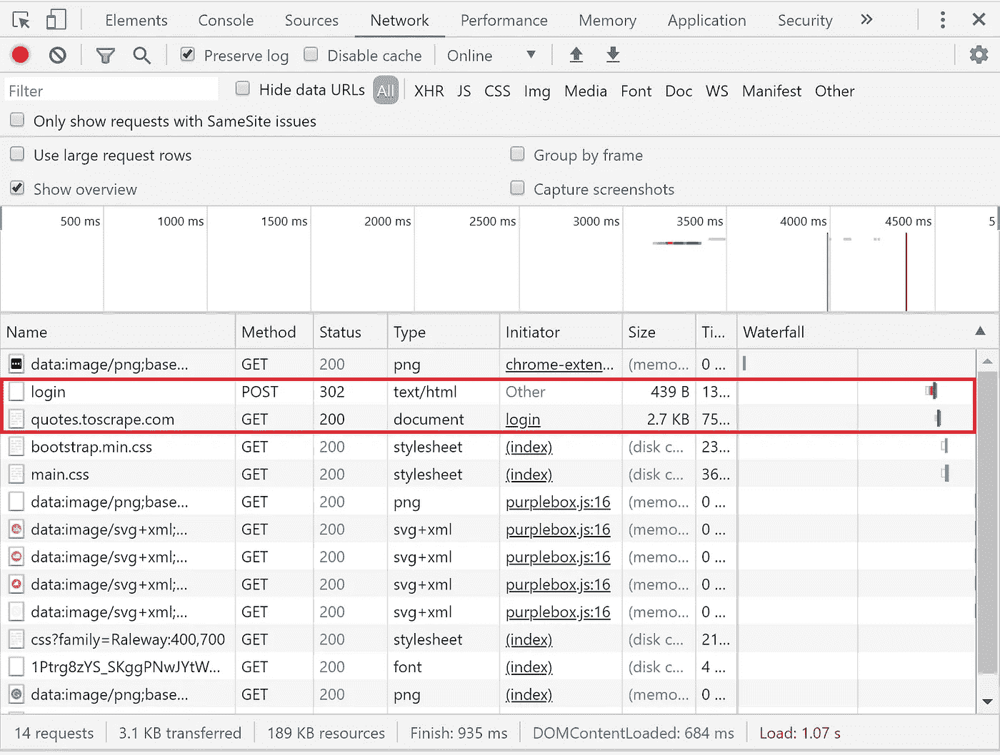
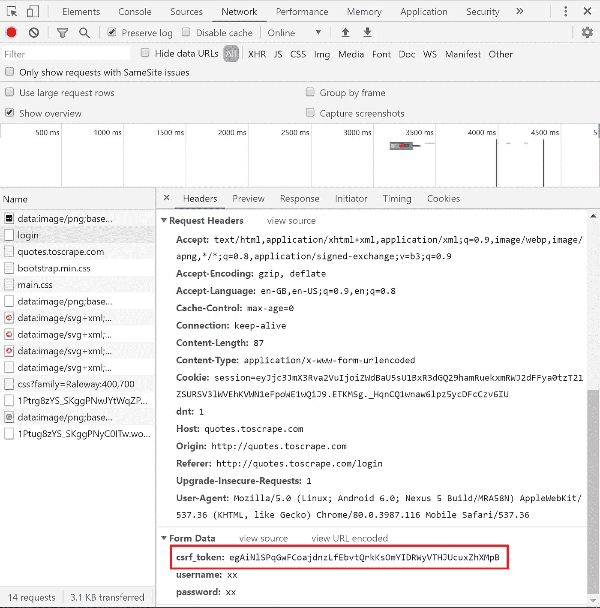
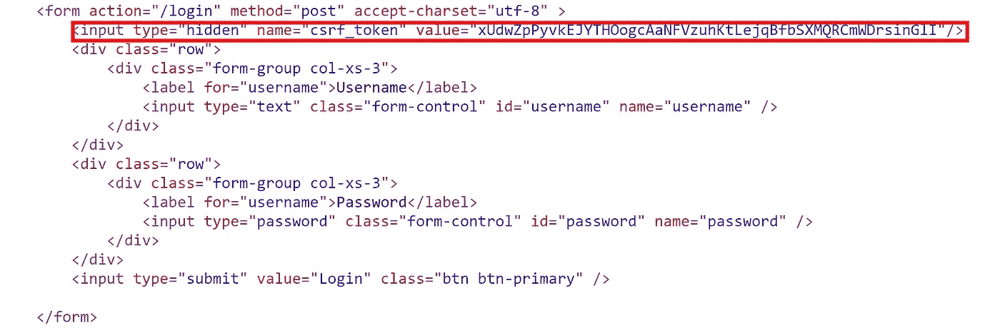

# Scrapy:这就是如何轻松成功登录

> 原文：<https://towardsdatascience.com/scrapy-this-is-how-to-successfully-login-with-ease-ea980e2c5901?source=collection_archive---------1----------------------->


[李晟](https://unsplash.com/@parachutel_)从没开过

## 揭秘用 Scrapy 登录的过程。

一旦你理解了 Scrapy 的基本知识，第一个复杂的问题就是必须处理登录。要做到这一点，了解登录是如何工作的以及如何在浏览器中观察这个过程是很有用的。我们将在这篇文章中讨论这一点以及 scrapy 如何处理登录过程。

# 在本文中，您将了解到

1.  如何将 FormRequest 类用于简单的登录过程
2.  如何使用`fromresponse`方法进行更复杂的登录过程
3.  如何实现基本的 XPATH 选择器
4.  了解会话和令牌浏览器身份验证之间的区别
5.  CSRF 是什么，为什么知道它很重要
6.  如何处理 Scrapy 中的令牌认证

# 简单的登录程序

当你输入数据到网站表单域时，这些数据被打包。浏览器将在标题中加入这一内容来执行 POST 请求。登录时可能会有许多 POST 和 redirect 请求。

要在 Scrapy 中做最简单的登录程序，我们可以使用 Scrapy 的 FormRequest 类。实际上，最好使用 FormRequests 方法之一来处理表单数据，但稍后会详细介绍！

让我们先看看它是如何工作的，然后在此基础上进行构建。为了在我们的 scrapy spider 中使用它，我们必须首先导入它。

```
from scrapy.http import FormRequest
```

现在，我们不再在蜘蛛的开头使用`start_url`，而是使用`start_requests()`方法。这允许我们使用与表单填充相关的方法。

让我们看看 scrapy.spider 代码的底层，看看它是如何工作的。请记住，这是我们在启动蜘蛛时经常提到的地方。

当我们从那个类中调用`start_requests()`方法时，这就是隐藏的内容。

```
def start_requests(self):
    for url in self.start_urls:
         yield self.make_requests_from_url(url)def make_requests_from_url(self, url): 
    return Request(url, dont_filter=True)
```

在这里，我们循环浏览`start_urls`的每个网址。对于每个 url，我们使用`scrapy.requests()`方法，并传递一个 URL 和一个名为 dont_filter 的关键字。现在`dont_filter=True`意味着不过滤重复的请求。

通过使用 FormRequest 子类，我们扩展了`scrapy.http.Request`类。FormRequest 为我们提供了从响应中预填充表单字段的功能。我们扩展了`scrapy.http.Request`,可以访问它所有的关键字参数。

让我们看看这是什么样子。

```
from scrapy.http import FormRequests
import scrapydef start_requests(self):
   return [
      FormRequest("INSERT URL", formdata={"user":"user",   
           "pass":"pass"}, callback=self.parse)]def parse(self,response):
    pass
```

笔记

1.默认的`parse()`函数处理脚本的响应和规则，以获取您想要的数据。
2。对于函数`start_request`，我们使用 FormRequest 类。我们向它提供一个 url 和关键字参数 formdata 以及我们的用户名和密码。

3.Scrapy 为我们处理饼干，而不需要我们在`start_request`中具体说明。

4.我们使用回调关键字参数将蜘蛛指向解析函数。


[莫哈末·阿拉姆](https://unsplash.com/@ambientpictures)来自未喷涂

# 隐式数据

有些网站会要求您传递表单数据，这些数据乍一看似乎并不重要。登录，但有必要通过 cookies 认证网站。有时页面有一个隐藏的字段需要通过。获得该值的唯一方法是登录。

为了解决这个问题，我们需要做两个请求，一个请求传递一些数据并捕获隐藏的字段数据。第二次请求登录。

这次我们将使用一个`start_request`函数，但是传递第一个请求。我们将处理回调以将信息传递给第二个函数。

对于第二个请求，我们将使用`FormRequest.from_response()`方法。这个方法用我们指定的字段中填充的数据来模拟点击。返回一个新的 FormRequest 对象。这个对象的默认设置是模拟一个点击，这个点击有一个类型为`<input_type=submit>`的可点击项目。

我们可以在`from_response()`方法中指定不同的方式。参考 scrapy 文档是明智的！例如，如果你不想让 scrapy 点击进入，你可以使用关键字`dont_click=True`。来自`from_response()`方法的所有参数都被传递给 FormRequest。

```
def start_requests():
    return [
       Request("URL", callback = self.parse_item)
     ]def parse_item(self,response):
    return FormRequest.from_response(response, formdata= 
           {'user':'user', 'pass':'pass'})
```

在这里，我们从`start_requests()`获取所需的头，然后将其传递给`parse_item()`

使用`FormRequest.from_response()`我们传递带有适当标题的表单数据。


特雷布雷·巴黑斯

# 浏览器认证基础知识

HTTP 是一种无状态协议。这意味着从请求到响应，没有消息状态的记录。如果您作为一个请求登录，这将在另一个请求中被忘记。讨厌还是什么！

第一个解决方案是创建一个会话。当我们进行 POST 请求时，会在服务器数据库中创建一个会话。一个 cookie，它是一个字典，附加到带有会话 ID 的响应中。cookie 被返回给浏览器。

当我们用这个 cookie 尝试另一个请求时，服务器会查找它并检查会话 ID。获取配置文件数据匹配，并将响应发送回浏览器。

Cookie 身份验证是有状态的。认证记录存储在客户端和服务器端。

现在我们有了单页面应用程序，前端和后端的分离要复杂得多！当与另一个服务器联系时，我们从一个服务器获得的会话 cookie 将不起作用。这就是基于令牌的身份验证发挥作用的地方。


[抢王](https://unsplash.com/@zenking)从未破土而出

# 基于令牌的认证

令牌是另一种浏览器身份验证方法。现在使用的标准令牌是 Json web 令牌(JWT)。

基于令牌的认证的优点是它是无状态的。服务器不记录哪些用户登录。每个请求都有一个令牌，服务器用它来检查真实性。令牌通常在授权报头载体(JWT)中发送，但也可以在 POST 请求的主体中发送。

JWT 由三部分组成:报头、有效载荷和签名

```
###HEADER###
{
  "alg": "HS256",
  "typ": "JWT"
}###PAYLOAD###{
  "sub": "1234567890",
  "name": "John Doe",
  "iat": 1516239022
}###SIGNATURE###{
  HMACSHA256(base64UrlEncode(header) + "." +           base64UrlEncode(payload),   
secret)
```

现在 jwt 使用编码算法进行签名。例如 HMACSHA256，看起来像这样。

```
eyJhbGciOiJIUzI1NiIsInR5cCI6IkpXVCJ9.eyJzdWIiOiIxMjM0NTY3ODkwIiwibmFtZSI6IkFkbyBLdWtpYyIsImFkbWluIjp0cnVlLCJpYXQiOjE0
```

这可以通过像[这样的网站解码，知道数据没有加密是很重要的。](https://jwt.io/)

用户输入登录详细信息，令牌被附加。然后，服务器验证登录是否正确，然后发送的令牌被签名。这个令牌存储在客户端，但实际上可以存储为会话或 cookie。记住 cookie 是键和值的字典。

对服务器的请求包括此令牌以进行身份验证。服务器对这个令牌进行解码，如果令牌有效，请求就会被发回。当用户注销时，令牌在客户端被销毁。不与服务器交互。这为我们提供了一些保障。


[孙富](https://unsplash.com/@zisun_word)从无到有

# CSRF 是关于什么的？

当谈到基于令牌的身份验证时，您会用到这个术语。所以了解它们是很有用的。这就是为什么基于令牌的认证变得流行的核心。

CSRF 代表跨站点请求伪造，是一个网络安全漏洞。它允许攻击者让用户执行他们不想执行的操作。例如通过改变账户的电子邮件地址。

CSRF 袭击的发生需要三个条件。首先是一个相关的动作，它是应用程序中有理由改变的东西。基于 cookie 的会话处理来进行身份验证，并且没有不可预测的请求参数。

有了这些，攻击者就可以创建一个带有表单的网页来更改电子邮件地址。用户输入数据，表单在对原始网站的请求中使用用户会话 cookie。而是使用新的电子邮件地址。

为了应对这种攻击，我们可以使用令牌来检查用户，而不是基于会话的 cookies。


克林特·帕特森

# 使用 Scrapy 处理基于令牌的认证

为了确定是否有必要使用令牌，我们必须使用 chrome/firefox 开发工具。为此我们将刮掉 quotes.toscrape.com。我们模拟登录过程，看看发送了哪些报头。为此，我们在登录前滚动到网络选项卡，然后模拟一个登录过程。所有请求将出现在下面。



Chrome 开发工具。红色方框显示登录过程

选择左侧的登录名，我们可以看到下面的请求标题。



登录过程的请求标头。突出显示 CSRF 令牌

正如您在表单数据中看到的,`csrf_token`是存在的。

请记住，当我们注销时，此令牌会被销毁。我们有必要在将它作为 POST 请求发送之前获取它。要做到这一点，我们必须看看 HTML。表单的 html 标签如下所示。

我们可以在这里看到表单字段< 【



# XPATH Basics

Now to do any scrapping it’s useful to go to the shell to see if the xpath selectors will work in your spider. So here we fetch the url and test out the xpath we need.

```
fetch("url")
response.xpath('//*[@name='csrf_token']/@value').extract_first()
```

Output

```
u'xUdwZpPyvkEJYTHOogcAaNFVzuhKtLejqBfbSXMQRCmWDrsinGlI'
```

Lets break down the xpath selector.

First xpath hands html documents as a tree and seperates the document out into nodes. The root node is parent to the document element 【 . Element nodes represent html tags. Attribute nodes represent any attribute from an element node. Text nodes represent any text in the element nodes.

First 【 is a 【 which means it selects current node or any below it. 【 means to select all nodes without comments or text nodes.

We use 【 to specify the attribute 【 and 【 after this to specify it’s value. 【 will grab the first value it finds.

So we have our xpath selector to get the 【 , we can then use this to pass onto the FormRequest

Now that we have that understanding we can look at the code for using it.

```
import scrapy
from scrapy.http import FormRequestsclass LoginSpider(Scrapy.spider):
    name = 'login'
    allowed_domains = ['quotes.toscrape.com']
    start_urls = ['[http://quotes.toscrape.com/login](http://quotes.toscrape.com/login)']def parse(self,response):
        csrf_token = response.xpath('//*[@name='csrf_token']
                     /@value').extract_first()') yield FormRequests.from_response(response, formdata={'csrf_token': csrf_token, 'user':'user', 'pass','pass'}, callback=self.parse_after_login)def parse_after_login(self,response):
    pass
```

Notes
1。我们像以前一样导入 scrapy 和表单请求

2.我们填充变量`name`、`allowed_domains`和`start_urls`。

3.我们将`csrf_token`分配给登录页面中令牌的 xpath 选择器值。

4.使用 FormRequests 子类，我们指定响应，并输入我们想要的表单数据。在这种情况下，我们指定了`csrf_token`以及用户名和密码。
5。登录成功后，使用回调将蜘蛛指向该函数。

唷！很难通过。希望让 Scrapy 的登录程序更易管理。下次见！

# 关于作者

我是一名医学博士，对教学、python、技术和医疗保健有浓厚的兴趣。我在英国，我教在线临床教育以及运行 www.coding-medics.com[网站。](http://www.coding-medics.com./)

您可以通过 asmith53@ed.ac.uk 或 twitter [这里](https://twitter.com/AaronSm46722627)联系我，欢迎所有意见和建议！如果你想谈论任何项目或合作，这将是伟大的。

更多技术/编码相关内容，请点击这里注册我的简讯[。](https://aaronsmith.substack.com/p/coming-soon?r=6yuie&utm_campaign=post&utm_medium=web&utm_source=copy)

# 相关文章

[](/how-to-download-files-using-python-ffbca63beb5c) [## 如何使用 Python 下载文件

### 了解如何使用 Python 下载 web 抓取项目中的文件

towardsdatascience.com](/how-to-download-files-using-python-ffbca63beb5c) [](https://medium.com/swlh/5-python-tricks-you-should-know-d4a8b32e04db) [## 你应该知道的 5 个 Python 技巧

### 如何轻松增强 python 的基础知识

medium.com](https://medium.com/swlh/5-python-tricks-you-should-know-d4a8b32e04db)