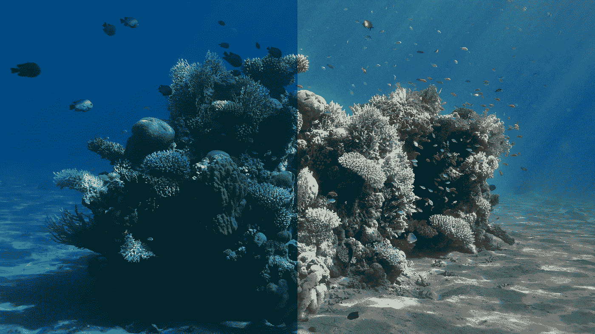
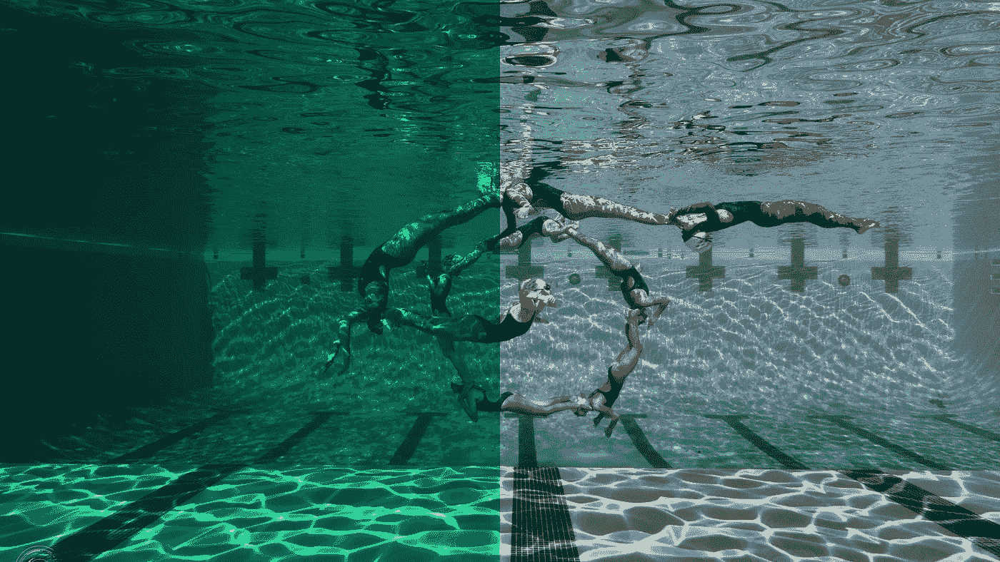
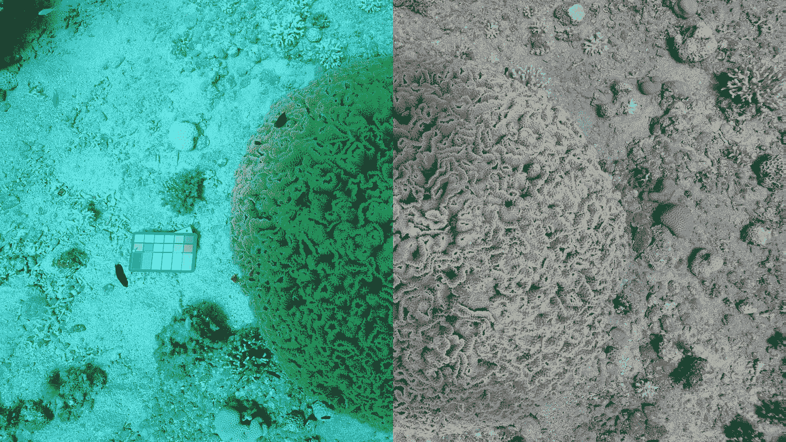
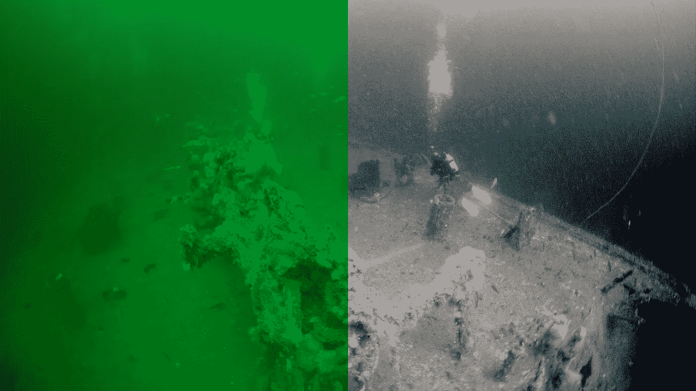
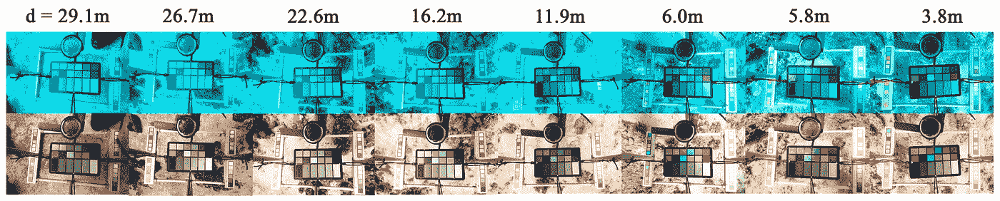
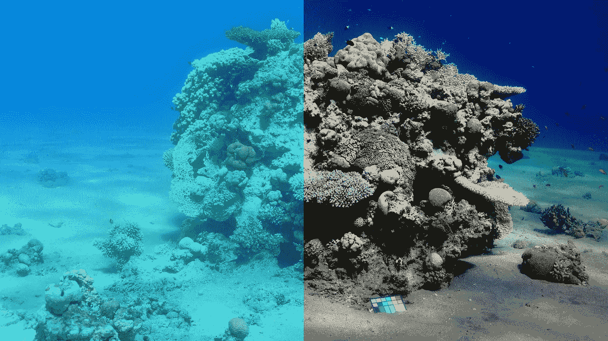

# 海洋穿越:从水下图像中去除水

> 原文：<https://towardsdatascience.com/sea-thru-removing-water-from-underwater-images-935288e13f7d?source=collection_archive---------18----------------------->

## 一种新的工具，有可能彻底改变水下图像的计算机视觉。

信用:Derya Akkaynak

先说清楚一点:这不是 Photoshop 教程！当然，相当多的摄影师知道提高水下照片质量的技巧，这对人眼来说已经足够了。但是对于那些开发机器学习算法来分类和识别图像中的对象的人来说，这样的技术是完全不够的。我挑战任何阅读这篇文章的人，让他们想到机器学习和计算机视觉在水下成像和视频中的单一应用。这比你想象的要难。根据德雅·阿克凯纳克和程昕婷·特雷比兹的说法，原因是“目前不存在鲁棒的算法”来可靠地去除水生图像中持续存在的噪声…

…直到现在。

信用:Derya Akkaynak

## 有什么问题？

水下照片相当于在空气中拍摄的照片，但被厚厚的彩色雾覆盖，受白点和强度随距离变化的光源影响目前用于改进水下摄影的模型扩展了定期观测大气条件下的模型。然而，这些模型没有考虑水对光的极端影响。你知道吗[光在水中的速度大约比在空气中的速度慢 46200 英里/秒](https://micro.magnet.fsu.edu/primer/java/speedoflight/index.html)？

信用:Derya Akkaynak

## 变化的波长

这些速度的变化影响了我们看到的光的波长和颜色。让事情变得更加复杂的是，物体发出的光仅仅是折射阳光的反射。Akkaynak 和 Treibitz 试图通过认识到观察到的颜色波长是速度、距离和原始色调的函数来克服这一挑战。光在水中的速度是一个常数，光源色调也是如此。因此，如果我们知道一个物体的精确色调和与它的距离，我们就可以逆向工程出观察到的颜色的公式。总之，理论上是这样的。不幸的是，还有其他挑战需要考虑。

信用:Derya Akkaynak

## 后向散射

如果你曾经在浓雾中开车，你可能会倾向于打开你的远光灯，但你会很快意识到增加的光线更多的是致盲而不是有益的。这是因为空气中的水颗粒将更多的光反射回给你。在水下拍摄图像时也会发生同样的现象，因此会影响拍摄照片的颜色精度。随着与焦点物体的距离增加，反向散射强度增加。

有一种用于处理反向散射的估计器，称为暗通道先验(DCP)，它是为在朦胧条件下拍摄图像而开发的。DCP 背后的思想基于以下内容:“[室外无霾图像中的大多数局部斑块包含一些像素，这些像素在至少一个颜色通道中的强度非常低。将该先验与薄雾成像模型一起使用，我们可以直接估计薄雾的厚度并恢复高质量的无薄雾图像。](http://kaiminghe.com/cvpr09/)

信用:Derya Akkaynak

## 克服障碍

Akkaynak 和 Treibitz 声称 DCP 的修改版本考虑了水的光吸收和反向散射。然而，这样做的公式需要已知的距离作为输入变量，并且期望用户对每张照片进行这样的测量是不切实际的。幸运的是，摄影测量领域的专家已经开发出处理这个问题的技术。例如，如果成像物体的尺寸是已知的，那么距离可以通过缩放得到。

多镜头相机，如现代智能手机上的相机，为使用视频测量提供了更优雅的解决方案。通过从两个或多个角度拍摄同一幅图像，并使用相机之间的已知距离，我们可以测量深度。(还记得你高中几何的 [ASA 三角形](https://www.mathsisfun.com/algebra/trig-solving-asa-triangles.html)吗？)你的手机已经能够实时进行这些测量和计算。最终的结果是一个有潜力为水下摄影和摄像带来计算机视觉革命的产品。

信用:Derya Akkaynak

关于 Sea-thru 的更多信息，包括该算法的未来可用性，请前往 https://www.deryaakkaynak.com/sea-thru。