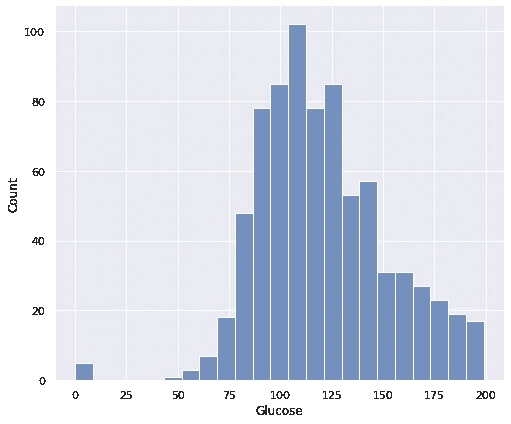
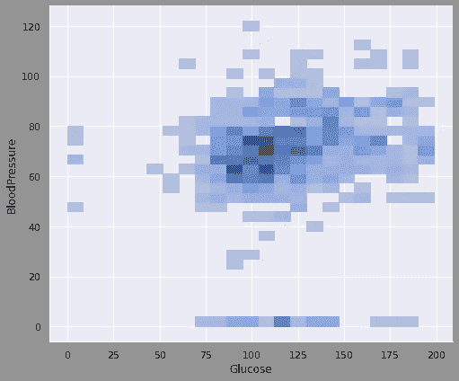
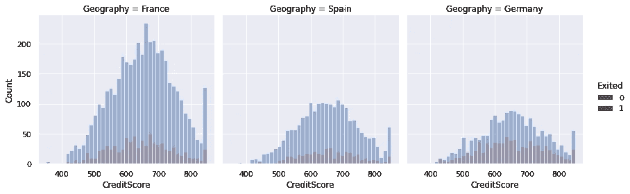
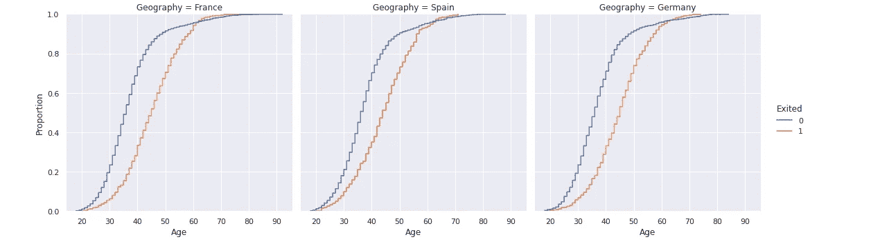
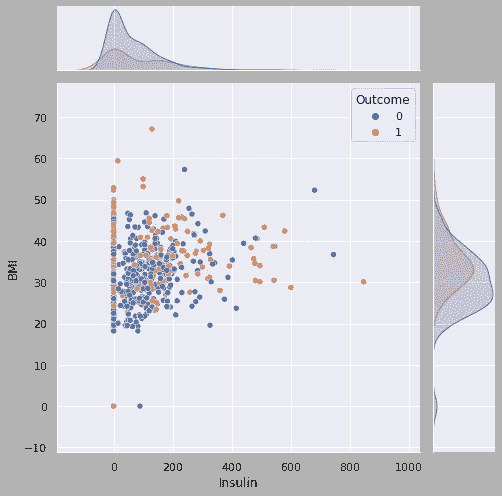
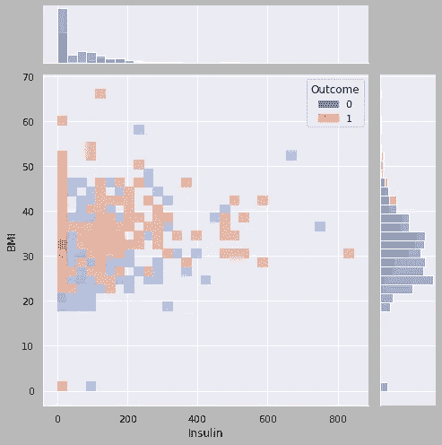

# 刚刚发布的 Seaborn 0.11 具有很棒的新特性

> 原文：<https://towardsdatascience.com/seaborn-0-11-just-released-with-great-new-features-c5b45efad7e2?source=collection_archive---------18----------------------->

## Seaborn 刚刚好起来。

Seaborn 是一个基于 Matplotlib 构建的高级 Python 数据可视化库。它可以方便地创建许多不同的信息统计可视化。


照片由 [Giovany Pineda Gallego](https://unsplash.com/@giovanypg?utm_source=unsplash&utm_medium=referral&utm_content=creditCopyText) 在 [Unsplash](https://unsplash.com/s/photos/view?utm_source=unsplash&utm_medium=referral&utm_content=creditCopyText) 拍摄

Seaborn 的新版本(0.11.0)刚刚发布，在现有版本的基础上增加了新的特性和增强功能。在本帖中，我们将通过可视化示例介绍大部分变化。

引入了三个新功能，分别是**显示图**、**历史图**和 **ecdfplot。**这三个函数可用于可视化单变量或双变量数据分布。

**注意**:为了使用新功能，您需要更新到新版本，这可以通过`pip install seaborn==0.11.0`完成。

让我们从距离图开始。可以认为是另外两个的父类。distplot 使用**种类**参数，提供对 histplot、ecdfplot 和 kdeplot 的访问。因此，它是不同类型分布图的图形级界面。

这里有一个例子。

```
sns.displot(data=diabetes, x='Glucose', kind='hist', height=6, aspect=1.2)
```



我们绘制了一个直方图，显示了葡萄糖变量的单变量分布。

下面的代码将创建一个直方图，显示葡萄糖和血压变量的二元分布。

```
sns.displot(data=diabetes, x='Glucose', y='BloodPressure',
kind='hist', height=6, aspect=1.2)
```



区域的暗度随着该区域内数据点数量的增加而增加。

distplot 是图形级别的函数，而 histplot 是轴级别的函数。可以使用 histplot 函数的以下语法创建相同的图。

```
sns.histplot(data=diabetes, x='Glucose', y='BloodPressure')
```

如果你想了解更多关于 Matplotlib 的图形和轴的概念，这里[有一个关于 Matplotlib 结构的详细帖子。](/understanding-the-structure-of-matplotlib-23b97f507fac)

由于 displot 在一个[面网格](/seaborn-facetgrid-taking-subplots-further-15ee7af54e44)上绘制图形，我们可以在同一个图形上绘制多个图形。

```
sns.displot(data=churn, x='CreditScore', kind='hist',
col='Geography', hue='Exited')
```



ecdfplot(经验累积分布函数)提供低于数据集中每个唯一值的观察值的比例或计数。除了对变量分布的概述之外，与直方图相比，我们可以更清楚地了解数据中的每个观察值，因为没有宁滨(即分组)。

```
sns.displot(data=churn, x='Age', kind='ecdf', col='Geography', hue='Exited')
```



ecdfplot 只能绘制单变量分布。

新版本带有一个贬值的功能，即 **distplot** 。这是意料之中的，因为新函数(displot 和 histplot)似乎是 displot 的更好的替代物。

目前使用的一些功能也有所改进或增强。

**联合图**提供两个变量的单变量和双变量图。色调语义被添加到 jointplot，这增加了额外的信息能力。

```
sns.jointplot(data=diabetes, x='Insulin', y='BMI', hue='Outcome',
height=7)
```



jointplot 的另一个新增功能是 kind 参数的“hist”选项。kind 参数的缺省值是“散点”,但如果我们将其更改为“历史”,则会创建关节轴上的双变量直方图和边缘轴上的单变量直方图。

```
sns.jointplot(data=diabetes, x='Insulin', y='BMI', hue='Outcome',
kind='hist', height=7)
```



**关于 API 的一些亮点**

*   `Set`功能已被重命名为`set_theme`。它调整可视化中使用的主题的几个属性。
*   `axlabel`功能不再可用。建议用`ax.set(xlabel=, ylabel=)`代替。

我们已经介绍了一些主要的变化，但是如果你想看到所有的变化，这里有相关的 seaborn [文档](https://seaborn.pydata.org/whatsnew.html)。

如果你想自己练习，你可以访问 Kaggle 上的数据集。

*   [糖尿病](https://www.kaggle.com/uciml/pima-indians-diabetes-database)
*   [流失](https://www.kaggle.com/sonalidasgupta95/churn-prediction-of-bank-customers)

感谢您的阅读。如果您有任何反馈，请告诉我。