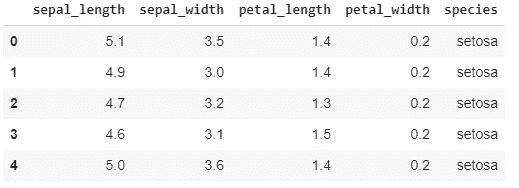
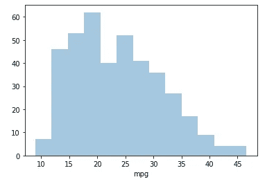
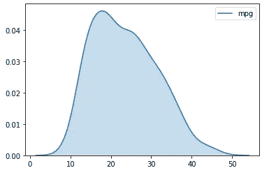
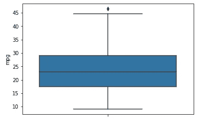
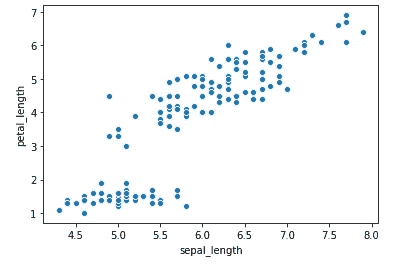
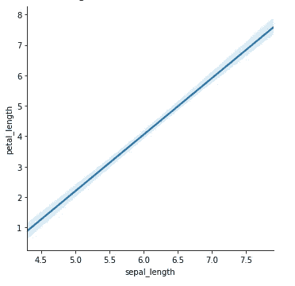
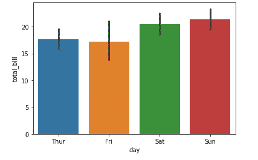
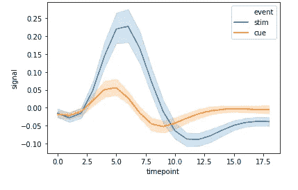
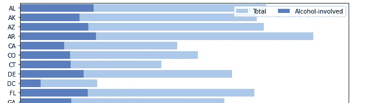
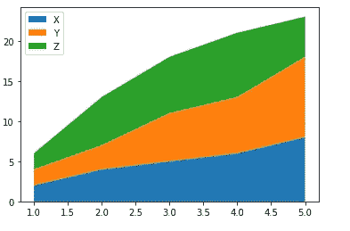

# Python 中数据可视化的 Seaborn 基础

> 原文：<https://towardsdatascience.com/seaborn-essentials-for-data-visualization-in-python-291aa117583b?source=collection_archive---------27----------------------->

## 可视化支柱的代码片段:分布、关系、比较、组合


照片由[阿尔菲亚诺·苏蒂安托](https://unsplash.com/@alfianostn?utm_source=medium&utm_medium=referral)在 [Unsplash](https://unsplash.com?utm_source=medium&utm_medium=referral) 拍摄

[之前说过](/4-pillars-of-data-visualization-distribution-relationship-composition-comparison-935cf9248f97)，数据可视化的目的是沟通数据中隐藏的信息。可视化从根本上服务于数据科学中的 4 个目的，即理解:

*   特征的**分布**
*   **两个或多个变量之间的关系**
*   **变量间的比较**
*   数据的**组成**

你可以用各种方法识别和交流隐藏的信息，而且有工具可以做到这一点。无论您选择哪种编程语言，每种语言都有库来有效地处理数据可视化。

如果你使用 Python，你有几个选择，但是我发现`seaborn`是最好的。不是因为`seaborn`可以做一些其他库做不到的事情，而是因为它的简单和直观的代码结构。

因此，本文的目的是用代码片段演示 Seaborn 的一些用例。我的学习/教学哲学是从一个问题开始，然后找到可以解决它的工具。因此，我不打算展示太阳底下的一切，而是给出一个关于 Seaborn 如何工作以及如何解决我刚才提到的 4 类问题的直觉。

让我们开始吧。

# 内置数据集

`seaborn`自带 17 个内置数据集。这意味着你不必花费大量的时间去寻找合适的数据集并清理它来使 Seaborn 就绪；相反，您将关注 Seaborn 可视化技术的核心特性来解决问题。

首先，让我们看看数据集。

```
# get names of the builtin dataset
sns.get_dataset_names()
```


内置数据集 Seaborn 数据集

如果你在数据科学领域呆过一段时间，你会仅仅通过它们的名字就认出它们中的许多(泰坦尼克？艾瑞斯。).否则，只需加载数据集并调用`head()`函数来查看数据。

```
df = sns.load_dataset("iris")
df.head()
```



加载和查看 Seaborn 内置数据集

我将使用其中的一些数据集来展示不同种类的可视化技术，所以我将它们全部载入。如果你知道每个数据集是关于什么的，那很好，否则就不要麻烦了。只需知道每个数据集包含不同种类的变量；其中一些是离散变量(例如 10、20、30 英里/加仑)，一些是连续变量(例如 5.2、3.6 瓣长)，一些是分类变量(例如一周中的几天)。现在，知道不同的变量类型以及何时使用它们应该是可行的。

```
# loading additional datasets
tips = sns.load_dataset("tips")
mpg = sns.load_dataset("mpg")
fmri = sns.load_dataset("fmri")
car_crashes = sns.load_dataset("car_crashes")
```

# 分配

我们的第一类问题是理解数据的分布。我所说的分布指的是几件事:频率分布、概率分布或只是数据相对于中心值的分布(平均值、中间值等)。

**直方图**

假设我们有一个包含 1000 辆汽车及其燃油效率的数据集，单位为每加仑英里数(mpg)。直方图会告诉我们每一 mpg 类别中汽车数量的频率分布。

```
# Bar histogram
sns.distplot(mpg["mpg"], kde = False)
```



柱状图

## **内核密度图**

统计学中使用的这种频率分布有一个更复杂的版本，叫做概率分布。你也可以画出来。

```
# Line histogram/kernel density plot
sns.kdeplot(mpg["mpg"], shade = True)
```



核密度图

## **箱线图**

还有另一种类型的分布——更广为人知的是 spread——它显示了一个变量相对于其中心趋势是如何分散/扩散的。

箱线图以展示变量的离差而闻名，变量的值如中值、最小值、最大值和异常值都在同一个图中。

```
# boxplot
sns.boxplot(y = mpg["mpg"])
```



箱线图

# 关系

孩子随着年龄的增长而长高——这是两个变量之间的关系:身高和年龄。

房子越大，价格越高——这是变量之间的另一种关系:楼层大小和价格。

关系图显示变量之间的关系。

## **散点图**

可视化可以检查和绘制变量之间的关联。对于连续变量，您可以非常直观地看到散点图中的任何东西，并直观地确定它们之间的关系。

```
# scatterplot
sns.scatterplot(x = "sepal_length", y = "petal_length", data = iris)
```

从下面的散点图可以看出，鸢尾花的花瓣长度与萼片长度呈正相关。



散点图

如果你很难直观地找出这种关系，还有一个选择——画一条趋势线。

```
# trend line
sns.lmplot(x = "sepal_length", y = "petal_length", data = iris, scatter = False)
```

## **趋势线/线性模型**

下面的趋势线应用于散点图中与前一条相同的数据。您想使用哪一个取决于您的需求，但也有权衡。在散点图中，你可以看到二维空间中每个数据点的可变性，但不容易跟踪趋势。

在基于线性模型创建的趋势图中，您可以确定数据的总体趋势以及置信区间，但会丢失单个数据点(当然，您也可以在趋势图中显示点)。



使用线性模型的趋势线

# 比较

比较分析是许多商业决策的关键。哪种产品卖得更好——产品 A 还是产品 B？这两种药物的疗效有显著差异吗？在整个决策过程中，这类问题无时无刻不在被问到。

## **条形图**

条形图是一些最简单、最古老但有效的可视化技术，用于交流比较分析。下图显示了顾客在一周的不同日子里支付的餐厅账单总额。这张图片比较了工作日的账单总额。

```
# bar chart
sns.barplot(x = "day", y = "total_bill", data = tips)
```



条形图

## **折线图**

折线图是比较数据的另一种方式。它通常用于时间序列分析，比较两组观察值的时间演变。

```
# line chart/time series
sns.lineplot(x="timepoint", y="signal", hue="event", data=fmri)
```



折线图

# 作文

数据可视化的最后一个支柱是组合。成分图的目的是用绝对和相对术语(如百分比)显示一个或多个变量的成分。

在 Seaborn 中创建复合图有点复杂，它不像其他的那样是一行代码。所以请原谅我在下面举两个例子。

## **堆积条形图**

堆积图在单个条形图中显示不同类别的变量的构成。例如，一个显示阿拉巴马州车祸总数的条形图，该条形图还按涉及酒精的车祸进行了分类(见下图)。

```
# Initialize the matplotlib figure
f, ax = plt.subplots(figsize=(10, 15))# Plot the total crashes
sns.set_color_codes("pastel")
sns.barplot(x="total", y="abbrev", data=crashes,label="Total", color="b")# Plot the crashes where alcohol was involved
sns.set_color_codes("muted")
sns.barplot(x="alcohol", y="abbrev", data=crashes, label="Alcohol-involved", color="b")# Add a legend and informative axis label
ax.legend(ncol=2, loc="upper right", frameon=True)
```



堆积条形图

## **堆叠区域**

堆积面积图显示同一绘图区中不同观察组的值的变化。在这种情况下，这些值“堆叠”在彼此的顶部。

Seaborn 的内置数据集和代码对于显示堆叠面积图并不太有用，因此我们将创建一个简单的数据集，并使用`matplotlib`库显示一个“Seaborn 风格”的图表。

```
# stacked area
import numpy as np
import matplotlib.pytplot as plt# Data
x = range(1,6)
y = [[2,4,5,6,8], [2,3,6,7,10], [2,6,7,8,5]]# Plot
plt.stackplot(x,y, labels=['X','Y','Z'])
plt.legend(loc='upper left')
plt.show()
```



堆积面积图

# 离别赠言

本文的目的是使用 Python 库`seaborn`演示一些可视化技术。我想涵盖两件事——介绍您在数据科学中通常会遇到的不同类型的可视化，第二，一些使用 Seaborn 内置数据集的代码片段。希望这有用。想看更多这样的文章就大声喊出来。