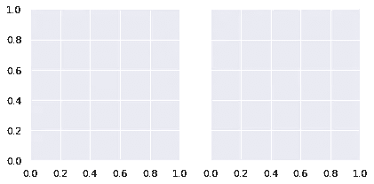
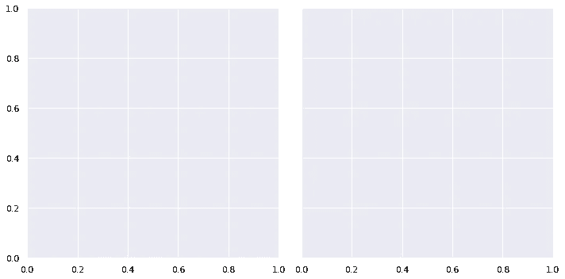
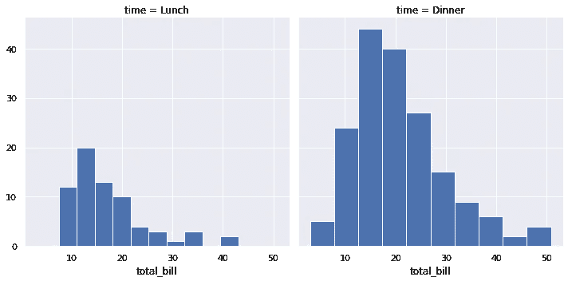
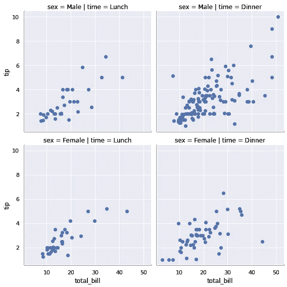
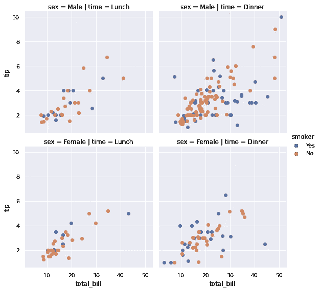
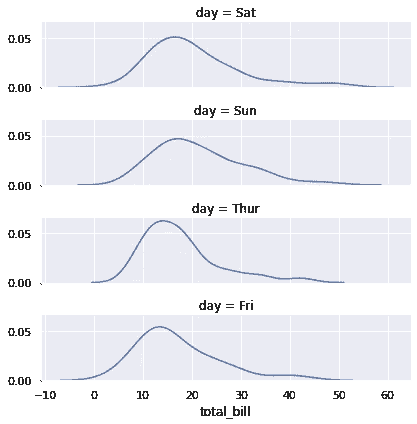

# Seaborn FacetGrid:进一步发展支线剧情

> 原文：<https://towardsdatascience.com/seaborn-facetgrid-taking-subplots-further-15ee7af54e44?source=collection_archive---------7----------------------->

## 循序渐进的教程


马库斯·斯皮斯克在 [Unsplash](https://unsplash.com/s/photos/different-colors?utm_source=unsplash&utm_medium=referral&utm_content=creditCopyText) 上的照片

数据可视化在数据分析中至关重要。“一张图片胜过千言万语”这句名言同样适用于数据可视化领域。在这篇文章中，我将解释一个结构良好、信息量很大的支线剧情集:**、FacetGrid** 。

**FacetGrid** 基本上就是支线剧情的网格。Matplotlib 支持创建具有多个轴的图形，因此允许在一个图形中有子图形。FacetGrid 在 matplotlib 的子情节结构上放了什么:

*   使过程更容易、更流畅(用更少的代码)
*   将数据集的结构转移到子情节

使用 FacetGrids 可以很容易地发现变量的分布或变量之间的关系。它们最多可以有三个维度:**行**、**列**和**色调**。通过例子，我们会更清楚。那么，我们开始吧。

像往常一样，我们从导入库开始。

> **注意** : FacetGrid 需要存储在 pandas 数据帧中的数据，其中每行代表一个观察值，列代表变量。因此，我们也进口熊猫。

```
import numpy as np
import pandas as pdimport matplotlib.pyplot as plt
import seaborn as sns
sns.set(style='darkgrid', color_codes=True)%matplotlib inline
```

我们将使用 seaborn 的内置“tips”数据集。

```
tip = sns.load_dataset("tips")
tip.head()
```


FacetGrid 对象通过传递数据帧和变量名来初始化，以创建轴的结构。用于初始化 FacetGrid 对象的变量需要是**分类的**或**离散的**。根据类别的数量创建网格结构。例如，“时间”列有两个唯一的值。

```
tip['time'].value_counts()
Dinner    176 
Lunch      68 
Name: time, dtype: int64
```

让我们通过将“时间”变量传递给**列**参数来初始化 FacetGrid 对象。

```
g = sns.FacetGrid(tip, col='time')
```



我们刚刚创建了一个非常简单的包含两个方面的网格(每个子情节都是一个方面)。使用**高度**和**纵横比**参数调整刻面的尺寸。

*   高度是刻面的高度，单位为英寸
*   纵横比是宽度和高度的比值(宽度=纵横比*高度)。坡向的默认值为 1。

让我们用更大的面来更新网格。

```
g = sns.FacetGrid(tip, col='time', height=5)
```



是时候使用 **FacetGrid.map()** 方法在网格上绘制数据了。它需要一个绘图函数和变量作为参数进行绘图。

```
g = sns.FacetGrid(tip, col='time', height=5)
g.map(plt.hist, "total_bill")
```



网格显示基于“时间”的“总账单”直方图。根据绘图函数的不同，我们可能需要为 map 方法传递多个变量。例如，散点图需要两个变量。

```
g = sns.FacetGrid(tip, col='time', height=5)
g.map(plt.scatter, "total_bill", "tip")
```


让我们用**行**参数给网格增加一个维度。

```
g = sns.FacetGrid(tip, row='sex', col='time', height=4)
g.map(plt.scatter, "total_bill", "tip")
```



“性别”和“时间”列都有两个不同的值，因此创建了一个 2x2 FacetGrid。从上图中我们可以看出，男性和女性的“总账单”和“小费”变量具有相似的趋势。

**色调**参数允许用颜色给网格增加一个维度。

```
g = sns.FacetGrid(tip, row='sex', col='time', hue='smoker',    
                  height=4)
g.map(plt.scatter, "total_bill", "tip")
g.add_legend()
```



我们现在对“总账单”、“小费”和“吸烟者”变量之间的关系有了一个概述。

“日”列有 4 个唯一值:

```
tip.day.value_counts()
Sat     87 
Sun     76 
Thur    62 
Fri     19 
Name: day, dtype: int64
```

我们可以创建一个 FacetGrid，显示“total_bill”在不同日子的分布情况。它会显示顾客是否在某一天花费更多。

```
g = sns.FacetGrid(tip, row='day', 
                  row_order = tip.day.value_counts().index,
                  height=1.5, aspect=4)g.map(sns.distplot, "total_bill", hist=False)
```



似乎人们倾向于在周末多花一点钱。我们在该图中使用了**行顺序**参数。顾名思义，它决定了刻面的顺序。在前面的绘图中，我们使用了 matplotlib.pyplot 接口中的绘图函数。但是，对于最后一个，我们使用了 seaborn 包中的绘图功能。这是 FacetGrid 的一个很好的特性，提供了额外的灵活性。

为了丰富 FacetGrids 的功能和外观，可以在 facet grids 上添加更多的特性。如果你想更深入，我建议在 FacetGrid 上查看 seaborn 文档。

感谢您的阅读。如果您有任何反馈，请告诉我。

# **参考文献**

*   [https://seaborn.pydata.org/generated/seaborn.FacetGrid.html](https://seaborn.pydata.org/generated/seaborn.FacetGrid.html)
*   [https://seaborn . pydata . org/tutorial/axis _ grids . html # grid-tutorial](https://seaborn.pydata.org/tutorial/axis_grids.html#grid-tutorial)