# Seaborn 绘图函数层次结构

> 原文：<https://towardsdatascience.com/seaborn-plot-functions-hierarchy-ccc865d974f2?source=collection_archive---------29----------------------->

## 每个地块系列一个函数

照片由[埃文·沃姆斯利](https://unsplash.com/@slushiepie?utm_source=unsplash&utm_medium=referral&utm_content=creditCopyText)在 [Unsplash](https://unsplash.com/s/photos/sea-pattern?utm_source=unsplash&utm_medium=referral&utm_content=creditCopyText) 上拍摄

python 中的 seaborn 包是我们大多数涉及数据可视化探索和提取洞察力的任务的首选。基于 matplotlib，seaborn 使我们能够生成更清晰的情节，更注重美感。

现在，随着本月 0.11.0 版本的发布，seaborn 不仅仅是一个绘图函数的集合，每个函数对应一种特定类型的绘图。

根据手头任务的性质，有明确定义的绘图功能层次和分组:

*   单变量分析(分布): **displot()**
*   关系分析(特征之间的相互作用和关系): **relplot()**
*   分类特征分析: **catplot()**

这 3 个顶级功能，也称为**图形级功能**，可用于主类别下的所有图。

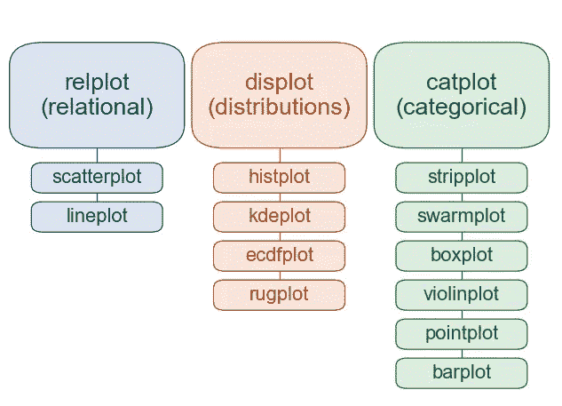

来源:Seaborn 文档[https://seaborn.pydata.org/index.html](https://seaborn.pydata.org/index.html)

我们为什么要关心这个？嗯，理解 seaborn 如何开展工作的这种细微差别是有好处的。这些优势列举如下:

*   你只需要知道三个函数——`relplot()`、`displot()`、`catplot()`，而不是全部十几个绘图函数。
*   图形级功能为各自类别中的所有图提供了相同的界面/签名。
*   默认情况下，这将确保图例(如果适用)绘制在绘图之外，从而减少对主要绘图元素的干扰
*   与 matplotlib 相比，基于数据集的特征容易生成小平面图，代码也更容易阅读
*   更简单的图形级定制

让我们来看看这些方面。我们将使用 seaborn 中内置的`tips`数据集。

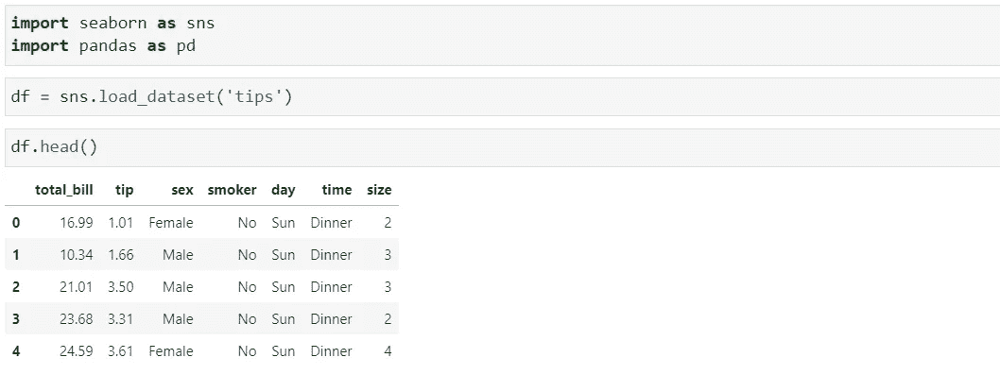

## 单变量分析—分布

`displot`功能(你没看错！这不是印刷错误..是`displot`而不是`distplot`，后者现在已被弃用)迎合了描绘特征分布的三种类型的图——直方图、密度图和累积分布图。注意，我们在所有 3 种情况下都只调用了`displot`,只是改变了`kind`参数来得到一个不同的图。

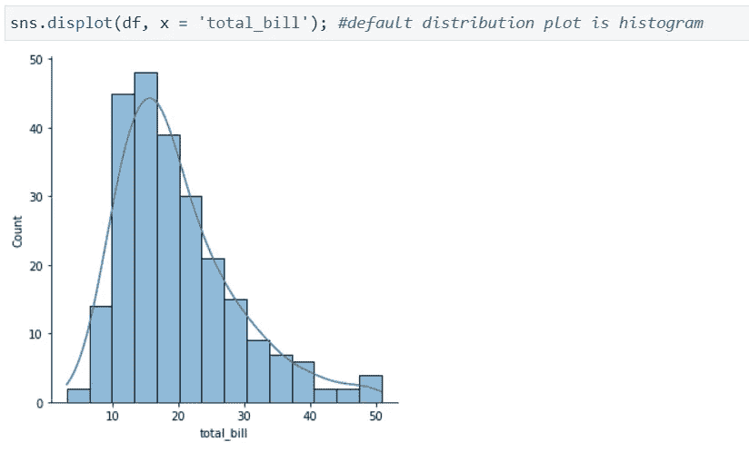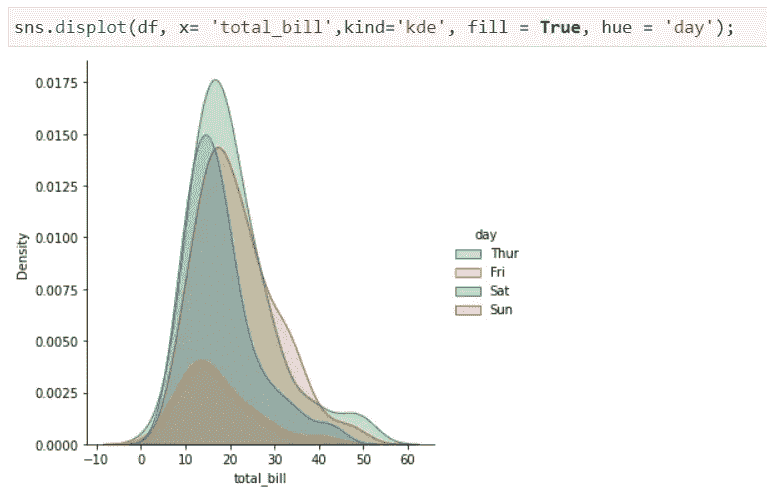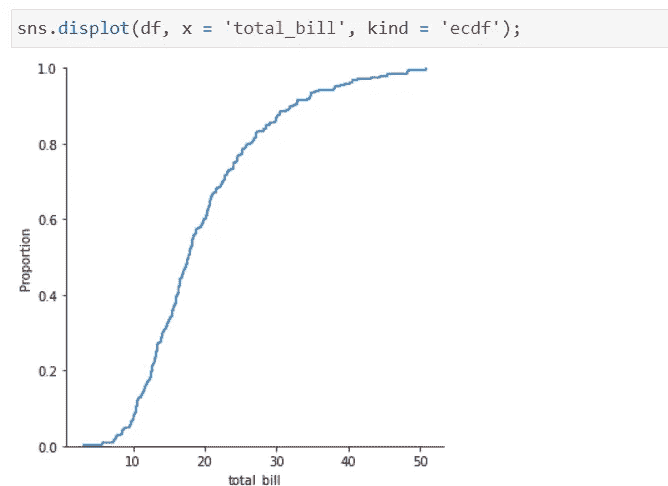

## 双/多变量分析—关系图

`relplot`功能适用于 2 个或更多特征之间的关系图系列(显示关系/相互作用或缺乏关系)——散点图和线图。

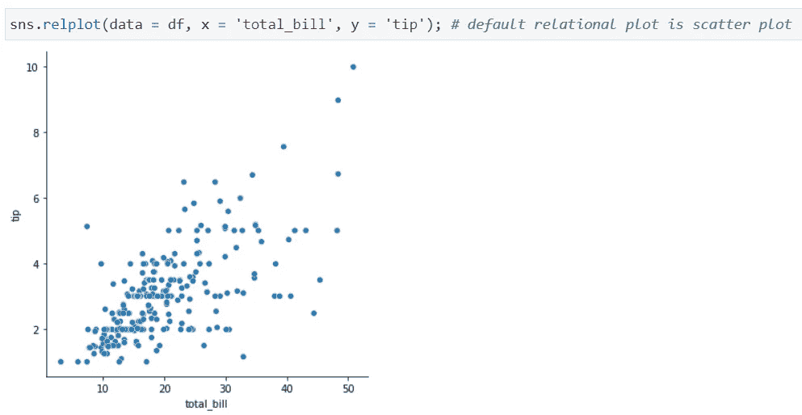

对于`lineplot`,假设我们想要检查一周中每一天的平均账单金额的趋势。我们使用`groupby()`按照数据集中的`day`特征对观察值进行分组。然后，我们使用`relplot`绘制线图。我们可以看到，与工作日相比，周末餐厅的平均账单金额有明显增加。

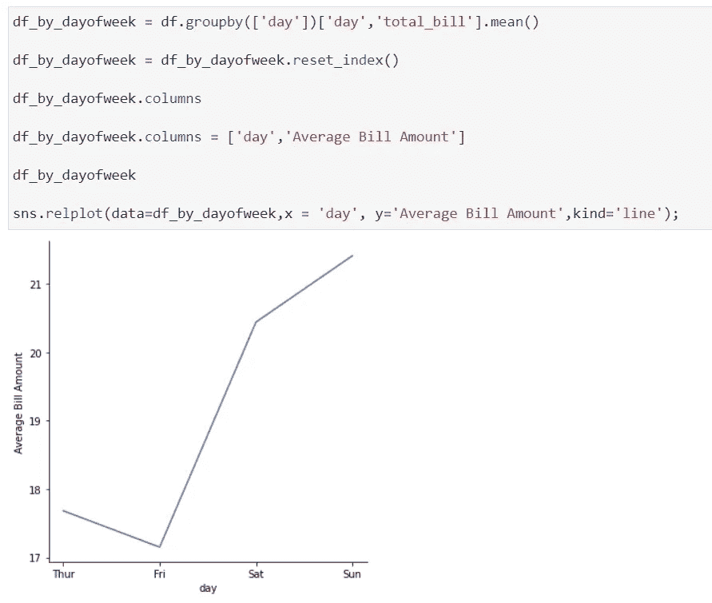

## 分类特征分析

图形级函数`catplot`满足所有分类特征图

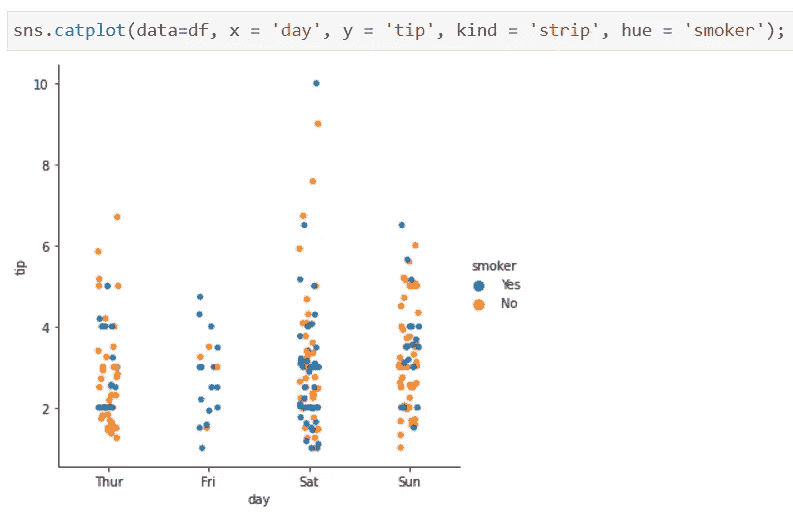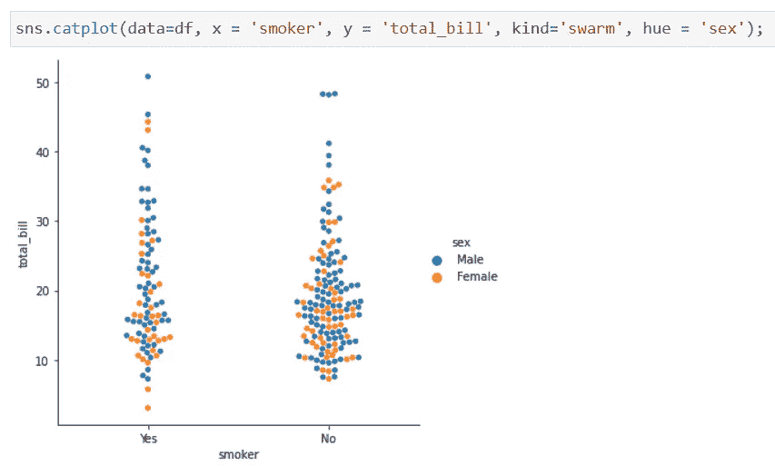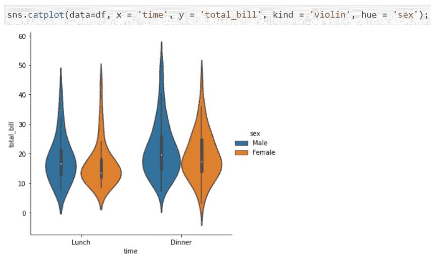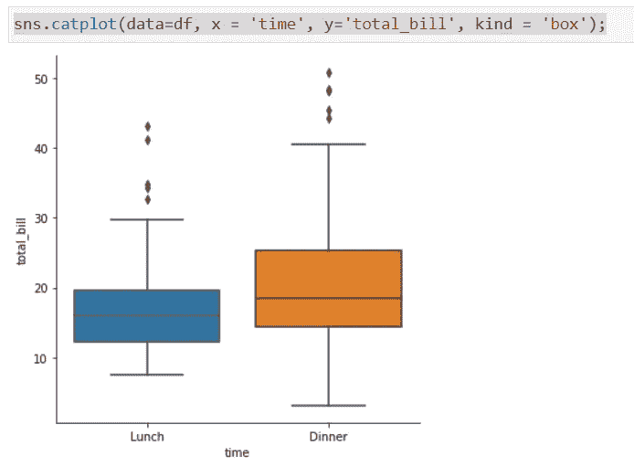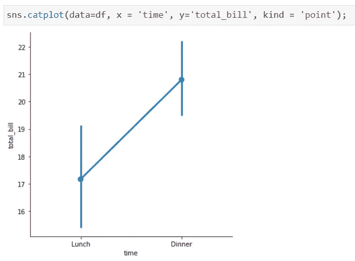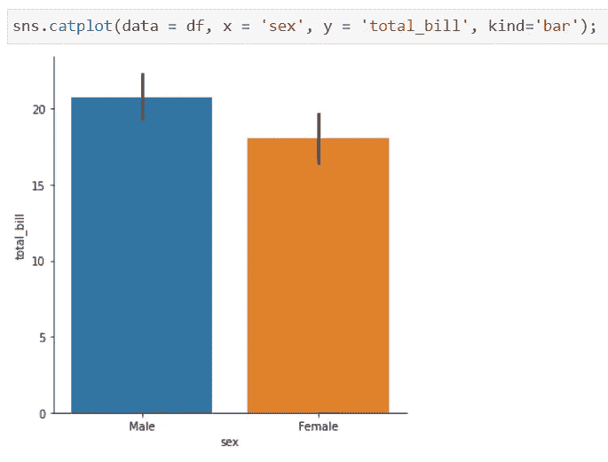

## 小平面图

与 matplotlib 相比，seaborn 的小平面绘图轻而易举，上面提到的图形级函数使用更少的代码和更少的混乱使它变得更加容易。查看以下图表:

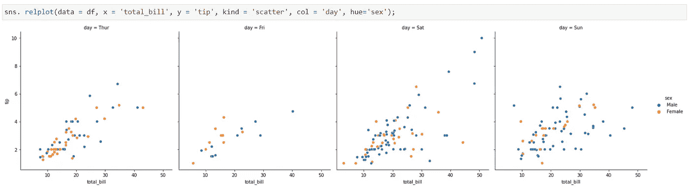

可以通过添加`col_wrap`参数并传递一个整数值来包装这些列。

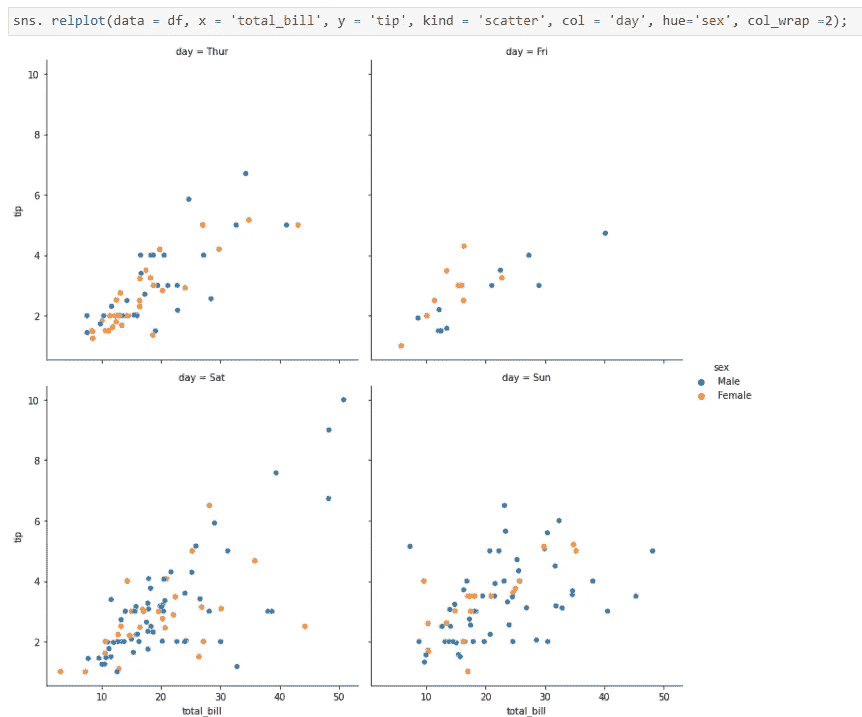

如果您是一个习惯性的生物，您仍然可以继续使用本文开头显示的图形级绘图函数下的单独绘图函数。

## 总结和结论

seaborn 0.11.0 版本中的通用图形级函数简化了绘图函数接口，并为每类绘图下的所有绘图提供了一个通用函数签名。这也减少了通过 matplotlib 实现相同结果的代码和混乱。小平面情节/支线情节也很容易用一行代码实现。

您可能还会喜欢以下关于简化数据可视化和探索性数据分析的文章:

 [## 拼凑——下一代 ggplots

### 进一步扩展 ggplot2 的多功能性..

towardsdatascience.com](/patchwork-the-next-generation-of-ggplots-1fcad5d2ba8a)  [## Matplotlib 多列、多行布局

### ..超越支线剧情中的标准网格布局

towardsdatascience.com](/matplotlib-multi-column-row-spanning-layouts-f026eb7c3c27)  [## 使用 SmartEDA 开发的 EDA

### 探索性数据分析——更智能、更快速的方式..

towardsdatascience.com](/eda-in-r-with-smarteda-eae12f2c6094) 

感谢您的阅读！