# Seaborn: Python

> 原文：<https://towardsdatascience.com/seaborn-python-8563c3d0ad41?source=collection_archive---------3----------------------->

## Seaborn 是 Python 中的一个库，主要用于制作统计图形。


沃洛季米尔·赫里先科在 [Unsplash](https://unsplash.com/s/photos/bar-chart?utm_source=unsplash&utm_medium=referral&utm_content=creditCopyText) 上的照片

**Seaborn** 是一个构建在 matplotlib 之上的数据可视化库，与 Python 中的 pandas 数据结构紧密集成。可视化是 Seaborn 的核心部分，有助于探索和理解数据。

要了解 Seaborn，你必须熟悉 [**Numpy**](https://medium.com/coderbyte/numpy-python-f8c8f2bbd13e) 和**[**Matplotlib**](https://levelup.gitconnected.com/matplotlib-python-ecc7ba303848)和 [**Pandas**](https://levelup.gitconnected.com/pandas-python-e69f4829fee1) 。**

**Seaborn 提供以下功能:**

1.  **面向数据集的 API 来确定变量之间的关系。**
2.  **线性回归图的自动估计和绘制。**
3.  **它支持多绘图网格的高级抽象。**
4.  **可视化单变量和双变量分布。**

**这些只是 Seaborn 提供的部分功能，还有更多，我们可以在这里探索所有的功能。**

**要初始化 Seaborn 库，使用的命令是:**

```
import seaborn as sns
```

**使用 Seaborn，我们可以绘制各种各样的图，如:**

1.  **分布图**
2.  **饼图和条形图**
3.  **散点图**
4.  **配对图**
5.  **热图**

> **对于整篇文章，我们使用从 [**Kaggle**](https://www.kaggle.com/lava18/google-play-store-apps) **下载的 Google Playstore 数据集。****

## **1.分布图**

**我们可以将 Seaborn 中的分布图与 Matplotlib 中的直方图进行比较。它们都提供了非常相似的功能。代替直方图中的频率图，我们将在 y 轴上绘制一个近似的概率密度。**

**我们将在代码中使用 **sns.distplot()** 来绘制分布图。**

**在继续之前，首先，让我们访问我们的数据集，**

**从我们的系统访问数据集**

**数据集看起来像这样，**

**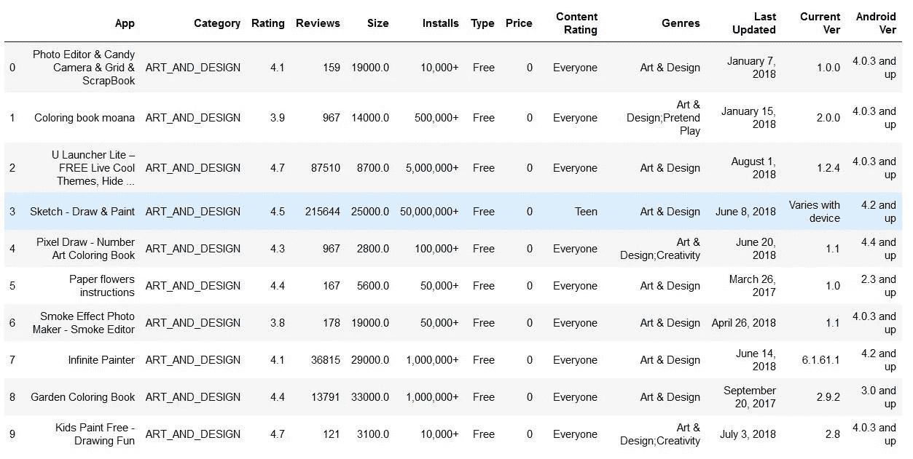**

**来自 Kaggle 的谷歌 Play 商店数据集**

**现在，让我们看看分布图看起来如何，如果我们从上面的数据集中绘制“评级”列，**

**评级栏分布图的代码**

**评级栏的分布图如下所示，**

**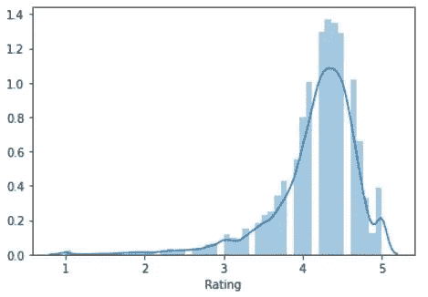**

**分布图—评级**

**这里，出现在分布图上的曲线( **KDE** )是近似概率密度曲线。**

**类似于 matplotlib 中的直方图，在 distribution 中也是如此，我们可以改变箱的数量，使图形更容易理解。**

**我们只需要在代码中增加仓的数量，**

```
#Change the number of bins
sns.distplot(inp1.Rating, bins=20, kde = False)
plt.show()
```

**现在，图表看起来像这样，**

**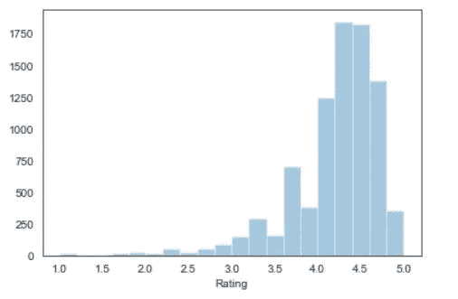**

**具有特定箱数的分布图**

**上图中，没有概率密度曲线。要移除曲线，我们只需在代码中写**‘kde = False’**。**

**我们还可以向分布图提供类似于 matplotlib 的条块的标题和颜色。让我们看看它的代码，**

**对于相同的列评级，分布图如下所示:**

**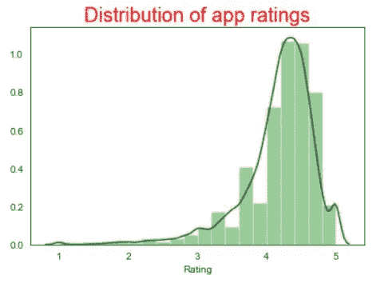**

**带标题的分布图**

****设计航海图****

**使用 Seaborn 的最大优势之一是，它为我们的图形提供了广泛的默认样式选项。**

**这些是 Seaborn 提供的默认样式。**

```
'Solarize_Light2',
 '_classic_test_patch',
 'bmh',
 'classic',
 'dark_background',
 'fast',
 'fivethirtyeight',
 'ggplot',
 'grayscale',
 'seaborn',
 'seaborn-bright',
 'seaborn-colorblind',
 'seaborn-dark',
 'seaborn-dark-palette',
 'seaborn-darkgrid',
 'seaborn-deep',
 'seaborn-muted',
 'seaborn-notebook',
 'seaborn-paper',
 'seaborn-pastel',
 'seaborn-poster',
 'seaborn-talk',
 'seaborn-ticks',
 'seaborn-white',
 'seaborn-whitegrid',
 'tableau-colorblind10'
```

**我们只需编写一行代码就可以将这些样式合并到我们的图表中。**

**将深色背景应用于我们的图表后，分布图看起来像这样，**

**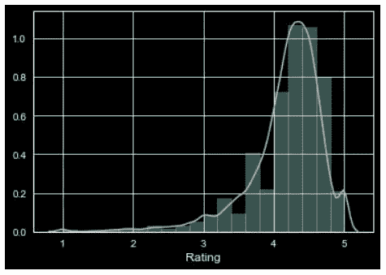**

**深色背景的分布图**

## **2.饼图和条形图**

**饼图通常用于分析不同类别中数值变量的变化情况。**

**在我们使用的数据集中，我们将分析内容评级栏中前 4 个类别的表现。**

**首先，我们将对内容评级列进行一些数据清理/挖掘，并检查那里有哪些类别。**

**现在，类别列表将会是，**

**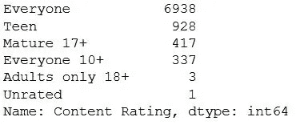**

**内容分级计数**

**根据上面的输出，由于“仅 18 岁以上成人”和“未分级”的数量明显少于其他类别，我们将从内容分级中删除这些类别并更新数据集。**

**在更新表格之后，在“内容分级”栏中出现的类别是，**

**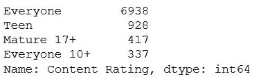**

**更新数据集后的内容分级计数**

**现在，让我们为“内容评级”列中的类别绘制饼图。**

**上面代码的饼状图如下所示，**

**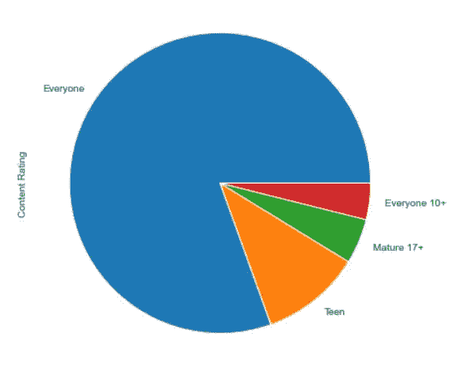**

**内容分级饼图**

**从上面的饼状图，我们无法正确推断是否“人人 10+”和“成熟 17+”。当这两个类别的值有些相似时，很难评估它们之间的差异。**

**我们可以通过在**条形图中绘制上述数据来克服这种情况。****

**现在，条形图看起来像下面这样，**

**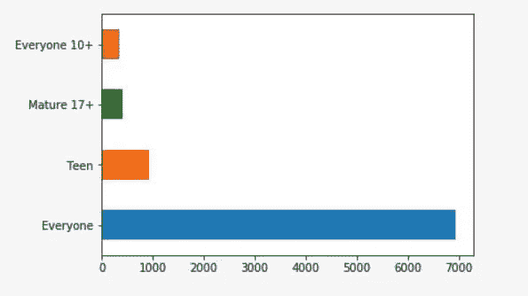**

**内容分级栏的条形图**

**类似于饼图，我们也可以定制我们的条形图，用不同颜色的条，图表的标题，等等。**

## **3.散点图**

**到目前为止，我们一直只处理数据集中的单个数字列，如评级、评论或大小等。但是，如果我们不得不推断两个数字列之间的关系，比如“评级和大小”或“评级和评论”呢？**

**当我们想要绘制数据集中任意两个数值列之间的关系时，可以使用散点图。这些图是在机器学习领域使用的最强大的可视化工具。**

**让我们看看数据集“Rating”和“Size”中的两个数字列的散点图是什么样子的。首先，我们将使用 matplotlib 绘制图形，然后我们将看到它在 seaborn 中的样子。**

****使用 matplotlib 的散点图****

```
**#import all the necessary libraries** **#Plotting the scatter plot** plt.scatter(pstore.Size, pstore.Rating)
plt.show()
```

**现在，情节看起来像这样**

**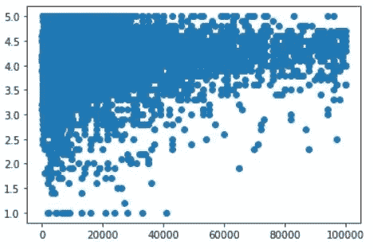**

**使用 Matplotlib 绘制散点图**

****使用 Seaborn 的散点图****

**我们将在散点图和直方图的代码中使用 **sns.joinplot()** 。**

****sns.scatterplot()** 在代码中仅用于散点图。**

**上面代码的散点图看起来像，**

**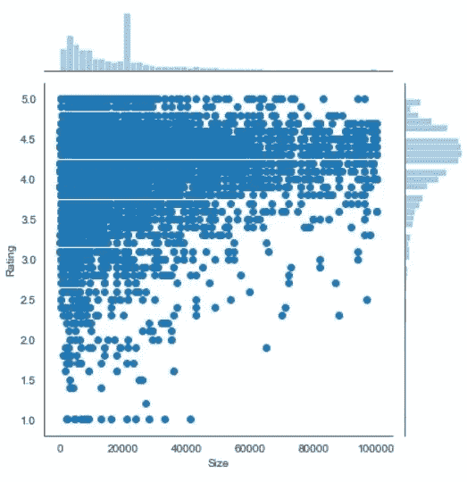**

**使用 Seaborn 的散点图**

**在 seaborn 中使用散点图的主要优点是，我们将在图形中获得散点图和直方图。**

**如果我们只想看到散点图，而不是代码中的“ **jointplot** ”，只需将其更改为“**散点图****

****回归图****

**回归图在接合图(散点图)中的两个数值参数之间创建一条回归线，并帮助可视化它们的线性关系。**

**该图如下所示，**

**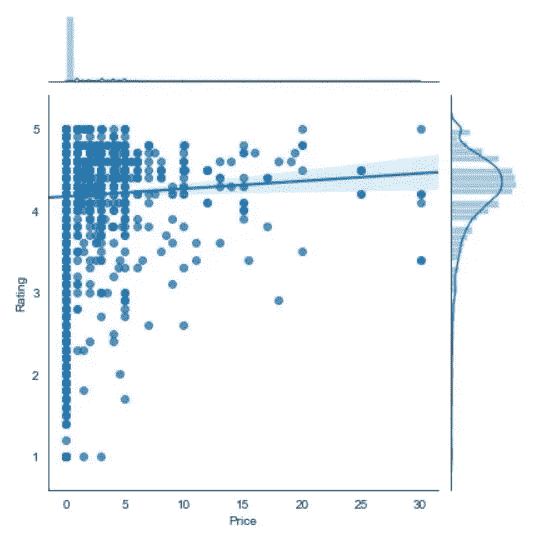**

**在 Seaborn 中使用 jointplot 的回归图**

**从上面的图表中，我们可以推断，如果应用程序的价格增加，评级会稳步上升。**

## **4.配对图**

**当我们想要查看 3 个以上不同数值变量之间的关系模式时，可以使用配对图。例如，假设我们想了解一家公司的销售如何受到三个不同因素的影响，在这种情况下，结对图将非常有帮助。**

**让我们为数据集中的评论、大小、价格和评级列创建一个配对图。**

**我们将在代码中使用 **sns.pairplot()** 一次绘制多个散点图。**

**上述图形的输出图形如下所示，**

**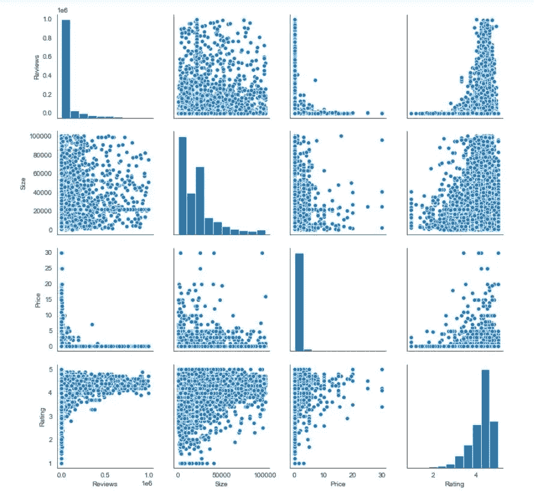**

**使用 Seaborn 的配对图**

*   **对于非对角线视图，图表将是两个数值变量之间的**散点图****
*   **对于对角线视图，它绘制了一个**直方图**，因为两个轴(x，y)是相同的。**

## **5.热图**

**热图以二维形式显示数据。热图的最终目的是在彩色图表中显示信息摘要。它利用了使用颜色和颜色强度来可视化一系列值的概念。**

**我们大多数人都会在足球比赛中看到以下类型的图形，**

**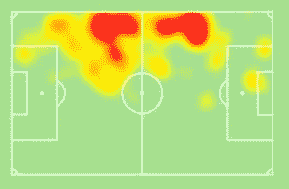**

**足球运动员的热图**

**Seaborn 的热图正是创建了这些类型的图表。**

**我们将使用 **sns.heatmap()** 来绘制可视化。**

**当您拥有如下数据时，我们可以创建一个热图。**

****

> **上表是使用 Pandas 的数据透视表创建的。你可以在我之前的文章 [**熊猫**](https://levelup.gitconnected.com/pandas-python-e69f4829fee1) **中看到数据透视表是如何创建的。****

**现在，让我们看看如何为上表创建一个热图。**

**在上面的代码中，我们将数据保存在新变量“heat”中**

**热图如下所示，**

**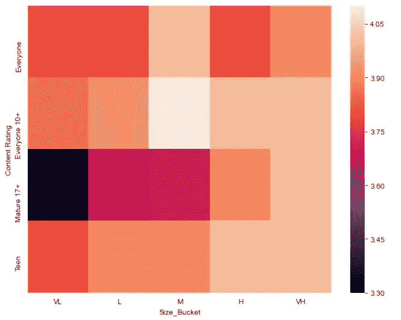**

**在 Seaborn 上创建的默认热图**

**我们可以对上面的图形进行一些定制，也可以改变颜色渐变，这样最高值的颜色会更深，最低值的颜色会更浅。**

**更新后的代码将是这样的，**

**上面更新的代码的热图如下所示，**

**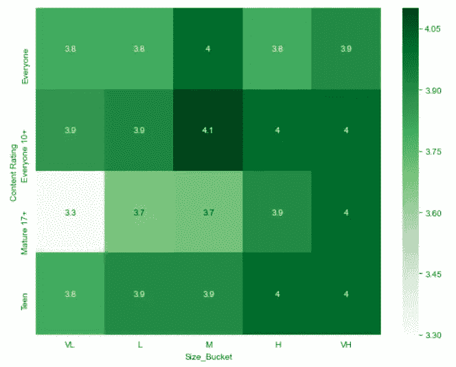**

**对代码进行了一些定制的热图**

**如果我们观察，在我们给出的代码“ **annot = True** ”中，这意味着，当 **annot 为 true** 时，图中的每个单元格显示其值。如果我们在代码中没有提到**不能**，那么它的默认值是 **False。****

**Seaborn 还支持一些其他类型的图表，如**线形图、条形图、堆积条形图、**等。但是，它们与通过 matplotlib 创建的没有任何不同。**

## **结论**

**这就是 seaborn 在 Python 中的工作方式，以及我们可以使用 Seaborn 创建的不同类型的图表。正如我已经提到的，Seaborn 构建在 matplotlib 库之上。因此，如果我们已经熟悉了 Matplotlib 及其函数，我们可以很容易地构建 Seaborn 图，并可以探索更深入的概念。**

****感谢您阅读**和**快乐编码！！！****

# **在这里查看我以前关于 Python 的文章**

*   **[**熊猫:蟒蛇**](https://levelup.gitconnected.com/pandas-python-e69f4829fee1)**
*   **[**Matplotlib:Python**](https://levelup.gitconnected.com/matplotlib-python-ecc7ba303848)**
*   **[**NumPy: Python**](https://medium.com/coderbyte/numpy-python-f8c8f2bbd13e)**
*   **[**Python 中的时间复杂度及其重要性**](https://medium.com/swlh/time-complexity-and-its-importance-in-python-2b2ba03c786b)**
*   **[**Python 中的递归或递归函数**](https://medium.com/python-in-plain-english/python-recursion-or-recursive-function-in-python-5802c74c1844)**
*   **[**Python 程序检查阿姆斯特朗数(n 位数)和栅栏矩阵**](https://medium.com/python-in-plain-english/python-programs-to-check-for-armstrong-number-n-digit-and-fenced-matrix-bc84a1bf32aa)**
*   **[**Python:基础参考问题—对换、阶乘、反数位、模式打印**](https://medium.com/python-in-plain-english/python-problems-for-basics-reference-swapping-factorial-reverse-digits-pattern-print-241dde763c74)**

# **参考**

*   ****Seaborn:**[https://www.w3schools.com/python/numpy_random_seaborn.asp](https://www.w3schools.com/python/numpy_random_seaborn.asp)**
*   ****seaborn 官方教程:**[https://seaborn.pydata.org/tutorial.html](https://seaborn.pydata.org/tutorial.html)**
*   ****Seaborn |回归图:**[https://www.geeksforgeeks.org/seaborn-regression-plots/](https://www.geeksforgeeks.org/seaborn-regression-plots/)**
*   ****Seaborn 热图:【https://likegeeks.com/seaborn-heatmap-tutorial/】T22****
*   ****https://www.kaggle.com/lava18/google-play-store-apps**—**数据集:** [谷歌 Play 商店](https://www.kaggle.com/lava18/google-play-store-apps)**