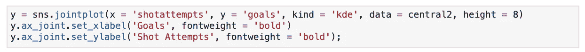

# Seaborn 可视化教程

> 原文：<https://towardsdatascience.com/seaborn-visualizations-tutorial-c390bf1d43ce?source=collection_archive---------21----------------------->

## 使用 NHL 统计数据浏览 Seaborn 的工具箱

作者安德鲁·科尔


克里斯·利维拉尼在 [Unsplash](https://unsplash.com?utm_source=medium&utm_medium=referral) 上的照片

如果你和我一样，一个没有体育的世界根本就不是世界。然而，进入 2020 年和新冠肺炎的时间，我们在这里，看着 2003 年 NCAA 锦标赛第二轮的重播，假装我们就像 2020 年锦标赛一样投入(当我打这篇文章时，它应该正在发生)。这个不幸的疫情也意味着我们错过了一年中我个人最喜欢的时间，NHL 季后赛。因此，为了弥补运动带给我们如此多的人的生活的缺乏，我决定将 NHL 统计数据整理成一个给我们中的一些人带来生活的概述。

Seaborn 是 Python 最强大和最基本的可视化包之一，通过数据讲述可视化故事有无限的可能性。所有 NHL 的数据都是从 MoneyPuck.com 的 T4 收集的。这款笔记本的 GitHub 库可以在[这里](https://github.com/andrewcole33/seaborn_nhl_visualizations.git)找到。

# 数据

我们先清理一下现有的信息。我们将从所有情况下的溜冰者中选择数据(5v5，男子优势，人手不足，等等。).接下来，因为有 31 支 NHL 球队，这对于这些教学目的来说是一个很大的处理量，所以我们将数据限制在仅来自中央赛区的球队:芝加哥黑鹰队、纳什维尔掠夺者队、圣路易斯蓝调队、科罗拉多雪崩队、明尼苏达怀尔德队、温尼伯喷气机队和达拉斯明星队。

我们将要处理的数据帧如下所示:


我们有来自 200 个玩家的 153 个统计特征的统计数据。我们将只关注基本的统计数据，如进球、得分、点球等。

# 海生的

要导入库:

```
import seaborn as sns
```

我们将 seaborn 重命名为“sns ”,以便以后在可视化时调用它。

## 散点图— sns.relplot()

与任何数据集一样，我们想看看统计关系。也许观察二元关系的最好方法是使用散点图。每个点将显示一个统计要素中观测值的联合分布及其第二个要素的位置。我们先来看看积分是怎么来的(1 球= 1 分，1 助攻= 1 分；1 球+ 2 助攻= 3 分)


我们可以看到，正如你直觉所料，玩的游戏越多，得分越高。这只是你的基本散点图，那么我们如何让这个图表给我们更多的信息呢？让我们添加一个色调。

## 色调图— sns.relplot()


通过在 sns.relplot()代码中添加“hue”参数，我们能够看到每个团队的得分/比赛分布情况。我们能更进一步吗？这个情节只告诉我们每支队伍的分数和比赛，但是还有更多信息需要了解！职位呢？在那些单独的队伍中，谁得分更多？我们来加点支线剧情了解一下。


现在我们有了和上面一样的图表，按团队和位置分类。每行代表不同的球队，每列代表不同的位置(进攻或防守)。举个例子，我们可以看到芝加哥有一个前锋在刚刚打完的 60 多场比赛中得分超过 80 分，而芝加哥的大部分防守队员无论打多少场比赛得分都不到 20 分(只有一个例外)。

## 直方图— sns.distplot()

直方图是任何分析师都能创建的最强大的可视化工具之一。直方图以图形方式总结了所有数据的分布。简单来说，直方图显示了数据集中每个值出现的频率。x 轴包含变量度量，而 y 轴包含观察值的相对频率。


上面的直方图告诉我们，绝大多数联盟得分在 0 到 20 分之间。我们看到的平滑线是**核密度估计(KDE)——**一种基于我们已有样本估计未知变量概率分布的技术。更简单地说，如果新的玩家数据被引入到集合中，它最有可能落在平滑线的最高峰之下。我们在图表底部看到的刻度线被称为**地毯。**rug 简单地向我们展示了各个数据观察值在图表上的位置。您可以通过将代码参数设置为 **False 来消除直方图中的 KDE 和地毯。**

## **box plot—SNS . cat plot(kind = ' box ')**

另一种有助于我们了解数据的图表是箱线图。具体来说，箱线图帮助我们确定数据的中位数、范围和可变性在哪里。团队得分的箱线图如下所示:


我们看到的方框显示了分布的三个四分位数(大的彩色方框)，该组的平均值(通过团队方框中间的水平线)，以及异常值(图表上方的点)。例如，科罗拉多州的得分率大多在 0-32 之间。科罗拉多州盒子上方的点是异常值，这意味着雪崩有一个明显高于团队其他人的单点得分，因此使其成为异常值。

为了使这个图更具描述性，我们可以再次添加“位置”作为色调，以显示每个位置(进攻或防守)的团队中的异常信息。


## 小提琴情节— sns.catplot(kind = 'violin ')

小提琴图是一种不太流行但更具描述性的可视化方法。箱线图实际上没有考虑数据的分布。如果数据发生变化(比如增加整个联盟的数据，而不仅仅是中部地区的数据)，中位数和范围不会变化，但小提琴图**将**反映这种变化。小提琴图将“变宽”,以表示该值附近更高的观察密度。


我们现在可以看到，芝加哥的防守得分在 0-40 分之间，而明尼苏达的防守得分范围要大得多。小提琴图越宽，观察值处的数据越密集。

我们还可以通过添加一个“分割”来创建一个更精简的版本:


图表显示了同样的事情，只是通过将防御和进攻小提琴合二为一而简化了。芝加哥的前锋得分范围很大，而其防守队员的得分都集中在 0 到 20 分之间。

## 蜂群图— sns.catplot(kind = 'swarm ')

群体图基本上就是一个散点图，X 轴代表一个分类变量。


我们可以通过这个群集图看到，温尼伯拥有分区最高的进球得分者，但他们球队的大部分得分都在 10 分以下。让我们翻转类别，按职位和团队查看目标。


现在我们可以看到前锋明显比防守队员进更多的球，迄今为止最高的射手为温尼伯效力。

## 抖动图— sns.catplot(抖动=真)

抖动图与我们的蜂群图非常相似，但它让我们更有条理。这是你正常的点状图，但是它增加了一个“抖动”——一个点与点之间的间隔，以便更好的可视化。让我们用一个抖动图来看看各个位置的罚分数量。我们可以看到所有被罚 16 分以上的球员都是前锋


## Jointplot — sns.jointplot()

jointplot 是 seaborn 在显示单变量概要文件的同时显示双变量关系的方法。本质上结合了散点图和直方图(没有 KDE)。让我们来看看一个接合图，看看采取的处罚数量是如何与点生产。


如果我们看主要的散点图，我们真的不能做出很大的区别。人们固有地认为，少量的点球意味着更多的时间待在冰上，这意味着更多的得分机会。然而，散点图本身并没有显示任何方向上的强关系。但是，jointplot 为我们提供了沿着顶部和右侧脊线显示分布的好处。通过查看这些，我们可以看到随着处罚数量的增加，这些地区的玩家越来越少。积分也是如此。因此，我们可以推断，两者之间存在轻微的正相关关系。

## hex plot—SNS . joint plot(kind = ' hex ')

另一种可视化双变量关系的方法是 hexplot，特别是当我们有大量数据时。六格图将绘图窗口分成几个六格，然后落入每个格中的观察值的数量用一种颜色表示密度。颜色较深的六边形意味着在那个区域有更多的观察，或更多的密度。观察频率条形图可以沿着脊柱看到，作为额外的参考信息。我们将使用六边形图来分析进球数与射门次数之间的关系。


同样，这个图表可能是固有的。正如伟大的韦恩·格雷兹基/迈克尔·斯科特曾经说过的，“你没有出手的时候，你百分之百会错过”。我们相信随着射门次数的增加，进球数量也会增加。hexplot 重申了这个观点。我们在右下角看到了最暗的 hexbin，因为它是最密集的，因为在 NHL 中进球不是一件容易的事情，大多数球员都将集中在这个区域。当我们向右上方增加六边形时，颜色开始慢慢变淡，这表明射门次数和得分之间的正相关关系逐渐减少。

## 核密度估计-joint plot-SNS . joint plot(kind = ' kde ')

与 hexbin 相似的二元图是核密度估计联合图。KDE 联合图也使用颜色来确定观察值最密集的地方，但不是将它们放入预定义的六边形中，而是使用新数据引入的概率来制作连续图。让我们看看同样的射门次数/进球次数的关系。



我们可以看到，给我们的信息与在 hexbin 图中给我们的信息相同，但这显示了观察位置的概率视图。hexbin 没有向我们显示大多数球员都属于低进球/低射门尝试类别，我们可以看到更多射门尝试等于更多进球的概率越来越呈正相关，最大的球员集中在 0-50 次射门尝试范围和 0-5 次进球范围。

## 相关

双变量关系可以告诉我们很多，但是仅仅看分布图和散点图可能不足以提供我们所需要的关于数据表面数字下发生的事情的所有信息。相关性向我们展示了一个变量的值对另一个变量的影响程度。强相关性(1.00)表示当一个变量发生变化时，另一个变量也会发生 100%的正向变化(相反方向为-1.00)。让我们看看 NHL 中的某些变量在相关性方面有多重要。下面是检查相关性的代码:


观察这些数字让我们明白了很多，注意，z 轴向右下方移动代表了变量与自身的完美相关性。我们可以看到，像分数这样的某些变量**与射门次数、**密切相关，因为相关系数都远高于 0.5。但是统计数据和数据集通常不像体育统计数据那样直观，所以让我们看看如何让这个相关图表对用户更友好。

## 热图— sns.heatmap()

热图只是我们在上面制作的关联表的一种更友好的可视化方式。如果相关系数较高，表明两个变量之间的相关性更显著，则颜色会更深。同样，参考深蓝色的 z 轴来表示变量与其自身之间完美的 1:1 相关性。


这张热图只是以一种更简单的方式将我们的目光吸引到最佳和最差的相关性上。例如，我们很容易看到射门次数和射门次数的相关性最强，而命中率与进球的相关性最小。

## Pairplot — sns.pairplot()

最后，或许对任何分析师来说，最强大、最有用的工具之一就是 Pairplot。pairplot 可视化了单个变量的分布以及与其他变量的**双变量**关系。简单地说，我们将为数据框架中的每个变量创建一个二元散点图，然后将它们放入一个屏幕中。


这个庞大的图表有一大堆，但是它也非常有助于获得我们正在寻找的东西的整体视图。我们阅读它就像阅读二元散点图一样。如果我们看到两个变量之间有很强的正/负关系，我们就知道这些变量及其关系值得进一步研究。

# 就是这样！目前…

Seaborn 是一个非常强大的工具，可以将复杂的数据转化为易于理解的信息。可能性似乎是无穷无尽的，但希望这是所有可能性的良好开端。因此，请大家保持安全，保持健康，待在室内，我们都会没事的:)。