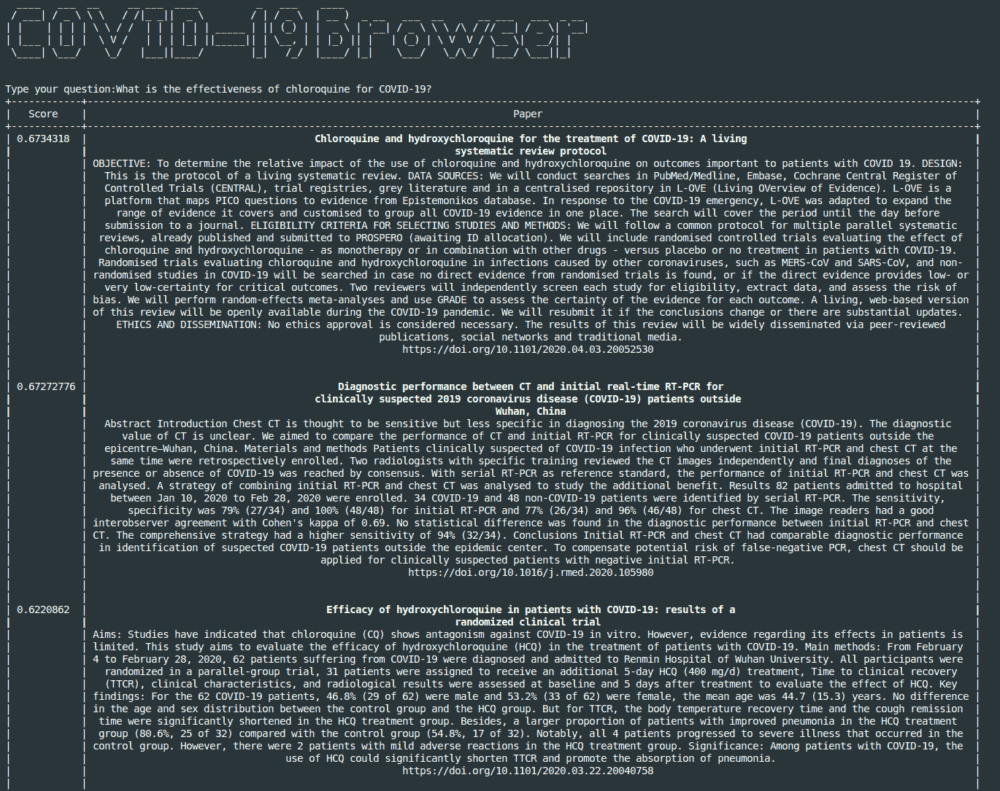

# 用深度学习搜索 COVID 论文

> 原文：<https://towardsdatascience.com/search-in-covid-papers-with-deep-learning-a3c14a61f501?source=collection_archive---------48----------------------->

## *一个*语义*浏览器使用深度学习和弹性搜索来搜索 COVID 论文*


今天，我们将使用深度学习建立一个语义浏览器，在超过 5 万篇关于最近新冠肺炎病的论文中进行搜索。

所有代码都在我的 GitHub [repo](https://github.com/FrancescoSaverioZuppichini/Search-COVID-papers-with-Deep-Learning) 上。而这篇文章的现场版是[这里](https://github.com/FrancescoSaverioZuppichini/Search-COVID-papers-with-Deep-Learning/blob/develop/tutorial.ipynb)

其核心思想是将每篇论文编码成一个表示其语义内容的向量，然后使用查询和所有编码文档之间的余弦相似性进行搜索。这与图像浏览器(例如 Google Images)搜索相似图像的过程相同。

因此，我们的难题由三部分组成:数据、从论文到向量的映射以及搜索方法。

大部分工作都是基于这个项目，在这个项目中，我和来自意大利的里雅斯特大学的学生一起工作。此处有现场演示[。](http://covidbrowser.areasciencepark.it/)

我们开始吧！

# 数据

一切从数据开始。我们将使用来自 Kaggle 的数据集。由白宫和领先研究团体联盟准备的超过 57，000 篇学术文章的列表。实际上，我们唯一需要的文件是包含论文信息和摘要全文的`metadata.csv`。您需要将文件存储在`./dataset`中。

让我们来看看

```
import pandas as pddf = pd.read_csv('./dataset/metadata.csv')df.head(5)
```


如你所见，我们有很多信息。我们显然对文本栏感兴趣。和熊猫一起工作并不理想，所以让我们创造一个`Dataset`。这将允许我们稍后创建一个`DataLoader`来执行分批编码。如果你不熟悉 Pytorch 数据加载生态系统，你可以在这里阅读更多关于[的内容](https://pytorch.org/tutorials/beginner/data_loading_tutorial.html)


按照顺序，我子类化了`torch.utils.data.Dataset`来创建一个定制数据集。数据集需要一个 dataframe 作为输入，我们只保留了感兴趣的列。然后，我们删除了一些行，其中的`abstract`和`title`列分别与`FILTER_TITLE`和`FILTER_ABSTRACT`中的一个“垃圾”单词相匹配。这样做是因为文章以自动的方式被废弃，并且许多文章有不相关的条目而不是标题/摘要信息。

数据集返回一个字典，因为 PyTorch 不支持`pd.DataFrame`类型。为了给我们的搜索引擎更多的上下文，我们将`title`和`abstract`合并在一起，结果存储在`title_abstract`键中。

我们现在可以调用数据集，看看是否一切都是正确的

```
ds = CovidPapersDataset.from_path('./dataset/metadata.csv')ds[0]['title']
```

输出:

`'Sequence requirements for RNA strand transfer during nidovirus discontinuous subgenomic RNA synthesis'`

# 把…嵌入

我们现在需要一种方法从每个数据点创建一个向量(*嵌入*)。我们定义了一个类`Embedder`，它使用 [sentence_transformers](https://github.com/UKPLab/sentence-transformers) 库从 [HuggingFace 的](https://github.com/huggingface/transformers) `[transformers](https://github.com/huggingface/transformers)`中自动加载一个模型。

选择的模型是[gsarti/BioBERT-nli](https://huggingface.co/gsarti/biobert-nli)a[BioBERT](https://github.com/dmis-lab/biobert)模型，在 [SNLI](https://nlp.stanford.edu/projects/snli/) 和 [MultiNLI](https://www.nyu.edu/projects/bowman/multinli/) 上进行微调，以产生[通用句子嵌入](https://www.aclweb.org/anthology/D17-1070/)。Gabriele Sarti 进行了微调，复制它的代码可从[这里](https://github.com/gsarti/covid-papers-browser/blob/master/scripts/finetune_nli.py)获得。

BioBERT 特别适合我们的数据集，因为它最初是在生物医学科学出版物上训练的。因此，考虑到与我们的数据的相似性，它应该创建更好的上下文感知嵌入。

在幕后，模型首先将输入字符串标记化，然后为每个标记创建一个向量。因此，如果我们在一篇论文中有`N`个标记，我们将得到一个`[N, 768]`向量(注意，一个标记通常对应一个单词片段，在这里阅读更多关于标记化策略。因此，如果两篇论文有不同的字数，我们将有两个不同的第一维向量。这是一个问题，因为我们需要将它们与搜索进行比较。

为了获得每篇论文的固定嵌入，我们应用平均池。这种方法计算每个单词的平均值，并输出一个固定大小的 dims 向量`[1, 768]`

所以，让我们编写一个`Embedder`类


我们可以在数据点上尝试我们的嵌入器

```
embedder = Embedder()emb = embedder(ds[0]['title_abstract'])emb[0].shape // (768,)
```

瞧啊！我们对一篇论文进行了编码。

# 搜索

好的，我们知道如何嵌入每篇论文，但是我们如何使用查询来搜索数据呢？假设我们已经嵌入了**所有**论文，我们也可以**嵌入查询**并计算查询和所有嵌入之间的余弦相似性。然后，我们可以显示按距离(分数)排序的结果。直觉上，它们在嵌入空间中离查询越近，它们共享的上下文相似性就越大。

但是，怎么做呢？首先，我们需要一种适当的方法来管理数据，并足够快地运行余弦相似性。幸运的是，弹性搜索来救援！

# 弹性搜索

[弹性搜索](https://www.elastic.co/)是一个目标只有一个的数据库，是的你猜对了:搜索。我们将首先在 elastic 中存储所有嵌入，然后使用它的 API 来执行搜索。如果你像我一样懒，你可以用 docker 安装弹性搜索

```
docker pull docker.elastic.co/elasticsearch/elasticsearch:7.6.2
docker run -p 9200:9200 -p 9300:9300 -e "discovery.type=single-node" docker.elastic.co/elasticsearch/elasticsearch:7.6.2
```

完美。下一步是在弹性搜索中存储嵌入和论文信息。这是一个非常简单的过程。我们需要创建一个`index`(一个新的数据库)，然后为每篇论文建立一个条目。

为了创建一个`index`，我们需要为 elastic 描述我们希望存储的内容。在我们的案例中:


你可以在弹性搜索[文档](https://www.elastic.co/guide/en/elasticsearch/reference/current/indices-create-index.html)上阅读更多关于索引创建的内容。最后一个条目将`embed`字段定义为带有`768`的密集向量。这确实是我们的嵌入。为了方便起见，我将配置存储在一个`.json`文件中，并创建了一个名为`ElasticSearchProvider`的类来处理存储过程。


大部分工作都是在`create_and_bulk_documents`完成的，在那里我们每次只解构一个条目，并添加两个弹性搜索参数。

不幸的是，弹性搜索无法序列化`numpy`数组。所以我们需要为我们的数据创建一个适配器。该类将纸张数据和嵌入作为输入，并“调整”它们以在我们的`ElasticSearchProvider`中工作。


好了，我们一切就绪。一种表示数据的方法，一种将数据编码成向量的方法和一种存储结果的方法。让我们把所有的东西都包起来，把所有的文件都编码。


这里有两个技巧，首先，我们使用`torch.utils.data.DataLoader`创建一个批处理式迭代器。总的来说，将数据成批地而不是作为一个单独的点提供给模型可以提高性能(在我的例子中是 x100)。其次，我们替换`DataLoader`构造函数中的`collate_fn`参数。这是因为，默认情况下，Pytorch 会尝试将我们所有的数据转换成一个`torch.Tensor`，但是它无法转换字符串。通过这样做，我们只返回一个字典数组，即来自`CovidPapersDataset`的输出。所以，`batch`是一个长度为`batch_size`的字典列表。我们做完后(1080ti 上~7m)，可以看一下`[http://localhost:9200/covid/_search?pretty=true&q=*:*](http://localhost:9200/covid/_search?pretty=true&q=*:*.)` [。](http://localhost:9200/covid/_search?pretty=true&q=*:*.)

如果一切正常，您应该会看到弹性搜索显示我们的数据


# 进行查询

我们差不多完成了。拼图的最后一块是在数据库中搜索的方法。弹性搜索可以在所有文档中的一个输入向量和目标向量场之间执行余弦相似性。语法非常简单:

```
{
    "query": {
        "match_all": {}
    },
    "script": {
        "source":
        "cosineSimilarity(params.query_vector, doc['embed']) + 1.0",
        "params": {
            "query_vector": vector
        }
    }
}
```

其中`vector`是我们的输入。因此，我们创建了一个类，它将一个向量作为输入，并显示查询的所有结果


让我们看看第一个结果(我已经复制并粘贴了第一篇匹配论文的摘要)

```
es_search = ElasticSearcher()
es_search(embedder(['Effect of the virus on pregnant women'])[0].tolist())
```

*作为应对新发感染的公共卫生专业人员，需要特别关注***孕妇及其后代。孕妇可能更容易感染新出现的感染，或受到更严重的影响。新的母体感染对胚胎或胎儿的影响很难预测。一些推荐用于预防或治疗的药物可能会伤害胚胎或胎儿。我们讨论了应对孕妇中新出现的感染的挑战，并提出了克服这些挑战的策略。**

*成功了！我还创建了一个命令行，用户可以在其中输入查询。最后的结果是:*

**

# *更多查询*

*最后可以提一个问题，找感兴趣的论文。从经验上看，越详细的查询效果越好，因为它们提供了更多的上下文。*

*例如，我们可能想知道*氯喹对新冠肺炎*有什么效果。结果是*

**

*或者*新冠肺炎如何与 ACE2 受体结合？**

**

*搜索引擎似乎工作良好，但它并不完美，在本教程的下一部分，我们将努力提高其准确性。*

# *结论*

*在这个项目中，我们建立了一个语义浏览器来搜索超过 5 万篇新冠肺炎论文。我和的里雅斯特大学的学生合作的最初项目是这里的。这里[有现场演示](http://covidbrowser.areasciencepark.it/)*

*你也可以使用命令行程序，你需要按照[这里](https://github.com/FrancescoSaverioZuppichini/Search-COVID-papers-with-Deep-Learning/blob/develop/README.md)的指示。*

## *承认*

*我要感谢 [Gabriele Sarti](https://www.linkedin.com/in/gabrielesarti/) 对我撰写本文的帮助， [Marco Franzon](https://www.linkedin.com/in/marco-franzon/) 和 [Tommaso Rodani](https://www.linkedin.com/in/tommaso-rodani-471a43b8/) 对我在弹性搜索实现中的支持。*

*感谢您的阅读*

*注意安全，*

*弗朗西斯科·萨维里奥·祖皮奇尼*