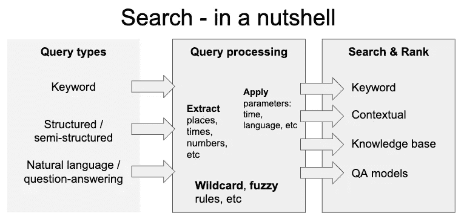
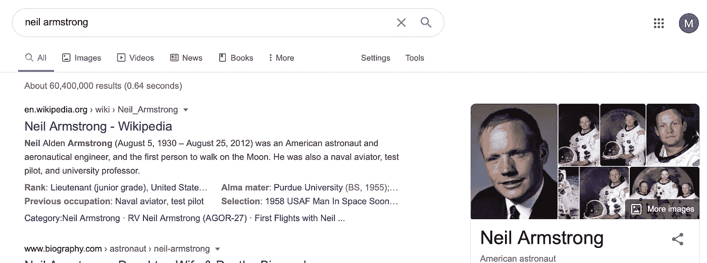
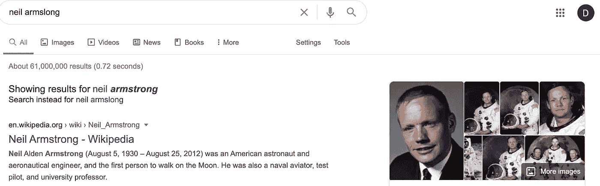
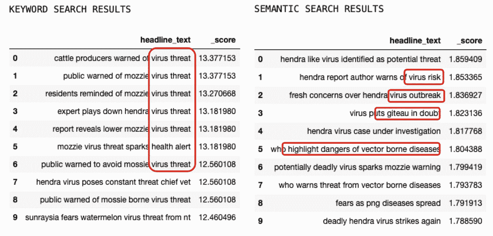
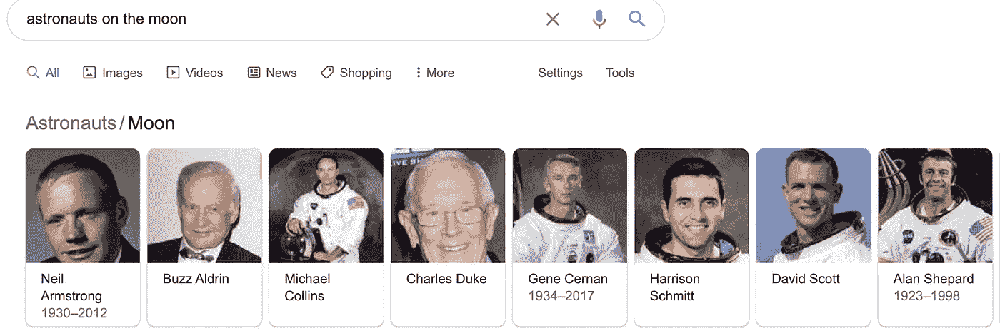
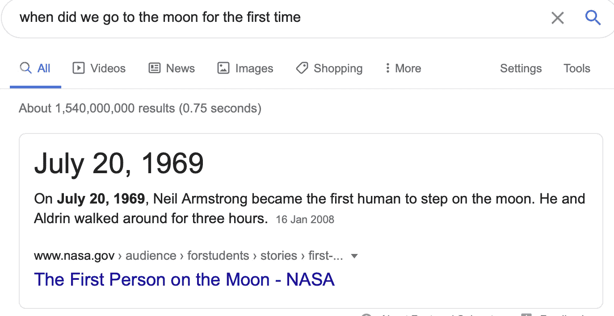
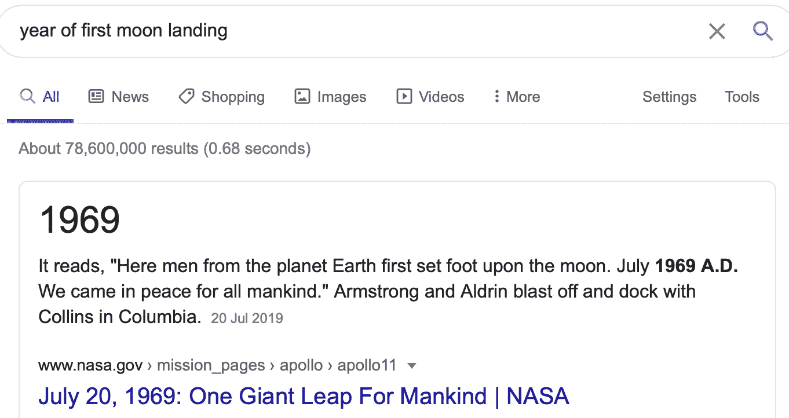
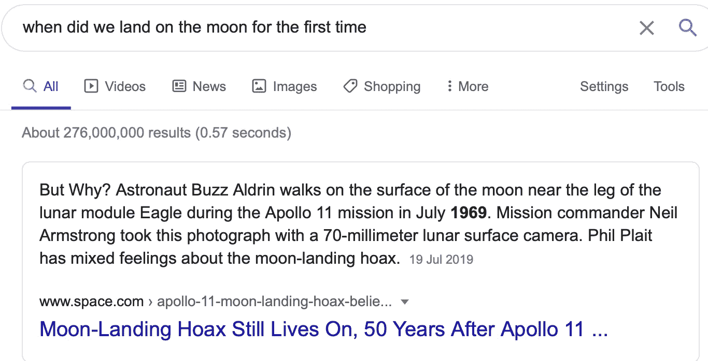
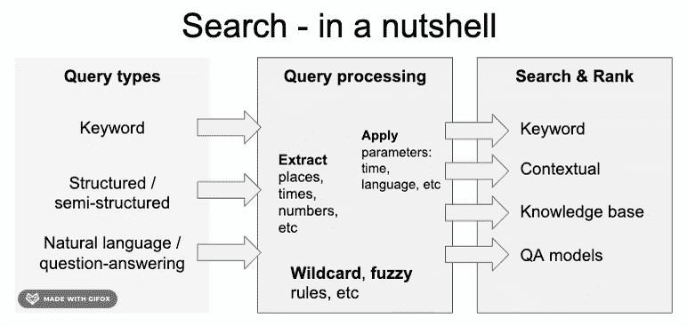
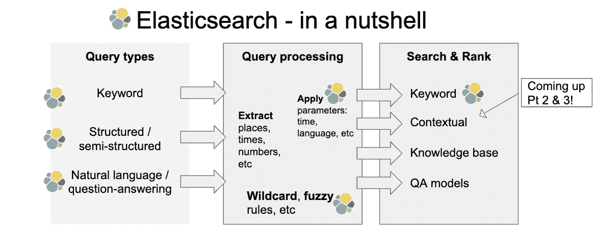

# 搜索(第 1 部分)——一个温和的介绍

> 原文：<https://towardsdatascience.com/search-pt-1-a-gentle-introduction-335656c0f814?source=collection_archive---------43----------------------->

## 从基本的积木到 DIY 搜索引擎

照片由 [PhotoMIX 公司](https://www.pexels.com/@wdnet?utm_content=attributionCopyText&utm_medium=referral&utm_source=pexels)从 [Pexels](https://www.pexels.com/photo/black-samsung-tablet-display-google-browser-on-screen-218717/?utm_content=attributionCopyText&utm_medium=referral&utm_source=pexels) 拍摄

T4 在不到一秒钟的时间里搜索整个网络，寻找我们想知道的任何东西的能力是近代史上最伟大的成就之一。但是它是如何工作的呢？它的组成部分是什么？而且，最重要的是，……我们能不能**拼凑出我们自己的**版本？后者很重要，因为搜索不可避免地是个人化的:它关乎我们的关注点、偏好、可支配的资源甚至情感。另外，它真的很酷！

在这个由三部分组成的系列中，我将:

*   Pt 1。提供一个**温和的介绍**使用 Google 和 Elasticsearch 作为例子进行搜索
*   [Pt 2。](https://medium.com/@mihail.dungarov/search-pt-2-semantic-horse-race-5128cae7ce8d)我们将解释一些**最新的自然语言处理技术，**将结果与传统方法进行比较，并讨论利弊
*   [Pt 3。](https://medium.com/@mihail.dungarov/elastic-transformers-ae011e8f5b88)提供一份**黑客指南，帮助您构建自己的搜索引擎**包含 100 万条新闻标题的 elastic search engine&采用最先进的自然语言处理技术进行增强的语义搜索…

# 搜索-简而言之

如今，当我们谈论搜索时，我们通常指的是语义搜索。你会问，什么是语义搜索？想象一下，搜索“病毒威胁”这个词。一个简单的词汇搜索方法将返回包含单词的文档，并且按照特定的重要性顺序排列。另外，关于“安全威胁”的文档也将被认为是相关的，因为它们包含查询的一部分。

另一方面，语义搜索也能够获得“疾病”、“感染”和“电晕”的概念——我们有一个更广泛、潜在更准确的搜索，反映我们正在寻找的东西的“意义”，而不是坚持特定的关键词。在这一部分，我经常从巴斯特，汉娜的作品中获得灵感；比约恩·布赫霍尔德；埃尔马尔·奥斯曼(2016 年)。[“文本和知识库的语义搜索”](https://www.nowpublishers.com/article/Details/INR-032)。他们在文中指出:

> 语义搜索表示有意义的搜索，与词汇搜索不同，词汇搜索是搜索引擎在不理解查询的整体意义的情况下寻找查询词或其变体的文字匹配

下图显示了这种搜索引擎的核心组件

作者图片

我们专注于对带有一些附加注释(如姓名、日期、链接等)的文本的语义搜索，而不是对结构化数据库的搜索。这基本上是我们一直在使用的**典型网络搜索**。

请注意，本文处理的是产生相关文档或单个事实列表的搜索，而不是额外的步骤，如基于源质量的排名，如 PageRank、结果汇总等。

# 查询类型

这些可以分为:

*   **关键词** -这些是速记搜索，不是正确的句子，但其中的一组关键词和有时的顺序带有语义，例如尼尔·阿姆斯特朗的出生日期，10 分钟内的意大利面食谱
*   **结构化/半结构化** -查询中使用的特殊语法。它可以表示完整的查询，也可以只是对它的细化。例如，这可能是仅搜索特定来源的限制，例如**仅来自 AP 的新闻。在其他情况下，这可能会限制结果的语言或陈述查询的强制元素**
*   **自然语言&自然问题**——完全或大部分语法形式的问题:“尼尔·阿姆斯特朗的生日是哪一天？”。这是与搜索交互的最自然的方式，然而，这也带来了许多困难。例如，我们可以同时问**多个问题**“哪里可以停车，营业时间是什么时候？”或者提出哲学上的问题，而不是事实上的问题“生命的意义是什么？”。从例子中可以看出，问题的范围相当广泛。虽然这些对我们来说有意义，但算法往往专注于狭窄的任务，因此需要各种算法协同工作，能够确定哪些结果是合适的。

# 询问处理

在将原始条目传递给搜索算法之前，系统可能需要对其执行不同类型的转换。那些可能是

*   **提取** -提取特定的名称、实体、位置，以进一步帮助搜索并与文档元数据中的值或知识库进行比较。例如，在下面的查询 Neil Armstrong 中，左边的信息框是调用 google 知识库的结果，因为该查询与其中的一个条目成功匹配

*   **过滤器和限制** -在半结构化查询对结果指定了一些限制的情况下，例如，只有英语新闻，搜索范围将被转换到搜索引擎
*   其他转换是对搜索的修改，例如针对**通配符或模糊**搜索。在这种情况下，原始查询可以被转换成一个或多个变体。例如，使用模糊搜索，我们可以允许对输入的关键字进行一些字符修改，直到找到最有可能被搜索的单词。请看下面，当我在谷歌上搜索尼尔·阿姆斯隆时的结果。即使一个叫 Armslong 的先生可能存在并且很重要，系统认为我们更有可能是打错了。

# 搜索和排名

最后，可以使用一种或多种类型的搜索和排序方法。这些将能够找到答案或者返回匹配查询的结果的排序列表。排名确保更相关的结果在更高的位置-这些结果可能比其他结果更频繁地提到搜索的关键字，或者在其标题或开头段落中包含与查询相关的信息。有:

*   **关键词搜索**——最常见的类型，精确或非常接近文字匹配。搜索的主要部分仍然是这样完成的。什么使它们具有语义——它们将使用术语出现来排列与某个关键词更相关的更高的文档，并识别出某些关键词何时是罕见的，这些关键词的命中率高于查询中更“常见”的词的命中率。有许多算法可用:BM25、tf-idf、各种学习排序方法等。
*   **上下文搜索**——我指的是任何基于文本嵌入的搜索，试图完全使用查询并找到上下文相关的结果。这与单独依赖任何特定的关键词或短语来确定结果相反。我们将在稍后重点讨论这个问题，因为它是本系列的核心。NLP 技术的一些最新进展将帮助我们显著提高搜索质量。

让我们快速地进行一个**面对面的关键词对比上下文搜索。**搜索“病毒线程”，在新闻标题上，左边的结果来自关键字方法，而右边的结果来自上下文搜索。后者给了我们一些结果，这些结果与任何搜索词都不匹配，如右边的示例 5:“世卫组织强调病媒传播疾病的危险”

*   **知识库** -如上所述，知识库中的条目可以直接与知识库中的条目匹配，并进一步用于生成结果。也可以应用更高级的技术，其中关键字或自然语言查询可以被转换成对知识库的查询。例如，“月球上的宇航员”将返回另一个知识库结果

*   **问答**——传统上，搜索引擎已经使用处理步骤的修改，将一个自然的问题转换成一个更像关键词的查询，并照此进行处理。最近，自然语言处理的进展显示了算法的强大性能，这些算法直接指出在特定文档中是否以及在哪里可以找到自然问题的答案。与上面的其他搜索范例不同，问答侧重于提供一个实际的(单个)答案，而不是一系列文档(就像这个列表中的其他文档)。当我们把登月作为一个自然的问题来问时，会发生什么。除了一系列答案之外，我们还会得到一个具体的答案。

然而，这项技术同样适用于一个不太自然的问题“首次登月的年份”

最后，对查询的轻微修改可能会破坏结果，我们不再得到明确的答案，我们甚至*完全在其他地方着陆*

# 把所有的放在一起

总之，任何查询类型都可以经过许多不同的修改，并可以通过许多搜索机制中的任何一种来产生候选结果。这些方法中的每一种都将表达其结果的置信度，然而，不同算法之间的不同置信度分数可能不可比较。在这一阶段，进一步的决策算法将能够确定哪些答案是非常合适的，并且足够“自信”以作为最终的答案列表传递给用户。

作者图片

一个正常运行的搜索引擎可以包含该过程三个步骤中的任何一个或至少一个。我们已经看到谷歌在幕后使用了它们中的大部分，但是如何制作我们自己的呢...

# 我应该透露我的秘密议程…

事实上，我一直想黑掉我自己的搜索引擎。

选择的工具是 Elasticsearch，主要是因为它实际上自带了很多搜索功能。同时，它得到了很好的支持，并在开源特性方面给了你很大的帮助。

这里是一个图表，显示了我们在讨论中使用 Elastic 后得到的结果。请注意，您不应该相信我的总结完整性，因为我心中有一个具体的目标。

作者图片

您会注意到，Elastic 可以处理任何类型的查询(尽管它们在默认情况下都由关键字搜索机制处理)，并允许进一步修改您的查询，以模糊、通配符和许多其他类型的查询。如果数据允许，人们还可以对结果应用任意数量的结构化条件:出版日期、来源等。

就搜索和排名而言，关键字搜索有很大的灵活性，但其他的就不多了。

总的来说，这是一个令人印象深刻的开箱即用特性列表。事实证明，通过一些额外的跑腿工作，我们甚至可以添加上下文搜索。这就是我们接下来要做的...

# 结论

我们探讨了搜索的主要组成部分，它们是如何协同工作的，以及对搜索结果的影响。不同类型的查询可能触发不同的搜索算法，结果是各种方法的混合。从 Google 的例子中我们可以看到，相同的用户体验(在一个简单的文本框中输入)是由多种技术提供的。

在接下来的文章中，我们将并排比较上下文搜索和关键字搜索( [Pt 2](https://medium.com/@mihail.dungarov/search-pt-2-semantic-horse-race-5128cae7ce8d) )，最后，我们将结合一些不同的工具来扩展 Elasticsearch 的功能，增加上下文搜索功能来构建我们自己的语义搜索引擎( [Pt 3](https://medium.com/@mihail.dungarov/elastic-transformers-ae011e8f5b88) )。

…

顺便说一句，[尼尔·阿姆斯隆](https://battlelands-royale.fandom.com/wiki/Neil_Armslong)

我希望你喜欢阅读这篇文章，下周我们将在第二部分中带来更多内容。与此同时，如果你想打招呼或者只是想告诉我我错了，请随时通过 LinkedIn 联系我

特别感谢 **Rich Knuszka** 的宝贵反馈。

请注意，我与谷歌或 Elasticsearch 没有任何关系，观点和分析是我自己的