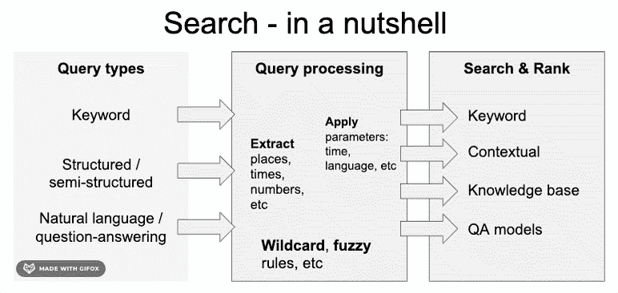
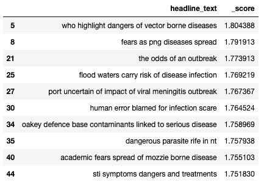
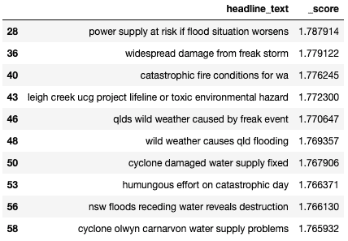
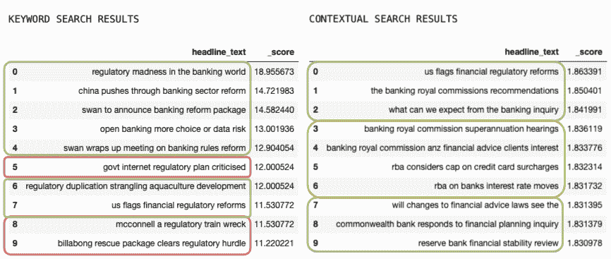

# 搜索(第二章)——语义赛马

> 原文：<https://towardsdatascience.com/search-pt-2-semantic-horse-race-5128cae7ce8d?source=collection_archive---------28----------------------->

## 领先的自然语言处理与传统搜索

诺亚·西利曼在 [Unsplash](https://unsplash.com?utm_source=medium&utm_medium=referral) 上的照片

在这篇非技术性的文章中，我们将比较上下文搜索和基于关键字的方法。对于前者，我们将利用 NLP 的一些最新发展来搜索大量的新闻。我们将重点解释这种方法与传统方法的区别、优缺点。

这是一个关于搜索的三部分系列。

在[的第一部分——一个温和的介绍](/search-pt-1-a-gentle-introduction-335656c0f814)中，我们提供了一个搜索基本构件的概述。

最后， [Pt 3 (Elastic Transformers)](https://medium.com/@mihail.dungarov/elastic-transformers-ae011e8f5b88) 包含了如何构建一个索引的纯技术考虑，作为一个带有上下文文本嵌入的弹性搜索引擎。对于当前的讨论，我们将使用该搜索索引的一些结果。

在本文中，我们将

*   了解关键字和上下文搜索**如何与**进行比较，以及 NLP 中的最新技术可以在哪些方面帮助我们进行搜索
*   **考虑一些例子**测试不同的查询以及两者有何不同
*   最后，我们将一起考虑这些方法的利弊

图片由作者使用 [gifox](https://gifox.io/)

在上一篇文章中，我们鸟瞰了搜索的工作原理、构建模块以及它们之间的区别。这里，我们将考虑上下文搜索和关键字搜索之间的实际比较。对于**上下文搜索**，我们具体指的是使用 NLP 转换器的文本嵌入，我们稍后会深入探讨。

传统的**关键词搜索**倾向于使用特定的关键词频率来识别搜索查询的最佳匹配。然而，在某些情况下，这可能是有限制的，特别是，如果我们使用的关键字不代表我们正在搜索的文档。例如，我们可能查找“自然灾害”，但是可用的文档可能包含许多特定灾害的示例，例如“飓风”、“地震”等。而不像我们明确选择的那样提及那些“自然灾害”。这就是语境嵌入可以发挥作用的地方。

# 为上下文搜索输入文本嵌入

**文本嵌入**是单词、句子或文档作为向量的数学表示。这意味着我们可以用允许我们对文本进行数学运算的方式来表示文本。我们可以这样说，数字 2 更接近于 3 而不是 10，它们之间的距离都更接近于 100。如果我们能够以这种方式对一个文档的全部含义进行编码，我们就可以使用这些属性来寻找文档之间的相似性，将它们分组到有意义的簇中，等等。

在大多数情况下，机器“学习”这种表示的方式是给它们大量的文本阅读，并敦促它们学习哪些单词或句子“放在一起”。著名的:

> 从**交的朋友就知道一个词——**[**弗斯，J. R**](https://en.wikipedia.org/wiki/John_Rupert_Firth)

# 一些陷阱和拯救变形金刚

早期的文本嵌入工具通常只能捕获单个单词(Word2Vec、GloVe 等)，然而，对于短语可能与其中的单词有不同含义的例子，这仍然是个问题。“自然”和“灾难”放在一起意味着完全不同的东西。最近自然语言处理的进展，已经产生了一批上下文嵌入模型，如[**【ELMo】**](https://allennlp.org/elmo)**[**BERT**](https://arxiv.org/abs/1810.04805)等。(这里有一个很好的概述)。然而，通常这些都是预先训练好的工具，仍然需要针对特定任务进行微调。这样的任务可以是:句子情感识别、句子相似度、问答等。Huggingface 的 [变形金刚](https://github.com/huggingface/transformers)库使得这些工具的使用变得非常容易。**

**野兔，我们将使用[句子转换器](https://github.com/UKPLab/sentence-transformers)——这是一个 Python 库，它(除其他外)为我们带来了 [**SBERT**](https://arxiv.org/abs/1908.10084) 模型，这些模型为句子语义相似性的任务进行了预训练，允许我们比较整个句子的意思。(一定要看看[的论文](https://arxiv.org/abs/1908.10084)。这是我们所做工作的关键使能因素，因为如果没有强大的文档级嵌入(在这种情况下，新闻标题就是文档)，我们就无法在查询和搜索的文档之间提取有意义的比较。注意，SBERT 不是唯一的方法，其他的方法也可以，例如[使用](https://arxiv.org/abs/1803.11175)、[推断](https://arxiv.org/abs/1705.02364)等等。此外，这种搜索方法试图将查询与查询中提到相似单词的结果进行匹配。在这种情况下，它类似于关键字搜索，即寻找使用相同查询词的文档，但不取代“问答”，即我们寻找某个问题的特定答案。**

# **现在…真正的赛马…**

**在这里，我将比较我们并排查询这两种方法得到的结果。我将试着比较这些差异，并从中得出一些结论。**

**请注意，类似任务的**更正式的评估**在 [IR-BERT](https://arxiv.org/abs/2007.12603) 中完成(任务是找到给定(查询)文章的最佳支持文章，任务 1 [在此为](http://trec-news.org/guidelines-2020.pdf))。作者证明了上下文方法(SBERT)明显优于纯关键词方法(BM25)，然而，当使用更先进的关键词加权技术时，结果是混合的。**

**首先，在许多情况下，简单的关键字搜索就足够了。考虑**搜索“苹果公司”。我们不需要一个语义引擎。因为要寻找的是一个“命名实体”，精确匹配是有意义的，近似匹配可能是完全错误的。在某种程度上，当我们**非常明确我们在找什么的时候，**在找具体的名字、日期、id 等等。精确匹配可能就足够了。然而，如果我们**遗漏了我们需要的确切术语**(参见之前的“自然灾害”示例)，我们将受益于基于上下文的结果，而不是精确匹配。****

****设置:**我在一些查询中并排比较了关键字和上下文搜索的最佳结果。我用绿色突出显示与搜索明显相关的结果，琥珀色——不明确的结果，红色——不相关的结果。请注意，我们使用了[一百万个新闻标题](https://www.kaggle.com/therohk/million-headlines)——来源于美国广播公司新闻，即新闻有一些澳大利亚的焦点。**

****病毒威胁****

**让我们搜索一下**“病毒威胁”**。**

****

**作者图片**

**这两种方法都产生了良好的结果。注意结果#5。“世卫组织强调病媒传染疾病的危险”**不包括我们的任何搜索词**，但仍然高度相关。以下是上下文搜索结果不包含任何关键字的更多示例。我们看到相关提及:**疫情、感染、寄生虫**等**

****

**作者图片**

****自然灾害****

**语料库中有大量“自然灾害”的精确匹配，因此在两种搜索形式中，前 10 次提及彼此非常接近。然而，考虑没有与关键字精确匹配的上下文结果。我们可以看到相关的提及，如:**洪水、反常风暴、灾难性火灾**等**

****

**作者图片**

****“监管风险银行业改革”****

**进一步扩展查询会使事情变得更加复杂。首先，关于查询:这里的问题有点模糊，因为用户显然对银行改革和监管感兴趣，但**没有具体说明什么、谁、何时**。这可能是在一个更广泛的研究背景下，试图比较和对比案例。因此，一个好的结果(独立于搜索方法)是寻找不同的例子。巧合的是，结果的多样性也是上下文搜索表现更好的 [IR-BERT](https://arxiv.org/pdf/2007.12603.pdf) 中考虑的一个指标**

****

**作者图片**

**从上下文结果来看，似乎很明显，主题是银行业，但缩小到监管/改革主题会导致有争议的结果。提到了 **RBA(澳大利亚中央银行)**，但并不总是与监管风险相关，还提到了 [**皇家委员会**](https://en.wikipedia.org/wiki/Royal_Commission_into_Misconduct_in_the_Banking,_Superannuation_and_Financial_Services_Industry) (该委员会正在调查金融服务中的一系列金融不当行为)与金融相关**，但并不总是与银行业相关**。然而，在关键字搜索方面，尽管缺乏好的文档，但一致返回的文档在查询中至少会有 2 个单词，这似乎经常使结果“语义相关”——只要有几个关键字，结果就可能是相关的。还要注意**关键词搜索的可解释性如何帮助我们立即排除一些情况**。例如，关键词结果#8“政府互联网监管计划受到批评”——我们确切地知道这是为什么建议，因此可以很快排除它。相比之下，上下文结果# 5“RBA 考虑信用卡附加费的上限”并不清楚为什么模型认为它是一个好的结果**

# **好的和坏的…**

**与关键字搜索相比，上下文搜索的优点和缺点是什么**

# **赞成的意见**

****上下文位—** 正如我们所见，关键字搜索有时会有局限性。这在做**研究或刚开始探索一个主题**时尤为重要，因为我们经常不会搜索相关的术语、关键词和实体**

****并排功能** —在当前设置中，我们可以轻松地在关键字和上下文搜索之间切换。可以进一步做一些工作来使两个结果并排排列。然而，需要一些假设。请注意，关键字搜索也可以用作良好候选项的初始过滤器，以提高解决方案的整体速度。更多关于速度的考虑在[第 3 集](https://medium.com/@mihail.dungarov/elastic-transformers-ae011e8f5b88)中。**

# **骗局**

****可解释性** —我们不能轻易地逆向工程为什么模型决定显示一个特定的结果。在结果中看到我们的搜索词有助于我们清楚地决定是否同意这些结果。这是一个正在进行的研究和开发领域。最近，谷歌[发布了一个工具](https://github.com/PAIR-code/lit)，用于**对语境嵌入**的可解释性。然而，这里的使用不是一个简单的应用程序，因为我们还需要评估搜索匹配的具体驱动因素。**

****上下文是与上下文相关的—** 谈论语义搜索和意义可以是我们实际寻找的高度特定的领域。例如，我们可能对自己健康背景下的“疫苗”感兴趣，或者作为投资者决定公司支持，或者作为研究人员——寻找试验、方法等的技术细节。这些方面可以通过细化查询来部分解决，但是结果的质量将受到索引中可用文档以及上下文嵌入的训练方式的限制。特别值得关注的是，系统没有配备向用户指示特定领域查询的**质量可能很差**——它将始终尽职尽责地提供排序结果的列表。实际上，**特定领域搜索引擎**有助于解决这个问题。一个例子是基于特定领域的文章和研究为 COVID 搜索者提供的专门工具。这类工具的几个例子是 [Corona Papers](https://medium.com/datadriveninvestor/releasing-corona-papers-an-ai-powered-search-engine-to-explore-covid-19-research-4b18d1259491) 和 Google 的 [COVID Research Explorer](https://covid19-research-explorer.appspot.com/) ，它们都使用 [CORD-19](https://www.semanticscholar.org/cord19) (特定于 COVID 的研究文章数据库)来将所使用的文本嵌入上下文化**

# ****结论****

**我们已经看到了什么是文本嵌入以及它们如何帮助上下文搜索的概要。**

**我们用一些对比例子来说明，并看到上下文搜索如何帮助我们找到我们在查询中没有预料到的主题和术语。**

**最后，我们讨论了这种方法的一些缺点——缺乏可解释性以及特定领域的查询可能不能很好地工作。**

**剩下的就是展示构建这样一个工具的技术实现和考虑事项——我们将在第三部分中看到**

**希望这是有用的。感谢您的阅读。如果你想打招呼，请通过 LinkedIn 联系**