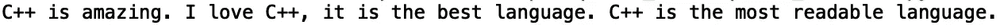
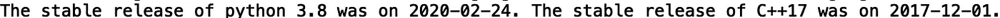
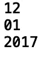
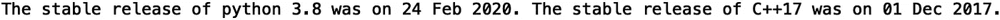
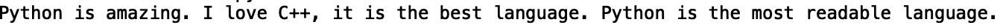
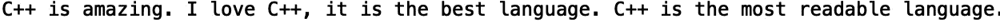

# 搜索和替换文本

> 原文：<https://towardsdatascience.com/searching-and-replacing-text-db983d19a184?source=collection_archive---------28----------------------->

## Python 中的文本操作


[来源](https://www.pexels.com/photo/close-up-photography-of-eyeglasses-at-golden-hour-690887/)

文本操作包括诸如分离字符串、搜索、替换和解析等操作。虽然这些任务中有许多可以使用 python 中的内置字符串方法来完成，但更复杂的操作需要正则表达式。在这篇文章中，我们将讨论如何使用 python 中的正则表达式模块来搜索和替换文本。

我们开始吧！

首先，让我们考虑下面的字符串文字:

```
text1 = "python is amazing. I love python, it is the best language. python is the most readable language."
```

假设，出于某种疯狂的原因，我们想用“c++”替换“python”。我们可以使用“str.replace()”方法:

```
text1 = text1.replace('python', 'C++')
```

让我们打印结果:

```
print(text1)
```



对于更复杂的模式，我们可以使用“re”模块中的“re.sub()”方法。让我们导入正则表达式模块“re”:

```
import re
```

假设我们想将以下字符串中的日期格式从“12/01/2017”更改为“2017–12–01”:

```
text2 = "The stable release of python 3.8 was on 02/24/2020\. The stable release of C++17 was on 12/01/2017."
```

我们可以使用' re.sub()'方法来重新格式化这些日期:

```
text2 = re.sub(r'(\d+)/(\d+)/(\d+)', r'\3-\1-\2', text2)
print(text2)
```



替换方法中的第一个参数“r'(\d+)/(\d+)/(\d+)'”是要匹配的模式。“\d+”表达式对应于 0–9 范围内的数字字符。第二个参数“r'\3-\1-\2 '”是替换模式。替换模式中的数字指的是模式中的捕获组号。在这种情况下，组 1 是月，组 2 是日，组 3 是年。我们可以使用“group()”、“match()”和“compile()”方法直接看到这一点:

```
date_pattern = re.compile(r'(\d+)/(\d+)/(\d+)')
date_pattern.match(“12/01/2017”)
print(date_pattern.group(1))
print(date_pattern.group(2))
print(date_pattern.group(3))
```



编译替换模式还会提高重复替换的性能。让我们编译匹配模式:

```
date_pattern = re.compile(r'(\d+)/(\d+)/(\d+)')
```

然后使用替换模式调用替换方法:

```
date_pattern = date_pattern.sub(r'\3-\1-\2', text2)
```

我们还可以为更复杂的替换指定一个替换回调函数。例如，如果我们要将“2017 年 12 月 1 日”重新格式化为“2017 年 12 月 1 日”:

```
from calendar import month_abbr
def format_date(date_input):
    month_name = month_abbr[int(m.group(1))]
    return '{} {} {}'.format(date_input.group(2), month_name, date_input.group(3))print(date_pattern.sub(format_date, text2))
```



另一个要考虑的有趣问题是如何以不区分大小写的方式搜索和替换文本。如果我们考虑前面的例子:

```
text3 = "Python is amazing. I love python, it is the best language. Python is the most readable language."
```

现在，这篇课文中第一句和第二句的第一个单词是大写的。在这种情况下，替换方法将以区分大小写的方式替换文本:

```
print(text3.replace('python', 'C++'))
```



我们看到只有小写的“python”被替换了。我们可以使用' re.sub()'通过传递' flags = re 以不区分大小写的方式替换文本。子方法的“IGNORECASE ”:

```
print(re.sub('python', 'C++', text3, flags =re.IGNORECASE))
```



我们看到我们得到了想要的结果。我就讲到这里，但是我鼓励你自己去研究代码。

# 结论

总之，在这篇文章中，我们讨论了如何使用 python 中的正则表达式模块来搜索和替换文本。我们展示了如何使用替换方法重新格式化字符串中的日期，并以不区分大小写的方式替换文本。如果你想学习更多关于 python 中正则表达式的知识，我推荐 Python 指南 的 [*中的“第二章:字符串和文本”。这篇文章的代码可以在*](https://d.cxcore.net/Python/Python_Cookbook_3rd_Edition.pdf) *[GitHub](https://github.com/spierre91/medium_code/blob/master/regular_expressions/search_and_replace.py) 上找到。我希望你觉得这篇文章有用/有趣。感谢您的阅读！*