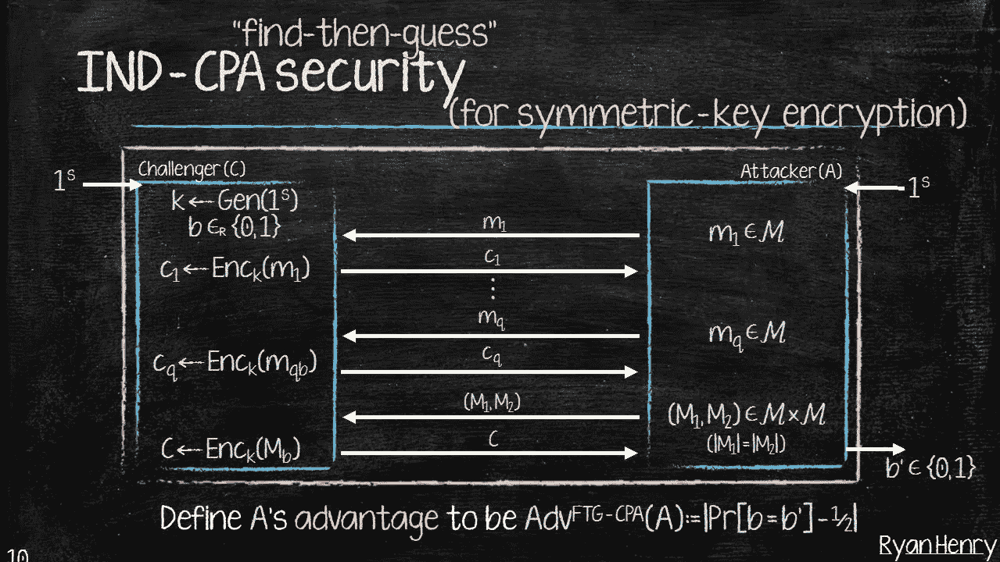

# 搜索和排序加密数据

> 原文：<https://towardsdatascience.com/searching-and-sorting-encrypted-data-59fc95d961b7?source=collection_archive---------36----------------------->

## 走向安全的云数据库

Mauro Sbicego 在 [Unsplash](https://unsplash.com?utm_source=medium&utm_medium=referral) 上拍摄的照片

假设有一天，你的老板走进办公室，给你一份工作:

> 老板:我要你对一组数据进行排序
> 
> 你:好吧！给我意见，我会处理的
> 
> 老板:我不信任你，我的数据对我来说是合理的
> 
> 你:如果你不想给我数据，我该怎么分类？
> 
> 老板:不知道！想办法！这就是我付钱给你的原因😤

> **如果你没有数据，你怎么能对一组数据进行排序呢？**

和大多数隐私问题一样，答案在于 ***密码术*** 的秘密。

斯蒂芬·斯坦鲍尔在 [Unsplash](https://unsplash.com?utm_source=medium&utm_medium=referral) 上拍摄的照片

## 关于通用加密的一个词

我想我们所有人，作为程序员，都至少在自己写的软件中使用过一次密码学。有些人可能只是在服务器上启用 TLS，有些人可能编写了特殊的加密软件。在所有这些情况下，您都有一些想要加密的数据。

最常见的加密方案，如 AES、RSA 等。有一个至关重要的特性:它们在语义上是安全的。这是什么意思？嗯，是关于两个人的游戏。

照片由[JESHOOTS.COM](https://unsplash.com/@jeshoots?utm_source=medium&utm_medium=referral)在 [Unsplash](https://unsplash.com?utm_source=medium&utm_medium=referral) 上拍摄

在这个游戏(称为 IND-CPA 游戏)中，一个玩家是攻击者，另一个是挑战者。游戏如下:

1.  攻击者选择一些消息，挑战者提供这些消息的密文
2.  攻击者选择两条相同长度的消息发送给挑战者
3.  挑战者从两条消息中随机选择一条，加密并发送给攻击者
4.  如果攻击者猜对了哪条消息被加密，该方案就被破解了

下图说明了这个游戏:

Ryan Henry I 538 /B 609:密码学简介

## 回到老板的问题

所以你的老板有一些数据，他想排序，但他不想给你看😵

你可能想告诉你的老板在把数据交给你之前先加密。假设数组只包含两个元素: *m1* 和 *m2* 。计划如下:

1.  老板使用某种加密方案对这两个元素进行加密，得到两个密文: *c1* 和 *c2*
2.  你比较一下 *c1* 和 *c2。*如果 *c1 < c2* 你告诉你老板，排序后的数组是[ *m1* ， *m2* ]。否则你告诉你老板，排序后的数组是[ *m2* ， *m1* ]。

> 为此，你需要一个**保序**的加密方案。

也就是说，该方案保留了明文的顺序。举个例子，如果 *c1* 是 *m1* 的加密， *c2* 是 *m2* 和 *m1* < *m2* 的加密，那么 *c1* < *c2* 。

如果你正在考虑一个共同的加密方案，如 AES 或 RSA，它不会工作。为什么？记住所有这些方案都是语义安全的。

**如果你能比较两个密文，并推断出明文的顺序，你就能打破 IND-CPA 游戏。**

方法如下:

游戏第一步，你会选择两条消息 *m1* 和*m2*(*m1*<*m2*)。挑战者将返回两条消息的密文: *c1* 和 *c2* 。然后，在步骤 2 中，您将向挑战者发送在第一步中选择的相同消息( *m1* 和 *m2* )。挑战者将返回一个密文 *c* ，该密文将是 *m1* 的加密或 *m2* 的加密。如果 *c* 是对 *m1* 的加密，那么 *c < c2* 如果 *c* 是对 *m2* 的加密，那么 *c > c1*

因此，您不能使用 AES、RSA 或任何其他众所周知的加密方案。那你应该用什么呢？

> Boldyreva 的加密方案是您的正确答案

如果你想了解更多可以阅读原文 [*这里*](https://www.cc.gatech.edu/~aboldyre/papers/bclo.pdf) 。

现在，让我们开始工作，实现加密数据的排序和搜索。

照片由 [Corinne Kutz](https://unsplash.com/@corinnekutz?utm_source=medium&utm_medium=referral) 在 [Unsplash](https://unsplash.com?utm_source=medium&utm_medium=referral) 上拍摄

## 在 python 中排序和搜索加密数据

Boldyreva 的方案已经在 [pyope](https://pypi.org/project/pyope/) 库中实现。因此，让我们导入库:

要使用该方案，我们必须首先生成密钥并实例化密码:

让我们用一个简单的数组来排序它:

为了加密这个数组，我们需要在 *simple_array* 的每个元素上调用*密码*对象的*加密*方法*T3:*

只需对列表进行排序:

现在您已经对数组进行了排序，让我们解密它，并验证原始元素是否按升序排列。为此，您需要在*simple _ array _ encrypted:*的每个元素上调用 *cipher* 对象的 *decrypt* 方法

你应该看到[1，2，3，4，7]。

如果你的老板给你一个加密的元素，并询问它是否存在于他给的加密数组中，你只需从 numpy 库中调用[*search sorted*](https://numpy.org/doc/stable/reference/generated/numpy.searchsorted.html)*函数即可:*

*您应该看到 2。*

## *结论*

*恭喜你！你刚刚意识到了不可能。*

**

*威尔·斯图尔特在 [Unsplash](https://unsplash.com?utm_source=medium&utm_medium=referral) 上拍摄的照片*

*您能够在不知道元素本身的情况下对元素列表进行排序和搜索。保序加密和揭示序加密是密码学中非常活跃的研究领域。这些加密方法有许多应用，尤其是在数据库领域。随着数据量的增加，通过个人资源维护数据库变得越来越困难。你需要把你的数据放到云中。然而，没有必要以清晰的形式给出你的数据。你可以使用像保序加密这样的东西，首先加密你的数据，然后把它发送到云端。加密方案允许您继续使用数据库，即使数据一直被加密。这就是密码学的美妙之处，❤️.*

*感谢您的阅读😊*

*另外，我为你准备了一个 colab 笔记本，上面有所有代码。你可以从[这里](https://colab.research.google.com/drive/1qloJ3Uz5czz4uoGkvcTOoBgsVz7ugTb6?usp=sharing)进入。*