# 在 SQL Server 中搜索数据库对象和表数据

> 原文：<https://towardsdatascience.com/searching-for-database-objects-and-table-data-in-sql-server-f42f7e3e76a1?source=collection_archive---------46----------------------->

## *让我们来看看 SQL Server 中数据库数据和对象搜索的复杂性，并看看如何使用标准脚本和特定工具来执行它。*


图片来自 [Piqsels](https://www.piqsels.com/en/public-domain-photo-sxoqx) (CC0)

您好，欢迎来到我的系列文章的第四部分，它将帮助您了解如何设计和使用数据库。这一次我们将深入研究 SQL Server 中复杂的数据和对象搜索问题，这将首先在标准脚本的帮助下进一步进行，然后使用 dbForge [搜索工具](https://www.devart.com/dbforge/sql/search/)。

我们经常会遇到这样的情况，我们需要找到:

1.  数据库对象(表、视图、存储过程、函数等)。).
2.  数据(值和包含它的表)。
3.  数据库对象定义中的代码片段。

# 使用标准脚本在 SQL Server 中搜索数据和对象

让我们首先展示如何在标准脚本的帮助下做到这一点。
您可以使用以下脚本在数据库中搜索雇员表:

```
select [object_id], [schema_id],
                  schema_name([schema_id]) as [schema_name],
                  [name],
                  [type],
                  [type_desc],
                  [create_date],
                  [modify_date]
from sys.all_objects
where [name]='Employee'
```

脚本的结果将如下所示:

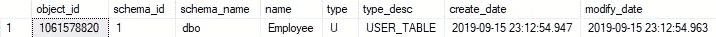

Img.1 .雇员表的搜索结果

它显示:

1.  对象的标识符和对象所在的架构。
2.  架构的名称和对象的名称。
3.  对象类型和描述。
4.  创建和修改对象的日期和时间。

要查找“项目”字符串的所有条目，可以使用以下脚本:

```
select [object_id], [schema_id],
           schema_name([schema_id]) as [schema_name], 
           [name], 
           [type], 
           [type_desc], 
           [create_date], 
           [modify_date] 
from sys.all_objects 
where [name] like '%Project%'
```

结果将是下表的输出:

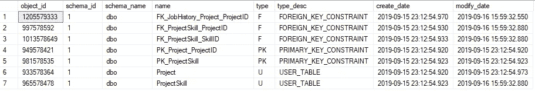

Img.2 .跨所有数据库对象的“项目”子字符串的搜索结果

如结果所示，“Project”字符串不仅包含在 Project 和 ProjectSkill 表中，还包含在一些主键和外键中。

要了解哪个表包含这些键，让我们通过执行以下操作将 parent_object_id 字段、其名称及其所在的模式添加到输出中:

```
select ao.[object_id], ao.[schema_id],
          schema_name(ao.[schema_id]) as [schema_name],
          ao.parent_object_id,
          p.[schema_id] as [parent_schema_id],
          schema_name(p.[schema_id]) as [parent_schema_name],
          p.[name] as [parent_name],
          ao.[name],
          ao.[type],
          ao.[type_desc],
          ao.[create_date],
          ao.[modify_date] 
from sys.all_objects as ao 
left outer join sys.all_objects as p on ao.[parent_object_id]=p. [object_id] 
where ao.[name] like '%Project%'
```

结果将是带有父对象详细信息的表输出，这意味着，在指定主键和外键的地方:

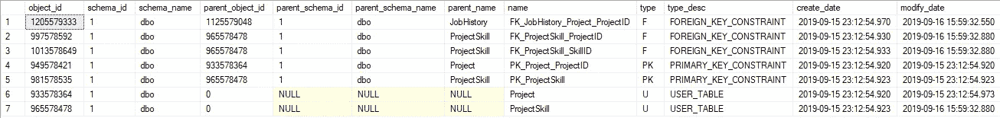

Img.3 .包含父对象详细信息的所有数据库对象中“项目”子字符串的搜索结果。

查询中使用了以下系统对象:

1.  [sys.all_objects](https://docs.microsoft.com/en-us/sql/relational-databases/system-catalog-views/sys-all-objects-transact-sql?view=sql-server-2017) 表。
2.  [schema_name](https://docs.microsoft.com/en-us/sql/t-sql/functions/schema-name-transact-sql?view=sql-server-2017) 标量值函数。

您可以通过这个[解决方案](https://github.com/ktaranov/sqlserver-kit/blob/master/Scripts/Search_Script.sql)找到所有数据库表中的字符串值。让我们简化这个解决方案，并展示如何用下面的脚本找到值“Ramiro”:

输出可能如下所示:

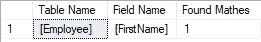

Img.4 .数据库搜索结果

这里，输出显示了表的名称，哪些列存储了包含子串“Ramiro”的值，以及找到的匹配表列的该子串的输出数。

要查找其定义包含给定代码片段的对象，可以使用以下系统视图:

1.  [sys.sql_modules](https://docs.microsoft.com/en-us/sql/relational-databases/system-catalog-views/sys-sql-modules-transact-sql?view=sql-server-2017)
2.  [系统所有 sql 模块](https://docs.microsoft.com/en-us/SQL/relational-databases/system-catalog-views/sys-all-sql-modules-transact-sql?view=sql-server-2017)
3.  [sys.syscomments](https://docs.microsoft.com/en-us/sql/relational-databases/system-compatibility-views/sys-syscomments-transact-sql?view=sql-server-2017)

例如，使用最后一个视图，您可以在以下脚本的帮助下找到其定义包含给定代码片段的所有对象:

```
select obj.[object_id], 
            obj.[name], 
            obj.[type_desc], 
            sc.[text] 
from sys.syscomments as sc 
inner join sys.objects obj on sc.[id]=obj.[object_id] 
where sc.[text] like '%code snippet%'
```

这里，输出显示了对象的标识符、名称、描述和完整定义。

# 使用 dbForge Search 搜索数据库数据和对象

借助现成的便捷工具，搜索数据和对象要方便得多。其中一个工具就是 [dbForge Search](https://www.devart.com/dbforge/sql/search/) 。

要调用此工具，请在 SSMS 窗口中按 dbForge 搜索。将出现搜索窗口:

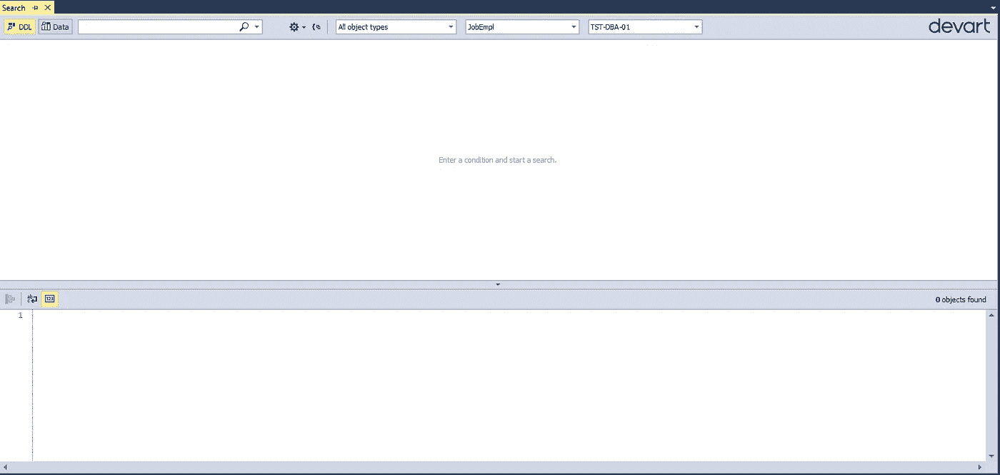

Img。5 dbForge 搜索的搜索窗口

请注意顶部面板(从左到右)，因为您可以更改:

*   搜索模式(搜索 DDL(对象)或数据)。
*   我们实际搜索的内容(哪个子串)。
*   区分大小写，搜索单词的精确匹配，或搜索字符串条目。

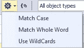

Img.6 .搜索模式

您还可以:

*   使用顶部中间的按钮(由花括号连接的两个正方形)按对象类型对结果进行分组。
*   为搜索选择必要的对象类型:

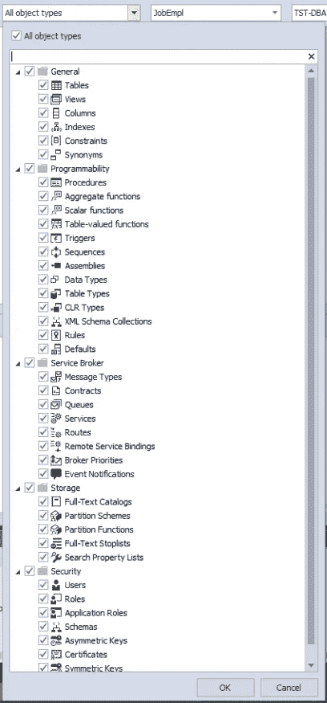

Img.7 .为搜索选择对象类型

*   为搜索设置几个数据库，并选择一个 MS SQL Server 实例

这是对象搜索模式，即包括 DDL 时:

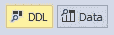

Img.8 .按 DDL 对象搜索

在数据搜索模式中，唯一不同的是对象类型选择:

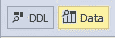

Img.9 .按数据搜索

也就是说，只有存储数据的表可供选择:

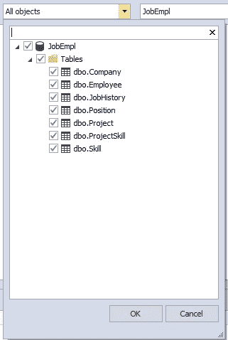

Img.10 .选择用于数据搜索的表格

现在，和以前一样，让我们在对象名中找到所有“项目”子串条目:

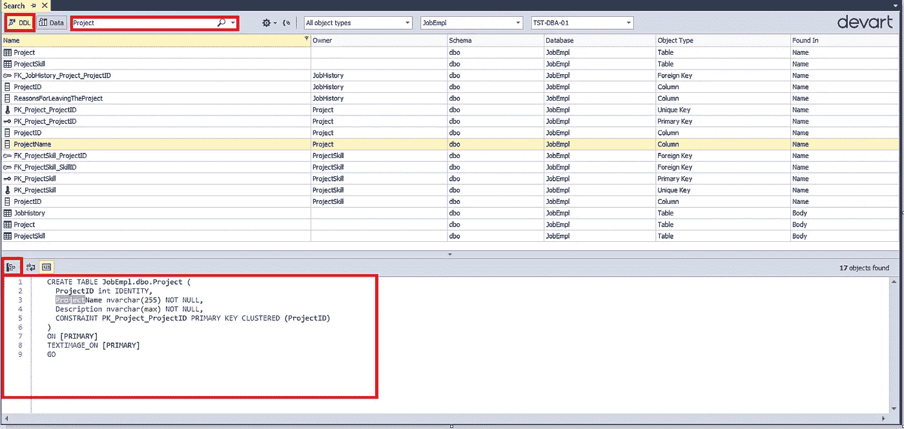

Img.11 .数据库对象名称中所有“项目”字符串条目的搜索结果

显然，搜索模式是由 DDL 对象设置的，我们正在寻找“项目”字符串，所以它是填充的，其他一切都是默认的。

当选择检索到的对象时，您可以在下面看到给定对象及其父对象的定义代码。

此外，您可以通过按下下面显示的按钮将导航切换到检索到的对象:


Img.12 .将导航转移到检索到的对象

您也可以按类型对找到的对象进行分组:

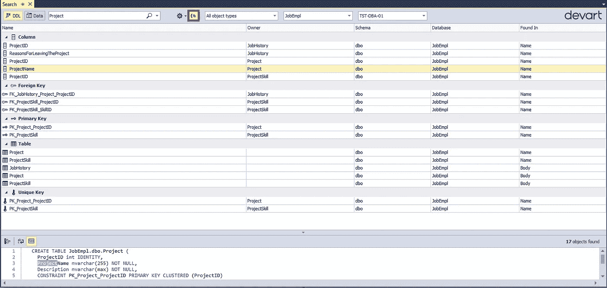

Img.13 .按类型分组的对象进行搜索的结果

请注意，甚至包含名称中包含“Project”子字符串的字段的表也会显示出来。但是，让我提醒您，搜索模式是可以改变的:搜索整个匹配或部分匹配，区分大小写与否。

现在，让我们找出所有表中的“Ramiro”值:

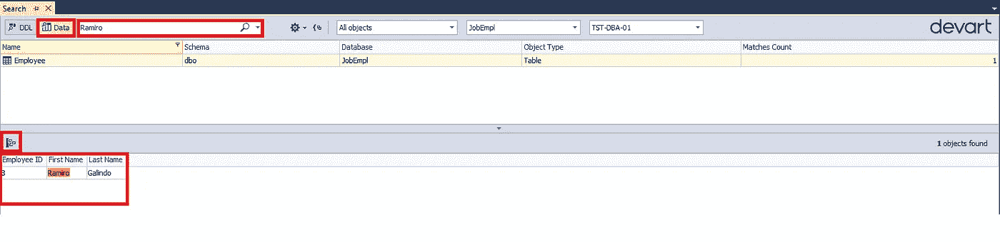

Img.14 .跨所有数据库数据的“Ramiro”子字符串的搜索结果

请注意，将显示所选 Employee 表上包含“Ramiro”子字符串的所有字符串。

此外，您可以像之前一样，通过按下下面显示的按钮将导航切换到找到的对象:

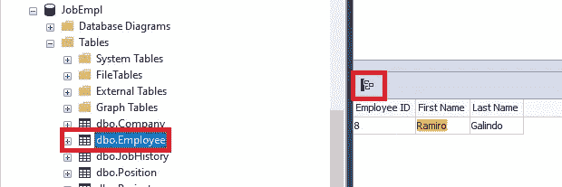

Img.15 .将导航转移到找到的对象

因此，我们可以在数据库中搜索所需的对象和数据。

# 结论

简而言之，从创意到实现招聘服务数据库，我们走过了漫长的道路。让我们总结一下到目前为止我们所取得的成就:

就这样，数据库已经准备好可以使用了，在测试运行之后，它可以被集成，并且它将存在。那么下一步是什么？稍后，我们将需要维护数据库，并在需要时引入更改。

另请阅读:

1.  [SQL 数据库设计基础及示例](/sql-database-design-basics-with-example-8dcce4b0c687)
2.  [用测试数据填充员工数据库](/populating-the-employee-database-with-test-data-aa76419eebb6)
3.  [导出和导入 JSON 数据](/exporting-and-importing-json-data-fc1753808349)

*原载于 2020 年 8 月 11 日*[*https://blog.devart.com*](https://blog.devart.com/how-to-search-for-database-objects-and-table-data-in-sql-server.html)*。*