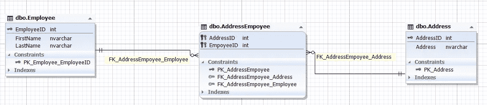
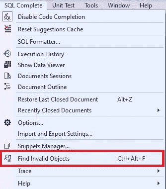
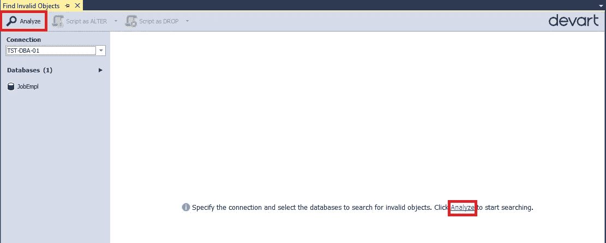
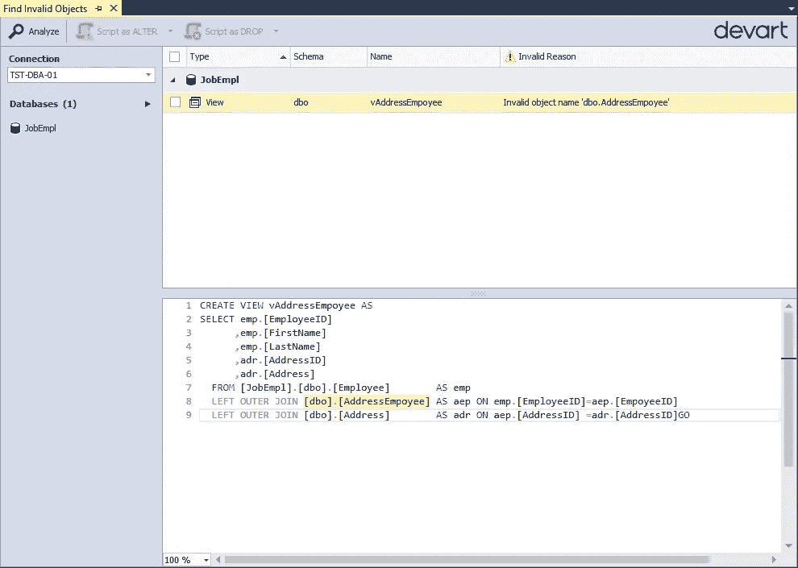
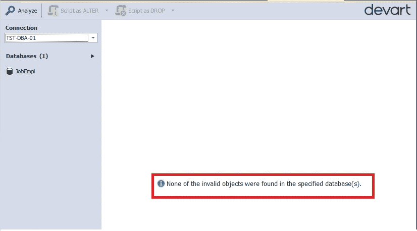

# 在 SQL Server 数据库中搜索无效对象

> 原文：<https://towardsdatascience.com/searching-for-invalid-objects-in-the-sql-server-database-a90fab49a66a?source=collection_archive---------43----------------------->

## 本文旨在解决在 SQL Server 数据库中查找和修复无效对象的问题。


图片来自 [Piqsels](https://www.piqsels.com/en/public-domain-photo-zkkgn) (CC0)

本文讨论数据库开发人员和管理员工作中的一个瓶颈，即无效对象的出现以及在 SQL Server 数据库中找到它们的方法。

在之前的文章中，我们涵盖了从创意到实现招聘服务数据库的所有过程:

*   [审查了数据库基本设计规则](/sql-database-design-basics-with-example-8dcce4b0c687)
*   [发现如何用测试数据填充数据库，以提供增长和性能预测](/populating-the-employee-database-with-test-data-aa76419eebb6)
*   [已检查数据的导出和导入](/exporting-and-importing-json-data-fc1753808349)
*   [查看创建的数据库导航，包括在数据库中搜索对象和数据](/searching-for-database-objects-and-table-data-in-sql-server-f42f7e3e76a1)

# 如何使用 SQL Complete 查找无效对象

让我们在 [SQL Complete](https://www.devart.com/dbforge/sql/sqlcomplete/) 工具的帮助下查看无效对象的搜索。假设我们用雇员的地址定义了一个新表，并将其命名为 Address:

员工可能有不同的地址。同时，几个雇员可以有相同的地址。因此，这些实体之间的关系是多对多的:



Img.1 .雇员和地址之间的关系

我们不考虑每个雇员只有一个指定地址的居住登记情况。我们对所有地址都感兴趣，包括那些指定员工倾向于在哪里度过时间(他居住和睡觉的地方)的地址。这样的地方可能有几个。

现在，让我们创建一个 vEmployeeAddress 视图，以如下方式显示雇员的数据和地址:

问题是我们忘记了更改 vAddressEmployee 视图，它现在引用了不存在的表。

不久之后，一个用户或者如果我们幸运的话，一个测试人员发现了一个问题，每当调用 vAddressEmployee 视图时，系统的一部分功能就会崩溃。

为了避免这种情况，每次将更改引入数据库时，我们都需要检查是否存在无效对象。

为此，选择您需要的数据库，在 [SSMS](https://docs.microsoft.com/en-us/sql/ssms/download-sql-server-management-studio-ssms?view=sql-server-2017) 的菜单栏中，选择 SQL Complete\Find Invalid Objects 命令:



Img.2 .在 SQL Complete 中选择“查找无效对象”命令

在出现的窗口中，单击窗口左上角或中间的“分析”按钮:



Img.3 .运行无效对象的搜索

请注意，您可以在“数据库”面板上一次选择多个数据库:


Img.4 .选择多个数据库

对无效对象的搜索完成后，我们可以看到显示 vAddressEmployee 视图的结果，该视图引用了不存在的表 AddressEmployee 和 Address:



Img.5 .搜索无效对象的结果

考虑到地址在雇员表中，重写 vAddressEmpoyee 视图就足够了，如下所示:

```
ALTER VIEW [dbo].[vAddressEmpoyee] AS
SELECT emp.[EmployeeID]
      ,emp.[FirstName]
      ,emp.[LastName]
	  ,emp.[EmployeeID] AS [AddressID]
	  ,emp.[Address]
  FROM [JobEmpl].[dbo].[Employee]		 AS emp
GO
```

完成后，当您第二次搜索无效对象时，将找不到它们:



Img.6 .未找到任何无效对象

请注意，AddressID 列根本不应该显示在 vAddressEmployee 视图中。但是，如果系统使用它，我们需要以两种方式确定变化的过程:

1.  如果该字段仅用于提供信息，而不用于搜索相同的地址，是否可以用 EmployeeID 中的值替换 AddressID。
2.  是否可以完全不显示 AddressID。

如果执行第一点失败，我们将不得不在应用程序的逻辑中引入变化，同时执行第二点。

然而，如果第一点是可行的，这将是一个快速解决问题的方法，您可以稍后通过一个修补程序或下一个更新来执行第二点。

简而言之，我们已经考虑了找到无效对象并修复它们的重要性。

# 结论

总之，我们研究了为招聘服务创建数据库的整个过程，从想法开始，到在生产中实现，并对模式进行进一步的修改。

给定的数据库允许我们执行快速搜索，并根据以下指标汇总数据:

1.  用人公司。
2.  位置。
3.  项目。
4.  技能。

值得一提的是，这个模式为 IWU 团队的创业提供了基础。

*原载于 2020 年 8 月 11 日*[*【https://blog.devart.com】*](https://blog.devart.com/searching-for-invalid-objects-with-sql-complete.html)*。*