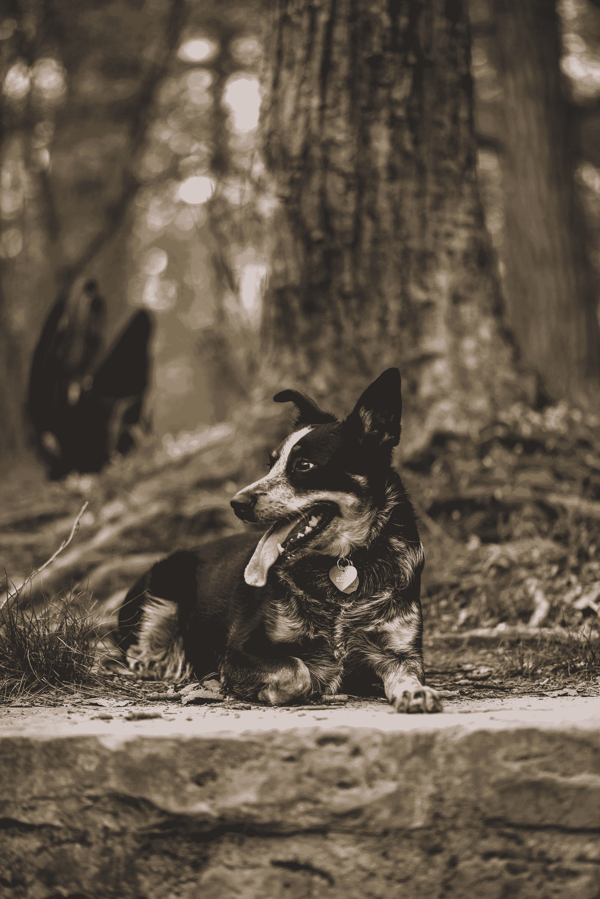

# 基于 Python 中的属性对对象列表进行搜索或排序

> 原文：<https://towardsdatascience.com/searching-or-sorting-a-list-of-objects-based-on-an-attribute-in-python-6cffb26a57c3?source=collection_archive---------8----------------------->

## 当你想找出哪个(狗)学生和其他(狗)学生的数量最多时

通常，当您有一组对象时，您可能不希望根据它们在内存中的位置，而是根据感兴趣的属性对它们进行排序。今天，我们将看看 Python 的内置工具:`operator.attrgetter`，以及这个工具包中的相关工具和实现类似目标的替代方法(使用 lambdas 和迭代器/理解)。


查尔斯·德鲁维奥在 [Unsplash](https://unsplash.com?utm_source=medium&utm_medium=referral) 上拍摄的照片

对于我们今天的数据集，我们将使用一个由 100 只狗组成的虚拟数据集。狗学生类有属性:`name`、`yr`、`strengths`、`areas_for_growth`、`works_well_with`、`not_works_well_with`、`has_sat_by`、`has_not_sat_by`、`notes`。它有添加、获取、移除和这些属性的方法，加上返回各自列表中朋友/敌人数量的`get_n_not_works_well`和`get_n_works_well`。

# 如何使用 attrgetter

Attrgetter 是一个属性 getter。您可以通过几种方式使用它:

1.  您可以创建一个 attrgetter“可调用对象，该对象从其操作数中获取 *attr* ”(从[文档](https://docs.python.org/3/library/operator.html))属性。

```
from operator import attrgetterfriend_getter = attrgetter('works_well_with')
print(friend_getter(dog_pack[1]))
```

这里，friend_getter 返回 dog_pack[1]的`works_well_with`列表:

```
[Student('Qeb', 12), Student('Putty', 6), Student('Douglas', 3), Student('Denali', 5), Student('Asher', 12), Student('Portia', 3), Student('Suki', 2), Student('Olive', 14), Student('Peri', 8), Student('Mari', 5), Student('Snowflake', 2), Student('Guayaba', 12)]
```

我仍在寻找你会在`dog_pack[1].works_well_with`上这样做的背景。我们将在下面看到我遇到的一个例子，但我不确定我是否被说服了。


马特·尼尔森在 [Unsplash](https://unsplash.com?utm_source=medium&utm_medium=referral) 上拍摄的照片

2.可以将 attrgetter 用于需要函数参数的函数。比如作为 sorted()、max()、min()的键；或者用 map()、itertools.groupby()等。

要得到最老的狗:

```
# to get the object with the characteristic (max yr)
oldest = max(dog_pack, key=attrgetter("yr"))
print(f"Oldest Dog\nname: {oldest.name}\nage: {oldest.yr}", 
      f"Strengths: {oldest.strengths}")
```

打印:

```
Oldest Dog
name: Abbey
age: 15
Strengths: ['snuggly', 'snuggly', 'plays well', 'fetch']
```

这里我们实际上有多个最老的狗，所以我们想使用过滤/条件列表理解来获得最老的狗的列表:

```
[d for d in dog_pack if d.yr == max(d.yr for d in dog_pack)]
```

返回

```
[Student(Abbey, 15),
 Student(Radar, 15),
 Student(Pinot, 15),
 Student(Lucci, 15),
 Student(Leona Mae Alcott Helmsley Cole, 15),
 Student(Stella, 15),
 Student(Whiskers, 15)]
```

不要忘记，如果我们想要值本身，而不是带有值的对象，就没有必要使用`attrgetter`。

```
max(d.yr for d in dog_pack)
```

它返回`15`。


由 [Bharathi Kannan](https://unsplash.com/@bk010397?utm_source=medium&utm_medium=referral) 在 [Unsplash](https://unsplash.com?utm_source=medium&utm_medium=referral) 上拍摄的照片

# 方法的 Attrgetter:方法调用方

Methodcaller 的工作方式与 attrgetter 非常相似，但是当您希望使用类的“方法”而不是“类”属性的返回时。

例如，如果我想让狗学生与最少的其他学生一起工作:

```
min_works_well = min(dog_pack, key=methodcaller('get_n_works_well'))print(f"""Works Well With The Fewest Dogs
          name: {min_works_well.name}
          works well with: {min_works_well.get_n_works_well()} dogs
          strengths: {min_works_well.strengths}
          areas for growth: {min_works_well.areas_for_growth}""")
```

返回:

```
Works Well With The Fewest Dogs
name: Pringles
works well with: 4 dogs
strengths: ['leave it', 'snuggly', 'comes when called']
areas for growth: ['playing with others']
```

`attrgetter`和`methodcaller`的另一个区别是，对于`attrgetter`，附加参数是要获取的附加属性，而对于`methodcaller`，它们是作为参数传递给方法的。


照片由 [gotdaflow](https://unsplash.com/@gettagottaflow?utm_source=medium&utm_medium=referral) 在 [Unsplash](https://unsplash.com?utm_source=medium&utm_medium=referral) 上拍摄

# 其他数据结构的 attr getter:item getter

`attrgetter`作用于类，而`itemgetter`作用于其他数据结构(列表、元组、字典等)。

如果我们的 dog_pack 被构造成一个字典列表:

```
oldest = max(dogs_dict_list, key=itemgetter('yr'))print(f"Oldest dog\nname: {oldest['name']}",
      f"strengths: {oldest['strengths']}")
```

`itemgetter`使用“yr”作为关键字并返回:

```
Oldest dog
name: Dollie
strengths: ['plays well', 'ignores food on the sidewalk']
```

如果它被构造成这样的元组列表:

```
dogs_tups = [('Bella', 5, 'labrador', 'yellow'), 
             ('Dollie', 12, 'austrailian sheppard', 'cream, brown')]youngest = min(dogs_tups, key=itemgetter(1))print(f"Youngest Dog:\nname: {youngest[0]}\nbreed: {youngest[2]}")
```

`itemgetter`将使用参数 1 作为索引并返回

```
Youngest Dog:
name: Bella
breed: labrador
```

像`attrgetter`一样，`itemgetter`在提供多个参数时返回一组查找值。


卡米洛·菲耶罗在 [Unsplash](https://unsplash.com?utm_source=medium&utm_medium=referral) 的照片

# 获取子属性

如果你想对我们的狗进行分类，不是根据这些一级属性中的一个，而是根据属性的一个组成部分，我看到了四个选项:

1.  如果属性是一个类，你可以通过将第二个属性名和第一个属性名一起传递给`attrgetter`来访问你的属性的一个属性。例如，如果我们改变 name 属性来创建类名的一个实例，我们可以像在 [docs](https://docs.python.org/3/library/operator.html) 示例中一样，用`sorted(dog_pack, key=attrgetter("name.first")`按名字排序。
2.  如果你可以访问这个类，或者这个类有一个方法返回你感兴趣的子属性，你可以使用`methodcaller`来访问/排序这个子属性。

```
from operator import methodcallersorted(dog_pack, key=methodcaller("get_area_for_growth", 0))
```

这里的`growth_sorted`是一个列表，按照它们的第一个成长领域排序(按字母顺序)。

再次注意，methodcaller 向该方法传递附加参数。这与 attrgetter 不同，在 attr getter 中，额外的参数被作为额外的属性来读取，支持多属性键。对于带有 methodcaller 的多属性键，您需要一个 lambda 函数。

3.使用 lambda 或定义的函数。

```
sorted(dog_pack, key=lambda x: (x.get_area_for_growth(0),
                                x.name.first)
```

或者相当于:

```
def first_growth_first_name(x):
    "Returns the first area for growth and first name of Dog x" first_growth = x.get_area_for_growth(0)
    first_name = x.name.first
    return (first_growth, first_name) sorted(dog_pack, key=first_growth_first_name)
```

4.组合 lambda 和 attrgetter/methodcaller。

```
sorted(dog_pack[0:5], key = lambda x: attrgetter("strengths")(x)[0])
```

这个例子对我来说很复杂，它依赖于群体中的每只狗在那个位置的力量。但在某些情况下这可能是正确的做法。与`lambda`和直接属性访问相比，我不确定`attrgetter`和`lambda`组合的相对计算时间。


由 [Anoir Chafik](https://unsplash.com/@anoirchafik?utm_source=medium&utm_medium=referral) 在 [Unsplash](https://unsplash.com?utm_source=medium&utm_medium=referral) 上拍摄的照片

# attr getter/item getter/method caller 与 lambda

内置函数似乎运行得更快，这对您的场景来说可能重要，也可能不重要。互联网上的人们似乎不同意哪个更优雅/更漂亮/更漂亮。字符串的使用阻碍了许多代码编辑器的自动完成功能，这需要键入/拼写/知道他们想要什么属性。不理想。对我来说不是交易破坏者。

这些都可以很容易地用 lambda 函数(或定义的函数)来代替:

## attrgetter

按年份和名称对我们的狗群进行分类:

`sorted(dog_pack, key=attrgetter(“yr”, "name.first"))`成为

`sorted(dog_pack, key=lambda x: (x.yr, x.name.first))`

## itemgetter

```
dogs_tups = [('Bella', 5, 'labrador', 'yellow'), 
             ('Dollie', 12, 'austrailian sheppard', 'cream, brown')]
```

将这些狗元组按品种分类:

`sorted(dogs_tups, key=itemgetter(2)`成为

`sorted(dog_pack, key=lambda x: x[2])`

## 方法调用程序

根据狗狗们玩耍的数量对狗群进行分类:

`sorted(dog_pack, key=methodcaller(“get_n_works_well”))`变成了

`sorted(dog_pack, key=lambda x: x.get_n_works_well())`

## 何时使用 lambda、自定义函数或理解

如果您需要在排序/获取最大值/最小值/无论什么之前处理属性数据，那么您可能需要使用`attrgetter`的替代方法。

例如，最初，我的狗的名字有不规范的大写。如果您没有访问该类的权限，可以使用以下方法进行更正:

```
sorted(dog_pack, key=lambda x: x.name.first.lower())
```

或者如果你正在寻找名字以 A 开头的狗:

```
[d for d in dog_pack if d.name.first.lower() < 'b']
```

点击查看 GitHub 库[。编码快乐！](https://github.com/allisonhonold/attrgetter_blog)



照片由 [allison christine](https://unsplash.com/@happpyal?utm_source=medium&utm_medium=referral) 在 [Unsplash](https://unsplash.com?utm_source=medium&utm_medium=referral) 上拍摄