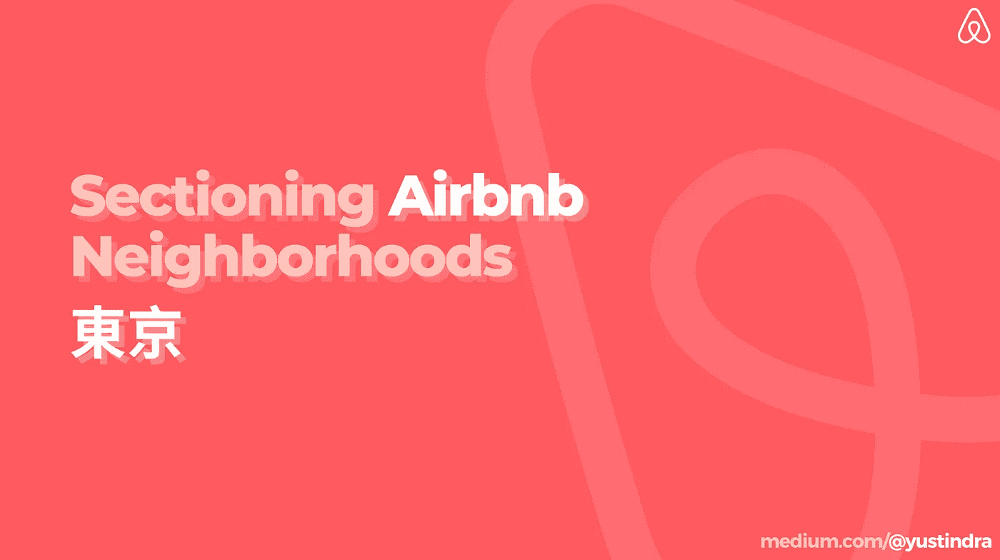
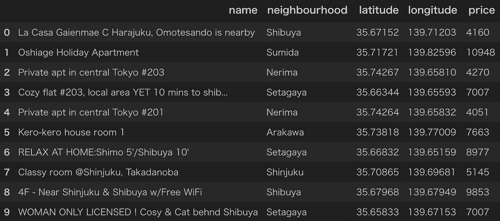
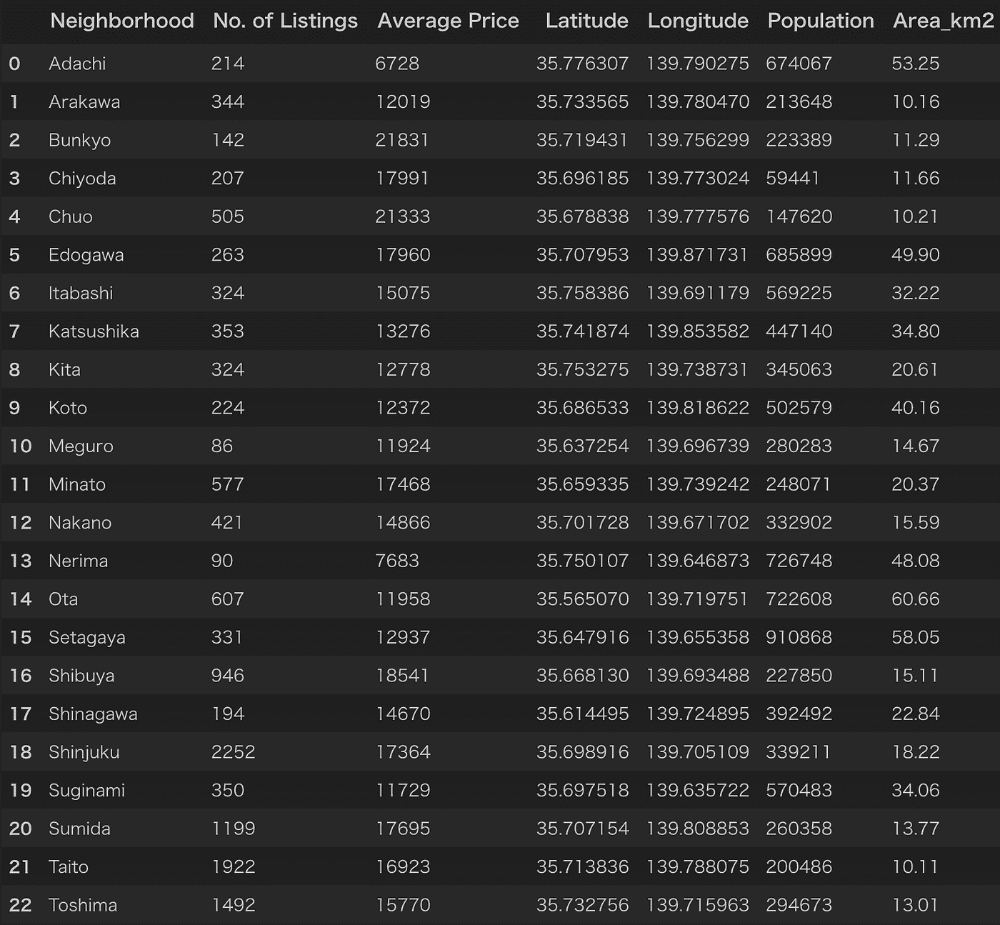
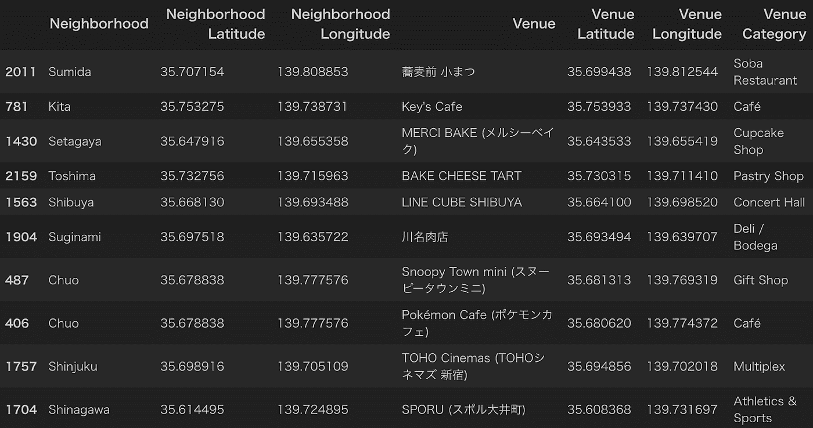
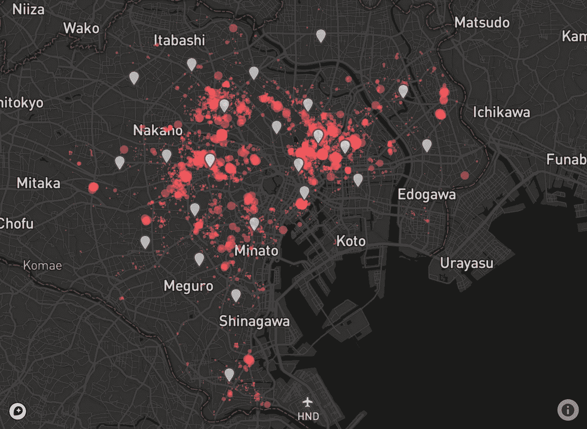
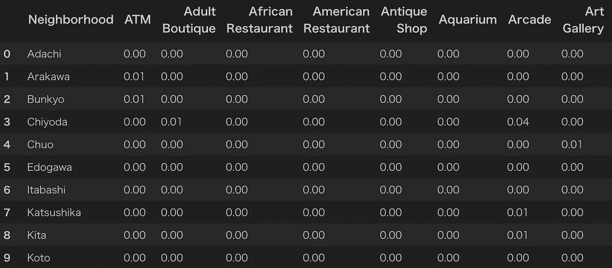
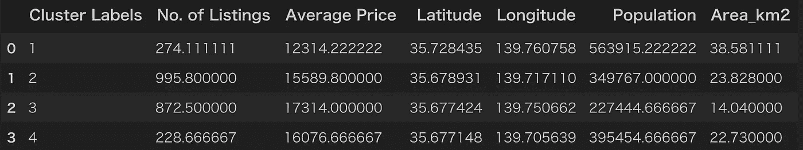
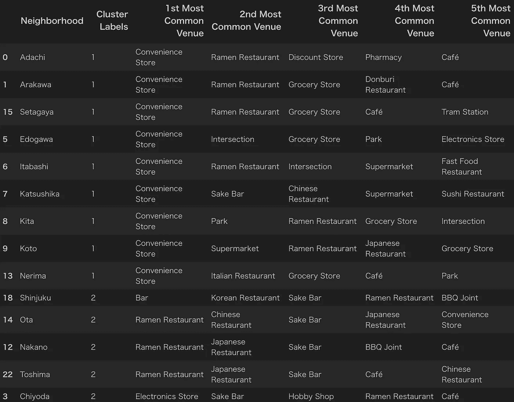
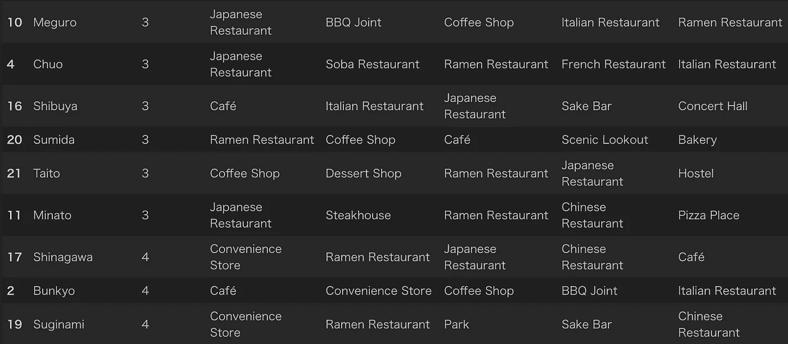
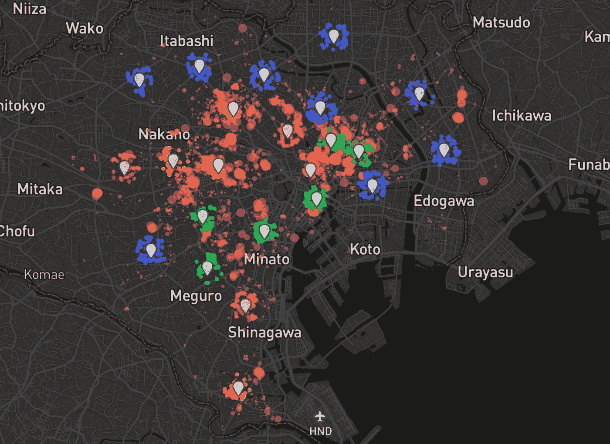

# 分割东京的 Airbnb 社区:调查周围环境

> 原文：<https://towardsdatascience.com/sectioning-airbnb-neighborhoods-in-tokyo-survey-the-surroundings-31edd55b37d9?source=collection_archive---------20----------------------->

## 您下次去东京时打算住在 Airbnb 吗？瞥一眼周围是什么样子，看看其他类似的区域。

# 前言

Despite rising tension with the government authority in recent years, Tokyo has been a growing market for property owners renting out their space for the public; 民泊 or *minpaku* as they would call in Japanese. Airbnb, just as in other major cities, is among the popular platforms to find one, especially for foreigners who possess little or no local language understanding.

当到达 Airbnb 时，人们往往会想知道附近有哪些好景点。隐藏的被低估的寿司店，正宗的当地拉面摊，或者那些“可语法化的日式咖啡馆”正等着被发现。快速的谷歌搜索就可以了，但是如果我们能在预订之前就探索在哪个地区有什么样的地方呢？还是找出特色相似但花费较少的地区？我们也许可以节省更多的时间来决定去哪里，甚至更好地计划我们的旅行。这个照明项目旨在回答这个问题。它不仅针对旅行者，也可能对那些有兴趣在附近经营住宿或相关业务的人有用，甚至对那些考虑住在世界上人口最多的大都市并想知道社区是什么样子的人有用。

# **准备数据**

[Inside Airbnb](http://insideairbnb.com/) 拥有世界上任何 Airbnb 城市中更新最多的数据库之一，而且是免费的；感谢他们的抓取工具成功地从 Airbnb 网页相对复杂的 HTML 结构中提取文本。仅获取必要的分析数据后，由 13367 个列表(截至 2019 年 11 月)组成的数据将如下所示:

数据集 1:东京 Airbnb 房源

然后我汇总数据，找出每个街区的房源数量、平均价格和经纬度坐标。为了增加一些趣味，我在东京维基百科的特殊选区页面上做了一个快速的**漂亮的图片**抓取，这个页面包含了该市 23 个行政区的人口和面积数据。

数据集 2:每个邻域的聚合属性

随后，基于坐标，我使用 **Foursquare API** 检索了步行距离半径(小于 1 公里)内每个区域的最多 100 个推荐地点。有些区域可能不如其他区域集中，因此周围的斑点较少。我发现看到获得的结果很有趣，因为我不知道周围一些相当不错的地方，尽管我在这个地区生活了多年。下面显示的是收集的 2216 条记录的前几行。我们会在场地类别上查找更多信息，以浏览周围环境并回答项目问题。让我们开始进一步的分析。

数据集 3:每个邻近区域的推荐景点列表

# 视察社区

## 简要检查

下面的图表总结了所有的信息，让我们一瞥病房之间的比较。我正在使用 **Plotly** 进行可视化，所以你可以随意在周围徘徊。

注:圆圈的大小表示人口数量。x 轴是对数刻度。

总体而言，东京房源平均每晚花费**12000 ~ 15000 日元(110~140 美元)**。这与世界其他主要城市的平均水平相当或低于平均水平，但由于今年夏天奥运会前需求的上升，实际上**从去年开始变得越来越贵。**

面积和人口似乎有很好的相关性，因为练马、**足立**、**江户川**和**太田**的大小和颜色大致相同。有趣的是，Bunkyo 是最贵的病房，尽管它在列表数量上排名倒数第三。此外，尽管在人口和面积上与两个最便宜的地区不相上下，江户川的价格还是出现了飙升，这可能是因为它很容易到达东京迪士尼度假区和市中心。5 离群值很容易识别，因为有 1000~个列表；这似乎有一个明显的原因，我们将在接下来的几行中看到。

你可能想知道东京的 Airbnb 房源大多集中在哪里。这是一张地图，显示了公寓的位置(半径越小意味着花费越少)和标记图标所指的 23 个特殊病房。

大致有 3 大组和几个较小的上市集群。位于中野标志 4 点钟位置的是新宿区，这里是日本最繁忙的地区，也是东京约 17%的房源所在地。拥有城市的中央车站和许多景点可能是出租公寓聚集在那里的主要原因。稍微往北一点，我们可以看到第二个拥挤的区域——丰岛——著名的池袋区的所在地。它是连接东京和邻近郊区的主要枢纽之一，也是生活便利的地区之一。最后一个团位于**台东**和**隅田**基地的东侧。必须参观的浅草真宗寺和东京晴空塔每天都会吸引大量游客。我对周围的环境不太熟悉，但我听说由于合理的租金和不断改善的基础设施，越来越多的人来到这里居住。

## 将病房分组

在数据集 3 中，有 242 个独特的类别，其中“便利店”、“拉面餐厅”、“日本餐厅”(*你不要说*)、“咖啡馆”和“清酒吧”名列榜首。诸如“井”、“白俄罗斯餐馆”和“十字路口”之类的随机类别也出现在列表中。

为了弄清楚社区是什么样子，我列出了每个区最常见的场所类别，然后使用相对频率值进行细分。聚集表是一个稀疏的 23×243 矩阵。

这一次，我将只使用 k-means 聚类算法来查找相似的邻域组，因为它对于无监督的任务来说是常见且强大的。我在考察了肘法和剪影评分后选择 4 作为 *k* 的最佳数。数据集 2 中的其他要素不包括在拟合模型中，以避免人口统计和空间噪声。但是它们在比较聚类之间的差异时非常有用，如下表所示:

第一个和第二个集群看起来像这样，

这是剩下的第三和第四个。

对于那些不熟悉东京的人来说，仅仅从上面的表格中很难看出地理模式，所以下面的精确可视化可能会有所帮助。

我们仅从基础地理空间数据、Airbnb 列表和 Foursquare 的相对较小的数据集观察到有趣的发现。在简单检查部分，你可以有一个大的图片，哪一个社区适合你的需要。例如，如果你想住在公共区域的一个地方，并愿意收取高于平均水平的费用，将你的过滤搜索设置为列表数量最多的 5 个病房之一。或者那些为了更便宜的租金而牺牲更多的交通和通勤时间的人可能会在 Nerima 和 Adachi 附近找到适合他们的地方。

聚类结果也出乎意料的好。在没有将地理坐标数据放入 k-means 拟合中的情况下，结果似乎找到了形成将邻域与其空间上接近的对应物分组的线段的方法。如果我可以包括我自己的领域知识，集群 1 由**郊区**组成，集群 2 代表**对旅行者友好的**区域，集群 3 似乎是**全才**(商业、购物、旅游)，集群 4 基本上是**随机**。进一步来看，每个集群的特征如下:

*   集群 1:房源少，价格低，人口多，面积大，便利店占主导
*   集群 2:很多上市，平均价格，游客的热门停留区域，拉面餐厅和酒吧是最常见的
*   集群 3:房源多，价格高，人口少，面积小，场地多样
*   集群 4:房源少，价格平均，混合了普通住宅、学生和游客的住宿区

# 附言

当预订 Airbnb 或其他租赁住宿时，了解其特点和周围环境可能会很有用。通过考虑位置、平均价格和/或人口密度，你可以知道哪些社区适合或不适合你的偏好。像新宿、涩谷、池袋、上野和浅草这样的热门地区是出租公寓集中的地方。然而，不太出名的街区也值得一试，而且花费相对较少；也许你会发现隐藏的宝石和沿途的当地经历。数据显示，日本首都可以分为 4 个区域。郊区？旅行者之群？全能区？还是一般的地区？你喜欢哪一个？

*本文是* [*IBM 数据科学专业证书*](https://www.coursera.org/account/accomplishments/specialization/8MHCGUH9ZWCG) *应用顶石项目的一部分。*