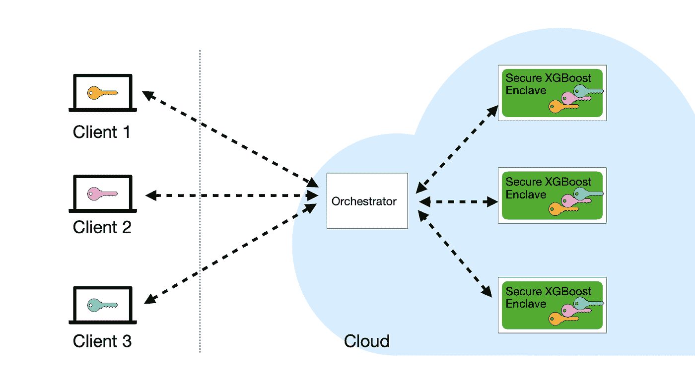
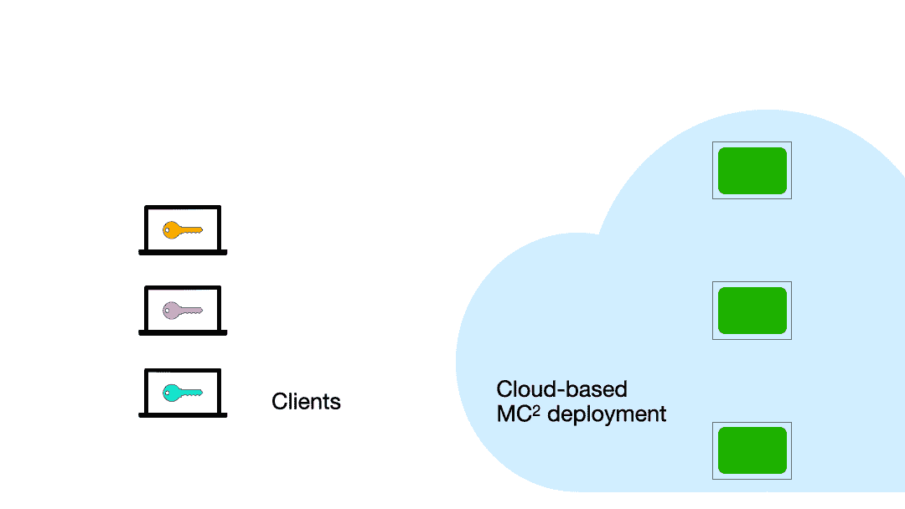

# 加密数据上的安全协作 XGBoost

> 原文：<https://towardsdatascience.com/secure-collaborative-xgboost-on-encrypted-data-ac7bc0ec7741?source=collection_archive---------61----------------------->

## 一个使用安全飞地进行多方训练和 XGBoost 模型推理的库


马库斯·斯皮斯克在 [Unsplash](/?utm_source=unsplash&utm_medium=referral&utm_content=creditCopyText) 上拍摄的照片(已修改)。

> **TL；DR:** 在加州大学伯克利分校的 [RISE 实验室](https://rise.cs.berkeley.edu/)，我们一直在构建 [Secure XGBoost](https://github.com/mc2-project/secure-xgboost) ，这是一个支持**协作**[**XGBoost**](https://xgboost.ai/)**对加密数据**进行训练和推理的库。为了便于使用，我们提供了一个与 XGBoost 几乎相同的 Python API，只是增加了一些集成安全性。Secure XGBoost 是 [umbrella MC 项目](https://github.com/mc2-project/mc2)的一部分，在这个项目下，我们正在开发各种保护隐私的机器学习工具。
> 
> 特别是，Secure XGBoost 有助于**安全的协作学习***——相互不信任的数据所有者可以在他们的数据上联合训练一个模型，但不会向彼此透露他们的数据。安全协作学习是一种强大的范式，可能是开启更具弹性和稳健模型的关键。我们一直在与行业中的一些团队合作，包括丰业银行和蚂蚁金服，以部署 Secure XGBoost 来努力实现反洗钱和欺诈检测。*

# *动机*

*训练机器学习模型需要大量高质量的数据。实现这一点的一种方法是组合来自许多不同数据组织或数据所有者的数据。但是，出于隐私方面的考虑，数据所有者通常不愿意彼此共享他们的数据，这可能源于商业竞争，也可能是法规遵从性的问题。*

*问题是:我们如何减轻这样的隐私问题？*

*安全的协作学习使许多数据所有者能够**在他们的集体数据上建立稳健的模型，但不会相互泄露他们的数据**。银行可以合作开展反洗钱工作，同时保持客户数据的私密性。医疗保健机构可以将他们的患者数据集中在一起，并在医学研究方面进行合作。可能性是巨大的，充满希望的。*

# *安全 XGBoost 简介*

*作为朝着这个方向迈出的一步，我们很高兴推出 [Secure XGBoost](https://github.com/mc2-project/secure-xgboost) ，这是一个支持**协作** [**XGBoost**](https://xgboost.ai/) **对加密数据**进行训练和推理的库。简而言之，多个客户端(或数据所有者)可以使用这个库，在云环境中基于他们的集体数据联合训练一个 XGBoost 模型，同时保护他们个人数据的隐私。虽然我们在本文的其余部分关注协作学习，但是 Secure XGBoost 也支持那些只是想将计算外包给云，但不想以纯文本形式将数据暴露给云的人。*

*在其核心部分，Secure XGBoost 使用**安全飞地**(如英特尔 SGX)来保护数据，即使是在充满敌意的云环境中。也就是说，即使培训在云中运行，每个客户端的数据仍然对云提供商和其他客户端隐藏。客户端远程编排训练管道*，但是*协作*，并且安全 XGBoost 保证每个客户端保留对其自身数据的控制。**

# *安全的飞地*

*安全区域是计算机处理器技术的最新进展，它允许在不可信的机器上创建安全的内存区域(称为区域)。放置在 enclave 中的任何数据或软件都与系统的其余部分隔离开来。同一处理器上的任何其他进程都不能访问该内存，即使是操作系统或虚拟机管理程序等特权软件也不能。secure enclave 技术的示例包括英特尔 SGX、AWS Nitro Enclaves、ARM TrustZone 和 AMD 内存加密。*

*此外，enclaves 通常支持一个名为*远程证明*的特性。该特性使客户端能够以加密方式验证云中的 enclave 正在运行可信的、未经修改的代码。*

*Secure XGBoost 构建于 [Open Enclave SDK](https://openenclave.io/sdk/) 之上，这是一个开源 SDK，提供了跨不同 Enclave 技术的单一统一抽象。Open Enclave 的使用使我们的库能够兼容许多不同的 Enclave 后端，如英特尔 SGX 和 OP-TEE。*

# *减轻旁道攻击*

*在飞地之上，Secure XGBoost 增加了第二层安全，额外保护数据和计算免受飞地上的大类攻击。*

*研究人员已经表明，攻击者可能能够通过利用[辅助泄漏源](https://en.wikipedia.org/wiki/Side-channel_attack)(或“旁道”)了解 SGX 飞地内数据的敏感信息，即使他们无法直接观察数据。存储器访问模式就是这种旁路的一个例子。*

*在 Secure XGBoost 中，我们设计并实现了用于模型训练和推理的**数据无关算法**。在高层次上，我们的算法产生相同的存储器访问序列，而不管输入数据如何。因此，内存访问模式不会向攻击者透露任何有关底层数据的信息。*

*然而，额外的安全性是以牺牲性能为代价的。如果这种攻击超出了用户的威胁模型，他们可以禁用这种额外的保护。*

# *系统结构*

*安全 XGBoost 的部署由以下实体组成:(I)多个数据所有者(或客户),他们希望在他们各自的数据上协作训练模型；以及(ii)在飞地机器集群中托管安全 XGBoost 平台的不可信云服务。*

**

*安全 XGBoost:架构*

*   ***嫖客。**客户是指与其他客户一起参与协作学习过程的数据所有者。客户端通过远程调用其 API 在安全的 XGBoost 平台上共同执行计算管道。*
*   ***有飞地的云服务。**云服务由一个虚拟机集群组成，每个虚拟机在一个安全的飞地中托管安全的 XGBoost。在训练和推理过程中，Secure XGBoost 将计算分布在飞地集群中。飞地通过 TLS 通道相互通信，TLS 通道在飞地内部开始和结束。云还托管一个不受信任的 orchestrator 服务。orchestrator 协调客户机和部署在 enclaves 中的安全 XGBoost 平台之间的通信。*

# *工作流程*

*每个客户端将它们的加密数据上传到云服务，然后共同调用安全的 XGBoost API 来处理它们的数据。端到端示例工作流如下:*

**

*安全 XGBoost:工作流*

1.  ***客户端认证云上的 enclave**(通过 enclave 的远程认证程序)以验证预期的安全 XGBoost 代码已经安全地加载到每个 enclave 中。作为证明的一部分，他们从飞地接收一个公钥 pk。每个客户端生成一个对称密钥 *k_i* ，使用 *pk* 对其进行加密，并将其发送到 Secure XGBoost。*
2.  ***客户端上传加密数据到云存储**。每个客户端用他们的对称密钥 k_i 加密数据，并上传到云存储。*
3.  *客户端共同协调数据处理。客户端同意预先确定的*命令*(一个命令是一个 XGBoost API 调用)序列，这些命令将在它们的数据上联合执行。客户端提交*一个签名的命令*给 orchestrator，orchestrator 将其转发给 Secure XGBoost。命令的结果(例如，加密的训练模型或加密的预测结果)被返回给客户端。*

*该过程继续，直到所有命令都被执行。*

# *用户 API*

*从用户的角度来看，上面工作流的所有复杂性都被抽象到了库中，使用这个库非常简单。在很大程度上，Secure XGBoost 保留了常规 XGBoost 公开的 API，只需要很少的添加就可以在 enclaves 的多方设置中工作。*

*假设每个客户端都已经将它们的加密数据上传到了云服务器，这里有一个客户端如何使用 Secure XGBoost 的例子。*

1.  *每个客户端首先初始化它们的密钥，并连接到云中的安全 XGBoost 部署。*

```
*import securexgboost as xgbxgb.init_client(user1,
                symmetric_key,
                public_key,
                certificate,
                server_addr)*
```

*2.接下来，每个客户端验证 enclaves，以验证它们正在运行真实的、未经修改的安全 XGBoost 代码。*

```
*xgb.attest()*
```

*然后，客户端调用安全的 XGBoost APIs。这些与普通的 XGBoost 非常相似，在支持多个数据所有者方面略有不同。*

*3.将来自不同数据所有者的数据加载到服务器的单个“数据矩阵”中。*

```
*dtrain = xgb.DMatrix({user1: “/path/to/data/on/server”,
                      user2: “/user2/data/on/server”})*
```

*4.根据加载的数据训练模型。*

```
*params = {"tree_method": "hist",
          "objective": "binary:logistic",
          "min_child_weight": "1",
          "gamma": "0.1",
          "max_depth": "3"}num_rounds = 5booster = xgb.train(params, dtrain, num_rounds)*
```

*5.使用模型运行预测。Secure XGBoost 发送加密的结果，这些结果在客户机上本地解密。*

```
*dtest = xgb.DMatrix({username: “path/to/data/on/server”})predictions, num_preds = booster.predict(dtest)*
```

# *应用程序*

*在过去的几个月里，我们一直在与行业中的几个团队合作，包括加拿大丰业银行、爱立信和蚂蚁金服，以开发和部署安全的 XGBoost。特别是，我们正在努力使用 Secure XGBoost 进行反洗钱、欺诈检测和信用风险建模。*

# *资源*

*我们对这个项目的方向及其潜在的应用感到非常兴奋。代码库是开源的。要开始，请查看我们在 Github 上的项目页面[。如果您想进一步了解该项目或有任何疑问，请](https://github.com/mc2-project/secure-xgboost)[提出问题](https://github.com/mc2-project/secure-xgboost/issues)或通过以下方式联系我们:*

*   *里沙卜·波德达尔<[rishabhp@eecs.berkeley.edu](mailto:rishabhp@eecs.berkeley.edu)*
*   *wzheng@eecs.berkeley.edu 郑文婷<[](mailto:wzheng@eecs.berkeley.edu)*
*   *梁志成<[chester@eecs.berkeley.edu](mailto:chester@eecs.berkeley.edu)*

*Secure XGBoost 是 [umbrella MC 项目](https://github.com/mc2-project/mc2)的一部分，在这个项目下，我们正在开发各种保护隐私的机器学习工具。请查看我们的项目页面获取更新。*

# *作者*

*里沙布·波德达尔、切斯特·梁、郑文婷、拉卢卡·阿达·波帕和扬·斯托伊察(*里塞拉布，加州大学伯克利分校)**

****来自《走向数据科学》编辑的提示:*** *虽然我们允许独立作者根据我们的* [*规则和指导方针*](/questions-96667b06af5) *发表文章，但我们并不认可每个作者的贡献。你不应该在没有寻求专业建议的情况下依赖一个作者的作品。详见我们的* [*读者术语*](/readers-terms-b5d780a700a4) *。**