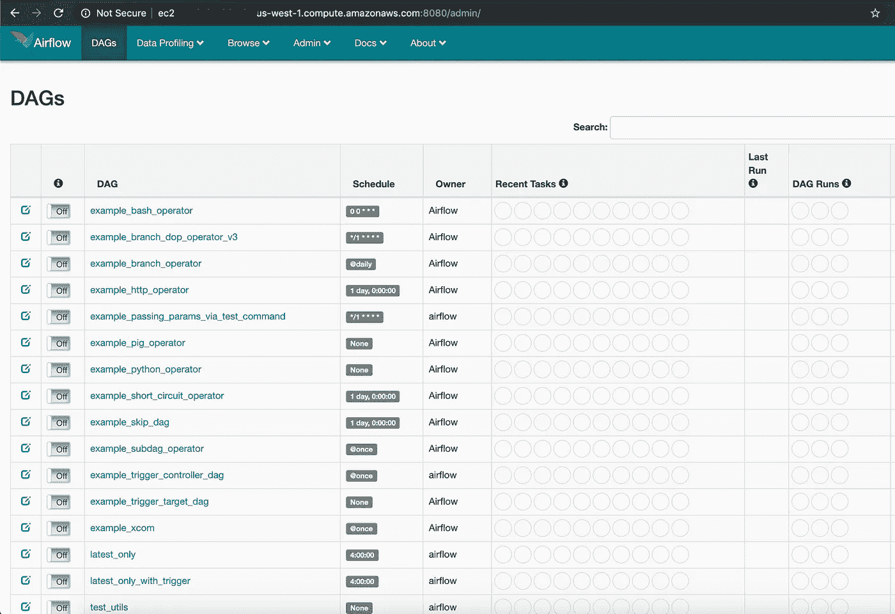
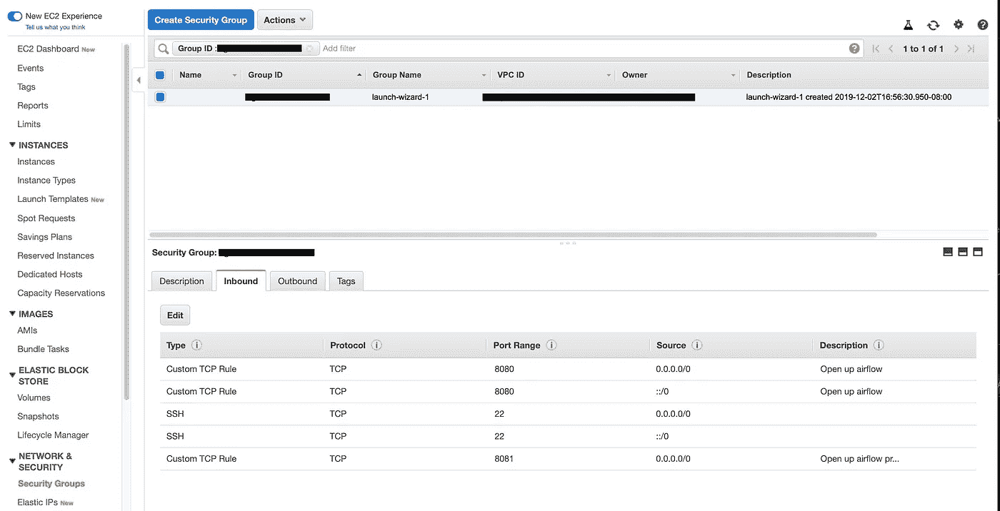
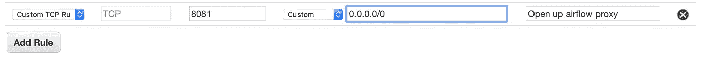
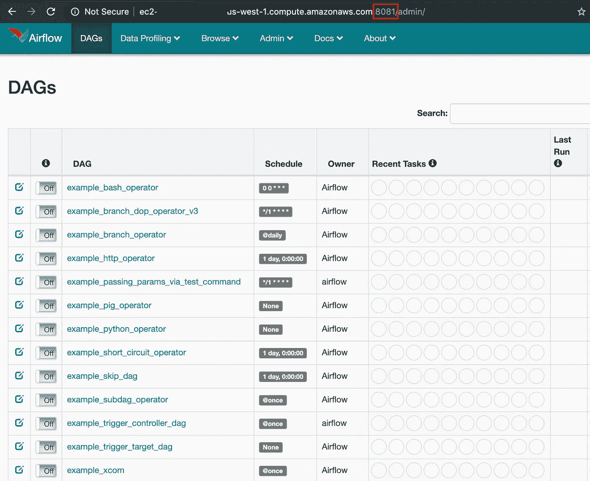
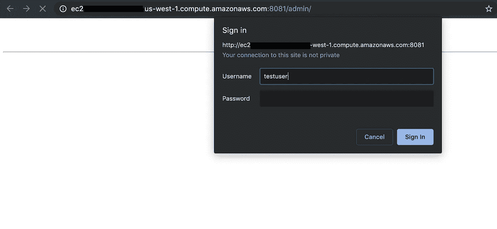

# 使用密码保护您的数据工具

> 原文：<https://towardsdatascience.com/secure-your-data-tool-part-1-2-1585029d59e9?source=collection_archive---------27----------------------->

## 作为一名数据科学家，如何使用 NGINX 保护数据工具

**TL；博士:** NGINX 是一种安全访问数据科学工具(如 Airflow 或任何 web 应用程序)的快速简单的方法，不需要完整的 web 开发技能。


被[框住的熊](https://unsplash.com/@theframedbear?utm_source=medium&utm_medium=referral)在 [Unsplash](https://unsplash.com?utm_source=medium&utm_medium=referral) 上拍照

想象一下…你是一名数据科学家，有一个棘手的问题要解决，你发现了一个很棒的开源工具，可以解决这个问题。也许你希望开始用 [MLflow](https://github.com/mlflow/mlflow/) 跟踪不同的模型版本……或者你想用 [Apache Airflow](https://github.com/apache/airflow) 建立数据管道……或者你想开始在 [JupyterHub](https://github.com/jupyterhub/jupyterhub) 中合作。这些工具都有一个超级简单的安装指南。您运行几个 bash 命令，然后将 web 浏览器指向`localhost:port`，您就可以启动并运行了。

让我们假设你正在使用气流。在本地使用它之后，您希望开始定期使用 Airflow 和/或与团队中的其他人分享。为此，您可以使用由云提供商(如 AWS EC2 或 GCP 计算引擎)管理的虚拟机，并遵循与在本地机器上类似的步骤。一旦 airflow 启动并运行，您需要能够通过一个网址访问，而不需要提供整个互联网访问。作为一名 web 安全经验有限的数据科学家，这第一次可能是一项艰巨的任务。本教程将向您展示如何以安全的方式在虚拟机上快速托管气流，而无需成为安全或 web 工程师！您也可以轻松地将这些方法应用于其他数据科学工具。

*免责声明:本指南旨在为数据科学家提供一种设置密码保护的简单方法。在对敏感用户或公司数据或系统使用这些方法之前，请务必咨询您的内部(或外部)安全专家。#保护数据*

# 先决条件:

本教程假设您已经在 EC2 机器上运行了一个 Apache Airflow 应用程序。[这里](https://adataguru.net/setup-airflow/)是阿帕奇气流的一个很好的例子。许多其他数据科学工具都有关于如何设置的类似教程！您还应该非常熟悉 bash 脚本。在本教程中，我们在 EC2 实例上使用 Ubuntu。

此时，您应该能够通过`http://<webserver_location>:port`在互联网上访问您的 web 应用程序(这种访问可以通过安全组来设置——下面有更多信息！).此时，Airflow 前面没有密码保护，您的浏览器指示您的连接不安全。



# 必要的工具

## **NGINX**

NGINX (发音为“engine x”)是一个漂亮、强大、全功能的 web 服务器，它为 web 开发人员提供了许多优秀的功能。这意味着数据科学家需要的少量功能实际上很难设置。您可以将它用于一些关键的功能:

*   向我们的 web 应用程序添加身份验证(这篇文章)
*   用域名给我们的网络应用添加加密，这样我们就可以访问 HTTPS 上空的气流

NGINX 是免费和开源的。要在 Ubuntu 服务器上安装 NGINX，请运行:

```
sudo apt-get install nginx
```

## **htpasswd**

htpasswd 是一个超级简单的系统，用于管理用户列表和认证密码。我们将使用 htpasswd 来管理访问 Airflow 的用户的用户名和密码。要安装 htpasswd，请运行

```
sudo apt-get install apache2-utils
```

## **AWS 安全组**

如果您使用 Airflow running，您可能已经在这里完成了，但是您需要访问 AWS 中的输入/输出端口安全设置来完成本教程。如果你在 AWS 上有一个管理员级别的帐户，你应该没有问题访问它。如果您的访问权限较低，请要求您的管理员授予您 EC2 安全组访问权限。

下面，您将看到对端口`8080`(它将在没有密码的情况下指向气流)、端口`22`(它将自动为 SSH 启用)和端口`8081`(它将在有密码保护的情况下指向气流)的开放访问。



要添加对这些端口的访问，只需编辑入站列表并点击“添加规则”。接下来从下拉列表中选择“自定义 TCP 规则”，添加您的端口号，并指定谁应该能够访问。您可以在开放访问、当前 IP 和自定义 IP 地址之间进行选择。小心开放访问——互联网上的任何人都可以访问！在这里，我们正在为`8081`港设置开放访问。



# 设置步骤

## **测试出 NGINX**

NGINX 是通过一系列配置来管理的。在默认安装 Ubuntu 的情况下，这些配置会在`/etc/nginx`(找不到这个文件？更多详情[此处](http://nginx.org/en/docs/beginners_guide.html))。您将在这个配置文件中看到各种目录和文件。你在乎的那个叫`sites-enabled` ( [为什么？](https://stackoverflow.com/questions/21812360/what-is-the-difference-between-sites-enabled-and-sites-available-directory))。在这个目录中，您会发现`default`,这是默认的配置文件。继续打开那个文件。为了保持整洁，让我们继续删除这个文件中的所有内容(提示:如果您正在使用 vim，请键入`dG`)。

为了确保 NGINX 正常工作，我们将设置一个超级简单的“代理传递”,将一个运行在`8080`上的 web 服务器“传递”给`8081`。为此，将以下内容粘贴到新清除的`default`文件中:

```
server {
        listen 8081;

        location / {
        proxy_pass http://127.0.0.1:8080;
        }
}
```

保存并退出该文件后，您需要使用`sudo service nginx restart`重启 NGINX(这对您不起作用吗？更多选项[此处](https://www.cyberciti.biz/faq/nginx-linux-restart/))。假设没有弹出错误，您新创建的代理通行证现在应该可以工作了！如果没有，检查您的安全组设置(前面已经讨论过)以确保端口`8081`是可访问的。这意味着您现在也应该能够从端口`8081`获得气流:



*注意:气流现在仍然在端口 8080 上可用，但现在也在端口 8081 上可用。*

## 添加身份验证

接下来，我们要添加一个用户名和密码认证到我们新的代理端口 8081。我们将使用 htpasswd 来管理用户名和密码，NGINX 将引用它们。

首先，让我们设置我们的第一个新用户。为此，请运行以下命令:

```
sudo htpasswd -c /etc/.htpasswd testuser
```

`-c`应该只是添加了*的第一个*时间，而不是当你添加新用户之后，`/etc/.htpasswd`可以是任何文件位置，请小心你放置这个的地方！`testuser`是用户名。

这将提示您输入密码并确认密码！该命令用您的`username:password`组合设置一个纯文本文件字符串。尽管密码是以加密格式存储的，但是仍然要确保谁可以访问这个文件。

要添加额外的用户名和密码，只需重新运行上面不带`-c`的命令:

```
sudo htpasswd /etc/.htpasswd testuser2
```

现在我们有了用户设置，我们应该回到`default` NGINX 配置文件。我们需要增加两条新线路。第一个设置登录提示文本，第二个引用最近创建的密码文件:

```
server {
        listen 8081;

        location / {
        proxy_pass http://127.0.0.1:8080;
 **auth_basic "Please Login";
        auth_basic_user_file /etc/.htpasswd;**
        }
}
```

随着 NGINX 配置文件的每次更新，我们需要使用 sudo service NGINX restart 来重启服务。现在前往`8081`端口，你会看到新的安全网页:



现在您已经在端口 8081 上设置了密码，您可以通过安全组设置删除对端口 8080 的访问。现在，用户将只能通过密码安全链接访问气流！

*关于这一节的更多细节，这里还有另一个很棒的教程*[](https://www.digitalocean.com/community/tutorials/how-to-set-up-basic-http-authentication-with-nginx-on-ubuntu-14-04)**。**

***注意:**此时，任何窥探您连接的人都可能在传输过程中窃取您的密码。这就是为什么有一个关于“你与这个网站的连接不是私人的”的说明为了避免这种情况，您应该只在安全、可信的 wifi 网络上使用它，或者使用 VPN。您也可以用自己的域名设置 HTTPs，这样就不用担心这个问题了。NGINX 有很棒的教程[这里](https://www.nginx.com/blog/using-free-ssltls-certificates-from-lets-encrypt-with-nginx/)。*

*问题，想法，错误？请在评论中让我知道。感谢阅读！*