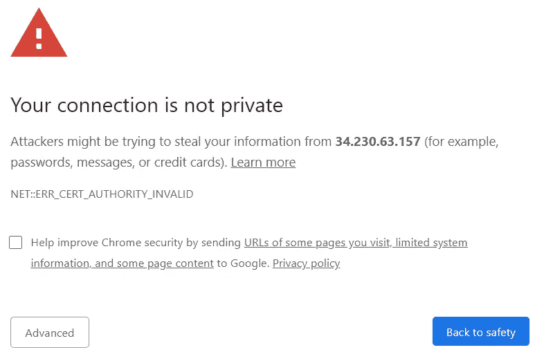
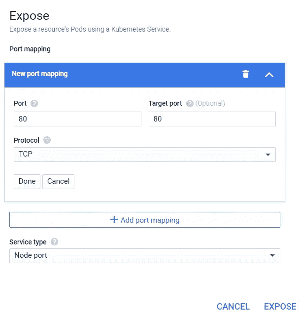
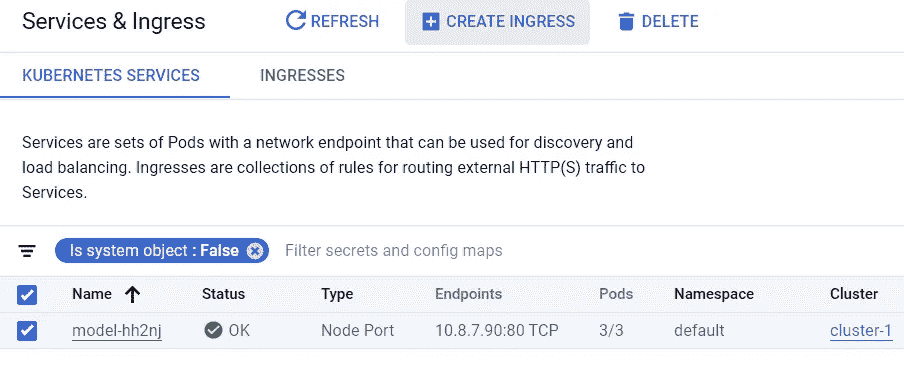
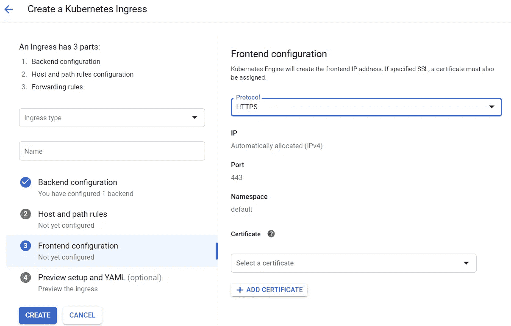
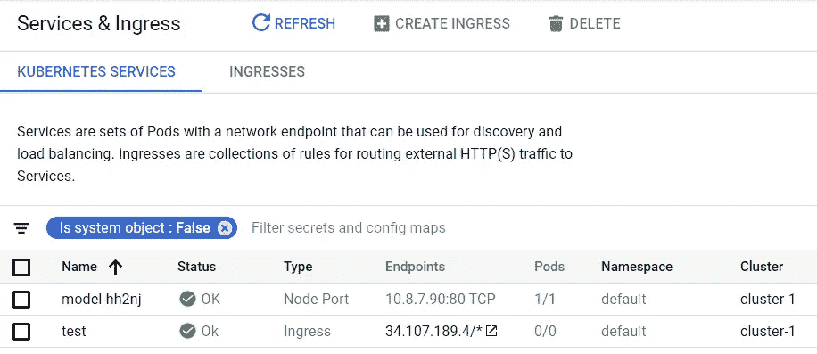
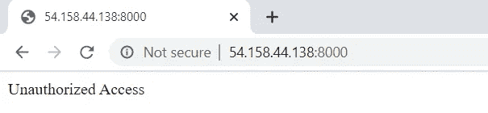
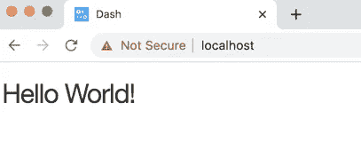
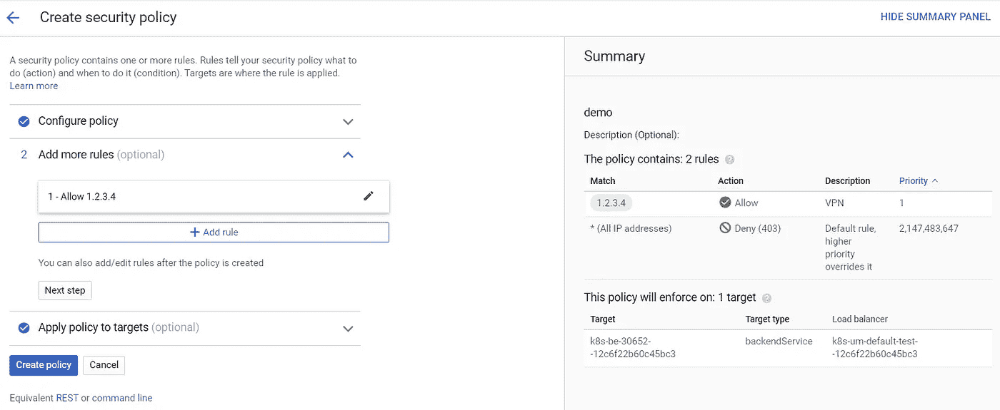

# 保护网络上的 ML 服务

> 原文：<https://towardsdatascience.com/securing-ml-services-on-the-web-69408e8554d0?source=collection_archive---------36----------------------->


来源:[https://pix abay . com/photos/vault-business-bank-vault-bank-1144249/](https://pixabay.com/photos/vault-business-bank-vault-bank-1144249/)

## HTTPS 和访问控制

如果您希望在 web 上托管机器学习服务，那么通常有必要锁定端点，以便对服务的调用是安全的，并且只有授权用户才能访问服务。为了确保敏感信息不会暴露在 web 上，我们可以使用安全的 HTTP (HTTPS)来加密客户端和服务之间的通信，并使用访问控制来限制谁可以访问端点。如果你在 2020 年建立一个机器学习服务，你应该计划为你的端点实现安全 HTTP 和访问控制。

本文将展示如何构建一个用 Flask 实现的安全端点来托管 scikit-learn 模型。我们将探索以下方法:

*   使 HTTPS 直接在烧瓶中
*   使用 WSGI 服务器(Gunicorn)
*   使用安全的负载平衡器(GCP)

我们将在 GCP 生态系统中使用 Docker 和 Kubernetes 托管服务。为了限制授权用户的访问，我们将探索以下服务访问控制方法:

*   基于令牌的身份验证(Flask)
*   OAuth 认证(破折号)
*   白名单

根据您的组织部署服务的方式，这些选项中的一些可能不可用，但获得锁定服务的各种不同方法的经验是很好的，通常使用多种方法锁定端点是个好主意。这篇文章是从托管用 Python 编写的 web 服务的角度来写的，并建立在我以前关于模型作为 web 端点的文章的基础上。

[](/models-as-web-endpoints-162cb928a9e6) [## 作为 Web 端点的模型

### 《生产中的数据科学》摘录

towardsdatascience.com](/models-as-web-endpoints-162cb928a9e6) 

# 烧瓶用 HTTPS

如果您计划在 web 上托管一个机器学习模型，那么您应该在项目早期考虑数据和结果的安全传输需求。Chrome 在 2018 年年中开始将 HTTP 网站标记为不安全，现在有很多工具可以使用 HTTPS 来保护模型端点。安全 HTTP 利用安全套接字层(SSL)来确保客户端和服务器之间的通信是加密的，并使用公钥基础设施(PKI)来确保客户端与其预定目标进行通信。本文主要关注第一个方面，客户端和服务器之间发送的流量是加密的。若要完全设置 HTTPS，您需要设置一个对应于您的端点 IP 地址的 DNS 条目，以便您可以创建一个签名证书，将您的端点标识为受信任的主机。一旦你设置了 DNS 入口，这一步对于谷歌云平台(GCP)来说是很简单的，但是管理一个网络域和 DNS 查询不在这篇文章的讨论范围之内。

一般来说，最好使用 Flask 以外的系统来保护端点，因为 Flask 不应该直接用作 web 应用程序。相反，最好使用 Gunicorn 或 Nginx 等工具在非安全的 Flask 应用程序上提供一个安全层。然而，有时候 Flask 应用程序，比如在 Flask 上用 Dash 构建的交互式 web 应用程序，需要提供端到端的安全连接。这就是像 [Flask Dance](https://flask-dance.readthedocs.io/en/latest/) 这样的库有用的地方。

首先，我们需要安装 Python 和相关库。对于本教程，我们将安装以下库来设置 Flask 端点、Dash 应用程序和客户端应用程序:

```
pip3 install --user pandas 
pip3 install --user scikit-learn
pip3 install --user flask
pip3 install --user Flask-HTTPAuth
pip3 install --user requests
pip3 install --user cryptography
pip3 install --user gunicorn
pip3 install --user dash
pip3 install --user flask_dance
pip3 install --user dash-google-auth
```

我们首先在 Flask 中构建一个预测建模端点，返回用户购买新游戏的倾向。模型的输入是一个特征向量，它描述了用户以前是否购买过小目录中的游戏。代码在我以前关于模型的帖子中有更详细的描述，名为 [web 端点](/models-as-web-endpoints-162cb928a9e6)。下面的代码片段显示了如何设置 Flask 端点，该端点首先训练一个 scikit-learn 模型，在“/”处设置一个端点来服务该模型，然后直接启动应用程序。

基本 HTTP Flask 应用程序。

在使用`python flask_html.py`运行应用程序之后，我们现在有了一个运行在端口 80 上的模型服务器应用程序。

```
* Serving Flask app "app" (lazy loading)
* Environment: production
* Debug mode: off
* Running on [http://0.0.0.0:80/](https://0.0.0.0:443/) (Press CTRL+C to quit)
```

我们还可以使用 Python 测试端点，如下面的代码片段所示:

用于通过 HTTP 调用模型端点的 Python 客户端。

运行客户端代码的结果是使用`requests`库通过不安全的 HTTP 调用模型端点，然后打印结果。我们希望达到同样的结果，但要让通话在 HTTPS 进行。要设置此协议，我们可以锁定 Flask 端点，使用 web 服务在 Flask 上提供一个安全层，或者使用负载平衡器来提供 HTTPS 功能，同时仍然在虚拟私有云(VPC)中使用 HTTP。

**直接使用 Flask** 使用 Flask 应用程序启用安全 HTTP 的第一种方法是在 Flask 中建立安全连接。这不是推荐的方法，因为在生产环境中直接使用 Flask 不是最佳实践，而是应该使用诸如 Gunicorn 之类的 WSGI 服务器来包装 Flask 应用程序。但是如果您想在开发期间锁定服务，那么这种方法可能是合适的。在 Flask 端，从 HTTP 到 HTTPS 的更改只需要更改一行，这是前面 Flask 代码片段中的最后一行。

```
app.run(host='0.0.0.0', port=443, ssl_context='adhoc')
```

我们修改了应用程序，使其运行在端口 443 上，这是 HTTPS 的默认端口，而不是 HTTP 的默认端口 80。此外，我们还设置了一个 SSL 上下文，它告诉 Flask 使用 SSL 来提供安全连接。`adhoc`参数告诉 Flask 动态生成未签名的凭证，而不是将已签名或未签名的凭证传递给服务器。当您运行更新后的示例时，您会看到服务的端口和协议都发生了变化，如下所示。

```
* Serving Flask app "app" (lazy loading)
* Environment: production
* Debug mode: off
* Running on [https://0.0.0.0:443/](https://0.0.0.0:443/) (Press CTRL+C to quit)
```

该服务现在使用 SSL 来提供客户端和服务器之间的安全连接，但是使用`adhoc`设置意味着证书的来源没有经过可信机构的验证。为了创建正确签名的证书，我们需要将模型托管在一个命名的 URL 上，比如`[https://cat-classifier.ml.com](https://cat-classifier.ml.com)`，而不仅仅是一个 IP 地址，比如`[https://10.0.0.1](https://10.0.0.1)`。如果您能够设置一个 DNS 条目来将您的 IP 地址映射到一个命名的 URL，那么您可以使用一个[认证机构](https://en.wikipedia.org/wiki/Certificate_authority)来创建正确的凭证。与此同时，我们将继续使用`adhoc`方法，这意味着当您试图使用 Google Chrome 查看模型端点时，会得到以下警告。



使用临时凭据会导致未签名的证书。

此外，如果您修改前面的客户端示例，使用 HTTPS 代替 HTTP，您将得到下面的警告。

```
requests.exceptions.SSLError: HTTPSConnectionPool(host='localhost', port=443): Max retries exceeded with url: / (Caused by SSLError(SSLCertVerificationError(1, '[SSL: CERTIFICATE_VERIFY_FAILED] certificate verify failed: self signed certificate (_ssl.c:1076)')))
```

我们现在有了作为安全端点运行的模型，但不是可信端点。为了创建受信任的端点，我们需要一个签名证书来验证发送到端点的流量实际上对应于模型端点，并且不能被冒充我们的服务的第三方截获。我们不会在本文中涉及这方面的内容，但是我们将在下一节中展示如何设置自签名证书。

**使用 WSGI 服务器** 与其直接运行 Flask 应用，不如在将模型服务应用部署到生产时，使用可扩展的 web 服务器框架，如 Gunicorn 或 Nginx。要修改我们的应用程序以使用 Gunicorn，我们首先需要创建一个自签名证书，该证书可用于建立安全连接。下面显示的命令显示了如何使用 Gunicorn 在 HTTPS 上提供 Flask 应用程序。

```
openssl req -x509 -newkey rsa:4096 -nodes -out cert.pem 
            -keyout key.pem -days 365 gunicorn --certfile cert.pem --keyfile key.pem 
         -b 0.0.0.0:443 flask_http:app
```

结果与上一节类似，现在我们有了一个受不可信模型保护的端点。这两个例子的主要区别在于 Gunicorn 方法可以处理更大的流量。

**使用负载均衡器** 还有第三种方法可以用来建立安全的 flask 应用程序，即构建一个 Flask 应用程序，它使用 HTTP 来服务请求，但是将这个服务包装在一个私有集群中。这种方法是安全的，但是不使用端到端加密。一旦流量被路由到私有集群，云内的机器之间就会使用不安全的连接，这些机器通常没有公共 IP 地址。实现这种设置的一种方法是使用 Google Kubernetes 引擎(GKE)来托管您的容器化 Flask 应用程序，并使用节点端口和入口来设置 HTTPS 安全负载平衡器。结果是，从客户端到服务器的流量将被加密到入口端点，并且从该端点到容器将在内部使用 HTTP。同样，这种方法导致了一种安全但不可信的方法。然而，如果您的端点有一个 DNS 条目，那么使用 Google 管理的 SSL 证书创建一个合适的证书是很简单的。

这一部分专门针对 GCP，但是这种方法应该适用于其他 Kubernetes 环境。下面是一般的方法:

1.  使用 Docker 将您的应用程序容器化
2.  在没有公共 IP 的 Kubernetes 集群中托管容器
3.  使用节点端口服务类型在 VPC 中公开服务
4.  使用启用了 HTTPS 的服务入口启用外部连接

要设置 GCP 帐户、创建凭证并启用这种方法所需的容器注册和 GKE 服务，需要遵循许多步骤。在我之前关于在 GCP 建立模型服务的文章中提供了更多的细节。我将在这篇文章中介绍的主要区别是使用节点端口加入口设置(*第 7 层*)与使用负载平衡器作为 TCP 端点来直接公开服务(*第 4 层*)。

[](/devops-for-data-science-with-gcp-3e6b5c3dd4f6) [## 与 GCP 合作开发数据科学

### 为模型服务部署生产级容器

towardsdatascience.com](/devops-for-data-science-with-gcp-3e6b5c3dd4f6) 

第一步是将端点设置为 Docker 应用程序。为了实现这一结果，我们需要创建一个 docker 文件来设置 Python 生态系统，安装所需的库，并定义要运行的应用程序。我们将使用 Gunicorn 来包装 Flask 应用程序，并通过 HTTP 托管这个端点，如下面的 *Dockerfile* 所示:

```
FROM ubuntu:latest
MAINTAINER Ben WeberRUN apt-get update \
  && apt-get install -y python3-pip python3-dev \
  && cd /usr/local/bin \
  && ln -s /usr/bin/python3 pythonRUN pip3 install flask
RUN pip3 install pandas
RUN pip3 install gunicorn
RUN pip3 install scikit-learnCOPY app.py app.pyENTRYPOINT ["gunicorn", "--bind", "0.0.0.0:80", "app:app"]
```

接下来，我们将构建容器，然后在将容器推送到注册中心之前在本地测试容器。

```
sudo docker image build -t "model_service" .
sudo docker images
sudo docker run -it -p 80:80 model_service
```

要将容器推送到 Google Container Registry，我们首先需要在推容器之前执行`docker login`。关于设置这些证书的细节，请参见我之前在 GKE 的[模特服务上的帖子。执行完这些步骤后，我们将在 GCP 上有一个可用的容器，我们可以用它在 GKE 部署服务。](/models-as-web-endpoints-162cb928a9e6)

将图像推送到 Google 容器注册表。

将容器推送到 GCP 后，我们将启动一个 GKE 集群，并将容器部署为一个工作负载。一旦您设置了一组 pod 并运行服务，您就可以通过首先设置节点端口服务类型来安全地公开服务，如下图所示。



在 VPC 中公开模型服务。

下一步是为服务创建一个入口，将端点暴露给开放的 web，而不仅仅是在您的 VPC 中。要设置入口，请浏览至服务和入口选项卡，选择您刚刚创建的节点端口，然后选择“创建入口”。



从节点端口创建入口。

从这一步开始，我们可以设置一个具有 HTTP 和 HTTPS 端点的负载平衡器。如果要禁用模型服务的非安全流量，可设置仅 HTTPS 端点。如果选择 HTTPS 选项，则需要指定要使用的证书。您可以暂时假装这一步，选择使用 Google 管理的证书并选择任何域。结果将是一个无效的证书，但是您将能够测试设置一个支持 HTTPS 的负载平衡器。



使用 GCP 负载平衡设置 HTTPS 端点。

结果将是一个 HTTPS 端点，您现在可以在“服务和入口”选项卡中查看。模型服务现在在`[https://34.107.189.4](https://34.107.189.4)`运行，但是端点不是受信任的 URL。



由此产生的 HTTPS 端点。

我们现在已经探索了将 Flask 应用程序设置为安全端点的三个选项。虽然使用的方法会根据您的云平台和组织偏好而有所不同，但是使用安全 web 服务包装 Flask 应用程序的第二种方法可能是最合适的方法。

# 烧瓶的访问控制

我们已经讨论了锁定模型服务的第一个方面，即确保客户端和服务器之间发送的流量是加密的。下一步是使用访问控制工具来限制谁可以访问该工具。加密可确保第三方无法监听主机之间的流量，而访问控制可确保未授权方无法访问该服务。如果您在公司网络中工作，那么一种可能已经存在的访问控制形式是仅限于 VPN 的访问。我们不会在这篇文章中讨论这种方法，因为 VPN 的设置可能非常复杂，并且在不同的组织中差异很大。相反，我们将通过令牌、OAuth 和白名单来探索访问控制。

本文没有涉及的另一种访问控制方法是使用 web 服务层，例如 Nginx，在将流量转发到 Flask 应用程序之前进行用户授权。这种方法非常适合数据科学团队，因为它实现了关注点的分离，数据科学团队建立模型服务容器，DevOps 团队管理对端点的访问。对于成熟的组织来说，这是一个很好的方法，但对于负责端到端模型部署的数据科学团队来说，这可能不可行。

**基于令牌的认证** 启动并运行锁定端点的最简单方法是拥有一个公共秘密，客户端可以使用该秘密向模型服务进行认证。在最简单的情况下，这意味着拥有单一的共享密码，客户端可以使用该密码来建立对资源的访问。这种方法以及大多数访问控制方法只有在使用安全连接与模型服务进行通信时才有效。一般来说，如果没有安全的通信协议，您就不能拥有有效的访问控制。下一步是为不同的用户提供不同的访问令牌或密码，并为不同的角色提供不同的访问级别。

我们将使用令牌方法开始，因为密码管理是一个庞大的主题，我无法在一篇简短的帖子中对其进行公正的讨论。事实上，我建议不要使用任何直接的密码管理，而应该使用 OAuth 之类的协议，这将在下一节中讨论。我们将浏览的示例使用单个令牌进行访问，但是可以扩展到使用一组令牌。理想情况下，您应该有一个工具来生成令牌，存储关于用户和角色的元数据，并能够拒绝令牌或使令牌过期。对于这个简单的例子，我们将使用 [Flask-HTTPAuth](https://flask-httpauth.readthedocs.io/en/latest/) ，它提供令牌和摘要认证。

向 Flask 应用程序添加令牌认证只需要几个步骤。我们需要使用`@auth.login_required` 注释来识别哪些路由是安全的，并实现一个`verify_token`函数来认证客户端。在这种情况下，我们检查来自用户 *(1234567890abcdefg* )的已知令牌。对于生产系统，通常将令牌存储在数据库中，并将令牌映射到不同的访问策略。

用固定令牌保护 Flask 应用程序。

现在我们已经锁定了端点，当客户端试图在没有令牌的情况下访问端点时，将被拒绝访问，如下所示。



尝试在没有令牌的情况下访问模型服务。

要访问模型服务，我们需要更新客户机请求示例，以便在请求头中提供令牌。下面的代码片段显示了如何更新请求，将令牌添加到请求中的`headers`参数。现在，结果应该与第一个示例相同，但是我们现在已经使用令牌将模型服务锁定到客户端。

使用用于访问的令牌调用模型端点。

在与第三方合作时，令牌方法非常有用，因为您可以允许大量用户进行访问。但是，这种方法不如使用 OAuth 之类的协议安全，OAuth 可以用来限制对一组指定用户的访问。

**OAuth 认证** 令牌对于模型端点很有用，因为您可能需要提供预测，而不需要客户端通过 web UI 登录。但是如果你的目标应用是一个交互式应用，而不是模型预测，那么 Dash 这样的工具会非常有用。我喜欢用 Dash 来构建 web 应用程序，因为我可以用 Python 编写 web 应用程序，并使用 OAuth 等安全特性来验证用户。使用 OAuth，您可以将身份验证委托给已知的提供者，比如 Google 来建立用户的身份。您仍然定义可以访问您的应用程序的用户列表，但是您依赖可信的提供者来完成确保身份的复杂工作。

下面的例子展示了如何使用 Google Oauth 2.0 来锁定 Dash 应用程序。Dash 是建立在 Flask 之上的框架，本例中使用的 Flask Dance 库可以应用于所有 Flask 应用程序。为了让这个例子工作，您需要在 [GCP](https://cloud.google.com/docs/authentication) 中配置一个 OAuth 规则。

用 OAuth 2.0 保护的 Dash 应用程序示例。

这种方法的结果是，当您试图访问模型服务端点时，您将得到一个登录页面。如果您提供了凭据并且在允许的用户列表中，您将获得以下内容:



该应用程序服务于授权用户。

使用 OAuth 的主要好处是第三方负责建立用户的身份，这是一个标准协议。如果您正在设置一个基于 GUI 的 web 服务，这是一个很好的方法。

第三种实施访问控制的方式是限制哪些机器可以访问服务。这种方法被称为白名单，因为只有授权 IP 地址列表上的机器才被授权使用该服务。这种方法不验证发出调用的客户端的身份，但是锁定了对少量机器的访问。这种方法对于 VPN 设置很有用，在 VPN 设置中，到 VPN 的连接是安全的，流量通过带有静态地址的 VPN 传输。这对于需要与已知 IP 地址的第三方服务交互的模型端点也很有用。

如果您使用 GKE 服务入口方法来设置负载平衡的 HTTPS 端点，那么您可以使用 GCP 云盔甲来设置白名单规则。所有不允许访问服务的传入流量都将返回 403 响应代码(禁止)。要为负载平衡器设置白名单，请在 GCP 控制台中浏览到 Cloud Armor，然后单击“创建策略”。您可以配置一组阻止的 IP 和允许的 IP。在下面的示例中，默认情况下所有流量都被阻止，优先级更高的第二个规则允许来自 IP `1.2.3.4`的访问。设置好 IP 规则后，我们可以使用*目标*部分将这个新策略应用到模型服务负载平衡器。



将单个 IP(1.2.3.4)加入 GCP 云防护的白名单

这种方法的结果是，来自指定 IP 地址的流量将被允许，所有其他流量将得到*禁止*响应。这种方法不直接对用户进行身份验证，而是依赖于来自已知静态 IP 地址的流量。这类似于在 AWS 上配置 EC2 安全组时设置入站流量规则。

# 结论

如果您计划建立将在 web 上提供的机器学习模型，那么您应该从项目一开始就计划安全性和访问控制。虽然通常使用包装数据科学团队建立的服务功能的工具来提供安全措施，但是任何发布服务的团队都应该确保 web 服务是安全的，并且仅限于授权用户。

本·韦伯是 Zynga 杰出的数据科学家。我们正在[招聘](https://www.zynga.com/job-listing-category/data-analytics-user-research/)！

***注来自《走向数据科学》的编辑:*** *虽然我们允许独立作者根据我们的* [*规则和指导方针*](/questions-96667b06af5) *发表文章，但我们不认可每个作者的贡献。你不应该在没有寻求专业建议的情况下依赖一个作者的作品。详见我们的* [*读者术语*](/readers-terms-b5d780a700a4) *。*