# 分割和对象检测—第 1 部分

> 原文：<https://towardsdatascience.com/segmentation-and-object-detection-part-1-b8ef6f101547?source=collection_archive---------16----------------------->

## [FAU 讲座笔记](https://towardsdatascience.com/tagged/fau-lecture-notes)关于深度学习

## 细分基础

FAU 大学的深度学习。下图 [CC BY 4.0](https://creativecommons.org/licenses/by/4.0/) 来自[深度学习讲座](https://www.youtube.com/watch?v=p-_Stl0t3kU&list=PLpOGQvPCDQzvgpD3S0vTy7bJe2pf_yJFj&index=1)

**这些是 FAU 的 YouTube 讲座** [**深度学习**](https://www.youtube.com/watch?v=p-_Stl0t3kU&list=PLpOGQvPCDQzvgpD3S0vTy7bJe2pf_yJFj&index=1) **的讲义。这是与幻灯片匹配的讲座视频&的完整抄本。我们希望，你喜欢这个视频一样多。当然，这份抄本是用深度学习技术在很大程度上自动创建的，只进行了少量的手动修改。** [**自己试试吧！如果您发现错误，请告诉我们！**](http://autoblog.tf.fau.de/)

# 航行

[**上一讲**](/unsupervised-learning-part-5-f8809d7f1f90) **/** [**观看本视频**](https://youtu.be/CG7UJIEl7KI) **/** [**顶级**](/all-you-want-to-know-about-deep-learning-8d68dcffc258)/[**下一讲**](/segmentation-and-object-detection-part-2-a334b91255f1)

欢迎回到深度学习！所以今天，我们想讨论几个更面向应用的话题。我们希望研究图像处理，特别是分割和对象检测。

道路场景中的语义分割。使用 [gifify](https://github.com/vvo/gifify) 创建的图像。来源: [YouTube](https://youtu.be/qWl9idsCuLQ)

让我们看看我为你准备了什么。下面是接下来五个视频的大纲:我们首先介绍话题，当然。然后，我们再来讲细分。因此，我们将激发它并讨论细分的问题所在。接下来，我们将介绍几种可以实现良好图像分割的技术。你会发现实际上有一些非常有趣的方法，它们非常强大，可以应用于各种各样的任务。在此之后，我们想继续谈论对象检测。所以，这是一种相关的话题。对于对象检测，我们希望研究如何在场景中找到对象以及如何实际识别哪个对象属于哪个类的不同方法。所以，我们先从介绍开始。

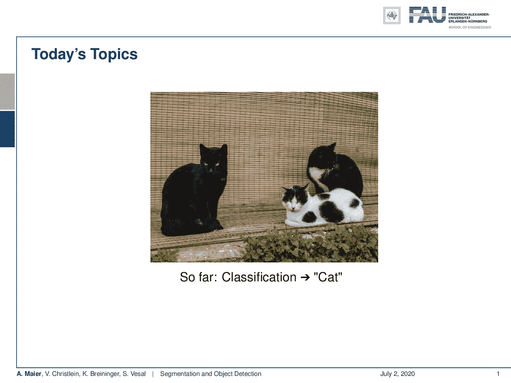

分割、对象检测和实例分割。 [CC 下的图片来自](https://creativecommons.org/licenses/by/4.0/)[深度学习讲座](https://www.youtube.com/watch?v=p-_Stl0t3kU&list=PLpOGQvPCDQzvgpD3S0vTy7bJe2pf_yJFj&index=1)的 4.0 。

到目前为止，我们研究了图像分类。从本质上讲，你可以看到问题在于你只是简单地进行了分类，但是你不能从物体之间的空间关系中得到任何信息。一个改进是图像分割。所以在语义分割中，你试图找到图像中每个像素的类别。在这里，你可以看到我们用红色标记了所有属于“猫”类的像素。现在，如果我们想讨论对象检测，我们必须研究一个稍微不同的方向。因此，这里的想法是基本上识别感兴趣对象所在的区域。你可以在这里看到，如果我们使用，例如，我们在可视化中学到的方法，我们可能不会很高兴，因为我们只会识别与该类相关的像素。所以，这必须以不同的方式完成，因为我们实际上对寻找不同的实例感兴趣。所以我们希望能够在一张图片中找出不同的猫，然后找到包围盒。因此，这实质上是对象检测和实例识别的任务。最后，当我们掌握了这两个概念后，我们还想谈谈实例分割的问题。在这里，不仅仅是你找到所有显示猫的像素，而是你实际上想要区分不同的猫，并将分割分配给不同的实例。这就是实例分割，它将出现在关于这些主题的最后一个视频中。

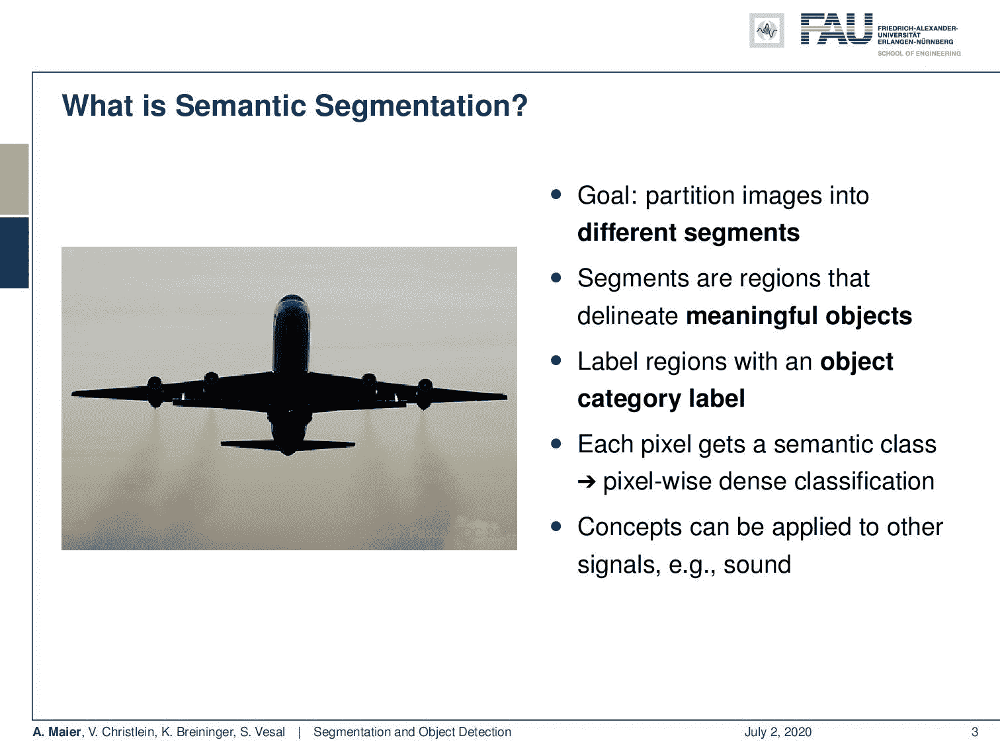

在这个例子中，图像分割试图找到与图像中的计划相关联的所有像素。 [CC 下的图片来自](https://creativecommons.org/licenses/by/4.0/)[深度学习讲座](https://www.youtube.com/watch?v=p-_Stl0t3kU&list=PLpOGQvPCDQzvgpD3S0vTy7bJe2pf_yJFj&index=1)的 4.0 。

所以，让我们继续谈一谈关于图像分割的想法。现在在图像分割中，我们想要准确地找到哪些像素属于那个特定的类。我们想从本质上描绘有意义的物体的边界。因此，在边界内的所有这些区域应该具有相同的标签，并且它们属于相同的类别。因此，每个像素都有一个语义类，我们希望生成像素级的密集标签。这些概念，当然，在这里显示在图像上，但从技术上讲，你也可以在声音上做类似的事情，例如，当你看光谱图时。图像的概念是，我们想把左边的图像变成右边的图像。你可以看到，我们找到了由飞机标识的区域，我们找到了边界。

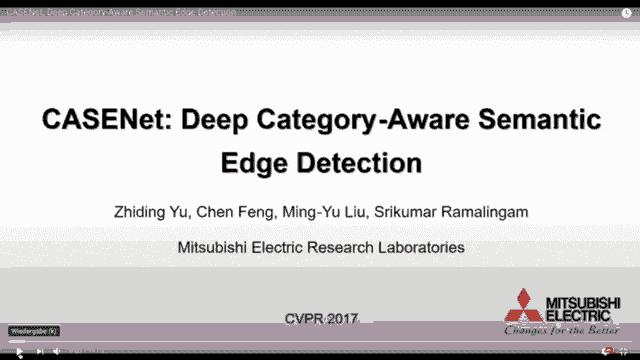

语义边缘分割直接找到语义类的边界。使用 [gifify](https://github.com/vvo/gifify) 创建的图像。来源: [YouTube](https://youtu.be/BNE1hAP6Qho)

当然，这是一个更简单的任务。在这里，你也可以考虑更复杂的场景，比如这个自动驾驶的例子。在这里，我们感兴趣的是街道在哪里，人在哪里，行人在哪里，车辆在哪里，等等。我们想在这个复杂的场景中标记它们。

分段的应用。 [CC 下的图片来自](https://creativecommons.org/licenses/by/4.0/)[深度学习讲座](https://www.youtube.com/watch?v=p-_Stl0t3kU&list=PLpOGQvPCDQzvgpD3S0vTy7bJe2pf_yJFj&index=1)的 4.0 。

类似的任务也可以用于医学成像。例如，如果你对不同器官的识别感兴趣，比如肝脏在哪里，血管在哪里，或者细胞在哪里。所以，当然，还有很多很多的应用我们不会在这里讨论。如果你处理卫星图像，当然还有航拍图像，自动机器人，还有图像编辑，你可以展示这些技术非常有用的特性。

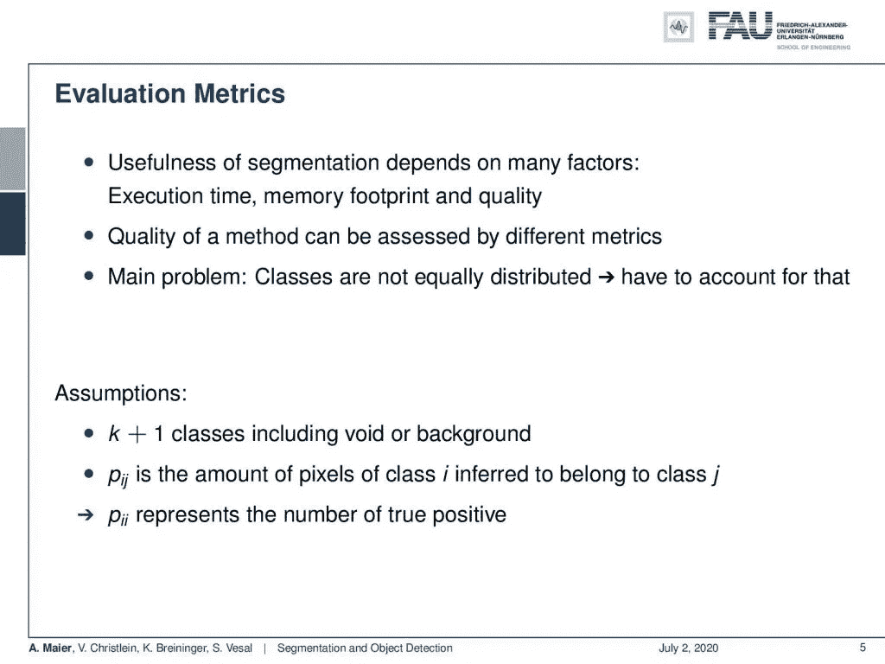

图像分割的评价指标。 [CC 下的图片来自](https://creativecommons.org/licenses/by/4.0/)[深度学习讲座](https://www.youtube.com/watch?v=p-_Stl0t3kU&list=PLpOGQvPCDQzvgpD3S0vTy7bJe2pf_yJFj&index=1)的 4.0 。

当然，如果我们想这样做，我们需要谈一谈评估指标。我们必须以某种方式来衡量分割算法的有用性。这取决于几个因素，如执行时间、内存占用和质量。一个方法的质量，我们需要用不同的度量来评估。这里的主要问题是，这些类通常不是平均分布的。因此，我们必须以某种方式解释这一点。我们可以通过增加背景类的数量来做到这一点。然后，我们可以确定，例如，类别 I 的像素被推断为属于类别 j 的概率。例如，p 下标 I，I 将表示真阳性的数量。

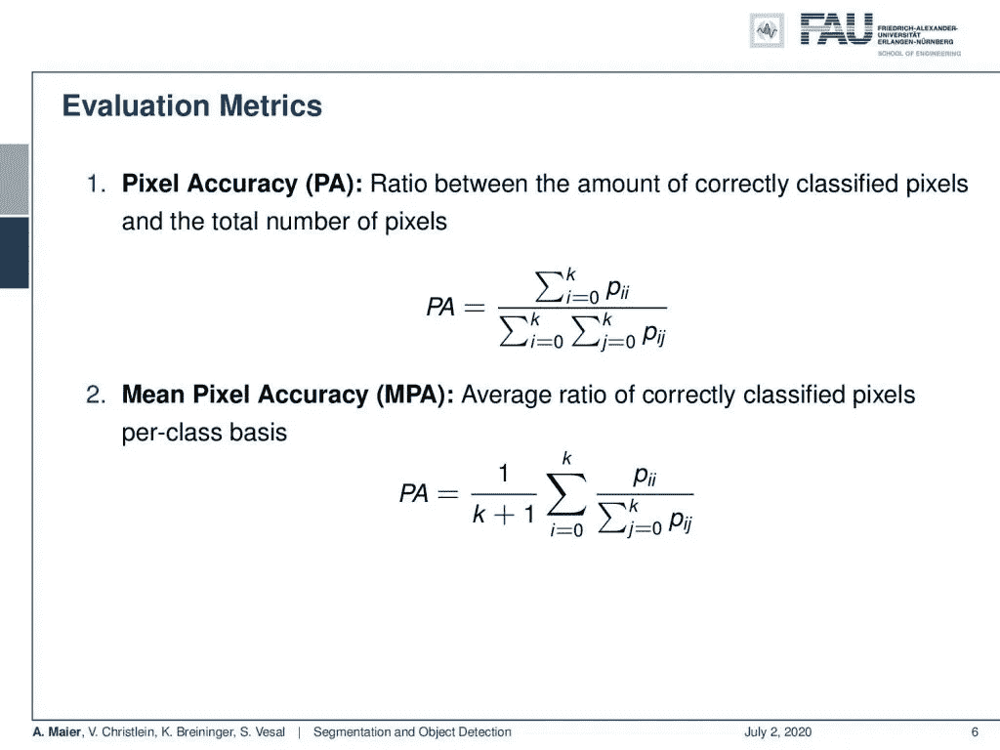

两个流行的评估指标。来自[深度学习讲座](https://www.youtube.com/watch?v=p-_Stl0t3kU&list=PLpOGQvPCDQzvgpD3S0vTy7bJe2pf_yJFj&index=1)的 [CC BY 4.0](https://creativecommons.org/licenses/by/4.0/) 下的图片。

这就引出了几个度量标准，例如，像素精度，即正确分类的像素数量与像素总数之间的比率，以及平均像素精度，即每类基础上正确分类的像素的平均比率。

两个更受欢迎的指标。 [CC 下的图片来自](https://creativecommons.org/licenses/by/4.0/)[深度学习讲座](https://www.youtube.com/watch?v=p-_Stl0t3kU&list=PLpOGQvPCDQzvgpD3S0vTy7bJe2pf_yJFj&index=1)的 4.0 。

实际上，评估分割更常见的是平均交集/并集，即两个集合的交集和并集之间的比率，以及一个并集的频率加权交集，这是一个平衡版本，其中还将类频率纳入该度量。因此，有了这些衡量标准，我们就可以知道什么是好的细分。

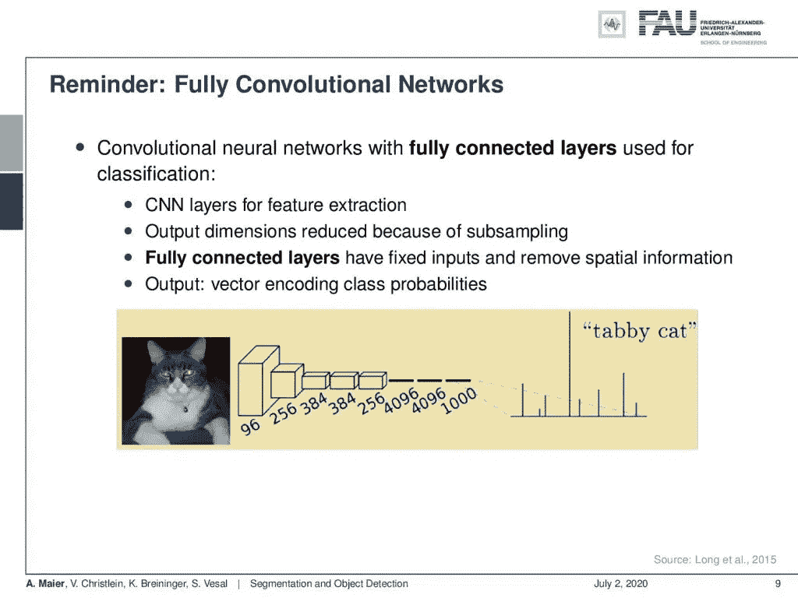

我们可以重用分类网络进行图像分割吗？来自[深度学习讲座](https://www.youtube.com/watch?v=p-_Stl0t3kU&list=PLpOGQvPCDQzvgpD3S0vTy7bJe2pf_yJFj&index=1)的 4.0CC 下的图片。

然后，我们继续，当然，我们遵循使用完全卷积网络进行分段的思想。到目前为止，如果我们一直使用全卷积网络，我们基本上有一个高维输入——图像——然后我们使用这个 CNN 进行特征提取。然后，输出实际上是不同类别的分布。因此，我们基本上有了一个编码类别概率的向量。

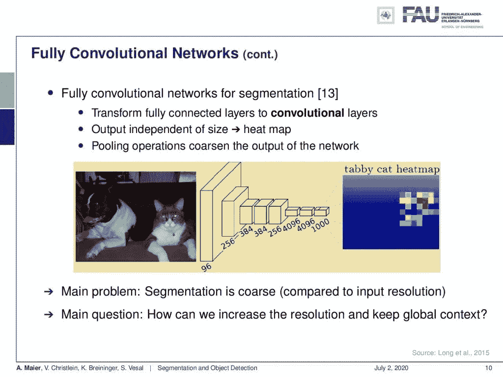

传统的全卷积网络只允许很差的空间分辨率。 [CC 下的图片来自](https://creativecommons.org/licenses/by/4.0/)[深度学习讲座](https://www.youtube.com/watch?v=p-_Stl0t3kU&list=PLpOGQvPCDQzvgpD3S0vTy7bJe2pf_yJFj&index=1)的 4.0 。

所以，你也可以把它转换成一个完全卷积的神经网络，然后从本质上解析整个图像，并把它转换成热图。所以，当我们谈到不同的激活时，我们已经在可视化中看到了类似的想法。我们基本上也可以遵循这条解释线，然后我们会得到一个非常低维非常粗糙的“虎斑猫”类的热图。当然，这是一种可行的方法，但是您无法非常详细地识别属于该特定类的所有像素。因此，你必须做的是，以某种方式将分割或类别信息恢复到原始图像分辨率。

编码器-解码器网络似乎有希望用于图像分割。编码器分支本质上是对类进行编码。来自[深度学习讲座](https://www.youtube.com/watch?v=p-_Stl0t3kU&list=PLpOGQvPCDQzvgpD3S0vTy7bJe2pf_yJFj&index=1)的 [CC BY 4.0](https://creativecommons.org/licenses/by/4.0/) 下的图片。

在这里，关键的想法是不只是使用 CNN 作为编码器，但你也可以使用解码器。因此，我们最终得到一个类似 CNN 的结构，你甚至可以说是沙漏，其中有一个编码器和一个解码器，再次进行上采样。顺便说一下，这不是一个自动编码器，因为输入是图像，但输出是分段掩码。网络的编码器部分本质上是一个 CNN，这与我们已经谈论了很多的技术非常相似。

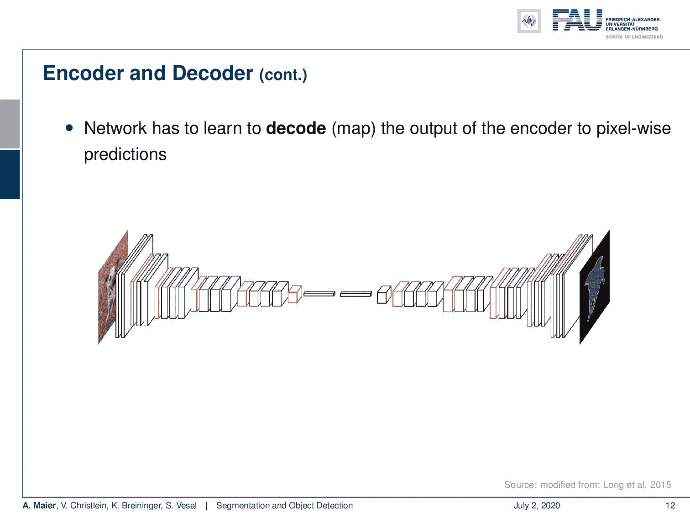

解码器分支将分类结果提升回原始图像分辨率。 [CC 下的图片来自](https://creativecommons.org/licenses/by/4.0/)[深度学习讲座](https://www.youtube.com/watch?v=p-_Stl0t3kU&list=PLpOGQvPCDQzvgpD3S0vTy7bJe2pf_yJFj&index=1)的 4.0 。

所以，另一方面，我们需要一个解码器。该解码器然后被用于再次对信息进行上采样。实际上有几种方法可以做到这一点。早期的一个是 Long 等人的全卷积网络[13]。还有 SegNet [1]，我认为最流行的是 U-net [21]。这也是我暗示过的有很多参考文献的论文。所以，U-net 真的很受欢迎，你可以看到你可以每天查看引用计数。

为了再次提高分辨率，我们需要上采样技术。 [CC 下的图片来自](https://creativecommons.org/licenses/by/4.0/)[深度学习讲座](https://www.youtube.com/watch?v=p-_Stl0t3kU&list=PLpOGQvPCDQzvgpD3S0vTy7bJe2pf_yJFj&index=1)的 4.0 。

好吧，让我们讨论一下我们该怎么做。主要问题是上采样部分。所以在这里，我们希望有一个解码器，以某种方式创建一个像素预测。可能有不同的选项，例如，取消轮询。你也可以转置卷积，这实际上不是使用池的概念，而是使用卷积的概念，而是转置，从而提高分辨率，而不是进行二次采样。

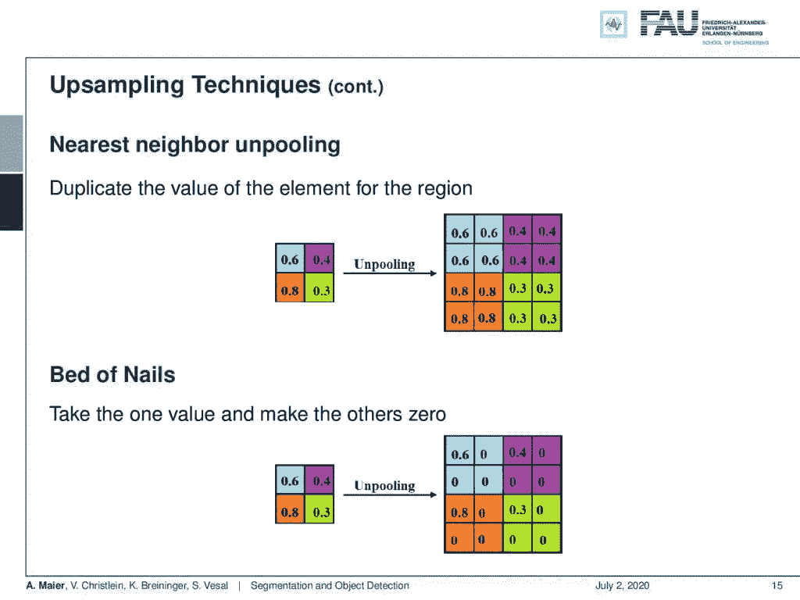

最近邻和甲床上采样。来自[深度学习讲座](https://www.youtube.com/watch?v=p-_Stl0t3kU&list=PLpOGQvPCDQzvgpD3S0vTy7bJe2pf_yJFj&index=1)的 [CC BY 4.0](https://creativecommons.org/licenses/by/4.0/) 下的图片。

那么，让我们更详细地看看这些上采样技术。当然，您可以做一些类似最近邻插值的事情。在那里，你只需简单地获取低分辨率信息，然后通过获取最近的邻居来解除轮询。有一个钉床，它只接受一个值，你只需要把它放在其中一个位置。所以，剩下的图像看起来像一床钉子。这里的想法是，当然，你只是把信息放在你知道它属于的位置。然后，剩余的缺失条目应该由一个可学习的部分来填充，然后在网络的后续步骤中引入该可学习的部分。

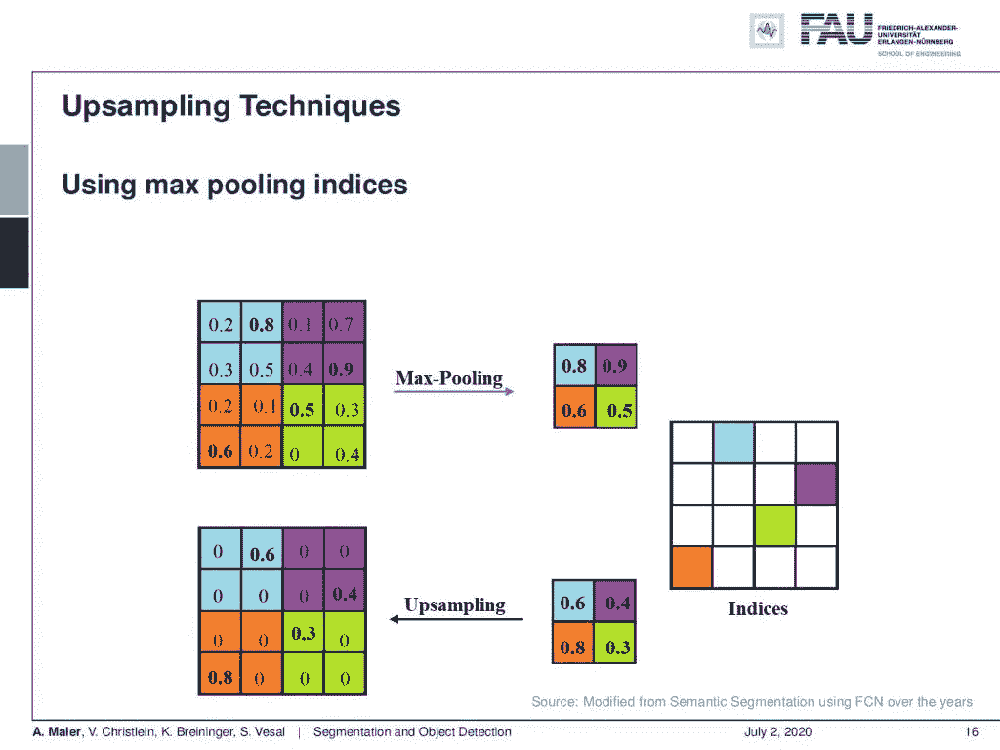

记住池索引是使用上下文信息的一种方式。 [CC 下的图片来自](https://creativecommons.org/licenses/by/4.0/)[深度学习讲座](https://www.youtube.com/watch?v=p-_Stl0t3kU&list=PLpOGQvPCDQzvgpD3S0vTy7bJe2pf_yJFj&index=1)的 4.0 。

另一种方法是使用最大汇集指数。因此，这里的想法是，在编码器路径中，执行最大池化，并保存池化实际发生位置的索引。然后，您可以在上采样步骤中再次获取该信息，并在最大值出现的位置准确写入该信息。这非常类似于最大池的反向传播步骤。

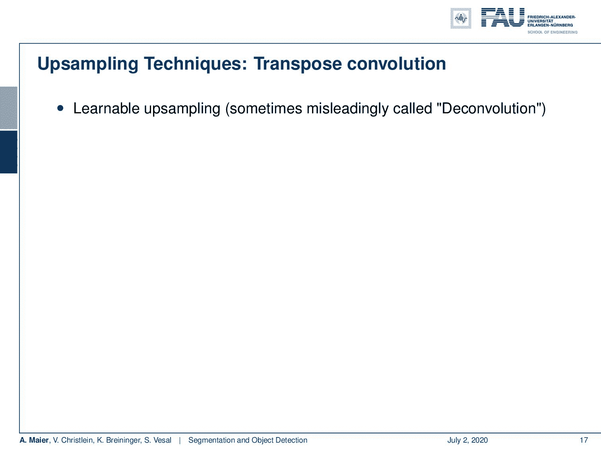

转置卷积允许可训练的上采样。 [CC 下的图片来自](https://creativecommons.org/licenses/by/4.0/)[深度学习讲座](https://www.youtube.com/watch?v=p-_Stl0t3kU&list=PLpOGQvPCDQzvgpD3S0vTy7bJe2pf_yJFj&index=1)的 4.0 。

当然，也有像转置卷积这样可以学习的技术。在这里，您将学习上采样，有时也称为去卷积。实际上，对于输入中的每一个像素，滤波器会在输出中移动两个像素。您可以使用步幅控制更高的上采样。让我们看看这个例子。我们有一个单独的像素，然后被取消。在这里，你产生这个 3 x 3 转置卷积。我们用两个步幅展示它。然后，我们移动到下一个像素，你可以看到一个重叠区域出现在这种情况下。在那里，你必须对这个重叠区域做些什么。例如，您可以简单地将它们相加，并希望在随后的处理中，您的网络学会如何处理上采样步骤中的这种不一致性。

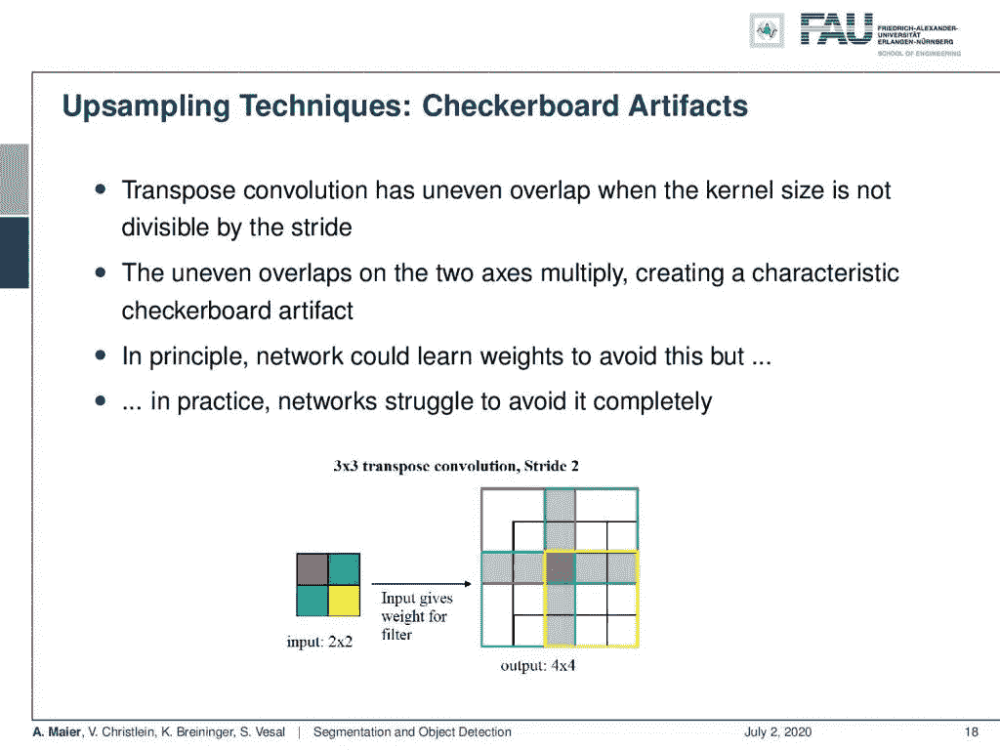

最好避免重叠配置。来自[深度学习讲座](https://www.youtube.com/watch?v=p-_Stl0t3kU&list=PLpOGQvPCDQzvgpD3S0vTy7bJe2pf_yJFj&index=1)的 [CC BY 4.0](https://creativecommons.org/licenses/by/4.0/) 下的图片。

在本例中，我们可以继续对其他两个像素执行此操作。然后，你看到我们有这个十字形区域。因此，当内核大小不能被步幅整除时，转置卷积会导致不均匀的重叠。这些轴上不均匀的重叠成倍增加，他们创造了这个典型的棋盘格人工制品。原则上，如前所述，您应该能够学习如何在后续层中再次移除那些工件。在实践中，它会导致冲突，我们建议完全避免它。

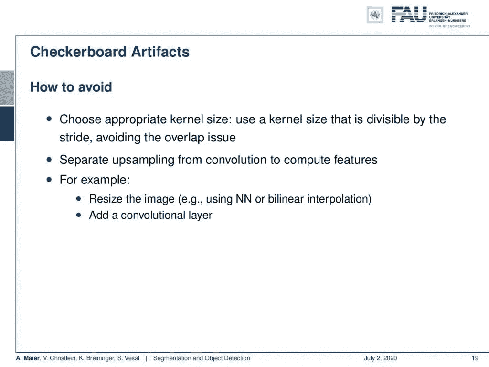

避免棋盘状伪影的策略。 [CC 下的图片来自](https://creativecommons.org/licenses/by/4.0/)[深度学习讲座](https://www.youtube.com/watch?v=p-_Stl0t3kU&list=PLpOGQvPCDQzvgpD3S0vTy7bJe2pf_yJFj&index=1)的 4.0 。

那么，如何避免这种情况呢？嗯，你选择一个合适的内核大小。您选择内核大小的方式是它可以被步幅整除。然后，您还可以从卷积中进行单独的上采样来计算特征。例如，您可以使用神经网络或线性插值来调整图像的大小。然后，添加一个卷积层。所以，这是一种典型的方法。

在这个深度学习讲座中，更多令人兴奋的事情即将到来。 [CC 下的图片来自](https://creativecommons.org/licenses/by/4.0/)[深度学习讲座](https://www.youtube.com/watch?v=p-_Stl0t3kU&list=PLpOGQvPCDQzvgpD3S0vTy7bJe2pf_yJFj&index=1)的 4.0 。

好吧。到目前为止，我们已经了解了执行图像分割所需的所有基本步骤。实际上，在下一个视频中，我们将讨论如何集成编码器和解码器，以获得良好的分段蒙版。我可能已经告诉你了，有一个你必须要做的特殊技巧。如果不使用这一招，很可能得不到很好的分割结果。所以，请继续关注下一个视频，因为在那里你会看到你如何做好细分。您将了解这些高级分段技术的所有细节。非常感谢大家的收听，下期视频再见。拜拜。

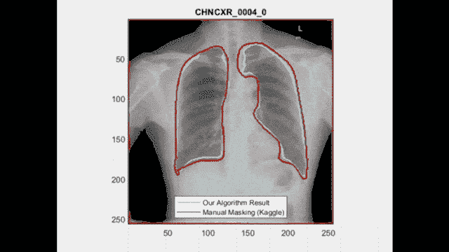

胸部 x 光的分割结果。使用 [gifify](https://github.com/vvo/gifify) 创建的图像。来源: [YouTube](https://youtu.be/v1eWWrswu6M)

如果你喜欢这篇文章，你可以在这里找到更多的文章，或者看看我们的讲座。如果你想在未来了解更多的文章、视频和研究，我也会很感激关注 [YouTube](https://www.youtube.com/c/AndreasMaierTV) 、 [Twitter](https://twitter.com/maier_ak) 、[脸书](https://www.facebook.com/andreas.maier.31337)或 [LinkedIn](https://www.linkedin.com/in/andreas-maier-a6870b1a6/) 。本文以 [Creative Commons 4.0 归属许可](https://creativecommons.org/licenses/by/4.0/deed.de)发布，如果引用，可以转载和修改。如果你有兴趣从视频讲座中获得文字记录，试试[自动博客](http://autoblog.tf.fau.de/)。

# 参考

[1] Vijay Badrinarayanan, Alex Kendall, and Roberto Cipolla. “Segnet: A deep convolutional encoder-decoder architecture for image segmentation”. In: arXiv preprint arXiv:1511.00561 (2015). arXiv: 1311.2524.
[2] Xiao Bian, Ser Nam Lim, and Ning Zhou. “Multiscale fully convolutional network with application to industrial inspection”. In: Applications of Computer Vision (WACV), 2016 IEEE Winter Conference on. IEEE. 2016, pp. 1–8.
[3] Liang-Chieh Chen, George Papandreou, Iasonas Kokkinos, et al. “Semantic Image Segmentation with Deep Convolutional Nets and Fully Connected CRFs”. In: CoRR abs/1412.7062 (2014). arXiv: 1412.7062.
[4] Liang-Chieh Chen, George Papandreou, Iasonas Kokkinos, et al. “Deeplab: Semantic image segmentation with deep convolutional nets, atrous convolution, and fully connected crfs”. In: arXiv preprint arXiv:1606.00915 (2016).
[5] S. Ren, K. He, R. Girshick, et al. “Faster R-CNN: Towards Real-Time Object Detection with Region Proposal Networks”. In: vol. 39\. 6\. June 2017, pp. 1137–1149.
[6] R. Girshick. “Fast R-CNN”. In: 2015 IEEE International Conference on Computer Vision (ICCV). Dec. 2015, pp. 1440–1448.
[7] Tsung-Yi Lin, Priya Goyal, Ross Girshick, et al. “Focal loss for dense object detection”. In: arXiv preprint arXiv:1708.02002 (2017).
[8] Alberto Garcia-Garcia, Sergio Orts-Escolano, Sergiu Oprea, et al. “A Review on Deep Learning Techniques Applied to Semantic Segmentation”. In: arXiv preprint arXiv:1704.06857 (2017).
[9] Bharath Hariharan, Pablo Arbeláez, Ross Girshick, et al. “Simultaneous detection and segmentation”. In: European Conference on Computer Vision. Springer. 2014, pp. 297–312.
[10] Kaiming He, Georgia Gkioxari, Piotr Dollár, et al. “Mask R-CNN”. In: CoRR abs/1703.06870 (2017). arXiv: 1703.06870.
[11] N. Dalal and B. Triggs. “Histograms of oriented gradients for human detection”. In: 2005 IEEE Computer Society Conference on Computer Vision and Pattern Recognition Vol. 1\. June 2005, 886–893 vol. 1.
[12] Jonathan Huang, Vivek Rathod, Chen Sun, et al. “Speed/accuracy trade-offs for modern convolutional object detectors”. In: CoRR abs/1611.10012 (2016). arXiv: 1611.10012.
[13] Jonathan Long, Evan Shelhamer, and Trevor Darrell. “Fully convolutional networks for semantic segmentation”. In: Proceedings of the IEEE Conference on Computer Vision and Pattern Recognition. 2015, pp. 3431–3440.
[14] Pauline Luc, Camille Couprie, Soumith Chintala, et al. “Semantic segmentation using adversarial networks”. In: arXiv preprint arXiv:1611.08408 (2016).
[15] Christian Szegedy, Scott E. Reed, Dumitru Erhan, et al. “Scalable, High-Quality Object Detection”. In: CoRR abs/1412.1441 (2014). arXiv: 1412.1441.
[16] Hyeonwoo Noh, Seunghoon Hong, and Bohyung Han. “Learning deconvolution network for semantic segmentation”. In: Proceedings of the IEEE International Conference on Computer Vision. 2015, pp. 1520–1528.
[17] Adam Paszke, Abhishek Chaurasia, Sangpil Kim, et al. “Enet: A deep neural network architecture for real-time semantic segmentation”. In: arXiv preprint arXiv:1606.02147 (2016).
[18] Pedro O Pinheiro, Ronan Collobert, and Piotr Dollár. “Learning to segment object candidates”. In: Advances in Neural Information Processing Systems. 2015, pp. 1990–1998.
[19] Pedro O Pinheiro, Tsung-Yi Lin, Ronan Collobert, et al. “Learning to refine object segments”. In: European Conference on Computer Vision. Springer. 2016, pp. 75–91.
[20] Ross B. Girshick, Jeff Donahue, Trevor Darrell, et al. “Rich feature hierarchies for accurate object detection and semantic segmentation”. In: CoRR abs/1311.2524 (2013). arXiv: 1311.2524.
[21] Olaf Ronneberger, Philipp Fischer, and Thomas Brox. “U-net: Convolutional networks for biomedical image segmentation”. In: MICCAI. Springer. 2015, pp. 234–241.
[22] Kaiming He, Xiangyu Zhang, Shaoqing Ren, et al. “Spatial Pyramid Pooling in Deep Convolutional Networks for Visual Recognition”. In: Computer Vision — ECCV 2014\. Cham: Springer International Publishing, 2014, pp. 346–361.
[23] J. R. R. Uijlings, K. E. A. van de Sande, T. Gevers, et al. “Selective Search for Object Recognition”. In: International Journal of Computer Vision 104.2 (Sept. 2013), pp. 154–171.
[24] Wei Liu, Dragomir Anguelov, Dumitru Erhan, et al. “SSD: Single Shot MultiBox Detector”. In: Computer Vision — ECCV 2016\. Cham: Springer International Publishing, 2016, pp. 21–37.
[25] P. Viola and M. Jones. “Rapid object detection using a boosted cascade of simple features”. In: Proceedings of the 2001 IEEE Computer Society Conference on Computer Vision Vol. 1\. 2001, pp. 511–518.
[26] J. Redmon, S. Divvala, R. Girshick, et al. “You Only Look Once: Unified, Real-Time Object Detection”. In: 2016 IEEE Conference on Computer Vision and Pattern Recognition (CVPR). June 2016, pp. 779–788.
[27] Joseph Redmon and Ali Farhadi. “YOLO9000: Better, Faster, Stronger”. In: CoRR abs/1612.08242 (2016). arXiv: 1612.08242.
[28] Fisher Yu and Vladlen Koltun. “Multi-scale context aggregation by dilated convolutions”. In: arXiv preprint arXiv:1511.07122 (2015).
[29] Shuai Zheng, Sadeep Jayasumana, Bernardino Romera-Paredes, et al. “Conditional Random Fields as Recurrent Neural Networks”. In: CoRR abs/1502.03240 (2015). arXiv: 1502.03240.
[30] Alejandro Newell, Kaiyu Yang, and Jia Deng. “Stacked hourglass networks for human pose estimation”. In: European conference on computer vision. Springer. 2016, pp. 483–499.