# 分割和对象检测—第 2 部分

> 原文：<https://towardsdatascience.com/segmentation-and-object-detection-part-2-a334b91255f1?source=collection_archive---------45----------------------->

## [FAU 讲座笔记](https://towardsdatascience.com/tagged/fau-lecture-notes)关于深度学习

## 跳过连接和更多

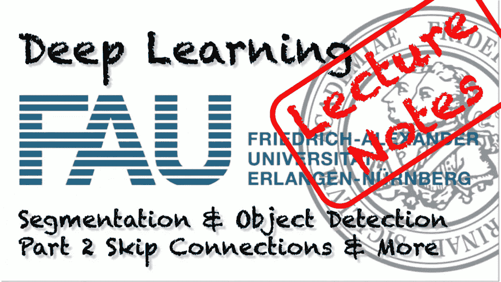

FAU 大学的深度学习。下图 [CC BY 4.0](https://creativecommons.org/licenses/by/4.0/) 来自[深度学习讲座](https://www.youtube.com/watch?v=p-_Stl0t3kU&list=PLpOGQvPCDQzvgpD3S0vTy7bJe2pf_yJFj&index=1)

**这些是 FAU 的 YouTube 讲座** [**深度学习**](https://www.youtube.com/watch?v=p-_Stl0t3kU&list=PLpOGQvPCDQzvgpD3S0vTy7bJe2pf_yJFj&index=1) **的讲义。这是与幻灯片匹配的讲座视频&的完整抄本。我们希望，你喜欢这个视频一样多。当然，这份抄本是用深度学习技术在很大程度上自动创建的，只进行了少量的手动修改。** [**自己试试吧！如果您发现错误，请告诉我们！**](http://autoblog.tf.fau.de/)

# 航行

[**上一讲**](/segmentation-and-object-detection-part-1-b8ef6f101547) **/** [**观看本视频**](https://youtu.be/BQIHiz1rKdc) **/** [**顶级**](/all-you-want-to-know-about-deep-learning-8d68dcffc258) **/** [**下一讲**](/segmentation-and-object-detection-part-3-abb4ec936fa)

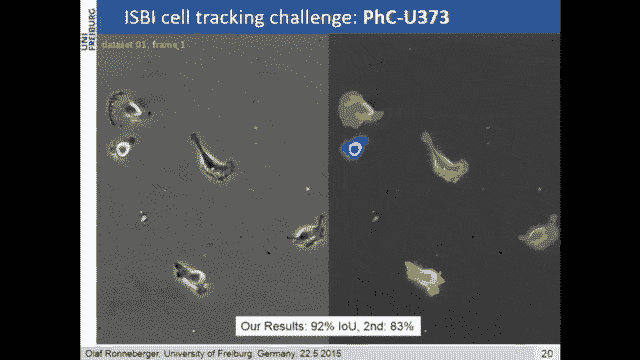

用于细胞分割的 U-net。使用 [gifify](https://github.com/vvo/gifify) 创建的图像。来源: [YouTube](https://youtu.be/81AvQQnpG4Q)

欢迎回到深度学习！所以今天，我们想谈谈更高级的图像分割方法。让我们看看我们的幻灯片。你可以在这里看到这是图像分割和物体检测系列讲座视频的第二部分。

如何整合语境知识？ [CC 下的图片来自](https://creativecommons.org/licenses/by/4.0/)[深度学习讲座](https://www.youtube.com/watch?v=p-_Stl0t3kU&list=PLpOGQvPCDQzvgpD3S0vTy7bJe2pf_yJFj&index=1)的 4.0 。

现在，我们需要知道的关键思想是如何整合上下文知识。仅仅使用我们在上一个视频中谈到的这种编码器-解码器结构不足以获得良好的分割。关键的概念是，你必须以某种方式告诉你的方法在哪里发生了什么，以便得到一个好的分段掩码。你需要平衡本地和全球信息。当然，这是非常重要的，因为局部信息对于给出好的像素精度是至关重要的，并且全局上下文对于正确地找出类是重要的。CNN 通常在这种平衡中挣扎。因此，我们现在需要一些关于如何整合这些上下文信息的好主意。

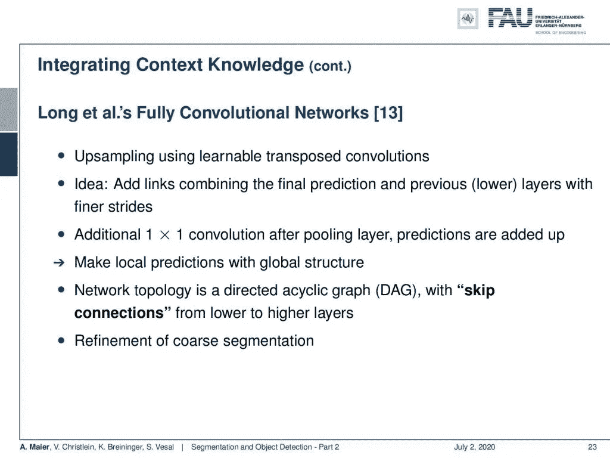

Long 等人在[13]中展示了整合上下文的第一个想法。来自[深度学习讲座](https://www.youtube.com/watch?v=p-_Stl0t3kU&list=PLpOGQvPCDQzvgpD3S0vTy7bJe2pf_yJFj&index=1)的 [CC BY 4.0](https://creativecommons.org/licenses/by/4.0/) 下的图片。

现在，Long 等人展示了这样做的第一种方法。他们本质上使用由可学习的转置卷积组成的上采样。关键的想法是，您想要添加链接，将最终预测与更精细的步骤中的先前较低层相结合。此外，他在池层之后进行了 1x1 卷积，然后将预测相加，以使用全局结构进行局部预测。因此，网络拓扑是一个有向无环图，从较低层到较高层有跳跃连接。因此，您可以细化一个粗略的分段。

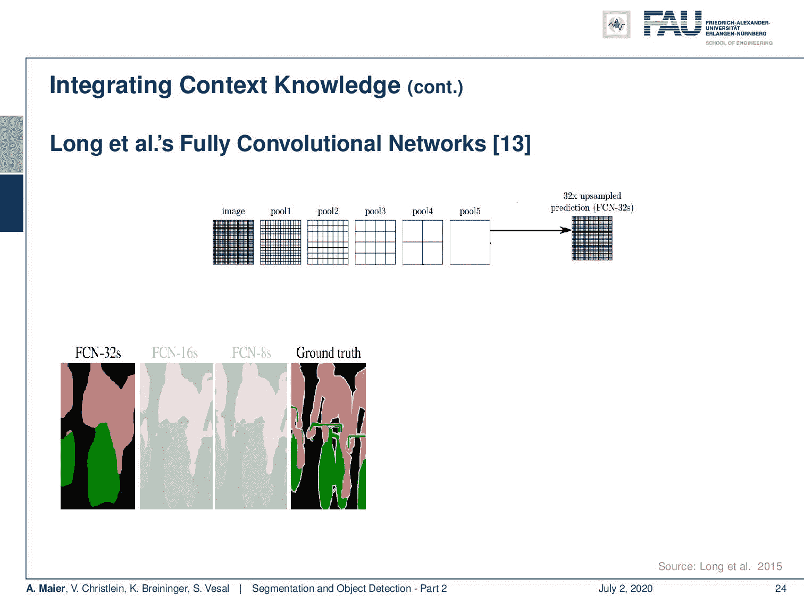

Long 等人对早期阶段知识进行了补充和整合。 [CC 下的图片来自](https://creativecommons.org/licenses/by/4.0/)[深度学习讲座](https://www.youtube.com/watch?v=p-_Stl0t3kU&list=PLpOGQvPCDQzvgpD3S0vTy7bJe2pf_yJFj&index=1)的 4.0 。

所以，让我们更详细地看看这个想法。你现在可以看到，如果你在右下角有地面实况，这有很高的分辨率。如果你简单地使用 CNN 和上采样，你会得到一个非常粗糙的分辨率，如左边所示。那么，龙等人的提议是什么呢？他们建议使用来自先前下采样步骤的信息，该步骤仍具有较高的分辨率，并在解码器分支内使用该信息，通过求和产生分辨率更高的图像。当然，您可以在解码器分支中再次这样做。你可以看到，这样我们可以对分段进行上采样，并重用来自编码器分支的信息，以产生更好的高分辨率结果。现在，您可以引入这些跳过连接，它们可以产生比仅使用解码器和上采样信息好得多的分段。

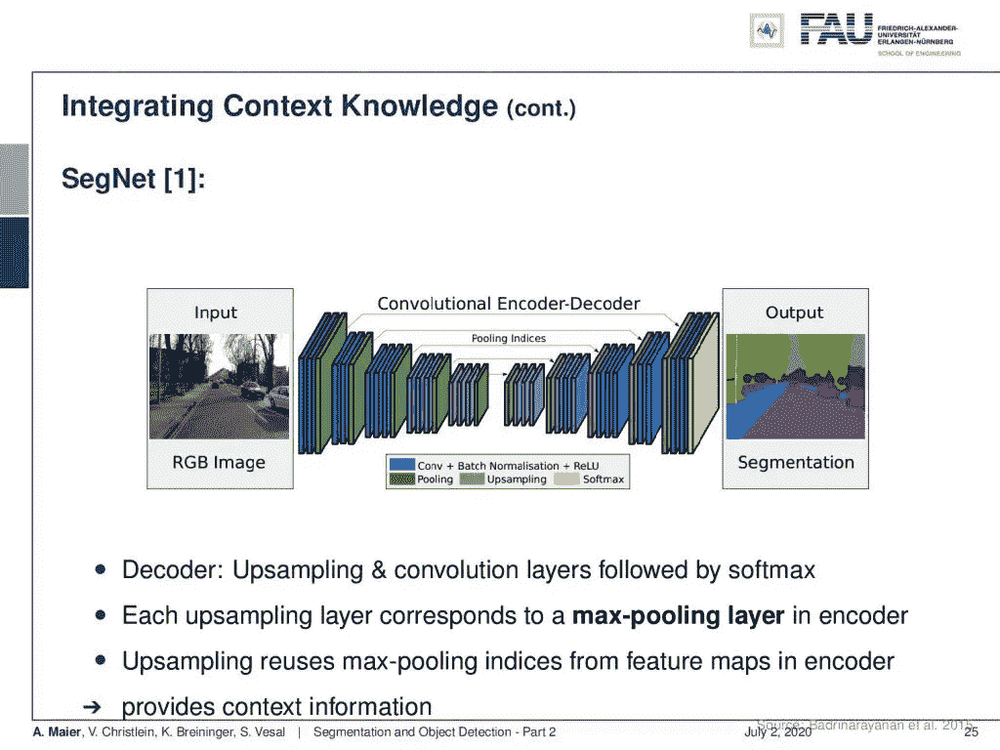

SegNet [1]重用了最大池索引。 [CC 下的图片来自](https://creativecommons.org/licenses/by/4.0/)[深度学习讲座](https://www.youtube.com/watch?v=p-_Stl0t3kU&list=PLpOGQvPCDQzvgpD3S0vTy7bJe2pf_yJFj&index=1)的 4.0 。

你看，整合背景知识是关键。在 SegNet 中，这里采用了不同的方法。还有这种卷积编码器-解码器结构。这里，关键思想是在上采样步骤中，在下采样步骤中重用来自最大池的信息，以便获得分辨率更高的解码。这已经是一个整合上下文知识的好主意了。

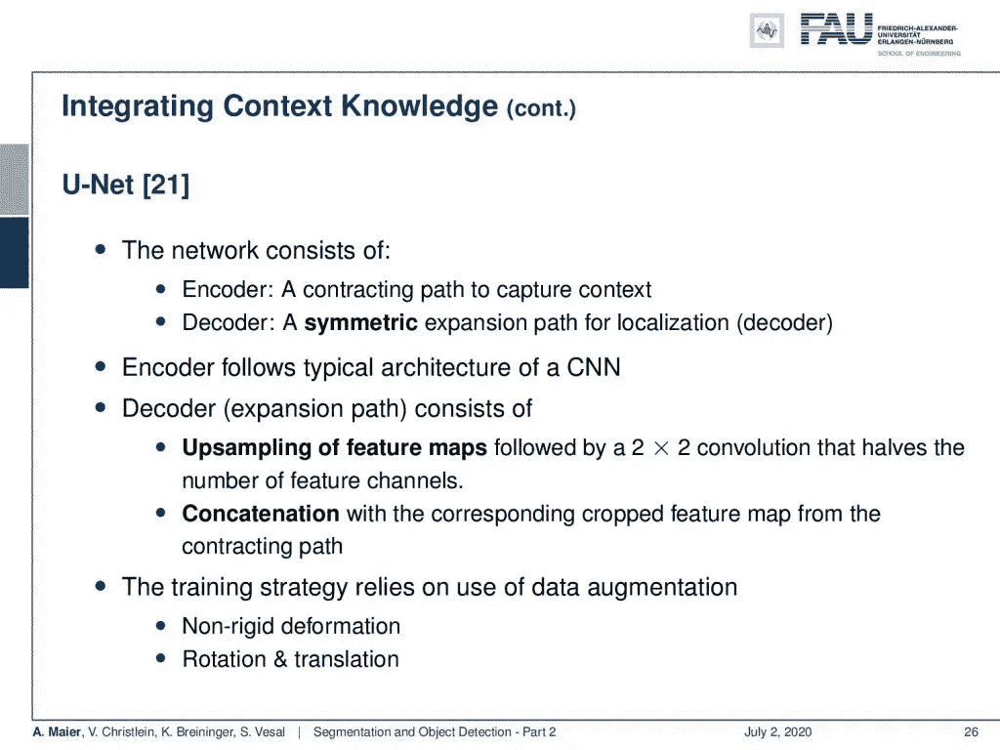

Ronneberger 在[21]中引入了跳过连接。来自[深度学习讲座](https://www.youtube.com/watch?v=p-_Stl0t3kU&list=PLpOGQvPCDQzvgpD3S0vTy7bJe2pf_yJFj&index=1)的 [CC BY 4.0](https://creativecommons.org/licenses/by/4.0/) 下的图片。

然后，一个更好的想法在 U-net 中展示出来。这里，网络由编码器分支组成，该分支是捕获上下文的收缩路径。解码器分支为定位进行对称扩展。因此，编码器遵循 CNN 的典型结构。解码器现在包括上采样步骤和相应编码器步骤的各个层的先前特征图的连接。因此，训练策略也依赖于数据扩充。有非刚性的变形、旋转和平移被用来给 U-net 带来额外的性能提升。

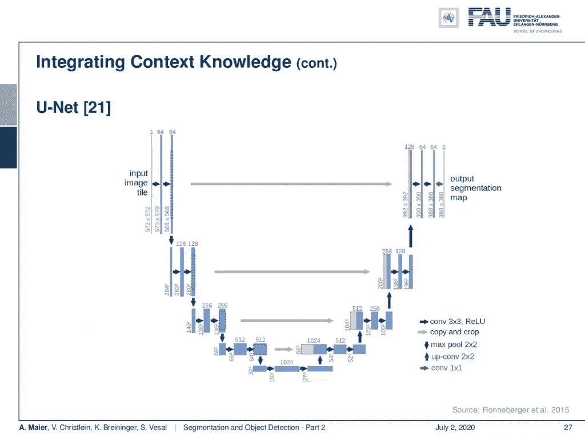

U-net 设计。 [CC 下的图片来自](https://creativecommons.org/licenses/by/4.0/)[深度学习讲座](https://www.youtube.com/watch?v=p-_Stl0t3kU&list=PLpOGQvPCDQzvgpD3S0vTy7bJe2pf_yJFj&index=1)的 4.0 。

你可以说 U-net 本质上是最先进的图像分割方法。这也是它有这个名字的原因。源于其形。你可以看到你得到了这个 U 型结构，因为你在精细层次上有很高的分辨率。然后降采样到较低的分辨率。解码器分支再次对所有内容进行上采样。这里的关键信息是连接解码器和编码器的两个相应级别的跳跃连接。这样你可以得到非常非常好的图像分割。训练非常简单，这篇论文已经被[引用了数千次](https://scholar.google.de/scholar?hl=en&as_sdt=0%2C5&q=u-net&btnG=)(2020 年 8 月 11 日:16471 次引用)。每天你都可以查看引用次数，它已经增加了。Olaf Ronneberger 能够在这里发表一篇非常重要的论文，它主宰了整个图像分割领域。

U-net 的变体。来自[深度学习讲座](https://www.youtube.com/watch?v=p-_Stl0t3kU&list=PLpOGQvPCDQzvgpD3S0vTy7bJe2pf_yJFj&index=1)的 4.0CC 下的图片。

您可以看到还有许多其他方法。它们可以通过 U-net 实现。所以他们可以使用扩张卷积等等。已经提出了许多这些非常小的变化，它们可能对特定的任务有用，但是对于一般的图像分割，[U-net 已经被证明仍然优于这样的方法](https://arxiv.org/abs/1809.10486)。尽管如此，仍然有一些东西可以使用，如扩张卷积，有网络堆栈可以非常有益，还有多尺度网络，然后甚至进一步深入到在不同尺度上使用图像的想法。您还可以做一些事情，比如将上下文建模推迟到另一个网络。然后，你也可以加入循环神经网络。同样非常好的想法是使用一个条件随机场来改进产生的分割图。

扩张卷积也可以应用于 U-net。 [CC 下的图片来自](https://creativecommons.org/licenses/by/4.0/)[深度学习讲座](https://www.youtube.com/watch?v=p-_Stl0t3kU&list=PLpOGQvPCDQzvgpD3S0vTy7bJe2pf_yJFj&index=1)的 4.0 。

我们这里有一些额外的方法，这样你就能明白我们在说什么。这里的扩大卷积，是你想要使用我们已经讨论过的那些萎缩卷积的想法。因此，我们的想法是，在不损失分辨率的情况下，使用扩张卷积来支持感受野的指数级扩张。然后，引入控制上采样因子的膨胀率 L。然后你把它叠加在上面，这样你就能使感受野呈指数增长，而滤波器的参数数量呈线性增长。因此，在需要进行大范围放大的特定应用中，这非常有用。所以，这真的取决于你的应用。

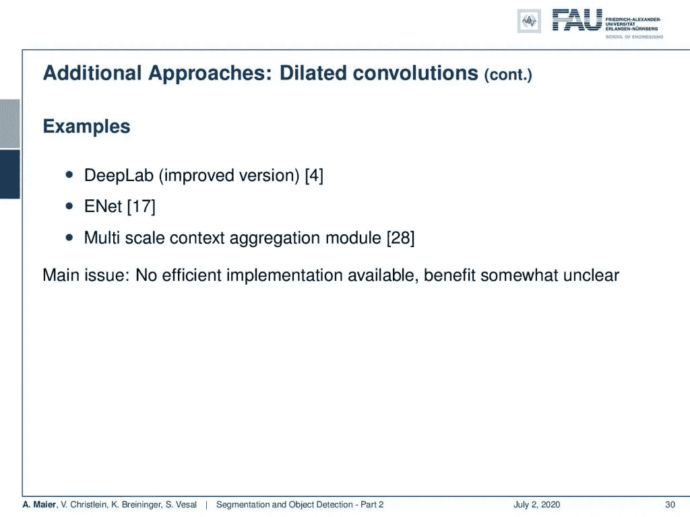

在各种分割方法中已经采用了扩展卷积。来自[深度学习讲座](https://www.youtube.com/watch?v=p-_Stl0t3kU&list=PLpOGQvPCDQzvgpD3S0vTy7bJe2pf_yJFj&index=1)的 [CC BY 4.0](https://creativecommons.org/licenses/by/4.0/) 下的图片。

这方面的例子有 DeepLab、ENet 和[28]中的多尺度上下文聚合模块。当然，主要问题是没有有效的实现。因此，这种好处还不清楚。

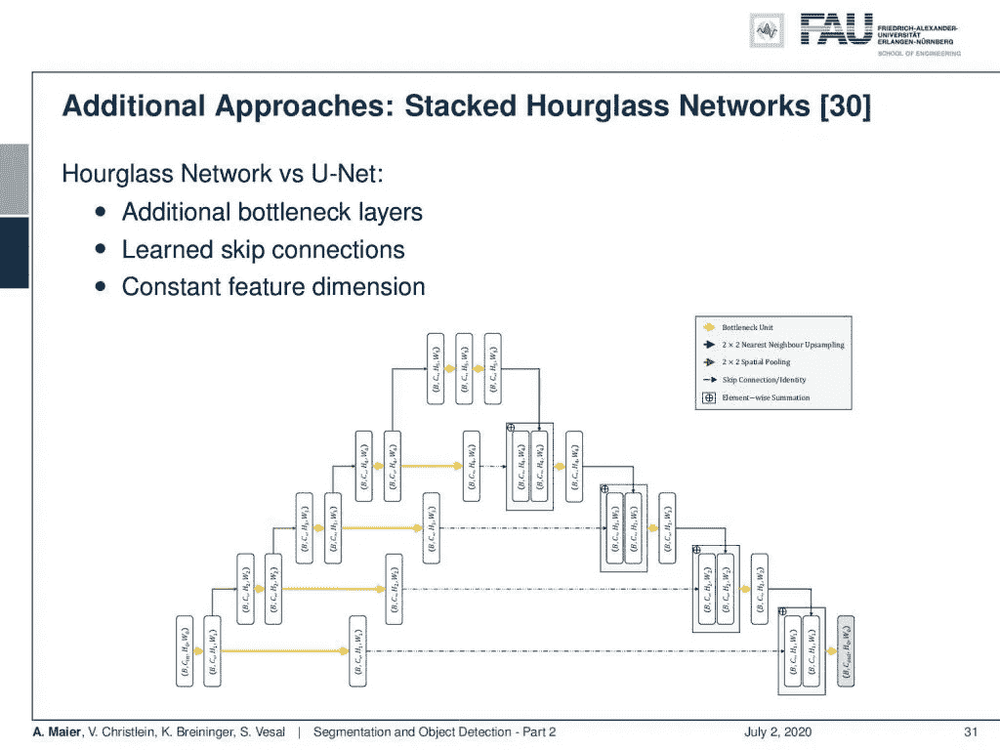

堆叠沙漏模块。 [CC 下的图片来自](https://creativecommons.org/licenses/by/4.0/)[深度学习讲座](https://www.youtube.com/watch?v=p-_Stl0t3kU&list=PLpOGQvPCDQzvgpD3S0vTy7bJe2pf_yJFj&index=1)的 4.0 。

我想向大家展示的另一种方法是所谓的堆叠沙漏网络。所以，这里的想法是，你使用一个非常类似于 U-net 的东西，但是你要在 skip 连接中加入一个额外的可训练部分。所以，这基本上是主要的想法。

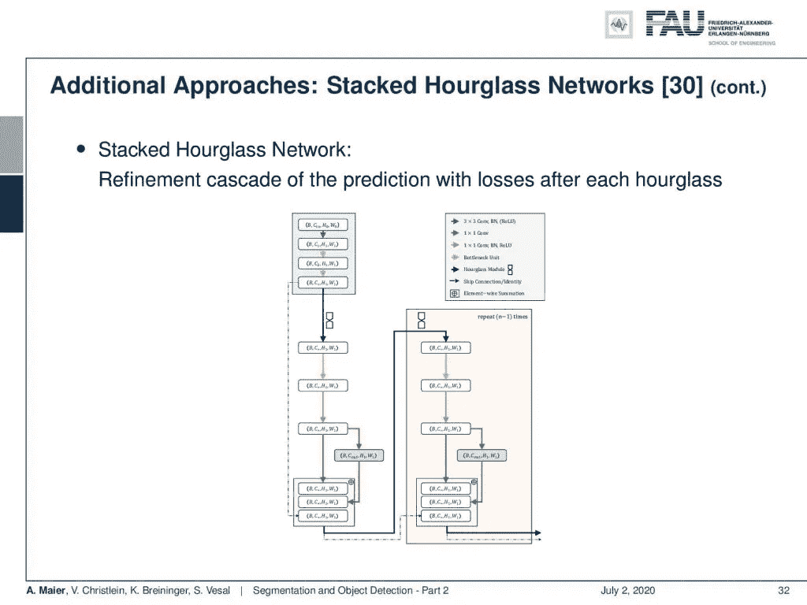

堆叠模块导致堆叠沙漏网络。来自[深度学习讲座](https://www.youtube.com/watch?v=p-_Stl0t3kU&list=PLpOGQvPCDQzvgpD3S0vTy7bJe2pf_yJFj&index=1)的 4.0CC 下的图片。

然后，您可以使用这个沙漏模块，并将其堆叠在彼此后面。因此，基本上有多个细化步骤，并且总是返回到原始分辨率。你可以插入第二个网络，本质上是一种伪像校正网络。现在，这种沙漏网络方法的真正好处是，你可以回到原来的分辨率。

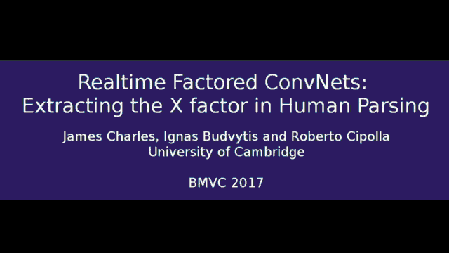

卷积姿态机器还将几个模块堆叠在彼此之上，以实现姿态跟踪。这也可以与分段相结合。使用 [gifify](https://github.com/vvo/gifify) 创建的图像。来源: [YouTube](https://youtu.be/syu-ttRyp2M)

假设你同时在预测几门课。然后，你会得到几个不同类别的分段掩码。这个想法可以在一个叫做卷积姿态机的东西中被提取出来。在回旋摆姿机中，你使用沙漏连接的区域，这里你有一个 U 形网基本上叠在另一个 U 形网的上面。在这一层，您还可以使用每个类的结果分割图，以便相互通知。因此，您可以使用在图像中检测到的其他事物的上下文信息来控制这种细化。在卷积姿态机器中，你为身体模型关节的姿态检测做那件事。当然，如果你有左膝关节和右膝关节以及身体的其他关节，关于其他关节的信息有助于解码正确的位置。

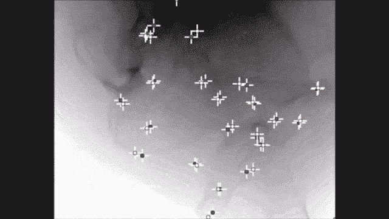

[X 射线变换不变标志检测](https://arxiv.org/abs/1803.08608)Bastian Bier。来自[深度学习讲座](https://www.youtube.com/watch?v=p-_Stl0t3kU&list=PLpOGQvPCDQzvgpD3S0vTy7bJe2pf_yJFj&index=1)的 4.0CC 下的图片。

这个想法也被我的同事 Bastian Bier [用于在 x 射线投影分析中检测解剖标志](https://arxiv.org/abs/1803.08608)。我在这里放一个小视频。您已经在简介中看到了这一点，现在您终于有了理解该方法所需的所有上下文。因此，这里有一种非常类似于卷积姿态机器的方法，然后开始通知地标彼此的方向和位置，以获得更好的检测结果。

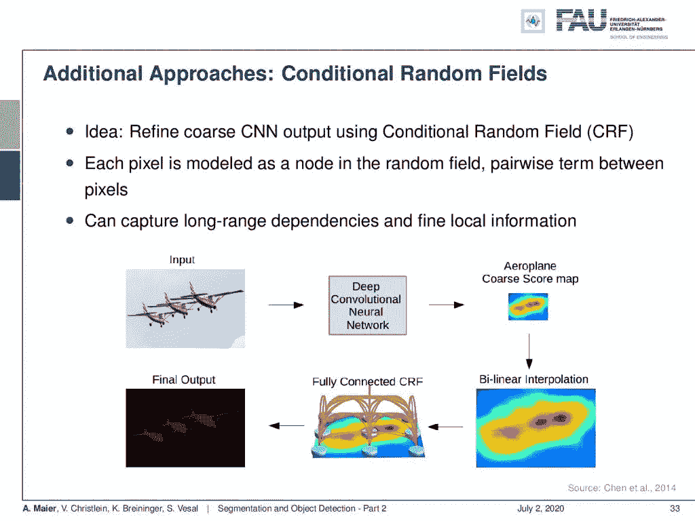

条件随机场也可以作为层引入。 [CC 下的图片来自](https://creativecommons.org/licenses/by/4.0/)[深度学习讲座](https://www.youtube.com/watch?v=p-_Stl0t3kU&list=PLpOGQvPCDQzvgpD3S0vTy7bJe2pf_yJFj&index=1)的 4.0 。

那还有什么？我已经暗示了条件随机场。这里的想法是使用条件随机场来优化输出。因此，像素被建模为随机场中的一个节点。这些基于像素对的术语非常有趣，因为它们可以捕捉长程相关性和精细的局部信息。

结果使用通用报告格式。来自[深度学习讲座](https://www.youtube.com/watch?v=p-_Stl0t3kU&list=PLpOGQvPCDQzvgpD3S0vTy7bJe2pf_yJFj&index=1)的 [CC BY 4.0](https://creativecommons.org/licenses/by/4.0/) 下的图片。

如果你看到这里的输出，这是来自 DeepLab 的。在这里，您可以看到条件随机场的迭代优化如何帮助改进分割。因此，你也可以像在[4]中那样将它与阿图斯卷积结合起来。你甚至可以用递归神经网络来模拟条件随机场，如参考文献[29]所示。这也允许整个条件随机场的端到端训练。

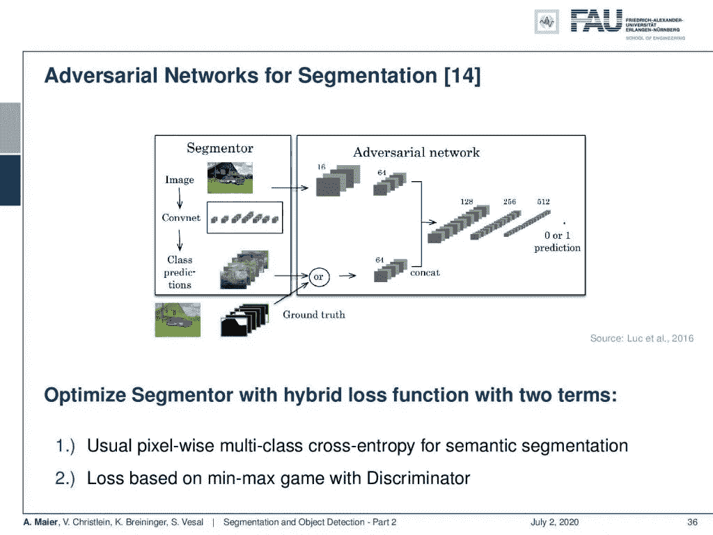

对抗性损失也适用于图像分割。 [CC 下的图片来自](https://creativecommons.org/licenses/by/4.0/)[深度学习讲座](https://www.youtube.com/watch?v=p-_Stl0t3kU&list=PLpOGQvPCDQzvgpD3S0vTy7bJe2pf_yJFj&index=1)的 4.0 。

还有几个高级主题我仍然想暗示一下。当然，你也可以带着损失工作。到目前为止，我们只看到了分割损失本身，但是当然，您也可以混合和匹配我们在本课程中已经看到的以前的想法。例如，你可以使用 GAN 来增加你的损失。这里的想法是，你可以创建一个分割器。然后，您可以使用分割器的输出作为 GAN 类型鉴别器的输入。鉴别器现在的任务是判断这是自动分段还是手动分段。那么，这可以被用作一种由生成性对抗网络的思想所启发的额外的对抗损失。你会发现，在文学作品中，这通常被称为对抗性的失败。

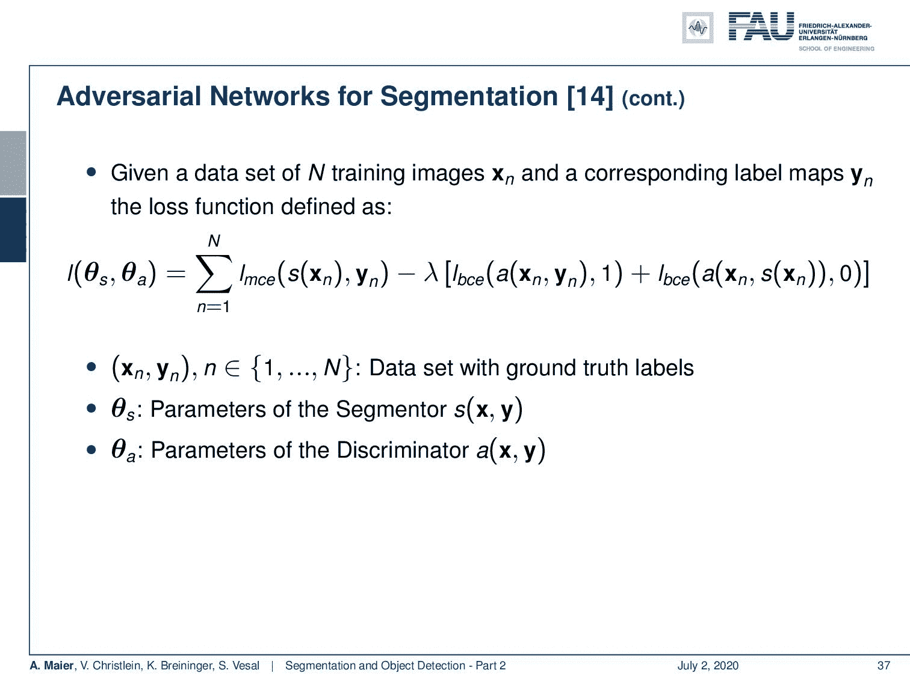

对抗性损失通常与分割损失相结合。 [CC 下的图片来自](https://creativecommons.org/licenses/by/4.0/)[深度学习讲座](https://www.youtube.com/watch?v=p-_Stl0t3kU&list=PLpOGQvPCDQzvgpD3S0vTy7bJe2pf_yJFj&index=1)的 4.0 。

那么，这是如何实现的呢？这个想法是，如果你有一个数据集给定的 N 个训练图像和相应的标签图，那么你可以建立以下损失函数:这本质上是多类交叉熵损失，然后你把对你的分割掩模起作用的对抗性损失放在上面。所以在这里，你可以用事实标签和欺骗鉴别器来训练你的分段。这本质上就是一种带有对抗性任务的多任务学习方法。

在这个深度学习讲座中，更多令人兴奋的事情即将到来。来自[深度学习讲座](https://www.youtube.com/watch?v=p-_Stl0t3kU&list=PLpOGQvPCDQzvgpD3S0vTy7bJe2pf_yJFj&index=1)的 [CC BY 4.0](https://creativecommons.org/licenses/by/4.0/) 下的图片。

好吧。所以，今天的短片到此结束。你可以看到，我们已经了解了如何构建良好的细分网络的关键理念。尤其是，U-net 是您应该了解的关键概念之一。既然我们已经讨论了分割网络，我们可以在下节课讨论对象检测以及如何快速实现它。所以，这是图像解读的另一面。我们还将能够找出图像中不同实例的实际位置。所以我希望，你喜欢这个小视频，我期待着在下一个视频中见到你。非常感谢，再见。

如果你喜欢这篇文章，你可以在这里找到更多的文章，或者看看我们的讲座。如果你想在未来了解更多的文章、视频和研究，我也会很感激关注 [YouTube](https://www.youtube.com/c/AndreasMaierTV) 、 [Twitter](https://twitter.com/maier_ak) 、[脸书](https://www.facebook.com/andreas.maier.31337)或 [LinkedIn](https://www.linkedin.com/in/andreas-maier-a6870b1a6/) 。本文以 [Creative Commons 4.0 归属许可](https://creativecommons.org/licenses/by/4.0/deed.de)发布，如果引用，可以转载和修改。如果你有兴趣从视频讲座中获得文字记录，试试[自动博客](http://autoblog.tf.fau.de/)。

# 参考

[1] Vijay Badrinarayanan, Alex Kendall, and Roberto Cipolla. “Segnet: A deep convolutional encoder-decoder architecture for image segmentation”. In: arXiv preprint arXiv:1511.00561 (2015). arXiv: 1311.2524.
[2] Xiao Bian, Ser Nam Lim, and Ning Zhou. “Multiscale fully convolutional network with application to industrial inspection”. In: Applications of Computer Vision (WACV), 2016 IEEE Winter Conference on. IEEE. 2016, pp. 1–8.
[3] Liang-Chieh Chen, George Papandreou, Iasonas Kokkinos, et al. “Semantic Image Segmentation with Deep Convolutional Nets and Fully Connected CRFs”. In: CoRR abs/1412.7062 (2014). arXiv: 1412.7062.
[4] Liang-Chieh Chen, George Papandreou, Iasonas Kokkinos, et al. “Deeplab: Semantic image segmentation with deep convolutional nets, atrous convolution, and fully connected crfs”. In: arXiv preprint arXiv:1606.00915 (2016).
[5] S. Ren, K. He, R. Girshick, et al. “Faster R-CNN: Towards Real-Time Object Detection with Region Proposal Networks”. In: vol. 39\. 6\. June 2017, pp. 1137–1149.
[6] R. Girshick. “Fast R-CNN”. In: 2015 IEEE International Conference on Computer Vision (ICCV). Dec. 2015, pp. 1440–1448.
[7] Tsung-Yi Lin, Priya Goyal, Ross Girshick, et al. “Focal loss for dense object detection”. In: arXiv preprint arXiv:1708.02002 (2017).
[8] Alberto Garcia-Garcia, Sergio Orts-Escolano, Sergiu Oprea, et al. “A Review on Deep Learning Techniques Applied to Semantic Segmentation”. In: arXiv preprint arXiv:1704.06857 (2017).
[9] Bharath Hariharan, Pablo Arbeláez, Ross Girshick, et al. “Simultaneous detection and segmentation”. In: European Conference on Computer Vision. Springer. 2014, pp. 297–312.
[10] Kaiming He, Georgia Gkioxari, Piotr Dollár, et al. “Mask R-CNN”. In: CoRR abs/1703.06870 (2017). arXiv: 1703.06870.
[11] N. Dalal and B. Triggs. “Histograms of oriented gradients for human detection”. In: 2005 IEEE Computer Society Conference on Computer Vision and Pattern Recognition Vol. 1\. June 2005, 886–893 vol. 1.
[12] Jonathan Huang, Vivek Rathod, Chen Sun, et al. “Speed/accuracy trade-offs for modern convolutional object detectors”. In: CoRR abs/1611.10012 (2016). arXiv: 1611.10012.
[13] Jonathan Long, Evan Shelhamer, and Trevor Darrell. “Fully convolutional networks for semantic segmentation”. In: Proceedings of the IEEE Conference on Computer Vision and Pattern Recognition. 2015, pp. 3431–3440.
[14] Pauline Luc, Camille Couprie, Soumith Chintala, et al. “Semantic segmentation using adversarial networks”. In: arXiv preprint arXiv:1611.08408 (2016).
[15] Christian Szegedy, Scott E. Reed, Dumitru Erhan, et al. “Scalable, High-Quality Object Detection”. In: CoRR abs/1412.1441 (2014). arXiv: 1412.1441.
[16] Hyeonwoo Noh, Seunghoon Hong, and Bohyung Han. “Learning deconvolution network for semantic segmentation”. In: Proceedings of the IEEE International Conference on Computer Vision. 2015, pp. 1520–1528.
[17] Adam Paszke, Abhishek Chaurasia, Sangpil Kim, et al. “Enet: A deep neural network architecture for real-time semantic segmentation”. In: arXiv preprint arXiv:1606.02147 (2016).
[18] Pedro O Pinheiro, Ronan Collobert, and Piotr Dollár. “Learning to segment object candidates”. In: Advances in Neural Information Processing Systems. 2015, pp. 1990–1998.
[19] Pedro O Pinheiro, Tsung-Yi Lin, Ronan Collobert, et al. “Learning to refine object segments”. In: European Conference on Computer Vision. Springer. 2016, pp. 75–91.
[20] Ross B. Girshick, Jeff Donahue, Trevor Darrell, et al. “Rich feature hierarchies for accurate object detection and semantic segmentation”. In: CoRR abs/1311.2524 (2013). arXiv: 1311.2524.
[21] Olaf Ronneberger, Philipp Fischer, and Thomas Brox. “U-net: Convolutional networks for biomedical image segmentation”. In: MICCAI. Springer. 2015, pp. 234–241.
[22] Kaiming He, Xiangyu Zhang, Shaoqing Ren, et al. “Spatial Pyramid Pooling in Deep Convolutional Networks for Visual Recognition”. In: Computer Vision — ECCV 2014\. Cham: Springer International Publishing, 2014, pp. 346–361.
[23] J. R. R. Uijlings, K. E. A. van de Sande, T. Gevers, et al. “Selective Search for Object Recognition”. In: International Journal of Computer Vision 104.2 (Sept. 2013), pp. 154–171.
[24] Wei Liu, Dragomir Anguelov, Dumitru Erhan, et al. “SSD: Single Shot MultiBox Detector”. In: Computer Vision — ECCV 2016\. Cham: Springer International Publishing, 2016, pp. 21–37.
[25] P. Viola and M. Jones. “Rapid object detection using a boosted cascade of simple features”. In: Proceedings of the 2001 IEEE Computer Society Conference on Computer Vision Vol. 1\. 2001, pp. 511–518.
[26] J. Redmon, S. Divvala, R. Girshick, et al. “You Only Look Once: Unified, Real-Time Object Detection”. In: 2016 IEEE Conference on Computer Vision and Pattern Recognition (CVPR). June 2016, pp. 779–788.
[27] Joseph Redmon and Ali Farhadi. “YOLO9000: Better, Faster, Stronger”. In: CoRR abs/1612.08242 (2016). arXiv: 1612.08242.
[28] Fisher Yu and Vladlen Koltun. “Multi-scale context aggregation by dilated convolutions”. In: arXiv preprint arXiv:1511.07122 (2015).
[29] Shuai Zheng, Sadeep Jayasumana, Bernardino Romera-Paredes, et al. “Conditional Random Fields as Recurrent Neural Networks”. In: CoRR abs/1502.03240 (2015). arXiv: 1502.03240.
[30] Alejandro Newell, Kaiyu Yang, and Jia Deng. “Stacked hourglass networks for human pose estimation”. In: European conference on computer vision. Springer. 2016, pp. 483–499.