# 分割和对象检测—第 3 部分

> 原文：<https://towardsdatascience.com/segmentation-and-object-detection-part-3-abb4ec936fa?source=collection_archive---------43----------------------->

## [FAU 讲座笔记](https://towardsdatascience.com/tagged/fau-lecture-notes)关于深度学习

## 一家地区性有线电视新闻网

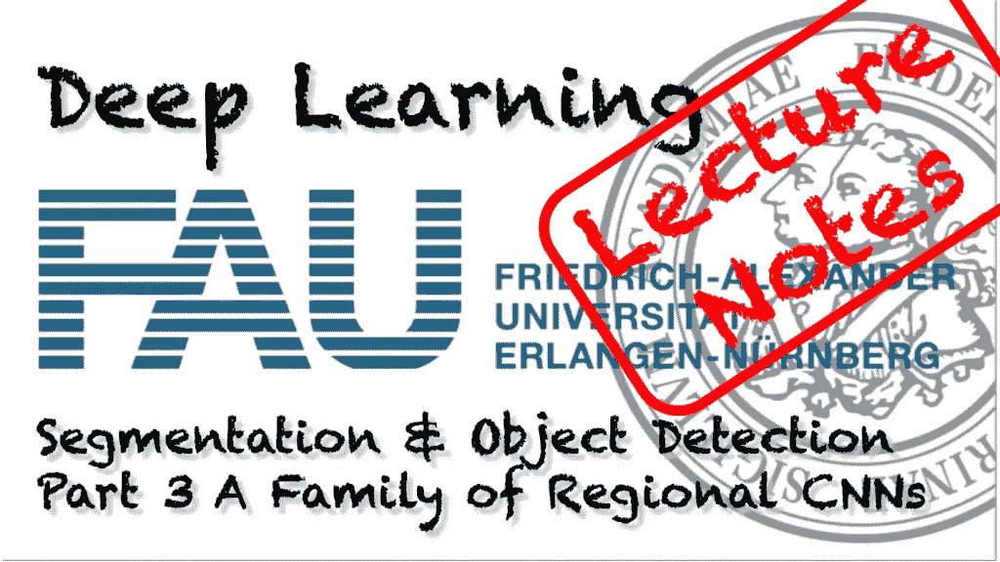

FAU 大学的深度学习。下图 [CC BY 4.0](https://creativecommons.org/licenses/by/4.0/) 来自[深度学习讲座](https://www.youtube.com/watch?v=p-_Stl0t3kU&list=PLpOGQvPCDQzvgpD3S0vTy7bJe2pf_yJFj&index=1)

**这些是 FAU 的 YouTube 讲座** [**深度学习**](https://www.youtube.com/watch?v=p-_Stl0t3kU&list=PLpOGQvPCDQzvgpD3S0vTy7bJe2pf_yJFj&index=1) **的讲义。这是与幻灯片匹配的讲座视频&的完整抄本。我们希望，你喜欢这个视频一样多。当然，这份抄本是用深度学习技术在很大程度上自动创建的，只进行了少量的手动修改。** [**自己试试吧！如果您发现错误，请告诉我们！**](http://autoblog.tf.fau.de/)

# 航行

[**上一讲**](/segmentation-and-object-detection-part-2-a334b91255f1) **/** [**观看本视频**](https://youtu.be/A9XwYERjXFE) **/** [**顶级**](/all-you-want-to-know-about-deep-learning-8d68dcffc258)/[**下一讲**](/segmentation-and-object-detection-part-4-f1d0d213976b)

野外物体检测。使用 [gifify](https://github.com/vvo/gifify) 创建的图像。来源: [YouTube](https://youtu.be/_zZe27JYi8Y)

欢迎回到深度学习！所以今天，我们想多谈谈物体检测的概念。我们将从对象检测的一个小动机和如何实际执行的一些关键想法开始。

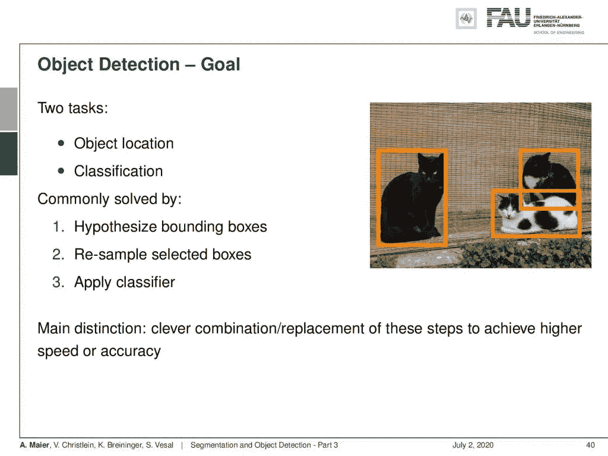

也可以使用对象检测方法来检测猫。 [CC 下的图片来自](https://creativecommons.org/licenses/by/4.0/)[深度学习讲座](https://www.youtube.com/watch?v=p-_Stl0t3kU&list=PLpOGQvPCDQzvgpD3S0vTy7bJe2pf_yJFj&index=1)的 4.0 。

那么，让我们来看看我们的幻灯片。你看，这已经是我们关于分割和物体检测的短片系列的第三部分了。现在，主题是物体检测。好吧，让我们稍微激励一下。这个想法——你还记得——是我们想要定位物体并对它们进行分类。所以，我们想知道猫在图像中的位置，我们想知道它们是否真的是猫。这通常通过生成关于边界框的假设来解决，然后对这些框进行重新采样，并应用分类器。因此，这些方法的主要区别在于如何组合和替换这些步骤，以实现更高的速度或精度。

包围盒是物体检测的关键。来自[深度学习讲座](https://www.youtube.com/watch?v=p-_Stl0t3kU&list=PLpOGQvPCDQzvgpD3S0vTy7bJe2pf_yJFj&index=1)的 [CC BY 4.0](https://creativecommons.org/licenses/by/4.0/) 下的图片。

我们也可以看看这个平面例子。当然，我们正在寻找边界框，边界框通常被定义为完全包含所讨论的对象的最小的框。然后，这通常被定义为具有宽度 *w* 和高度 *h* 以及边界框的一些分类器置信度的左上角。你可以看到，我们也可以用它来检测整个飞机，或者我们也可以用它来检测飞机的一部分。

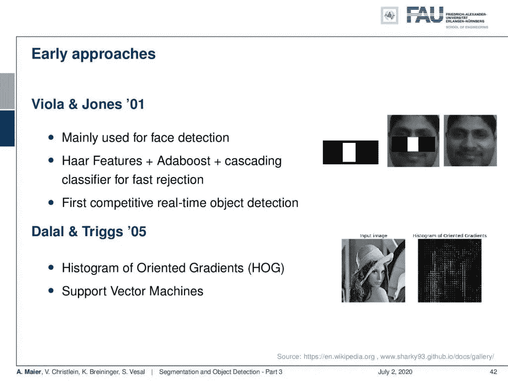

对于特殊的应用，存在传统的方法。来自[深度学习讲座](https://www.youtube.com/watch?v=p-_Stl0t3kU&list=PLpOGQvPCDQzvgpD3S0vTy7bJe2pf_yJFj&index=1)的 4.0CC 下的图片。

这实际上是我们已经有了不同成功故事的悠久历史的事情。一个非常早期的继任者是 Viola 和 Jones 算法，这是最早的真正有效的人脸检测器之一。这里你可以看到例子。这是使用哈尔特征，然后这些哈尔特征被用于一种提升级联，以便非常快速地检测人脸。所以，它使用了大量可以高效计算的特征。然后，在提升级联中，他们将只选择最有可能在给定位置检测到人脸的特征。然后用所谓的梯度方向直方图和经典方法对此进行了改进。你总是有一个好的特征提取加上一些有效的分类。当时，支持向量机非常普遍。

常见深度学习对象检测方法综述。 [CC 下的图片来自](https://creativecommons.org/licenses/by/4.0/)[深度学习讲座](https://www.youtube.com/watch?v=p-_Stl0t3kU&list=PLpOGQvPCDQzvgpD3S0vTy7bJe2pf_yJFj&index=1)的 4.0 。

当然，也有基于神经网络的方法。你可以用一个预先训练好的 CNN 很容易地做到这一点。因此，您可以简单地使用滑动窗口方法，然后通过 CNN 检测每个可能的窗口。有像 RCNN 这样的区域提议 CNN，先找到感兴趣的图像区域，然后用我们的 CNN 进行分类。我们将在下一个视频中讨论单次检测器，它可以进行联合检测和分类。我认为最著名的例子之一是 YOLO——你只需看一次——我们在介绍中已经有了这个例子。这是一种非常好的方法，可以实时完成所有这些检测方法。

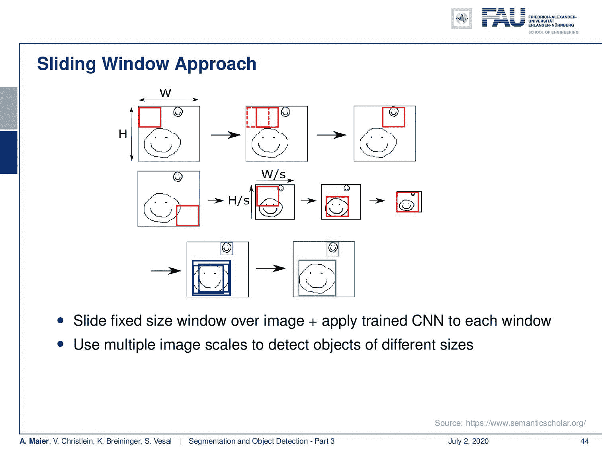

为什么。不就是用推拉窗吗？来自[深度学习讲座](https://www.youtube.com/watch?v=p-_Stl0t3kU&list=PLpOGQvPCDQzvgpD3S0vTy7bJe2pf_yJFj&index=1)的 [CC BY 4.0](https://creativecommons.org/licenses/by/4.0/) 下的图片。

嗯，在滑动窗口方法中，你可以简单地拿起你预先训练好的 CNN，在图像上移动它。当你发现一个高度自信的领域时，你可以说:“好的。有一张脸，我想检测这张脸！”现在，这里最大的缺点是，你不仅要检测人脸，而且人脸可能有不同的分辨率。所以，你要在多个分辨率上重复这个过程。然后，您已经看到逐片检测会产生大量的补丁。你要做大量的分类。所以，这可能不是我们想要走的路。当然，一个好处是我们不需要重新训练。在这种情况下，我们可以简单地使用我们训练过的分类网络。但它的计算效率非常低，我们希望寻找一些如何更有效地做到这一点的想法。

更好的方法是完全卷积处理。 [CC 下的图片来自](https://creativecommons.org/licenses/by/4.0/)[深度学习讲座](https://www.youtube.com/watch?v=p-_Stl0t3kU&list=PLpOGQvPCDQzvgpD3S0vTy7bJe2pf_yJFj&index=1)的 4.0 。

一个想法是，当然，你用它与完全卷积神经网络，并理解以下方法。所以，我们可以考虑如何将一个完全连接的层应用到一个任意形状的张量。一个想法是你将激活扁平化，然后运行你的全连接层，你可以得到一个分类结果。相反，您可以重塑权重，然后使用卷积。这将产生完全相同的结果。我们在讨论逐个卷积时已经讨论过了。现在，这里好的性质是，如果我们遵循这个想法，我们也可以处理任意形状的空间输入大小。通过使用卷积，我们还将产生更大的输出大小。所以，我们有点摆脱了移动窗口的方法，但我们仍然有一个问题，我们必须查看不同的比例，以便找到所有有趣的对象。

区域 CNN (RCNN)综述。来自[深度学习讲座](https://www.youtube.com/watch?v=p-_Stl0t3kU&list=PLpOGQvPCDQzvgpD3S0vTy7bJe2pf_yJFj&index=1)的 [CC BY 4.0](https://creativecommons.org/licenses/by/4.0/) 下的图片。

这就是为什么人们一直在关注基于区域的检测器。因此，我们知道 CNN 是强大的分类器，全卷积神经网络有助于提高效率。但他们还是有些蛮力。那么，我们能做些什么呢？我们可以通过像我们的眼睛一样只考虑感兴趣的区域来提高效率。所以，这就引出了 RCNN，区域性的 CNN。这里，您有一个多步骤方法，可以生成区域建议和选择性搜索。然后，将区域建议的内容分类到一个优化的边界框中。

首先，我们必须找到区域。 [CC 下的图片来自](https://creativecommons.org/licenses/by/4.0/)[深度学习讲座](https://www.youtube.com/watch?v=p-_Stl0t3kU&list=PLpOGQvPCDQzvgpD3S0vTy7bJe2pf_yJFj&index=1)的 4.0 。

让我们更详细地看一下这个问题。在这里，我们的区域建议，你通过一组具有相似纹理和颜色的像素来生成这些候选对象。然后你产生几千个目标提案，比如每个图像两千个。您会注意到，这比可能的窗口数量小得多。你基本上是基于一种粗略的分割形式。

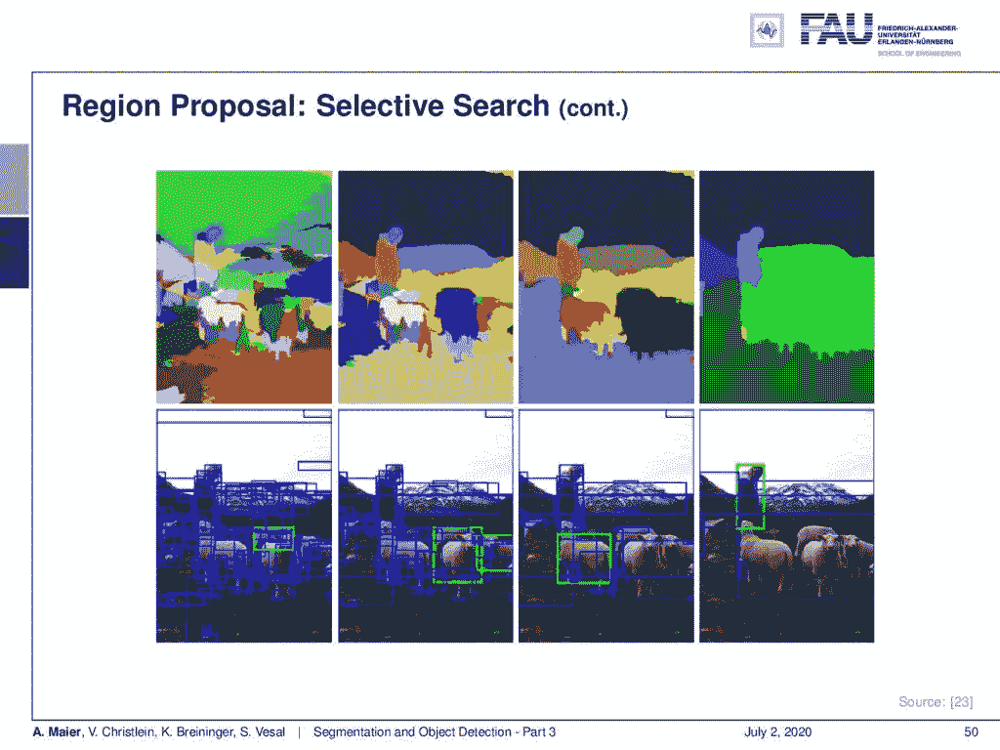

RCNN 使用经典的超像素方法。来自[深度学习讲座](https://www.youtube.com/watch?v=p-_Stl0t3kU&list=PLpOGQvPCDQzvgpD3S0vTy7bJe2pf_yJFj&index=1)的 [CC BY 4.0](https://creativecommons.org/licenses/by/4.0/) 下的图片。

在最初的 RCNN 论文中，他们实际上使用了一种叫做超像素的方法。超像素允许你生成更小和更大的区域。所以，你可以看到我们如何从左到右增加区域大小。然后，我们可以使用这些区域，以便用另一个检测器找到感兴趣的区域。然后，这些感兴趣的区域可以进入分类器的下一阶段。

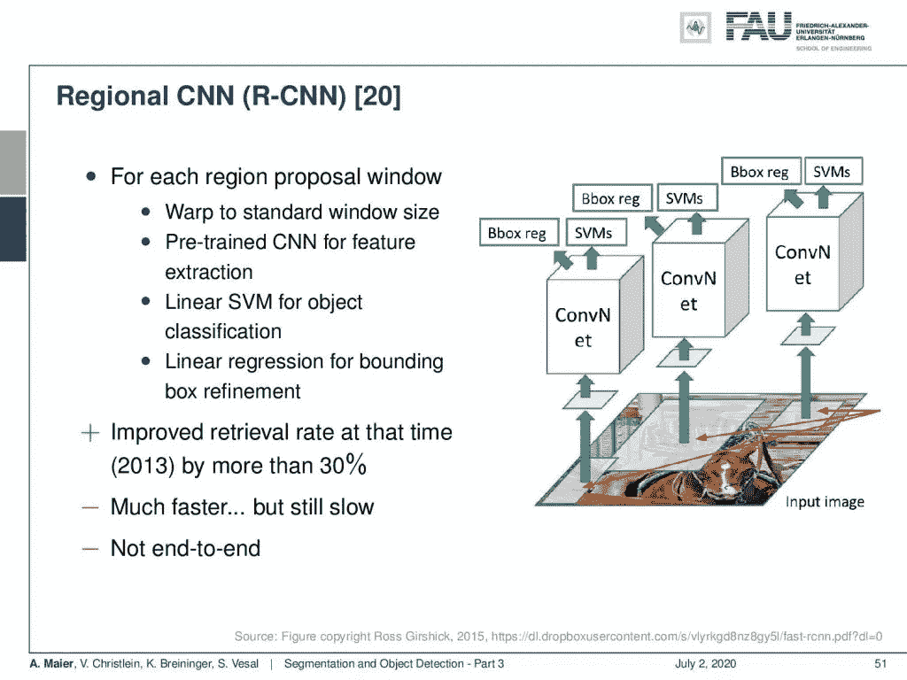

其次是美国有线电视新闻网专题敲诈加 SVM 分类。 [CC 下的图片来自](https://creativecommons.org/licenses/by/4.0/)[深度学习讲座](https://www.youtube.com/watch?v=p-_Stl0t3kU&list=PLpOGQvPCDQzvgpD3S0vTy7bJe2pf_yJFj&index=1)的 4.0 。

因此，在第二阶段，一旦我们有了这些区域，我们基本上就有了一个卷积神经网络。一方面，这产生了细化边界框的框回归。另一方面，这也作为一种表示学习提供给支持向量机进行最终决策。因此，这比我们之前在 2013 年那个时候看到的要好，但仍然很慢，而且不是端到端的。所以，如果我们想加速这个过程，我们会发现 RCNN 仍然存在问题。

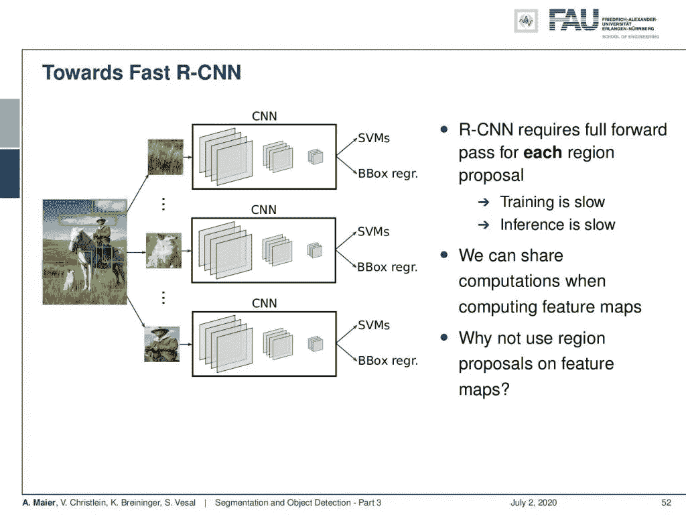

为什么我们必须单独处理每个包围盒？ [CC 下的图片来自](https://creativecommons.org/licenses/by/4.0/)[深度学习讲座](https://www.youtube.com/watch?v=p-_Stl0t3kU&list=PLpOGQvPCDQzvgpD3S0vTy7bJe2pf_yJFj&index=1)的 4.0 。

因为我们对每个地区的提案都进行了全面的审核，这意味着这种培训很慢，推理也很慢。我们可以在计算特征图时共享计算，因为我们一直在做相同或相似的计算。然后，为了提高推理速度，关键思想是在特征图上使用区域建议。

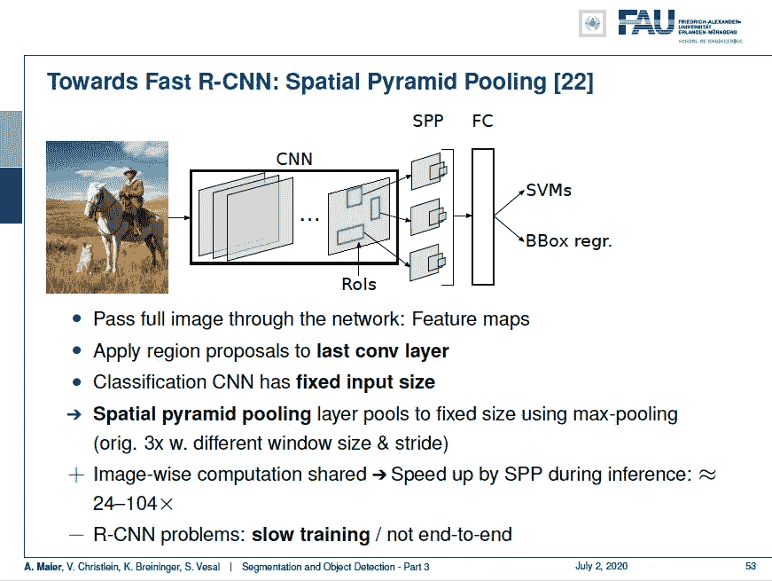

空间金字塔池允许我们只运行一遍 CNN 特征提取。它将检测到的 ROI 映射到最大汇集空间。来自[深度学习讲座](https://www.youtube.com/watch?v=p-_Stl0t3kU&list=PLpOGQvPCDQzvgpD3S0vTy7bJe2pf_yJFj&index=1)的 [CC BY 4.0](https://creativecommons.org/licenses/by/4.0/) 下的图片。

所以，你要做的是通过网络传递整个图像来生成特征地图。然后，将区域建议应用到最后一个卷积层。因此，您必须调整它们的大小才能应用到图层。您可以这样做，因为您可以通过计算合并步骤来重新格式化检测到的超像素，从而预测该特定图层的大小。分类 CNN 具有固定的输入大小。因此，您使用所谓的空间金字塔池，通过最大池将其重新采样为固定大小。最初，这是用三种不同的窗口大小和跨度完成的。然后，你基本上共享了这种基于图像的计算，这大大加快了推理的速度。你已经可以将推论加速 24 倍到 104 倍。尽管如此，你有缓慢的训练，这不是端到端的。

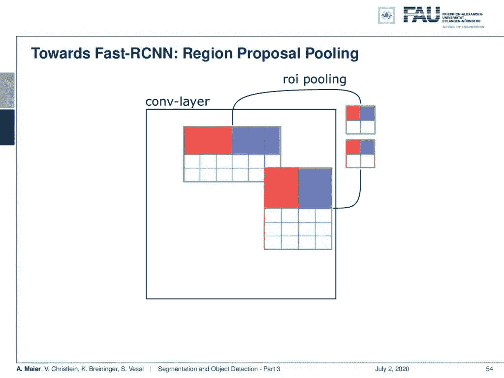

重新绑定到固定的输入大小是通过池化实现的。 [CC 下的图片来自](https://creativecommons.org/licenses/by/4.0/)[深度学习讲座](https://www.youtube.com/watch?v=p-_Stl0t3kU&list=PLpOGQvPCDQzvgpD3S0vTy7bJe2pf_yJFj&index=1)的 4.0 。

一个原因是，我们有这个区域提案库，您可以根据区域标识中的这些建议进行汇总。你可以简单地用最大池来实现。如果你只是在一个固定的采样中做，你在这一步会丢失一些信息。

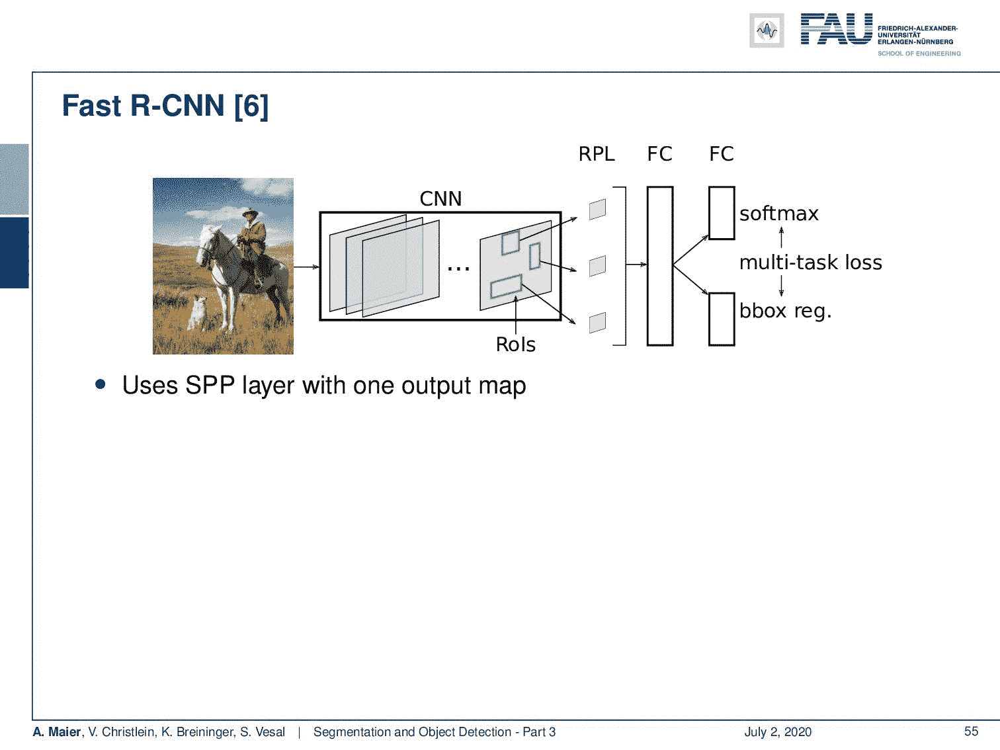

快速 RCNN 的剩余问题。来自[深度学习讲座](https://www.youtube.com/watch?v=p-_Stl0t3kU&list=PLpOGQvPCDQzvgpD3S0vTy7bJe2pf_yJFj&index=1)的 [CC BY 4.0](https://creativecommons.org/licenses/by/4.0/) 下的图片。

此外，这种空间金字塔池用于一个输出地图。他们有一些想法来更好地选择小批量的样品。你可以随机抽取 128 个均匀的感兴趣区域，如果你这样做，那么特征图通常不会重叠。相反，您也可以进行分层采样，然后从几幅图像中进行采样，但会有许多 ROI，比如 64 个。然后，你产生一个高度重叠。将支持向量机和回归替换为用于分类的 softmax 图层和用于边界框微调的回归图层。这将导致多任务丢失，并且总的来说，训练比 RCNN 快 9 倍。但我们仍然不是实时的。因此，除了投资回报提案，我们几乎是端到端的。

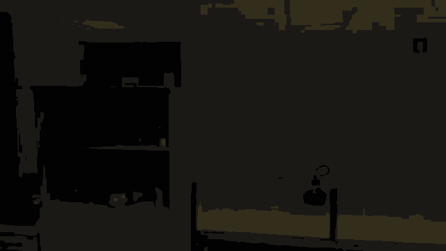

家居用品也可以在货架上检测到。未来的超市会使用这种技术吗？使用 [gifify](https://github.com/vvo/gifify) 创建的图像。来源: [YouTube](https://youtu.be/Py6_qG52EYQ)

为了进一步加速，你可以做的就是所谓的更快的 RCNN。这里的关键思想是，您添加一个区域建议网络，输入现在是生成的特征地图，输出是我们的区域建议。

使用区域提议网络，我们可以端到端地训练我们的 RCNN。来自[深度学习讲座](https://www.youtube.com/watch?v=p-_Stl0t3kU&list=PLpOGQvPCDQzvgpD3S0vTy7bJe2pf_yJFj&index=1)的 4.0CC 下的图片。

这集成到快速 RCNN 中。这里的想法是用不同的比例和纵横比定义锚定框，通常是三个比例和三个纵横比。这导致了有效的多尺度。因此，图像大小和过滤器大小都不需要改变。您可以获得大约 4000 个盒子参数和 2000 个分数，因为您拥有用于对象/非对象检测的 softmax。

快速 RCNN 的配置。 [CC 下的图片来自](https://creativecommons.org/licenses/by/4.0/)[深度学习讲座](https://www.youtube.com/watch?v=p-_Stl0t3kU&list=PLpOGQvPCDQzvgpD3S0vTy7bJe2pf_yJFj&index=1)的 4.0 。

这样，你就有了一个完全卷积的端到端系统，但这个系统仍然不是实时的。那么，让我们来比较一下这些方法。在这里，您可以看到基于 RCNN 的不同架构的概述。

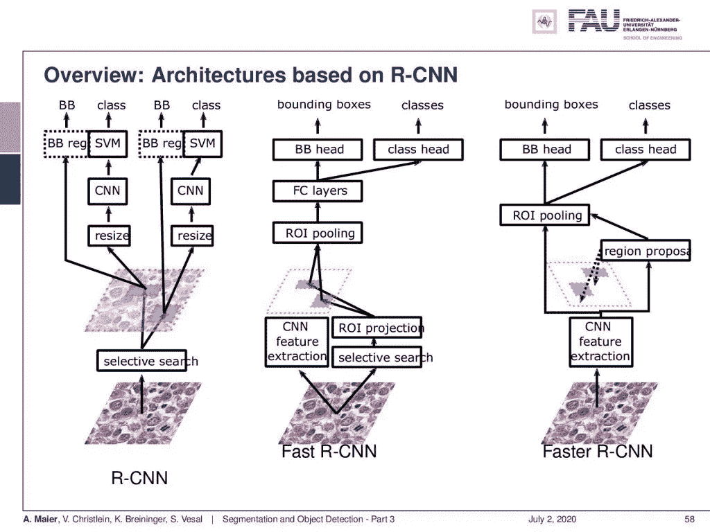

RCNN、快速 RCNN 和更快 RCNN 的比较。来自[深度学习讲座](https://www.youtube.com/watch?v=p-_Stl0t3kU&list=PLpOGQvPCDQzvgpD3S0vTy7bJe2pf_yJFj&index=1)的 [CC BY 4.0](https://creativecommons.org/licenses/by/4.0/) 下的图片。

你可以看到 RCNN 本身也在进行选择性搜索。然后，根据产生感兴趣区域的选择性搜索，调整大小。你使用一个 CNN，然后由支持向量机处理，你还做了一个包围盒回归，以完善包围盒。因此，快速 RCNN 在完全卷积方法中使用一个 CNN 进行特征提取。一步就可以制作出完整的特征地图。您仍然可以进行选择性搜索，然后生成感兴趣区域，您可以在空间金字塔池中使用它们，以便为完全连接的图层提供信息。然后，你有包围盒检测头和正在做这种多任务预测的类头。在更快的 RCNN 中，你真正进入了一个端到端的系统。这里，你有 CNN 特征提取。从这些提取的特征中，你做区域提议。随后进行 ROI 合并，然后得到边界框预测头和类头，这在训练、端到端方面快得多，在推理方面也快得多。

在这个深度学习讲座中，更多令人兴奋的事情即将到来。 [CC 下的图片来自](https://creativecommons.org/licenses/by/4.0/)[深度学习讲座](https://www.youtube.com/watch?v=p-_Stl0t3kU&list=PLpOGQvPCDQzvgpD3S0vTy7bJe2pf_yJFj&index=1)的 4.0 。

尽管如此，我们仍然不能进行实时分类，这就是为什么我们下次要讨论能够做到这一点的单次检测器。我真的希望你喜欢这个视频，我期待着在下一个视频中见到你。拜拜。

这个皮卡丘探测器不会帮你玩 Pokemon Go。使用 [gifify](https://github.com/vvo/gifify) 创建的图像。来源: [YouTube](https://youtu.be/UnSdl0UzLPM)

如果你喜欢这篇文章，你可以在这里找到[更多的文章](https://medium.com/@akmaier)，在这里找到更多关于机器学习的教育材料[，或者看看我们的](https://lme.tf.fau.de/teaching/free-deep-learning-resources/)[深度](https://www.youtube.com/watch?v=p-_Stl0t3kU&list=PLpOGQvPCDQzvgpD3S0vTy7bJe2pf_yJFj) [学习](https://www.youtube.com/watch?v=p-_Stl0t3kU&list=PLpOGQvPCDQzvgpD3S0vTy7bJe2pf_yJFj&index=1) [讲座](https://www.youtube.com/watch?v=p-_Stl0t3kU&list=PLpOGQvPCDQzvgpD3S0vTy7bJe2pf_yJFj)。如果你想在未来了解更多的文章、视频和研究，我也会很感激关注 YouTube、Twitter、脸书、LinkedIn 或 T21。本文以 [Creative Commons 4.0 归属许可](https://creativecommons.org/licenses/by/4.0/deed.de)发布，如果引用，可以转载和修改。如果你有兴趣从视频讲座中生成文字记录，试试[自动博客](http://autoblog.tf.fau.de/)。

# 参考

[1] Vijay Badrinarayanan, Alex Kendall, and Roberto Cipolla. “Segnet: A deep convolutional encoder-decoder architecture for image segmentation”. In: arXiv preprint arXiv:1511.00561 (2015). arXiv: 1311.2524.
[2] Xiao Bian, Ser Nam Lim, and Ning Zhou. “Multiscale fully convolutional network with application to industrial inspection”. In: Applications of Computer Vision (WACV), 2016 IEEE Winter Conference on. IEEE. 2016, pp. 1–8.
[3] Liang-Chieh Chen, George Papandreou, Iasonas Kokkinos, et al. “Semantic Image Segmentation with Deep Convolutional Nets and Fully Connected CRFs”. In: CoRR abs/1412.7062 (2014). arXiv: 1412.7062.
[4] Liang-Chieh Chen, George Papandreou, Iasonas Kokkinos, et al. “Deeplab: Semantic image segmentation with deep convolutional nets, atrous convolution, and fully connected crfs”. In: arXiv preprint arXiv:1606.00915 (2016).
[5] S. Ren, K. He, R. Girshick, et al. “Faster R-CNN: Towards Real-Time Object Detection with Region Proposal Networks”. In: vol. 39\. 6\. June 2017, pp. 1137–1149.
[6] R. Girshick. “Fast R-CNN”. In: 2015 IEEE International Conference on Computer Vision (ICCV). Dec. 2015, pp. 1440–1448.
[7] Tsung-Yi Lin, Priya Goyal, Ross Girshick, et al. “Focal loss for dense object detection”. In: arXiv preprint arXiv:1708.02002 (2017).
[8] Alberto Garcia-Garcia, Sergio Orts-Escolano, Sergiu Oprea, et al. “A Review on Deep Learning Techniques Applied to Semantic Segmentation”. In: arXiv preprint arXiv:1704.06857 (2017).
[9] Bharath Hariharan, Pablo Arbeláez, Ross Girshick, et al. “Simultaneous detection and segmentation”. In: European Conference on Computer Vision. Springer. 2014, pp. 297–312.
[10] Kaiming He, Georgia Gkioxari, Piotr Dollár, et al. “Mask R-CNN”. In: CoRR abs/1703.06870 (2017). arXiv: 1703.06870.
[11] N. Dalal and B. Triggs. “Histograms of oriented gradients for human detection”. In: 2005 IEEE Computer Society Conference on Computer Vision and Pattern Recognition Vol. 1\. June 2005, 886–893 vol. 1.
[12] Jonathan Huang, Vivek Rathod, Chen Sun, et al. “Speed/accuracy trade-offs for modern convolutional object detectors”. In: CoRR abs/1611.10012 (2016). arXiv: 1611.10012.
[13] Jonathan Long, Evan Shelhamer, and Trevor Darrell. “Fully convolutional networks for semantic segmentation”. In: Proceedings of the IEEE Conference on Computer Vision and Pattern Recognition. 2015, pp. 3431–3440.
[14] Pauline Luc, Camille Couprie, Soumith Chintala, et al. “Semantic segmentation using adversarial networks”. In: arXiv preprint arXiv:1611.08408 (2016).
[15] Christian Szegedy, Scott E. Reed, Dumitru Erhan, et al. “Scalable, High-Quality Object Detection”. In: CoRR abs/1412.1441 (2014). arXiv: 1412.1441.
[16] Hyeonwoo Noh, Seunghoon Hong, and Bohyung Han. “Learning deconvolution network for semantic segmentation”. In: Proceedings of the IEEE International Conference on Computer Vision. 2015, pp. 1520–1528.
[17] Adam Paszke, Abhishek Chaurasia, Sangpil Kim, et al. “Enet: A deep neural network architecture for real-time semantic segmentation”. In: arXiv preprint arXiv:1606.02147 (2016).
[18] Pedro O Pinheiro, Ronan Collobert, and Piotr Dollár. “Learning to segment object candidates”. In: Advances in Neural Information Processing Systems. 2015, pp. 1990–1998.
[19] Pedro O Pinheiro, Tsung-Yi Lin, Ronan Collobert, et al. “Learning to refine object segments”. In: European Conference on Computer Vision. Springer. 2016, pp. 75–91.
[20] Ross B. Girshick, Jeff Donahue, Trevor Darrell, et al. “Rich feature hierarchies for accurate object detection and semantic segmentation”. In: CoRR abs/1311.2524 (2013). arXiv: 1311.2524.
[21] Olaf Ronneberger, Philipp Fischer, and Thomas Brox. “U-net: Convolutional networks for biomedical image segmentation”. In: MICCAI. Springer. 2015, pp. 234–241.
[22] Kaiming He, Xiangyu Zhang, Shaoqing Ren, et al. “Spatial Pyramid Pooling in Deep Convolutional Networks for Visual Recognition”. In: Computer Vision — ECCV 2014\. Cham: Springer International Publishing, 2014, pp. 346–361.
[23] J. R. R. Uijlings, K. E. A. van de Sande, T. Gevers, et al. “Selective Search for Object Recognition”. In: International Journal of Computer Vision 104.2 (Sept. 2013), pp. 154–171.
[24] Wei Liu, Dragomir Anguelov, Dumitru Erhan, et al. “SSD: Single Shot MultiBox Detector”. In: Computer Vision — ECCV 2016\. Cham: Springer International Publishing, 2016, pp. 21–37.
[25] P. Viola and M. Jones. “Rapid object detection using a boosted cascade of simple features”. In: Proceedings of the 2001 IEEE Computer Society Conference on Computer Vision Vol. 1\. 2001, pp. 511–518.
[26] J. Redmon, S. Divvala, R. Girshick, et al. “You Only Look Once: Unified, Real-Time Object Detection”. In: 2016 IEEE Conference on Computer Vision and Pattern Recognition (CVPR). June 2016, pp. 779–788.
[27] Joseph Redmon and Ali Farhadi. “YOLO9000: Better, Faster, Stronger”. In: CoRR abs/1612.08242 (2016). arXiv: 1612.08242.
[28] Fisher Yu and Vladlen Koltun. “Multi-scale context aggregation by dilated convolutions”. In: arXiv preprint arXiv:1511.07122 (2015).
[29] Shuai Zheng, Sadeep Jayasumana, Bernardino Romera-Paredes, et al. “Conditional Random Fields as Recurrent Neural Networks”. In: CoRR abs/1502.03240 (2015). arXiv: 1502.03240.
[30] Alejandro Newell, Kaiyu Yang, and Jia Deng. “Stacked hourglass networks for human pose estimation”. In: European conference on computer vision. Springer. 2016, pp. 483–499.