# 分割和目标检测—第 4 部分

> 原文：<https://towardsdatascience.com/segmentation-and-object-detection-part-4-f1d0d213976b?source=collection_archive---------52----------------------->

## [FAU 讲座笔记](https://towardsdatascience.com/tagged/fau-lecture-notes)关于深度学习

## 单发探测器

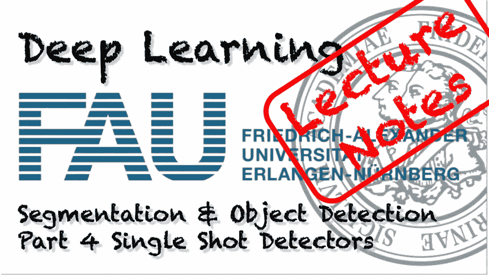

FAU 大学的深度学习。下图 [CC BY 4.0](https://creativecommons.org/licenses/by/4.0/) 来自[深度学习讲座](https://www.youtube.com/watch?v=p-_Stl0t3kU&list=PLpOGQvPCDQzvgpD3S0vTy7bJe2pf_yJFj&index=1)

**这些是 FAU 的 YouTube 讲座** [**深度学习**](https://www.youtube.com/watch?v=p-_Stl0t3kU&list=PLpOGQvPCDQzvgpD3S0vTy7bJe2pf_yJFj&index=1) **的讲义。这是讲座视频&配套幻灯片的完整抄本。我们希望，你喜欢这个视频一样多。当然，这份抄本是用深度学习技术在很大程度上自动创建的，只进行了少量的手动修改。** [**自己试试吧！如果您发现错误，请告诉我们！**](http://autoblog.tf.fau.de/)

# 航行

[**上一讲**](/segmentation-and-object-detection-part-3-abb4ec936fa) **/** [**观看本视频**](https://www.youtube.com/watch?v=tBzc2nqvFGk) **/** [**顶级**](/all-you-want-to-know-about-deep-learning-8d68dcffc258) **/** [**下一讲**](/segmentation-and-object-detection-part-5-4c6f70d25d31)

今天的话题是复杂场景下的实时物体检测。使用 [gifify](https://github.com/vvo/gifify) 创建的图像。来源: [YouTube](https://youtu.be/VOC3huqHrss)

欢迎回到深度学习！所以今天，我们想讨论一下单次检测器，以及如何实现实时物体检测。

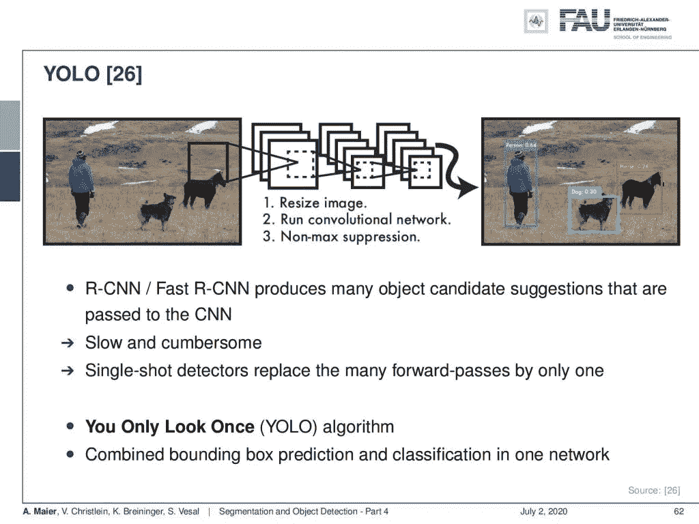

单次触发探测器的一般概念。 [CC 下的图片来自](https://creativecommons.org/licenses/by/4.0/)[深度学习讲座](https://www.youtube.com/watch?v=p-_Stl0t3kU&list=PLpOGQvPCDQzvgpD3S0vTy7bJe2pf_yJFj&index=1)的 4.0 。

好了，分割和对象检测的第四部分——单次检测器。所以，难道我们不能在《你只看一次》中使用区域提议网络作为检测器吗？这是 YOLO 的想法，这是一个单触发探测器。您只需查看一次-将边界框预测和分类合并到一个网络中。

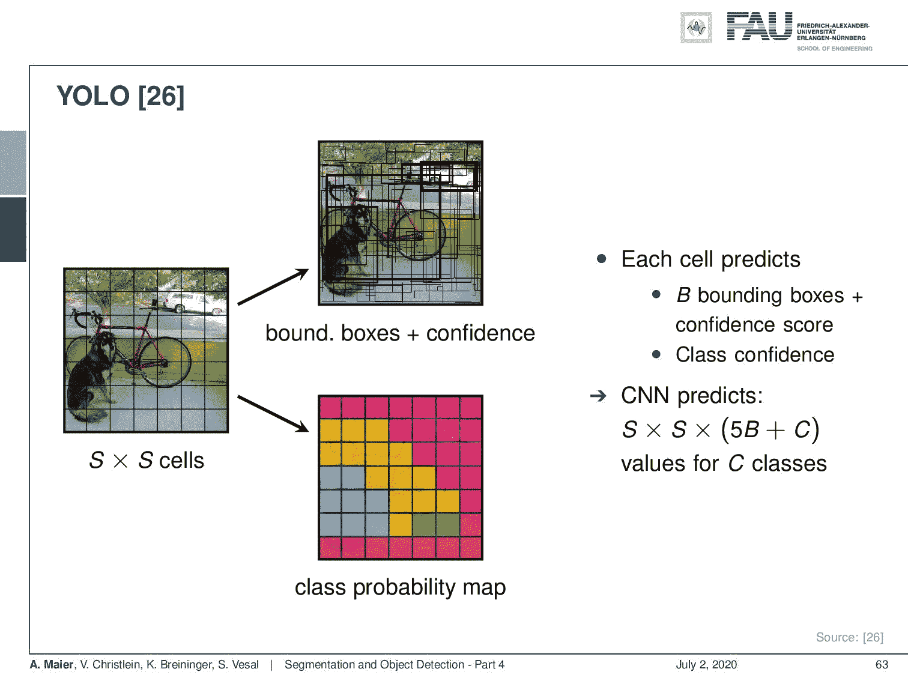

YOLO 算法。 [CC 下的图片来自](https://creativecommons.org/licenses/by/4.0/)[深度学习讲座](https://www.youtube.com/watch?v=p-_Stl0t3kU&list=PLpOGQvPCDQzvgpD3S0vTy7bJe2pf_yJFj&index=1)的 4.0 。

这是通过将图像基本上细分成 S×S 个单元来完成的，并且对于每个单元，并行地进行分类概率图计算，并且产生边界框和置信度。这将为每个单元格提供 B 个边界框，这些边界框带有一个置信度得分和类置信度，由 CNN 生成。所以 CNN 预测 S 乘以 S 乘以(5 B + C)的值，其中 C 是类的数量。最后，为了产生最终的对象检测，计算边界框与相应类别概率图的重叠。然后，这允许您计算这个边界框内的平均值，以产生相应对象的最终类。这样你就能解决像这样的复杂场景，而且这是实时的。

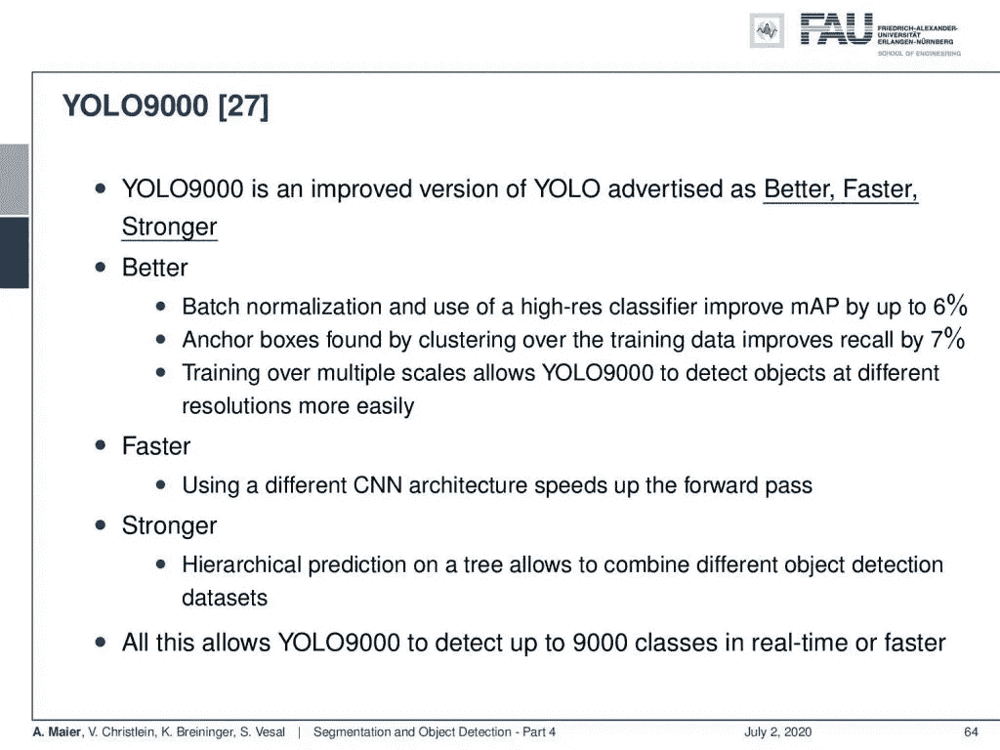

来自[深度学习讲座](https://www.youtube.com/watch?v=p-_Stl0t3kU&list=PLpOGQvPCDQzvgpD3S0vTy7bJe2pf_yJFj&index=1)的 [CC BY 4.0](https://creativecommons.org/licenses/by/4.0/) 下的 YOLO9000 图片规格。

所以有 YOLO9000，它是 YOLO 的改进版，被宣传为更好、更快、更强。所以更好是因为用了批量归一化。他们还进行高分辨率分类，将平均精度提高了 6%。通过对训练数据进行聚类而找到的锚框将召回率提高了 7%。多尺度训练让 YOLO9000 更容易检测到不同分辨率的物体。它更快，因为它使用了不同的 CNN 架构，加快了向前传递的速度。最后，它更强大，因为它在树上具有这种分层检测，允许组合不同的对象检测数据集。所有这些都使 YOLO9000 能够实时或更快地检测到多达 9000 个类别。

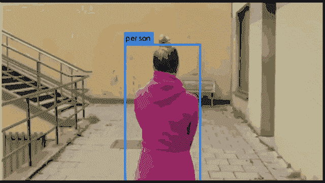

YOLO9000 在行动。使用 [gifify](https://github.com/vvo/gifify) 创建的图像。来源: [YouTube](https://youtu.be/px3WEoFOa48)

还有[24]中的单次多盒检测器。这是一个受欢迎的 YOLO 的替代品。也是像 Yolo 一样只有一次前向通过 CNN 的单发探测器。

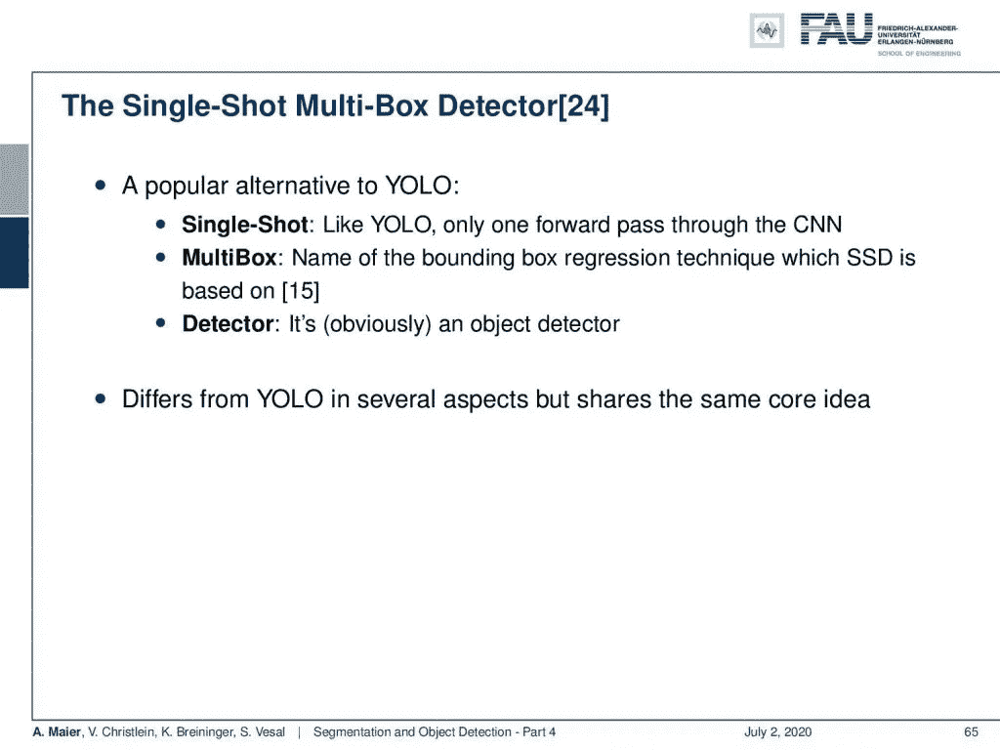

单次多盒探测器。 [CC 下的图片来自](https://creativecommons.org/licenses/by/4.0/)[深度学习讲座](https://www.youtube.com/watch?v=p-_Stl0t3kU&list=PLpOGQvPCDQzvgpD3S0vTy7bJe2pf_yJFj&index=1)的 4.0 。

它被称为多框，因为这是[15]中边界框回归技术的名称，它显然是一个对象检测器。它在几个方面不同于 YOLO，但有着相同的核心思想。

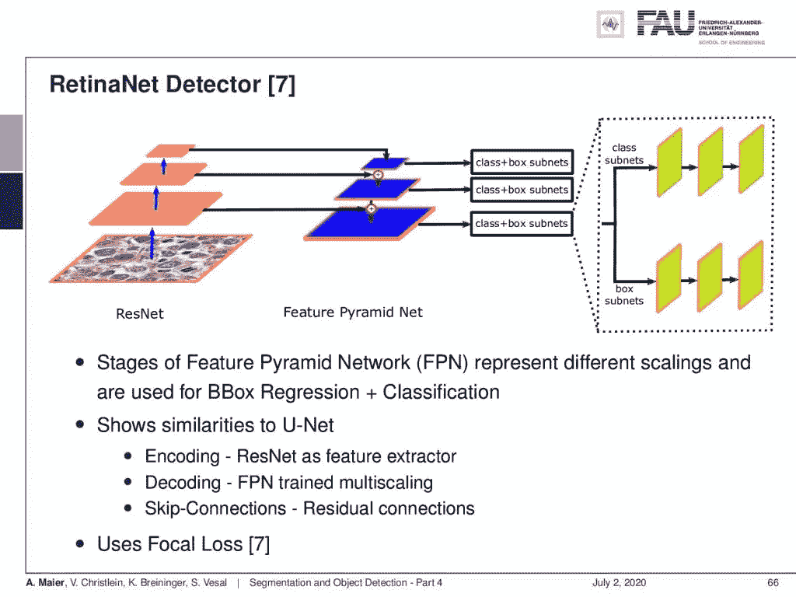

RetinaNet 是一个多尺度单次检测器。来自[深度学习讲座](https://www.youtube.com/watch?v=p-_Stl0t3kU&list=PLpOGQvPCDQzvgpD3S0vTy7bJe2pf_yJFj&index=1)的 [CC BY 4.0](https://creativecommons.org/licenses/by/4.0/) 下的图片。

现在，你仍然有一个多重分辨率的问题。特别是，如果你想到像组织学图像这种分辨率非常高的任务。然后，你也可以使用像 RetinaNet 这样的探测器。它实际上使用的是一个 ResNet CNN 编码器/解码器。这与我们在图像分割中已经看到的非常相似。它使用特征金字塔网络，允许您将不同的特征地图与解码器生成的原始输入图像结合起来。所以你可以说它非常类似于 U-net。与 U-net 相比，它使用特征金字塔网络的每个尺度上的子网进行类别和盒子预测。因此，你可以说它是一个单次检测器，同时使用 U-net 进行类和箱预测。此外，它还利用了我们将在几张幻灯片中讨论的焦点损失。

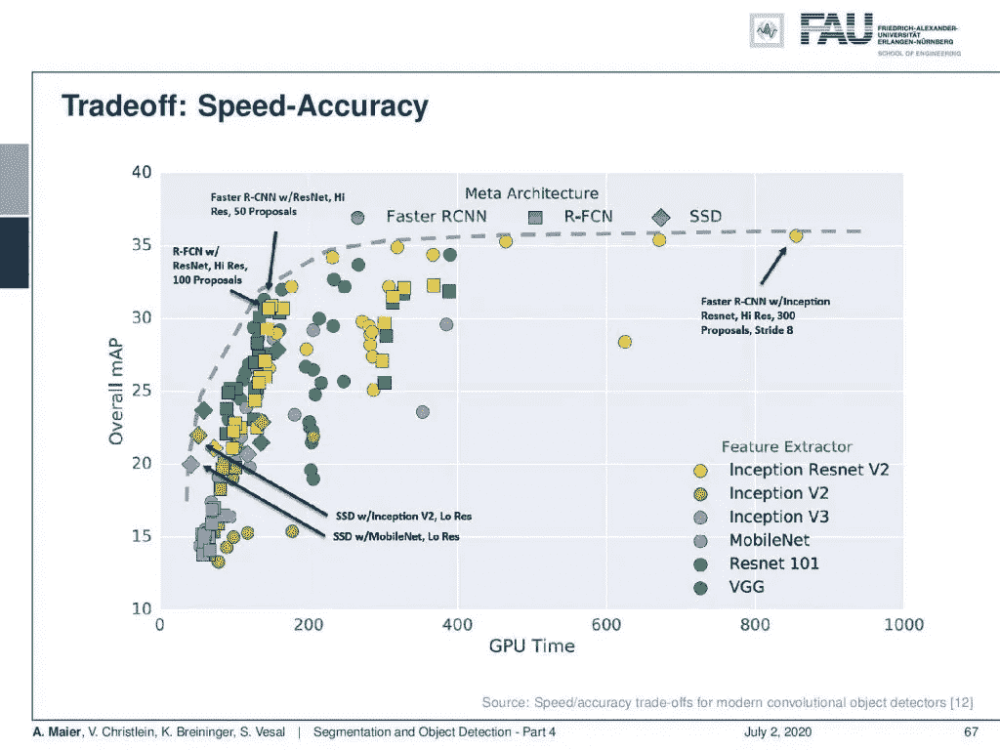

不同物体探测器的比较。 [CC 下的图片来自](https://creativecommons.org/licenses/by/4.0/)[深度学习讲座](https://www.youtube.com/watch?v=p-_Stl0t3kU&list=PLpOGQvPCDQzvgpD3S0vTy7bJe2pf_yJFj&index=1)的 4.0 。

让我们来看看速度和准确性之间的权衡。你可以看到，一般来说，非常精确的网络并没有那么快。这里，您可以在 x 轴上看到 GPU 时间，在 y 轴上看到总体平均精度。您可以看到，您可以将单次检测器(RCNN)等架构或更快的 RCNN 等理念与不同的特征提取器(如 Inception-ResNet、Inception 等)相结合。这使我们能够产生许多不同的组合。你可以看到，如果你在计算上花更多的时间，那么你通常也可以提高精度，这反映在这个图中。

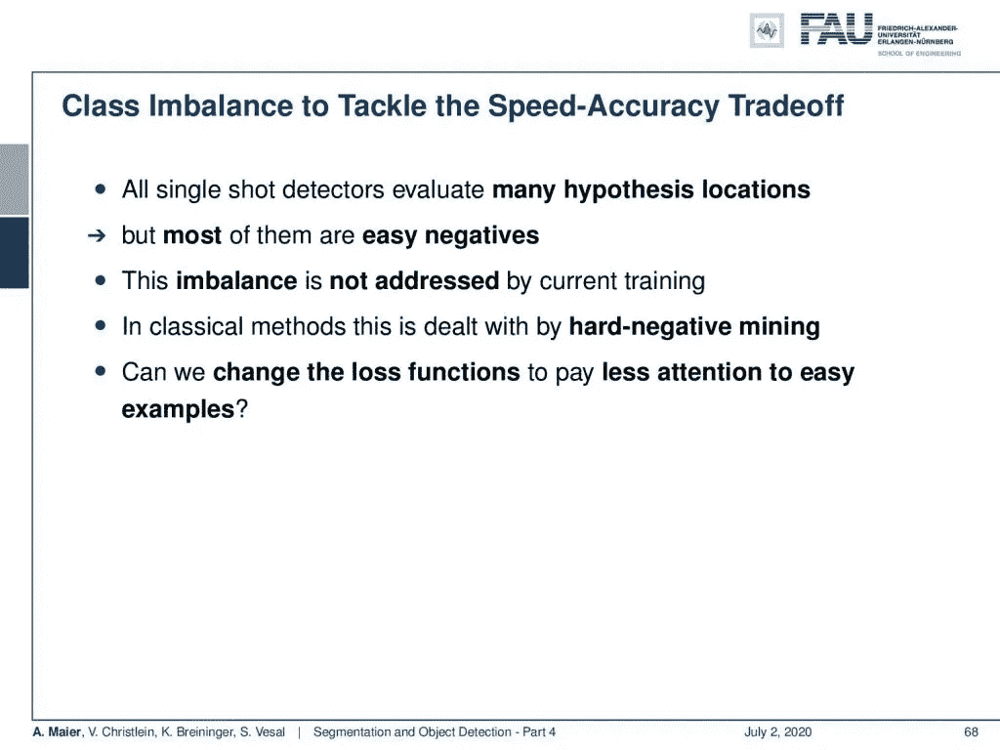

我们如何处理阶层失衡？ [CC 下的图片来自](https://creativecommons.org/licenses/by/4.0/)[深度学习讲座](https://www.youtube.com/watch?v=p-_Stl0t3kU&list=PLpOGQvPCDQzvgpD3S0vTy7bJe2pf_yJFj&index=1)的 4.0 。

类的不平衡是解决速度-精度权衡的关键。所有这些单触发检测器评估许多假设位置。大部分都是很容易否定的。因此，目前的培训没有解决这种不平衡。在经典方法中，我们通常用硬负挖掘来处理这个问题。现在，问题是“我们能不能改变损失函数来减少对简单例子的关注？”。

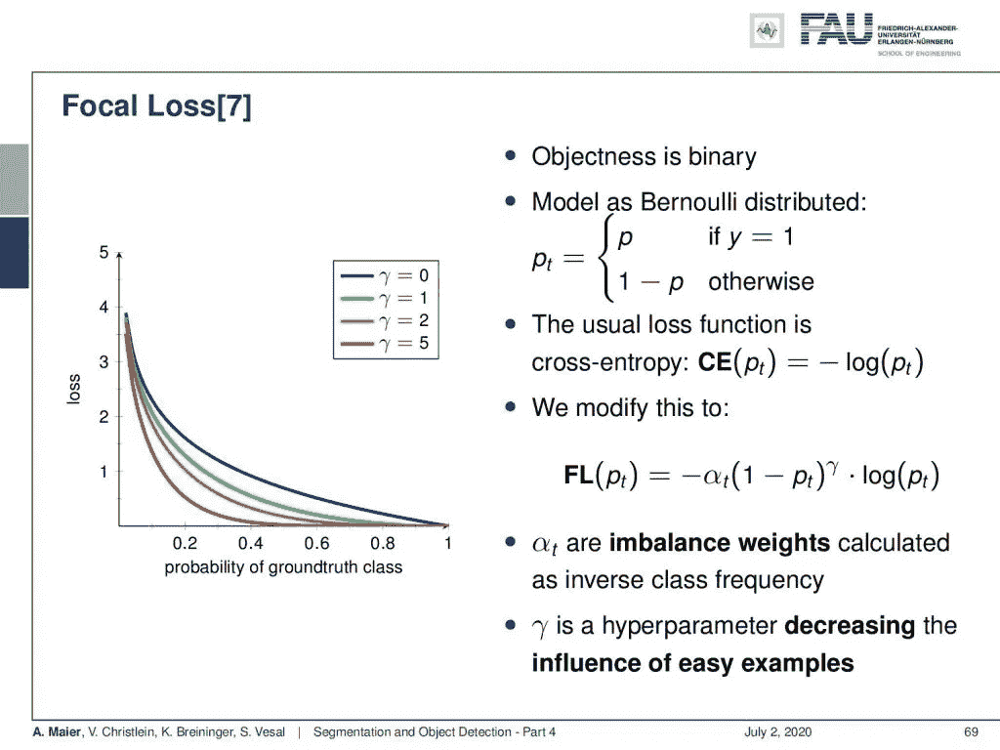

焦点损失。来自[深度学习讲座](https://www.youtube.com/watch?v=p-_Stl0t3kU&list=PLpOGQvPCDQzvgpD3S0vTy7bJe2pf_yJFj&index=1)的 [CC BY 4.0](https://creativecommons.org/licenses/by/4.0/) 下的图片。

这个想法恰恰把我们带到了焦点损失。在这里，我们基本上可以将对象性定义为二进制的，不管它是不是一个对象。然后，你可以把它模拟成伯努利分布。通常的损失只是交叉熵，也就是正确类别的负对数。你现在可以看到，我们可以把它调整到所谓的焦点损失。这里，我们引入一个附加参数α。α是作为类别频率倒数计算的不平衡重量。此外，我们还引入了超参数γ。这允许减少简单例子的影响。所以，你可以看到γ对左手边的图的影响。你增加的γ越多，你各自的体重就越多，这样你就可以真正专注于不太频繁的课程。

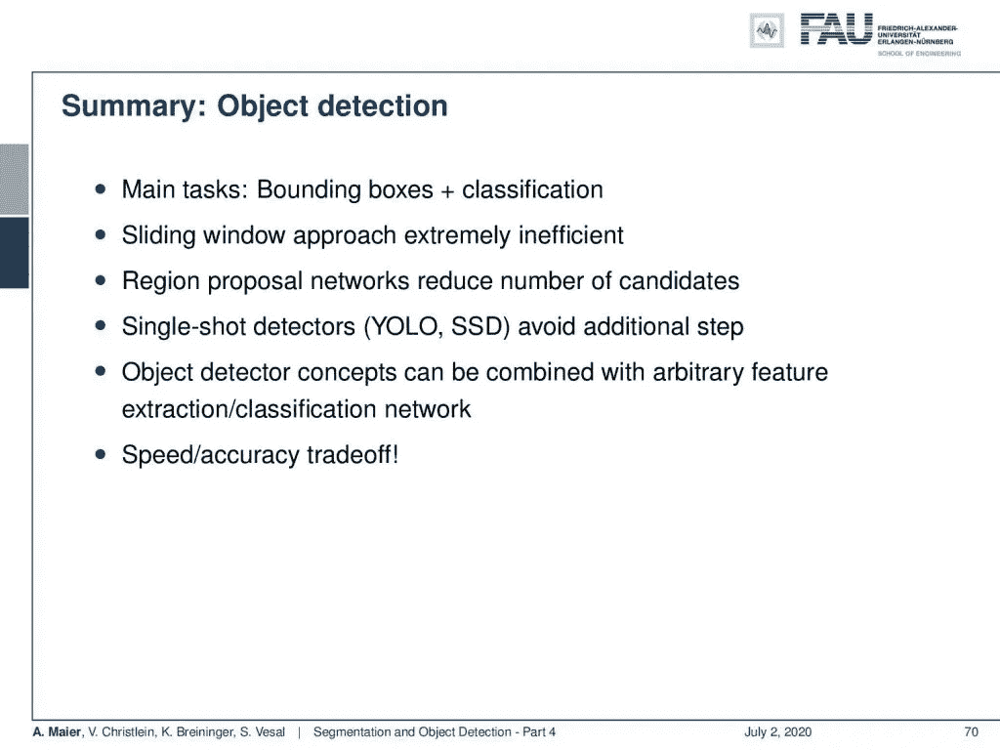

物体检测概述。 [CC 下的图片来自](https://creativecommons.org/licenses/by/4.0/)[深度学习讲座](https://www.youtube.com/watch?v=p-_Stl0t3kU&list=PLpOGQvPCDQzvgpD3S0vTy7bJe2pf_yJFj&index=1)的 4.0 。

那么，我们来总结一下物体检测。主要任务是检测包围盒和相关的分类。滑动窗口方法效率极低。区域建议网络减少了候选的数量，但是如果你真的想走向实时，那么你必须使用像 YOLO 这样的单次检测器来避免额外的步骤。当然，对象检测器概念可以与我们前面看到的任意特征提取和分类网络相结合。此外，请记住速度和精度之间的权衡。所以，如果你想变得非常快，那么你当然要减少预测的包围盒的数量，因为这样你会变得更快，但是你可能会错过真正的肯定。请注意，许多实现已经可用[31]。

在这个深度学习讲座中，更多令人兴奋的事情即将到来。 [CC 下的图片来自](https://creativecommons.org/licenses/by/4.0/)[深度学习讲座](https://www.youtube.com/watch?v=p-_Stl0t3kU&list=PLpOGQvPCDQzvgpD3S0vTy7bJe2pf_yJFj&index=1)的 4.0 。

我们现在讨论了细分。我们现在讨论了对象检测以及如何非常快速地进行对象检测。下一次，我们将探讨两者的融合，也就是实例细分。所以，非常感谢你观看这个视频，我期待着在下一个视频中见到你。

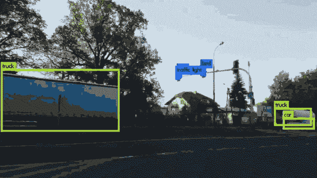

Yolo COCO 物体探测器在工作。使用 [gifify](https://github.com/vvo/gifify) 创建的图像。来源: [YouTube](https://youtu.be/yQwfDxBMtXg)

如果你喜欢这篇文章，你可以在这里找到更多的文章，或者看看我们的讲座。如果你想在未来了解更多的文章、视频和研究，我也会很感激关注 [YouTube](https://www.youtube.com/c/AndreasMaierTV) 、 [Twitter](https://twitter.com/maier_ak) 、[脸书](https://www.facebook.com/andreas.maier.31337)或 [LinkedIn](https://www.linkedin.com/in/andreas-maier-a6870b1a6/) 。本文以 [Creative Commons 4.0 归属许可](https://creativecommons.org/licenses/by/4.0/deed.de)发布，如果引用，可以转载和修改。如果你有兴趣从视频讲座中获得文字记录，试试[自动博客](http://autoblog.tf.fau.de/)。

# 参考

[1] Vijay Badrinarayanan, Alex Kendall, and Roberto Cipolla. “Segnet: A deep convolutional encoder-decoder architecture for image segmentation”. In: arXiv preprint arXiv:1511.00561 (2015). arXiv: 1311.2524.
[2] Xiao Bian, Ser Nam Lim, and Ning Zhou. “Multiscale fully convolutional network with application to industrial inspection”. In: Applications of Computer Vision (WACV), 2016 IEEE Winter Conference on. IEEE. 2016, pp. 1–8.
[3] Liang-Chieh Chen, George Papandreou, Iasonas Kokkinos, et al. “Semantic Image Segmentation with Deep Convolutional Nets and Fully Connected CRFs”. In: CoRR abs/1412.7062 (2014). arXiv: 1412.7062.
[4] Liang-Chieh Chen, George Papandreou, Iasonas Kokkinos, et al. “Deeplab: Semantic image segmentation with deep convolutional nets, atrous convolution, and fully connected crfs”. In: arXiv preprint arXiv:1606.00915 (2016).
[5] S. Ren, K. He, R. Girshick, et al. “Faster R-CNN: Towards Real-Time Object Detection with Region Proposal Networks”. In: vol. 39\. 6\. June 2017, pp. 1137–1149.
[6] R. Girshick. “Fast R-CNN”. In: 2015 IEEE International Conference on Computer Vision (ICCV). Dec. 2015, pp. 1440–1448.
[7] Tsung-Yi Lin, Priya Goyal, Ross Girshick, et al. “Focal loss for dense object detection”. In: arXiv preprint arXiv:1708.02002 (2017).
[8] Alberto Garcia-Garcia, Sergio Orts-Escolano, Sergiu Oprea, et al. “A Review on Deep Learning Techniques Applied to Semantic Segmentation”. In: arXiv preprint arXiv:1704.06857 (2017).
[9] Bharath Hariharan, Pablo Arbeláez, Ross Girshick, et al. “Simultaneous detection and segmentation”. In: European Conference on Computer Vision. Springer. 2014, pp. 297–312.
[10] Kaiming He, Georgia Gkioxari, Piotr Dollár, et al. “Mask R-CNN”. In: CoRR abs/1703.06870 (2017). arXiv: 1703.06870.
[11] N. Dalal and B. Triggs. “Histograms of oriented gradients for human detection”. In: 2005 IEEE Computer Society Conference on Computer Vision and Pattern Recognition Vol. 1\. June 2005, 886–893 vol. 1.
[12] Jonathan Huang, Vivek Rathod, Chen Sun, et al. “Speed/accuracy trade-offs for modern convolutional object detectors”. In: CoRR abs/1611.10012 (2016). arXiv: 1611.10012.
[13] Jonathan Long, Evan Shelhamer, and Trevor Darrell. “Fully convolutional networks for semantic segmentation”. In: Proceedings of the IEEE Conference on Computer Vision and Pattern Recognition. 2015, pp. 3431–3440.
[14] Pauline Luc, Camille Couprie, Soumith Chintala, et al. “Semantic segmentation using adversarial networks”. In: arXiv preprint arXiv:1611.08408 (2016).
[15] Christian Szegedy, Scott E. Reed, Dumitru Erhan, et al. “Scalable, High-Quality Object Detection”. In: CoRR abs/1412.1441 (2014). arXiv: 1412.1441.
[16] Hyeonwoo Noh, Seunghoon Hong, and Bohyung Han. “Learning deconvolution network for semantic segmentation”. In: Proceedings of the IEEE International Conference on Computer Vision. 2015, pp. 1520–1528.
[17] Adam Paszke, Abhishek Chaurasia, Sangpil Kim, et al. “Enet: A deep neural network architecture for real-time semantic segmentation”. In: arXiv preprint arXiv:1606.02147 (2016).
[18] Pedro O Pinheiro, Ronan Collobert, and Piotr Dollár. “Learning to segment object candidates”. In: Advances in Neural Information Processing Systems. 2015, pp. 1990–1998.
[19] Pedro O Pinheiro, Tsung-Yi Lin, Ronan Collobert, et al. “Learning to refine object segments”. In: European Conference on Computer Vision. Springer. 2016, pp. 75–91.
[20] Ross B. Girshick, Jeff Donahue, Trevor Darrell, et al. “Rich feature hierarchies for accurate object detection and semantic segmentation”. In: CoRR abs/1311.2524 (2013). arXiv: 1311.2524.
[21] Olaf Ronneberger, Philipp Fischer, and Thomas Brox. “U-net: Convolutional networks for biomedical image segmentation”. In: MICCAI. Springer. 2015, pp. 234–241.
[22] Kaiming He, Xiangyu Zhang, Shaoqing Ren, et al. “Spatial Pyramid Pooling in Deep Convolutional Networks for Visual Recognition”. In: Computer Vision — ECCV 2014\. Cham: Springer International Publishing, 2014, pp. 346–361.
[23] J. R. R. Uijlings, K. E. A. van de Sande, T. Gevers, et al. “Selective Search for Object Recognition”. In: International Journal of Computer Vision 104.2 (Sept. 2013), pp. 154–171.
[24] Wei Liu, Dragomir Anguelov, Dumitru Erhan, et al. “SSD: Single Shot MultiBox Detector”. In: Computer Vision — ECCV 2016\. Cham: Springer International Publishing, 2016, pp. 21–37.
[25] P. Viola and M. Jones. “Rapid object detection using a boosted cascade of simple features”. In: Proceedings of the 2001 IEEE Computer Society Conference on Computer Vision Vol. 1\. 2001, pp. 511–518.
[26] J. Redmon, S. Divvala, R. Girshick, et al. “You Only Look Once: Unified, Real-Time Object Detection”. In: 2016 IEEE Conference on Computer Vision and Pattern Recognition (CVPR). June 2016, pp. 779–788.
[27] Joseph Redmon and Ali Farhadi. “YOLO9000: Better, Faster, Stronger”. In: CoRR abs/1612.08242 (2016). arXiv: 1612.08242.
[28] Fisher Yu and Vladlen Koltun. “Multi-scale context aggregation by dilated convolutions”. In: arXiv preprint arXiv:1511.07122 (2015).
[29] Shuai Zheng, Sadeep Jayasumana, Bernardino Romera-Paredes, et al. “Conditional Random Fields as Recurrent Neural Networks”. In: CoRR abs/1502.03240 (2015). arXiv: 1502.03240.
[30] Alejandro Newell, Kaiyu Yang, and Jia Deng. “Stacked hourglass networks for human pose estimation”. In: European conference on computer vision. Springer. 2016, pp. 483–499.
[31] Object Detection Algorithms and Libraries, Neptune.ai Blog Post: [https://neptune.ai/blog/object-detection-algorithms-and-libraries](https://neptune.ai/blog/object-detection-algorithms-and-libraries)