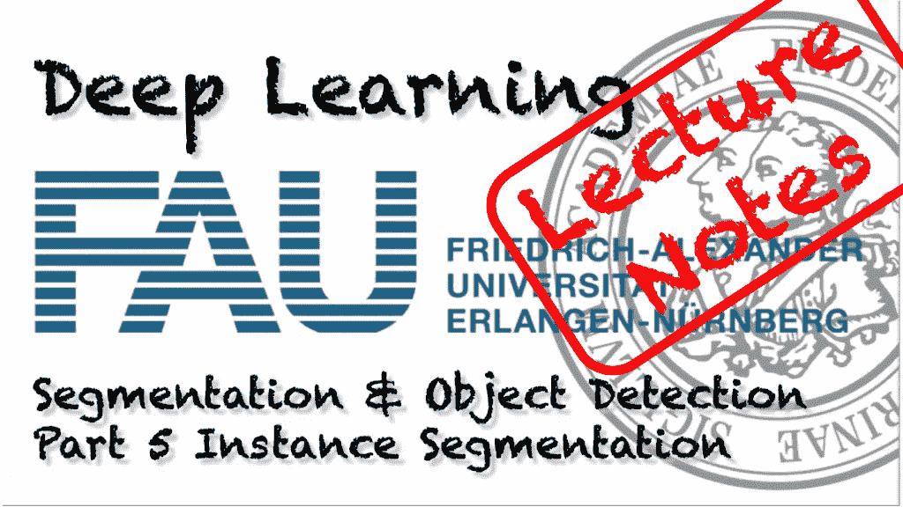
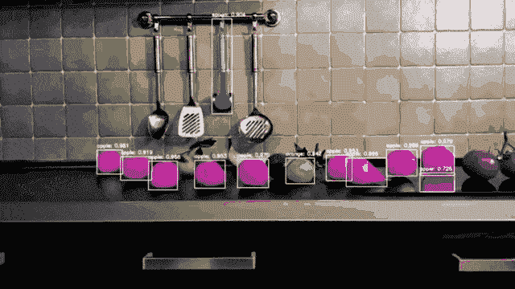
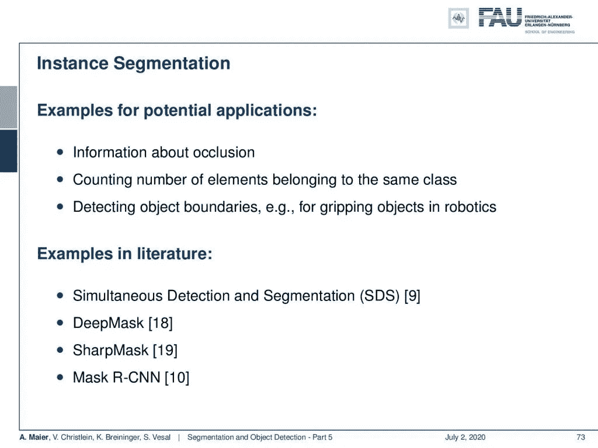
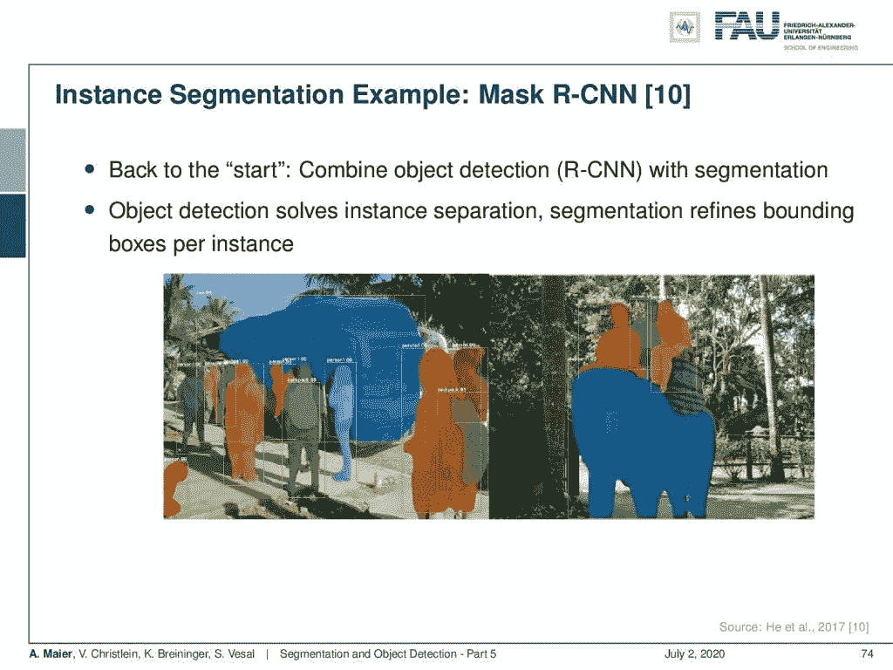
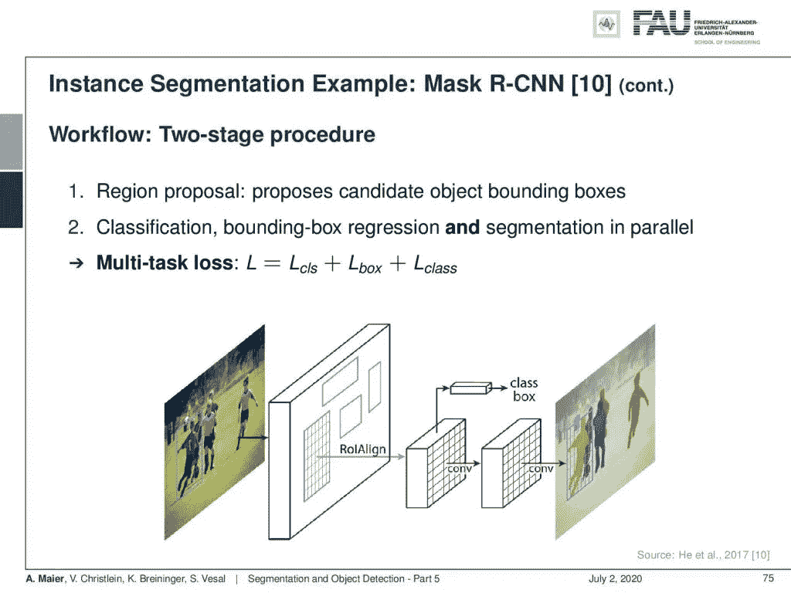
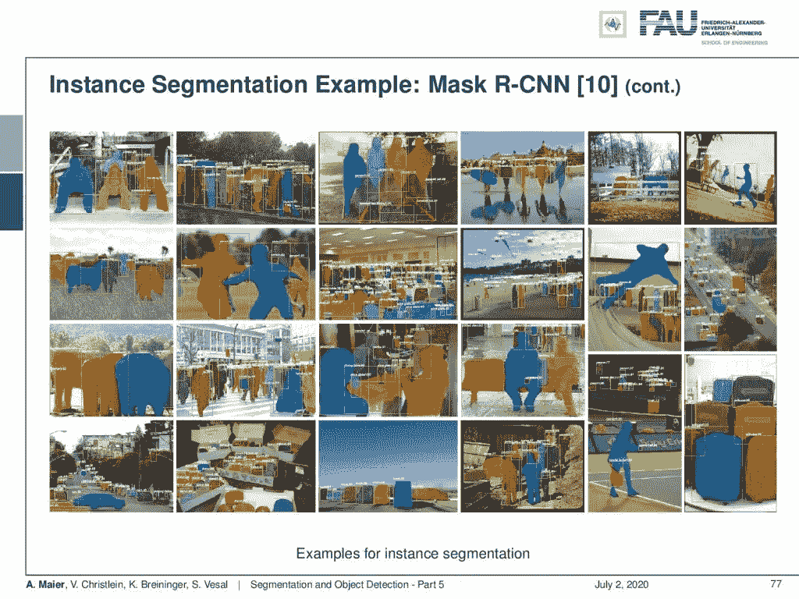
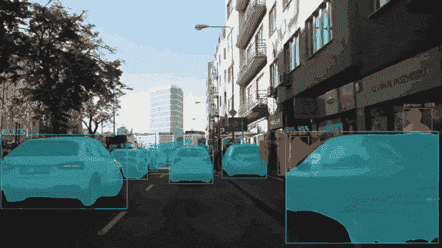
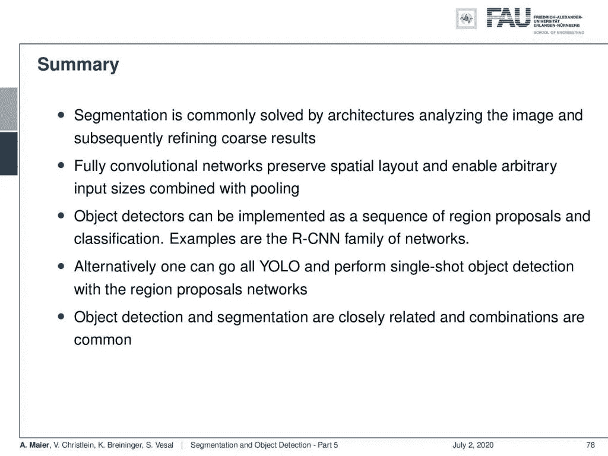

# 分割和目标检测—第 5 部分

> 原文：<https://towardsdatascience.com/segmentation-and-object-detection-part-5-4c6f70d25d31?source=collection_archive---------46----------------------->

## [FAU 讲座笔记](https://towardsdatascience.com/tagged/fau-lecture-notes)关于深度学习

## 实例分割

FAU 大学的深度学习。下图 [CC BY 4.0](https://creativecommons.org/licenses/by/4.0/) 来自[深度学习讲座](https://www.youtube.com/watch?v=p-_Stl0t3kU&list=PLpOGQvPCDQzvgpD3S0vTy7bJe2pf_yJFj&index=1)

**这些是 FAU 的 YouTube 讲座** [**深度学习**](https://www.youtube.com/watch?v=p-_Stl0t3kU&list=PLpOGQvPCDQzvgpD3S0vTy7bJe2pf_yJFj&index=1) **的讲义。这是讲座视频&配套幻灯片的完整抄本。我们希望，你喜欢这个视频一样多。当然，这份抄本是用深度学习技术在很大程度上自动创建的，只进行了少量的手动修改。** [**自己试试吧！如果您发现错误，请告诉我们！**](http://autoblog.tf.fau.de/)

# 航行

[**上一讲**](/segmentation-and-object-detection-part-4-f1d0d213976b) **/** [**观看本视频**](https://youtu.be/BU8K0d5CsH8) **/** [**顶级**](/all-you-want-to-know-about-deep-learning-8d68dcffc258) **/** [**下一讲**](/weakly-and-self-supervised-learning-part-1-8d29fce2dd92)

实例分割也可以用于视频编辑。使用 [gifify](https://github.com/vvo/gifify) 创建的图像。来源: [YouTube](https://youtu.be/WdIYLg9cfno)

欢迎回到深度学习！今天，我们想谈谈物体检测和分割的最后一部分。我们想了解实例分段的概念。

语义分割与实例分割。 [CC 下的图片来自](https://creativecommons.org/licenses/by/4.0/)[深度学习讲座](https://www.youtube.com/watch?v=p-_Stl0t3kU&list=PLpOGQvPCDQzvgpD3S0vTy7bJe2pf_yJFj&index=1)的 4.0 。

那么，让我们来看看我们的幻灯片。你看这已经是最后一部分了。第五部分，现在我们要谈谈实例分割。我们不只是想检测立方体的像素在哪里，而不是杯子的像素在哪里。我们想真正弄清楚哪些像素属于哪个立方体。这本质上是对象检测和语义分割的结合。

实例分割方法的例子。 [CC 下的图片来自](https://creativecommons.org/licenses/by/4.0/)[深度学习讲座](https://www.youtube.com/watch?v=p-_Stl0t3kU&list=PLpOGQvPCDQzvgpD3S0vTy7bJe2pf_yJFj&index=1)的 4.0 。

潜在应用的例子是关于遮挡的信息、对属于同一类的元素的数量进行计数、检测物体边界，例如在机器人学中抓取物体。这是非常重要的，文献中有同时检测和分割的例子，DeepMask、SharpMask 和 Mask RCNN[10]。

掩模 RCNN 是最广泛使用的实例分割方法之一。来自[深度学习讲座](https://www.youtube.com/watch?v=p-_Stl0t3kU&list=PLpOGQvPCDQzvgpD3S0vTy7bJe2pf_yJFj&index=1)的 [CC BY 4.0](https://creativecommons.org/licenses/by/4.0/) 下的图片。

让我们更详细地看看[10]。我们实际上回到了仓库。我们将目标检测和分割结合起来。我们使用 RCNN 进行目标检测。它本质上解决了实例分离。然后，分割细化每个实例的边界框。

掩模 RCNN 的概念。 [CC 下的图片来自](https://creativecommons.org/licenses/by/4.0/)[深度学习讲座](https://www.youtube.com/watch?v=p-_Stl0t3kU&list=PLpOGQvPCDQzvgpD3S0vTy7bJe2pf_yJFj&index=1)的 4.0 。

工作流程是一个两阶段的过程。你有提出物体边界框的区域提议。然后，使用边界框回归进行分类，同时进行分割。因此，您有一个多任务损失，它本质上结合了分割的像素分类损失、框损失和用于产生正确的类/边界框的类损失。所以，你有这三个术语，然后结合在一个多任务损失。

掩模 RCNN 的体系结构。 [CC 下的图片来自](https://creativecommons.org/licenses/by/4.0/)[深度学习讲座](https://www.youtube.com/watch?v=p-_Stl0t3kU&list=PLpOGQvPCDQzvgpD3S0vTy7bJe2pf_yJFj&index=1)的 4.0 。

让我们更详细地了解两阶段程序。两级网络有两种不同的选择。您可以有一个联合分支，该分支在 ROI 上工作，然后在稍后阶段拆分为掩膜分割和类及边界框预测，或者您可以提前拆分。然后，你在两个独立的网络中运行，在两个版本中，你都有这种多任务损失，它结合了逐像素分割损失、盒损失和类损失。

实例分割结果。来自[深度学习讲座](https://www.youtube.com/watch?v=p-_Stl0t3kU&list=PLpOGQvPCDQzvgpD3S0vTy7bJe2pf_yJFj&index=1)的 [CC BY 4.0](https://creativecommons.org/licenses/by/4.0/) 下的图片。

让我们来看一些例子。这些也是来自掩模 RCNN 的结果。你可以看到，老实说，这些是相当令人印象深刻的结果。所以，确实有疑难病例。你辨认出这些人在哪里，你也看到不同的人，当然，是不同的例子。所以，非常令人印象深刻的结果！

Mask RCNN 也适合支持自动驾驶。使用 [gifify](https://github.com/vvo/gifify) 创建的图像。来源: [YouTube](https://youtu.be/OOT3UIXZztE) 。

所以让我们总结一下目前为止我们所看到的。分割通常通过分析图像并随后细化粗略结果的架构来解决。完全卷积网络保留了空间布局，并通过池支持任意输入大小。

分割和目标检测综述。来自[深度学习讲座](https://www.youtube.com/watch?v=p-_Stl0t3kU&list=PLpOGQvPCDQzvgpD3S0vTy7bJe2pf_yJFj&index=1)的 4.0CC 下的图片。

我们可以使用对象检测器，并将它们实现为一系列区域提议和分类。那么这基本上导致了 RCNN 型网络族。或者，您可以使用单次检测器。我们研究了 YOLO，这是一种非常常见且非常快速的技术，如 YOLO9000。我们研究了 RetinaNet，如果你真的有一个规模的依赖，你想检测许多不同的规模，如组织切片处理的例子。因此，对象检测和分割是密切相关的，组合是常见的，正如您在这里看到的实例分割的目的。

在这个深度学习讲座中，更多令人兴奋的事情即将到来。 [CC 下的图片来自](https://creativecommons.org/licenses/by/4.0/)[深度学习讲座](https://www.youtube.com/watch?v=p-_Stl0t3kU&list=PLpOGQvPCDQzvgpD3S0vTy7bJe2pf_yJFj&index=1)的 4.0 。

让我们看看这节课还需要讲些什么。即将出现的是减轻标签负担的方法。因此，我们将讨论弱注释。我们如何生成标签？这也引出了自我监督的概念，这是现在非常流行的话题。为了建立更好的网络，它被大量使用。这些方法还能够稀疏地或者甚至完全地重新使用未标记的数据。我们将研究一些更先进的方法。我稍后要展示的一个想法是使用已知运算符。我们如何将知识整合到网络中？这有哪些属性？我们也展示了一些想法，关于我们如何潜在地使部分网络可重复使用。所以，激动人心的事情还在后面。

一些综合性的问题。来自[深度学习讲座](https://www.youtube.com/watch?v=p-_Stl0t3kU&list=PLpOGQvPCDQzvgpD3S0vTy7bJe2pf_yJFj&index=1)的 [CC BY 4.0](https://creativecommons.org/licenses/by/4.0/) 下的图片。

我有一些综合性的问题要问你，比如“语义分段和实例分段的区别是什么？”，“与物体检测有什么联系？”“我们如何构建一个接受任意输入大小的网络？”，“什么是投资回报池？”，“我们如何通过投资回报池层执行反向传播？”，“评估细分的典型方法是什么？”例如，我可以请你解释一种实例分割的方法。

我还有几篇关于链接的阅读材料。Yolo 的创始人 Joseph Redmond 有一个很棒的网站。我认为这是一个非常好的库，叫做 [darknet](https://pjreddie.com/darknet/yolo/) 。你也可以研究约瑟夫·雷德蒙的简历，我这里有[的链接](https://pjreddie.com/static/Redmon%20Resume.pdf)。我认为，如果你遵循这种布局，这肯定会推动你的职业生涯。请慢慢看，也看看下面的参考资料。我们选择了非常好的最先进的论文，我们绝对可以推荐看一看。非常感谢你们来听这个讲座，我希望你们喜欢我们对分割和物体检测等更应用领域的短暂探索。我希望这对你有用，我也希望我们能在下一个视频中再次看到。所以，非常感谢，再见！

如果你喜欢这篇文章，你可以在这里找到[更多的文章](https://medium.com/@akmaier)，在这里找到更多关于机器学习的教育材料[，或者看看我们的](https://lme.tf.fau.de/teaching/free-deep-learning-resources/)[深度](https://www.youtube.com/watch?v=p-_Stl0t3kU&list=PLpOGQvPCDQzvgpD3S0vTy7bJe2pf_yJFj) [学习](https://www.youtube.com/watch?v=p-_Stl0t3kU&list=PLpOGQvPCDQzvgpD3S0vTy7bJe2pf_yJFj&index=1) [讲座](https://www.youtube.com/watch?v=p-_Stl0t3kU&list=PLpOGQvPCDQzvgpD3S0vTy7bJe2pf_yJFj)。如果你想在未来了解更多的文章、视频和研究，我也会很感激关注 YouTube、Twitter、脸书、LinkedIn 或 T21。本文以 [Creative Commons 4.0 归属许可](https://creativecommons.org/licenses/by/4.0/deed.de)发布，如果引用，可以转载和修改。如果你有兴趣从视频讲座中生成文字记录，试试[自动博客](http://autoblog.tf.fau.de/)。

# 参考

[1] Vijay Badrinarayanan, Alex Kendall, and Roberto Cipolla. “Segnet: A deep convolutional encoder-decoder architecture for image segmentation”. In: arXiv preprint arXiv:1511.00561 (2015). arXiv: 1311.2524.
[2] Xiao Bian, Ser Nam Lim, and Ning Zhou. “Multiscale fully convolutional network with application to industrial inspection”. In: Applications of Computer Vision (WACV), 2016 IEEE Winter Conference on. IEEE. 2016, pp. 1–8.
[3] Liang-Chieh Chen, George Papandreou, Iasonas Kokkinos, et al. “Semantic Image Segmentation with Deep Convolutional Nets and Fully Connected CRFs”. In: CoRR abs/1412.7062 (2014). arXiv: 1412.7062.
[4] Liang-Chieh Chen, George Papandreou, Iasonas Kokkinos, et al. “Deeplab: Semantic image segmentation with deep convolutional nets, atrous convolution, and fully connected crfs”. In: arXiv preprint arXiv:1606.00915 (2016).
[5] S. Ren, K. He, R. Girshick, et al. “Faster R-CNN: Towards Real-Time Object Detection with Region Proposal Networks”. In: vol. 39\. 6\. June 2017, pp. 1137–1149.
[6] R. Girshick. “Fast R-CNN”. In: 2015 IEEE International Conference on Computer Vision (ICCV). Dec. 2015, pp. 1440–1448.
[7] Tsung-Yi Lin, Priya Goyal, Ross Girshick, et al. “Focal loss for dense object detection”. In: arXiv preprint arXiv:1708.02002 (2017).
[8] Alberto Garcia-Garcia, Sergio Orts-Escolano, Sergiu Oprea, et al. “A Review on Deep Learning Techniques Applied to Semantic Segmentation”. In: arXiv preprint arXiv:1704.06857 (2017).
[9] Bharath Hariharan, Pablo Arbeláez, Ross Girshick, et al. “Simultaneous detection and segmentation”. In: European Conference on Computer Vision. Springer. 2014, pp. 297–312.
[10] Kaiming He, Georgia Gkioxari, Piotr Dollár, et al. “Mask R-CNN”. In: CoRR abs/1703.06870 (2017). arXiv: 1703.06870.
[11] N. Dalal and B. Triggs. “Histograms of oriented gradients for human detection”. In: 2005 IEEE Computer Society Conference on Computer Vision and Pattern Recognition Vol. 1\. June 2005, 886–893 vol. 1.
[12] Jonathan Huang, Vivek Rathod, Chen Sun, et al. “Speed/accuracy trade-offs for modern convolutional object detectors”. In: CoRR abs/1611.10012 (2016). arXiv: 1611.10012.
[13] Jonathan Long, Evan Shelhamer, and Trevor Darrell. “Fully convolutional networks for semantic segmentation”. In: Proceedings of the IEEE Conference on Computer Vision and Pattern Recognition. 2015, pp. 3431–3440.
[14] Pauline Luc, Camille Couprie, Soumith Chintala, et al. “Semantic segmentation using adversarial networks”. In: arXiv preprint arXiv:1611.08408 (2016).
[15] Christian Szegedy, Scott E. Reed, Dumitru Erhan, et al. “Scalable, High-Quality Object Detection”. In: CoRR abs/1412.1441 (2014). arXiv: 1412.1441.
[16] Hyeonwoo Noh, Seunghoon Hong, and Bohyung Han. “Learning deconvolution network for semantic segmentation”. In: Proceedings of the IEEE International Conference on Computer Vision. 2015, pp. 1520–1528.
[17] Adam Paszke, Abhishek Chaurasia, Sangpil Kim, et al. “Enet: A deep neural network architecture for real-time semantic segmentation”. In: arXiv preprint arXiv:1606.02147 (2016).
[18] Pedro O Pinheiro, Ronan Collobert, and Piotr Dollár. “Learning to segment object candidates”. In: Advances in Neural Information Processing Systems. 2015, pp. 1990–1998.
[19] Pedro O Pinheiro, Tsung-Yi Lin, Ronan Collobert, et al. “Learning to refine object segments”. In: European Conference on Computer Vision. Springer. 2016, pp. 75–91.
[20] Ross B. Girshick, Jeff Donahue, Trevor Darrell, et al. “Rich feature hierarchies for accurate object detection and semantic segmentation”. In: CoRR abs/1311.2524 (2013). arXiv: 1311.2524.
[21] Olaf Ronneberger, Philipp Fischer, and Thomas Brox. “U-net: Convolutional networks for biomedical image segmentation”. In: MICCAI. Springer. 2015, pp. 234–241.
[22] Kaiming He, Xiangyu Zhang, Shaoqing Ren, et al. “Spatial Pyramid Pooling in Deep Convolutional Networks for Visual Recognition”. In: Computer Vision — ECCV 2014\. Cham: Springer International Publishing, 2014, pp. 346–361.
[23] J. R. R. Uijlings, K. E. A. van de Sande, T. Gevers, et al. “Selective Search for Object Recognition”. In: International Journal of Computer Vision 104.2 (Sept. 2013), pp. 154–171.
[24] Wei Liu, Dragomir Anguelov, Dumitru Erhan, et al. “SSD: Single Shot MultiBox Detector”. In: Computer Vision — ECCV 2016\. Cham: Springer International Publishing, 2016, pp. 21–37.
[25] P. Viola and M. Jones. “Rapid object detection using a boosted cascade of simple features”. In: Proceedings of the 2001 IEEE Computer Society Conference on Computer Vision Vol. 1\. 2001, pp. 511–518.
[26] J. Redmon, S. Divvala, R. Girshick, et al. “You Only Look Once: Unified, Real-Time Object Detection”. In: 2016 IEEE Conference on Computer Vision and Pattern Recognition (CVPR). June 2016, pp. 779–788.
[27] Joseph Redmon and Ali Farhadi. “YOLO9000: Better, Faster, Stronger”. In: CoRR abs/1612.08242 (2016). arXiv: 1612.08242.
[28] Fisher Yu and Vladlen Koltun. “Multi-scale context aggregation by dilated convolutions”. In: arXiv preprint arXiv:1511.07122 (2015).
[29] Shuai Zheng, Sadeep Jayasumana, Bernardino Romera-Paredes, et al. “Conditional Random Fields as Recurrent Neural Networks”. In: CoRR abs/1502.03240 (2015). arXiv: 1502.03240.
[30] Alejandro Newell, Kaiyu Yang, and Jia Deng. “Stacked hourglass networks for human pose estimation”. In: European conference on computer vision. Springer. 2016, pp. 483–499.