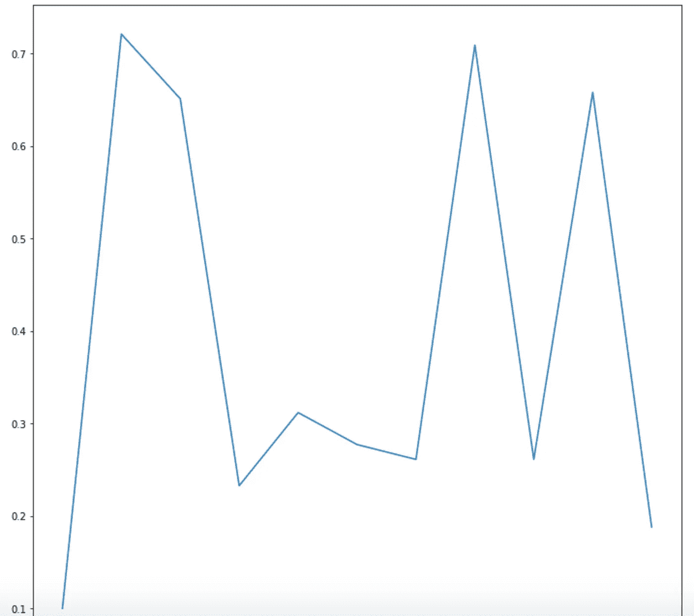
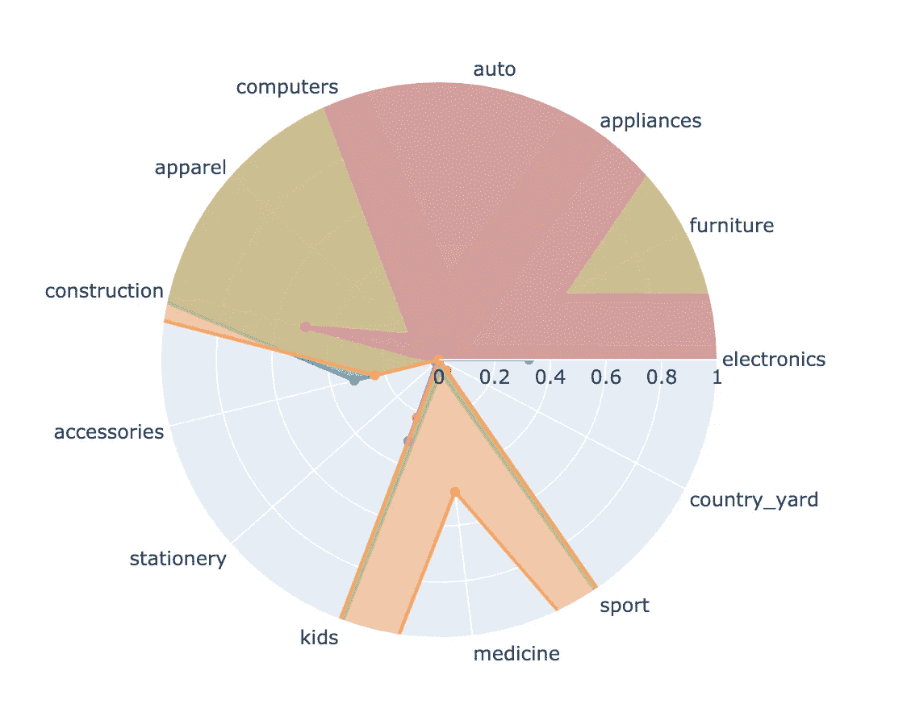

# 网店顾客的细分

> 原文：<https://towardsdatascience.com/segmentation-of-online-shop-customers-8c304a2d84b4?source=collection_archive---------38----------------------->

## 使用 Web 分析数据和 k-Means 聚类

作者识别相似客户/图像的集群

在这篇文章中，我将描述我们如何根据网上商店的网络分析数据对客户进行细分。基于该结果，可以实现现场个性化，并且可以针对细分市场中的用户开始有针对性的活动。

在这个过程中，我们将首先更详细地探索数据(“探索性数据分析”)，然后对数据进行适当的预处理，计算分割，最后可视化聚类。对于计算，我们将使用 [Google Colab](https://colab.research.google.com/) 。

## 数据

www.kaggle.com

数据来自 [Kaggle 数据平台](https://www.kaggle.com/mkechinov/ecommerce-behavior-data-from-multi-category-store)，包含一家大型多品类网店一个月(2019 年 10 月)的网络追踪数据。文件中的每一行代表一个事件。有不同类型的事件，如页面视图、购物车操作和购买。

该记录包含以下信息:

*   事件时间/事件是何时触发的？(世界协调时)
*   事件类型/视图，购物车，购买
*   产品标识/产品标识
*   类别标识/类别标识
*   类别代码/类别名称
*   品牌/品牌名称
*   价格/价格
*   用户标识/客户标识
*   用户会话/会话 ID

数据以 CSV 文件的形式从客户数据库平台导出，用于分析。

让我们导入数据:

## 先看数据

2019 年 10 月有超过 4200 万条记录可用。

数据集的前 10 条记录

这些数据来自超过 300 万的访问者。购买了超过 166，000 种不同的产品。

## 客户旅程示例

为了显示一个客户访问的示例，我们查看了针对某个 Session_id 存在的所有条目，并尝试解释它们:

客户旅程示例

*   用户已经查看了几部 iPhones
*   一次点击购买的 iPhone(无购物车事件)
*   考虑品牌领域的 2 种未知产品
*   查看一些苹果耳机并购买一个
*   后来他去了一家更贵的，但决定不买了。

## 客户历史示例

为了查看特定用户在该月的所有操作，我们使用他的用户 ID 过滤所有记录。

客户历史示例

## 探索性数据分析

每天在 web 分析中记录了多少事件？

2019 年 10 月记录的事件数量/作者图片

## 事件类型的数量

数据中发生了哪些事件，发生的频率如何？

事件类型/作者图片

大多数数据包括 96%的页面浏览量，其余的数据包括购物车和购买行为。

## 来访者的特征

我们为每个访问者计算最重要的特征，并把它们放在一个表中。

*   浏览量
*   参观
*   购买的产品数量
*   购物车中的产品数量
*   总支出
*   每次就诊的支出
*   每次访问的页面浏览量
*   每次访问的购物车操作

## 我们从行动中过滤购买

在下一步中，我们从数据中过滤购买，以便能够更精确地分析它们。我们将结果保存在一个单独的表中。

# 购买的关键数字

一个买家购买多少产品？
每位买家的平均购买价值是多少？

平均而言，每位买家的**购买量略高于 2 次**。
每位买家的**平均**购买价值为 **773.85** 。

## 品牌知名度

从哪些品牌购买产品？
让我们来看看排名前 10 的品牌的柱状图。

作者的流行品牌/图片

为了进一步分析，我们将购买分为最常见的品牌组(前 5 名)。而剩下的变成了一群“其他人”。

我们计算每个买家在 6 个品牌类别中的购买份额，并将它们存储在买家表中。

## 产品类别

有哪些产品类别？

产品类别以分层代码的形式存在。我们提取第一个级别，并将其保存为一个单独的特征。

作者购买的每个顶级类别/图片

有 13 个主要类别。我们将购买价格在每个主要类别中所占的份额作为附加功能添加到买家表中。

## 将购买特征添加到所有访问者的特征中

我们现在将购买特征添加到所有访问者的表中，从而获得一个包含所有访问者和特征的表。

因此，我们有 3，022，290 个用户的数据，其中每个用户都存储了 27 个特征。

## 用户数量的限制

为了将集群的计算和可视化保持在一定的范围内，我们将把自己限制在下面的前 50，000 个用户。

## 转换为矩阵格式以进行聚类计算

在开始计算聚类之前，我们必须将数据转换成适当的格式，作为二维数组。

## 数据的缩放

为了确保所有特征都以统一的尺寸标度表示，通过移动平均值并除以标准偏差来缩放矩阵。

## 计算不同聚类数的客户群

“k-Means 方法”用于计算线段。这是一种用于聚类分析的方法，其中一组对象必须形成 k 个组，这些组必须预先给定。

 [## 理解机器学习中的 K-均值聚类

### K-means 聚类是最简单和最流行的无监督机器学习算法之一。

towardsdatascience.com](/understanding-k-means-clustering-in-machine-learning-6a6e67336aa1) 

因为我们正在处理非常大量的数据，所以我们使用该过程的“小批量”变体，该变体在每次迭代中仅使用部分数据来计算新的聚类中心。

## 如何设置最佳聚类数(“k 值”)？

我们计算不同 k 值的聚类，然后搜索最佳值。计算的轮廓分数是聚类质量的度量。该值越接近 1，分类的质量越好。我们用它来确定集群的数量。

 [## 在 KMeans 算法中选择最佳聚类数(轮廓得分)

### KMeans 是一种无监督的机器学习技术，主要用于将相似的实例组合在一起。万一…

medium.com](https://medium.com/@jyotiyadav99111/selecting-optimal-number-of-clusters-in-kmeans-algorithm-silhouette-score-c0d9ebb11308) 

作者对不同 k 值/图像的轮廓评分

现在我们用确定的最佳聚类数来计算聚类。

并考虑分配给每个细分市场的客户数量。

作者提供的集群大小/图像

## 集群的可视化

为了获得集群的印象，我们用“tSNE”方法创建了一个可视化。t 分布随机近邻嵌入(tSNE)是一种降维技术，特别适合于高维数据集的可视化。

 [## 用 Python 例子介绍 t-SNE

### 介绍

以 Python 为例 Introductiontowardsdatascience.com 的 t-SNE](/an-introduction-to-t-sne-with-python-example-5a3a293108d1) 

作者用 tSNE / Image 实现的集群可视化

现在让我们用更少的集群来计算可视化。对于该过程来说，将各个区域分成不同的片段要困难得多。

tSNE 有 5 个集群/作者提供的图像

## 细分市场的特征

为了能够解释细分市场，我们创建了图形表示，例如，以“雷达图”的形式一次性显示每个细分市场的类别特征。这有助于解释各段的含义。

作者在群集/图像中的类别

例如，在“儿童”和“运动”领域具有高购买份额的细分市场，以及在“电子产品”领域具有高购买份额的其他细分市场。