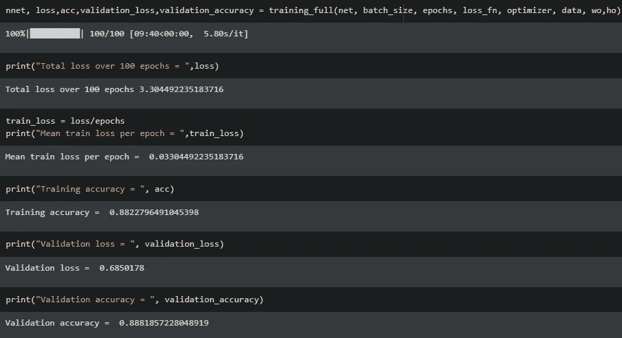

# 基于 U-网的 OCT 图像分割

> 原文：<https://towardsdatascience.com/segmentation-of-optical-coherence-tomography-images-with-diabetic-macular-edema-the-gluon-82093cfd8e24?source=collection_archive---------39----------------------->

## [内部 AI](https://towardsdatascience.com/inside-ai/home?gi=d53b80ec612)

## 使用基于 Apache Mxnet 和 Gluon 框架的光学相干断层扫描报告诊断糖尿病性黄斑水肿的深度学习方法


[克劳迪亚·拉米雷斯](https://unsplash.com/@makuph?utm_source=medium&utm_medium=referral)在 [Unsplash](https://unsplash.com?utm_source=medium&utm_medium=referral) 上拍照

## **糖尿病性黄斑水肿**

糖尿病性黄斑水肿是由称为糖尿病性视网膜病变的 II 型糖尿病引起的恶化。糖尿病性视网膜病变是最常见的糖尿病性眼病之一，通常会导致失明。粗略估计，770 万美国人被诊断患有这种糖尿病，其中大约 75 万人患有糖尿病性黄斑水肿。

## 光学相干断层扫描(OCT)

OCT 是对 DME 的诊断测试。这项测试使用一种特殊的光源和一台相机来获得视网膜的全面内细胞层。它可以感知视网膜的厚度，并有助于确定视网膜的肿胀程度。

## u 型网

在 2015 年 5 月 18 日，Olaf Ronneberger、Philipp Fischer 和 Thomas Brox 发表了一篇关于用于生物医学图像分割的卷积神经网络(CNN)的论文。传统上，细胞神经网络用于图像分类和目标检测。这种方法并不适合，因为期望的输出是定位的输出，其中类标签被分配给每个像素。因为与图像分类问题或物体检测问题相比，生物医学任务没有大量的正样本。Ciresan 等人试图训练一个网络，使用滑动窗口设置，通过使用感兴趣区域或像素周围的小块作为输入特征来预测每个像素的类别标签。这种方法虽然新颖，但却相当稳定，并且由于补丁重叠而导致大量冗余。此外，在小块尺寸和定位精度之间有一个折衷。斑块大小越大，背景越高，但这会导致最大池层数增加，从而减少空间信息，导致定位精度降低。如果小块尺寸减小了，那么上下文也就减小了。这导致了 U 型网络的产生，这是一种伪全连接网络

主要建议是提供一个连续层的正常卷积网络。最大池层被上采样层取代，从而提高了像素密度，最终提高了分辨率。来自卷积路径的这些较高分辨率特征与上采样输出连接。添加连续的卷积层作为扩展路径，这导致特征通道的数量增加，以使网络能够将空间信息传递到高分辨率层。该模型不包含任何完全连接的层，并使用每个特征提取器的最重要部分(卷积)。整体结构呈 U 形，因此得名 U 形网。在较大图像的情况下，通过翻转输入图像和对输入图像执行不同的增强来产生缺失的上下文，这不会改变图像的含义，但是有助于提取每个输入图像的更多特征。


来源:“U-Net:生物医学图像分割的卷积网络”

参考上面的图像，论文的作者使用了具有 ReLu 激活功能的连续 Conv3D 层。最低分辨率为 32×32 像素。卷积层的每个连续块被最大化汇集并相互堆叠。为了形成 U-Net 的基础，为了数据一致性，创建了由 3 个卷积层组成的平台块，其具有相同数量的输入和输出通道。后来通过转置卷积层对它们进行了上采样。反过来，这些层与相应的深度卷积块连接在一起。连接的输出被传递到 U-Net 的上升分支或扩展块。在每一个深度级别，空间信息通过连接不断传递。

你可以在[https://arxiv.org/abs/1505.04597](https://arxiv.org/abs/1505.04597)查看原文，了解更多细节。

## 资料组

我使用了 OCT 图像的分割:*光学相干断层扫描(OCT)和糖尿病性黄斑水肿(DME)数据集*，该数据集由 Paul Mooney 在 kaggle 上提供。你可以在 https://www.kaggle.com/paultimothymooney/chiu-2015[的](https://www.kaggle.com/paultimothymooney/chiu-2015)亲自看看


截图来自“kaggle.com”

数据集由以下文件组成


来自我的文件浏览器的屏幕截图

## 完整的源代码


由[马库斯·斯皮斯克](https://unsplash.com/@markusspiske?utm_source=medium&utm_medium=referral)在 [Unsplash](https://unsplash.com?utm_source=medium&utm_medium=referral) 上拍摄

您可以在我的 GitHub 资源库中找到我的实现的完整源代码。

[](https://github.com/sid0312/OCTImageSegmentation) [## sid 0312/oct image 分段

### 从头开始建立使用 Apache MxNet 和胶子图像分割光学相干断层扫描图像与…

github.com](https://github.com/sid0312/OCTImageSegmentation) 

**使用 MxNet 的 UNet】**

我使用 **Apache MxNet 框架和 Gluon API** 从头开始构建了一个 U-Net，它类似于 Tensorflow 框架的 Keras

我的存储库中的 model.py 如下所示

**现在让我们逐行查看我们的 model.py 文件**

*   **导入我们的依赖关系**

*   **为 U-Net 创建类**

U-Net 被实现为一个混合胶子块。

```
class network(gluon.nn.HybridBlock):
```

*   **创建卷积零件功能**

这作为单个收缩块，可以在卷积路径中多次使用。它由 3 个 Conv2D 层组成，每个层的内核大小为 3，ReLu 激活函数和 BatchNorm 层用于规范化输入，最后是一个 max pooling 层。它是混合顺序块，因为信息需要顺序传递。

*   **创建去卷积零件功能**

这就像是 U 型网络的一个单独的组成部分。它也可以在 U-Net 架构中多次使用。它由 Conv2D 层组成，每个层的内核大小为 3，ReLu 激活函数和 BatchNorm 层用于规范化输入，Conv2DTranspose 层用于扩展输入大小(换句话说就是增加特征图的大小)

*   **创建坪块功能**

这一层充当了 U-Net 的瓶颈。它是为数据一致性而创建的，具有相同数量的输入和输出通道。

*   **创建输出层功能**

该层充当 U-Net 的输出分段图。它紧接在广阔的道路之后发生。请注意，这几乎类似于卷积部分函数，但它包含一个用于鲁棒特征提取的额外参数。

*   **创建连接功能**

这是 model.py 文件中最重要的函数之一。它将从卷积路径获得的较高分辨率特征与最初来自平台块的上采样输出层连接起来。它还填充这些层以给出适当形状的合成层。我花了很长时间来编写这个函数，由于形状不一致，它有很多错误。

然而，这个函数现在工作得非常好。我们使用了边缘填充，以便用输入数组的边缘值填充特征图。简要地看一下 mxnet 在 http://beta.mxnet.io/r/api/mx.nd.pad.html 的官方文档会对理解下面的代码有很大的帮助。也试着在 http://beta.mxnet.io/r/api/mx.nd.concat.html 的[查阅 mxnet.nd.concat 文档](http://beta.mxnet.io/r/api/mx.nd.concat.html)

*   创建 __init__ 函数来分配层

我们已经为每个层创建了函数，但是要真正创建层，我们需要在 __init__ 方法中创建层。请注意，**kwargs 对于混合顺序块参数很重要。

*   创建 hybrid_forward 方法

我们已经分配了层，但是我们需要顺序地堆叠它们，传递输入 ndarray 并获得输出 ndarray。

*   为网络类创建对象

```
net = network(input_channels=1,output_channels=2)
```

**我们已经完成了整个模型。py.** 是时候可视化我们的模型了

```
print(net)
```

输出:


我的谷歌实验室笔记本截图

让我们使用 Xavier 初始化初始化网络的权重，并在获得上下文(无论代码是在 gpu 还是 cpu 上运行)后，使用形状的样本数组(5，1，284，284)检查模型摘要

输出:


来自我的 google colab 笔记本的截图

足够的可视化。现在让我们使用 prepare_data.py 来准备我们的数据

create_pipeline 方法有助于创建输入管道，即使用。数据集的 mat 文件。

load_dataset 方法将输入管道分为两部分，即训练和验证

现在我们已经有了我们的训练特征、训练标签、验证特征和验证，是时候训练我们的模型了！！

我们的批量大小为 6，运行 100 个时期的训练。

这里使用的损失函数是 mxnet . gluon . loss . softmaxcrossentropyloss()。可以在[https://mxnet . incubator . Apache . org/API/python/docs/API/gluon/loss/index . html](https://mxnet.incubator.apache.org/api/python/docs/api/gluon/loss/index.html)了解更多亏损情况

使用的优化器是一个胶子教练对象。使用的优化算法是随机梯度下降，学习率为 0.0004。你可以在[https://mxnet . incubator . Apache . org/API/python/docs/API/gluon/trainer . html](https://mxnet.incubator.apache.org/api/python/docs/api/gluon/trainer.html)了解更多关于 gluon 训练师的信息



我训练的一些日志

我获得了 88 %的验证准确率，这是相当不错的。

在训练我们的模型之后，我们获得我们的模型参数，我们把它保存在一个文件中，比如说，net.params

我们可以使用 model.params 文件加载我们的模型以进行进一步的预测

让我们使用 results.py 文件绘制一些结果

为了理解这个文件需要一些 matplotlib.pyplot 的知识，你可以在[https://matplotlib.org/users/pyplot_tutorial.html](https://matplotlib.org/users/pyplot_tutorial.html)获得这些数据可视化的知识

**结果**

以下是我在使用训练好的模型后获得的一些结果


在我的谷歌协作笔记本上绘制训练示例和结果


我们的验证示例的性能

**结论**

U-Nets 给出了比滑动窗口分割模型更好的结果。他们也处理最少的数据。

**进一步改进**

请注意，我在这个数据集上使用了 Conv2D 操作。Conv3D 在 4 维数据集上会工作得更好，这通常是光学相干断层扫描图像的情况，因为会保留 3 维空间信息。

**作者注**

准确性不是一个合适的参数(灵敏度和特异性才是),用来判断为医疗目的而制作的模型的稳健性，但本笔记本旨在使用 Apache MXNet 框架解释 UNet 架构，而不是目前的评估指标。请继续关注仓库，了解关于指标的进一步更新

快乐的计算机视觉和快乐的深度学习。非常感谢你的时间。真的激励我去开发更多，写更多。