# 细分简介

> 原文：<https://towardsdatascience.com/segmentation-u-net-mask-r-cnn-and-medical-applications-9a84bddf313e?source=collection_archive---------39----------------------->

## U-Net、Mask R-CNN 和医疗应用

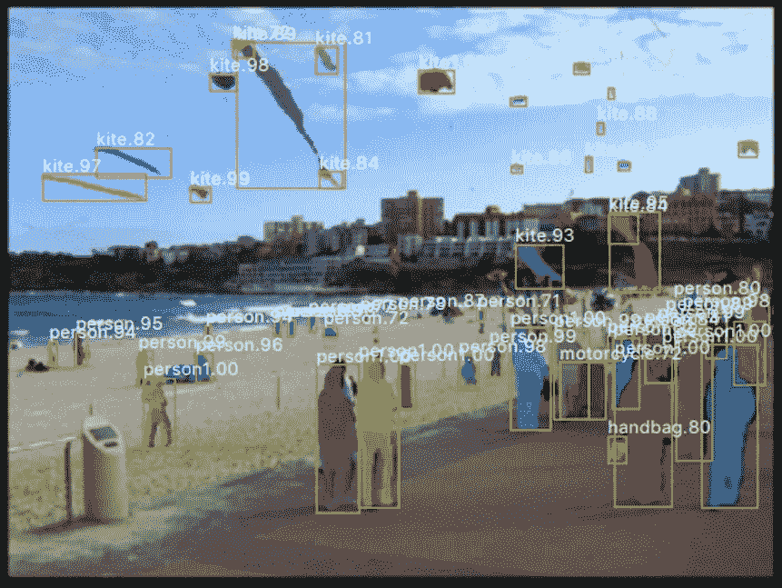

分割在医学成像(定位肿瘤、测量组织体积、研究解剖学、计划手术等)中有许多应用。)、自动驾驶汽车(定位行人、其他车辆、刹车灯等。)、卫星图像解译(建筑物、道路、森林、农作物)等等。

这篇文章将介绍分段任务。在第一部分中，我们将讨论语义分割和实例分割的区别。接下来，我们将深入研究用于语义分割的 U-Net 架构，并概述用于实例分割的 Mask R-CNN 架构。最后一节包括许多示例医学图像分割应用和视频分割应用。

# **分割任务**

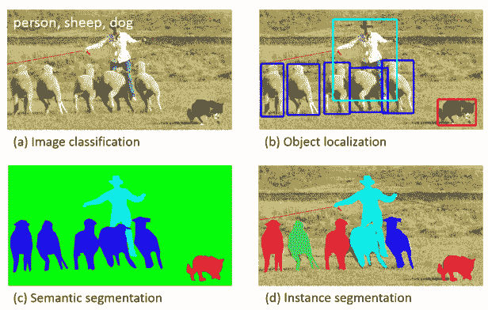

图片来源:[林等 2015 微软 COCO:语境中的常见对象](https://arxiv.org/pdf/1405.0312.pdf)

上图说明了四种常见的图像任务:

*   (a)分类，其中模型输出图像中类别的名称(在这种情况下，人、羊和狗)；
*   (b)目标定位，通常称为“目标检测”,其中模型输出图像中每个目标的边界框坐标；
*   (c)语义分割，其中模型为图像中的每个像素分配对象类别标签。在本例中，绵羊像素是蓝色的，狗像素是红色的，人像素是蓝绿色的，背景像素是绿色的。请注意，虽然图像中有多只绵羊，但它们都有相同的标签。
*   (d)实例分割，其中模型给图像中的每个像素分配一个“单个对象”标签。在这个例子中，每只羊的像素被分别标记。我们没有一个通用的“sheep”像素类，而是为五只绵羊创建了五个类:sheep1、sheep2、sheep3、sheep4 和 sheep5。

这是语义分割和实例分割之间差异的另一个说明，显示了在语义分割中所有“椅子”像素如何具有相同的标签，而在实例分割中，模型已经识别了特定的椅子:

图片来源: [StackExchange](https://datascience.stackexchange.com/questions/52015/what-is-the-difference-between-semantic-segmentation-object-detection-and-insta)

以下是对藻类图像的语义分割和实例分割的应用:

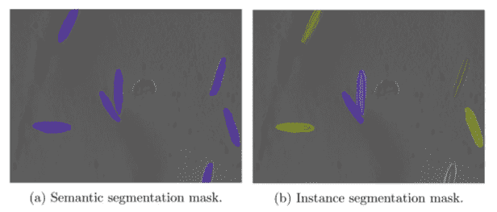

图片来源: [Ruiz-Santaquiteria 等 2020 微观藻类检测中的语义与实例分割。](https://www.sciencedirect.com/science/article/pii/S0952197619302398?dgcid=rss_sd_all)

下图显示了实例分段的模型预测:

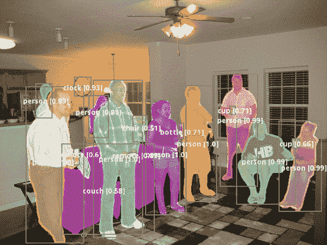

图片来源:[陈等 MaskLab:用语义和方向特征细化对象检测的实例分割。](https://www.arxiv-vanity.com/papers/1712.04837/)

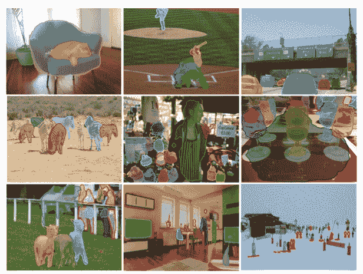

图片来源:[皮涅罗等 2015 学习分割对象候选人。](https://arxiv.org/pdf/1506.06204.pdf)

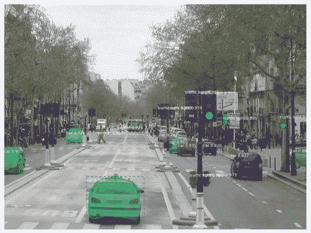

图片来源: [matterport/Mask_RCNN](https://github.com/matterport/Mask_RCNN)

# **U-Net:用于生物医学图像分割的卷积网络**

U-Net 论文(可从这里获得: [Ronneberger et al. 2015](https://arxiv.org/pdf/1505.04597.pdf) )介绍了一种语义分割模型架构，这种架构已经变得非常受欢迎，被引用超过 10，000 次(在这个知识库中列出了五十篇不同的后续论文[)。它最初是在生物医学图像的背景下提出的，但后来也被应用于自然图像。](https://github.com/ShawnBIT/UNet-family)

U-Net 的基本思想是执行以下任务:

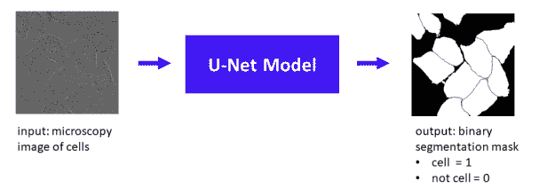

细胞/掩模图像来源: [Ronneberger 等人 2015](https://arxiv.org/pdf/1505.04597.pdf)

给定输入图像，在这种情况下，是细胞的灰度显微图像，U-Net 模型产生 1 和 0 的二进制掩码，其中 1 表示细胞，0 表示背景(包括细胞之间的边界)。请注意，这是一个语义分割任务，因为所有细胞都接收相同的“细胞”标签(即，我们没有不同的标签来区分不同的单个细胞，就像我们例如分割一样。)

该示意图显示了训练 U-Net 模型的设置:

在模型被完全训练之前，对于给定的输入图像，它将产生有问题的二进制分割掩模，例如上图所示的“预测的二进制分割掩模”，其中一些单元丢失或具有不正确的边界。U-Net loss 函数将预测掩码与真实掩码进行比较，以实现参数更新，这将允许模型在下一个训练示例上执行更好的分割。

这是 U-Net 架构:

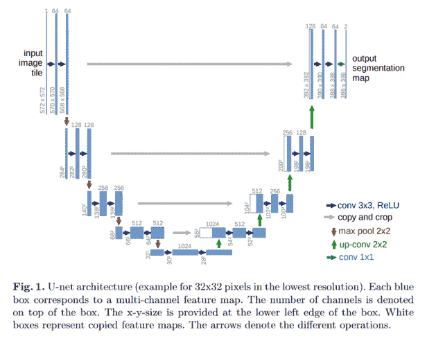

图一。Ronneberger 等人的 2015 年

从这个图中可以看出,“U-Net”这个名字是显而易见的，因为架构图显示了一个 U 形。U-Net 的基本思想是首先通过传统的卷积神经网络获得图像的低维表示，然后对该低维表示进行上采样，以产生最终的输出分割图。

使用右下角提供的架构图很有帮助，它解释了每种箭头类型对应的操作:

U-Net 由“收缩路径”和“扩张路径”组成:

由图 1 修改而来。2015 年

“收缩路径”是产生低维表示的传统 CNN。“扩展路径”对表示进行上采样，以产生最终的输出分割图。灰色箭头表示复制操作，其中来自“收缩路径”的高分辨率特征地图被复制并连接到“扩展路径”中的特征地图，以使网络更容易学习高分辨率分割。

U-Net 没有任何完全连接的层，这意味着 U-Net 是一个完全卷积的网络。

## **生成预测分割图:1×1 卷积和像素级 Softmax**

在 U-Net 的最后一层，应用 1×1 卷积将每个 64 通道特征向量映射到期望数量的类别，在本文中被认为是两个类别(细胞/背景)。如果你想使用 U-Net 对几个类别进行语义分割，例如 6 个类别(狗、猫、鸟、龟、牛、背景)，那么 64 通道特征向量可以映射到 6 个类别(6 个通道)。

这是图 1 的特写，显示了“扩展路径”的最后一部分，其中通过[conv 3×3，ReLU]操作产生 64 通道特征向量，并最终使用代表 1×1 卷积的蓝绿色箭头映射到 2 通道特征向量(细胞与背景):

修改自 [Ronneberger 等人 2015](https://arxiv.org/pdf/1505.04597.pdf) 的图 1

将逐像素的 softmax 应用于最终的[2 通道，388 高度，388 宽度]表示，以获得最终的输出，即预测的分割图。

像素级 softmax 函数为:

关于 softmax 函数的更多细节，见[这篇文章](https://glassboxmedicine.com/2019/05/26/classification-sigmoid-vs-softmax/)。

基于像素的 softmax 可以概念化如下。将输出地图想象成 388 x 388 的图像。该图像中的每个像素由 K 个值表示，K 个通道各有一个值，其中 K 是感兴趣类别的数量。对于每个像素，我们在 K 个通道上取一个 softmax，这样一个通道将“突出”为最高值；这个最高通道确定分配给该像素的类别。

## **U-Net 加权交叉熵损失**

使用[交叉熵损失](https://glassboxmedicine.com/2019/12/07/connections-log-likelihood-cross-entropy-kl-divergence-logistic-regression-and-neural-networks/)来训练 U-Net:

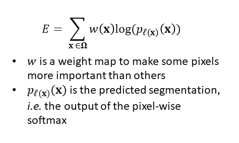

这是一个典型的交叉熵损失，增加了权重 ***w* (x)** ，它提供了一个权重来告诉模型一些像素比其他像素更重要。

权重图 ***w*** 是使用传统的计算机视觉技术基于每个基础事实分割预先计算的。具体地，形态学图像处理被应用于基本事实分割，以识别分隔细胞的细边界，然后创建权重图，使得分隔细胞的这些细边界被赋予高权重。将这个权重图合并到交叉熵损失中意味着，如果 U-Net 遗漏了细胞之间的这些细边界，或者如果它将它们画在错误的位置，它将受到严重的惩罚。在损失中使用权重图的总体目标是“迫使网络学习接触细胞之间的小分离边界[……]”

## **U-Net 数据增强**

构建数据集来训练分段模型是非常耗时的，因为需要手工绘制正确的基本事实分段。因此，最终数据集的大小可能很小。在 U-Net 论文中，作者采用数据扩充来增加训练数据的有效大小。他们对训练样本应用随机移位、旋转、灰度值变化和随机弹性变形。弹性变形在医学图像中特别有用，因为(通俗地说)生物样本通常是“粘糊糊的”，这意味着弹性变形的输出仍然是“真实的”

下面是一些应用于大脑图像的数据增强的例子，来自 Quantib 博客:

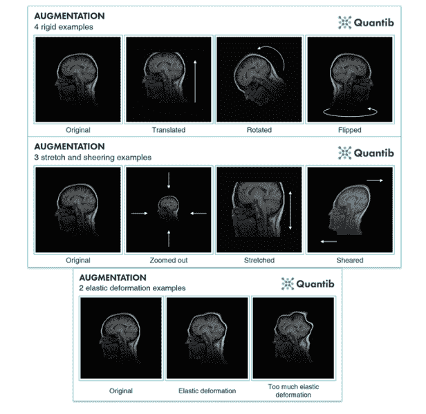

图片来源: [Quantib 博客](https://www.quantib.com/blog/image-augmentation-how-to-overcome-small-radiology-datasets)

总的来说，在发表时，U-Net 模型在细胞语义分割任务上取得了最先进的结果，并且随后被用于各种各样的自然图像和医学图像分割应用。

# **屏蔽 R-CNN 进行实例分割**

实例分段呢？回想一下，在实例分割中，我们不仅仅想要识别细胞与背景像素，我们还想要分离单个细胞。可以执行实例分割任务的一个模型是 [Mask R-CNN](https://arxiv.org/abs/1703.06870) 。Mask R-CNN 是流行的[更快 R-CNN](https://arxiv.org/abs/1506.01497) 对象检测模型的扩展。

掩模 R-CNN 的全部细节需要一整篇文章。这是对 Mask R-CNN 背后的思想的一个快速总结，为如何实现实例分割提供了一个思路。

在掩模 R-CNN 的第一部分中，选择感兴趣区域(ROI)。RoI 是输入图像的一部分，其中包含一个概率较高的对象。为每个输入图像识别多个 ROI。

在 Mask R-CNN 的第二部分，如下图所示，每个 RoI 用于获得三个模型输出:

*   该 RoI 的最终预测类别(对象的类别，例如“人”)
*   从这个 RoI 获得的最终预测边界框(边界框角的坐标，它提供基本的对象定位)
*   最终预测的分割(例如，提供非常详细的对象定位的人的轮廓)

图片修改自[何等 2018 口罩 R-CNN](https://arxiv.org/pdf/1703.06870.pdf)

如果 RoI 与真实边界框有足够的重叠，则被认为是“正的”。掩模 R-CNN 包括掩模损失，其量化预测的分割掩模与基本事实分割掩模的匹配程度。仅针对正 RoI 定义掩模损失，换句话说，仅当相关 RoI 与图像中的真实对象足够重叠时，才定义掩模损失。

在被训练之后，掩模 R-CNN 可以为单个输入图像同时产生类别、边界框和分割掩模注释:

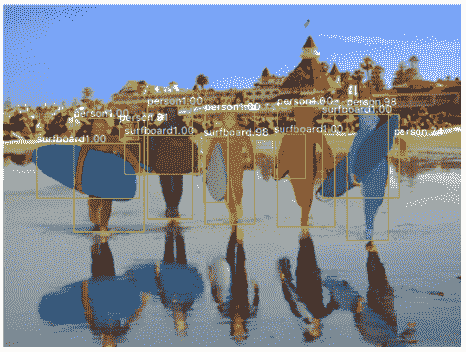

图片来源:[何等 2018 口罩 R-CNN](https://arxiv.org/pdf/1703.06870.pdf)

掩模 R-CNN 也可以用于关键点检测。在下面的示例中，关键点显示为由线连接的点:

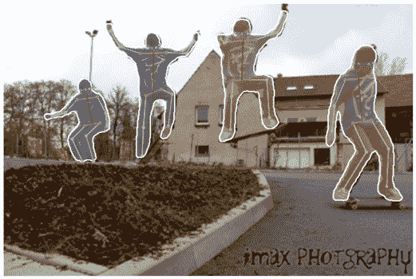

图片来源:[何等 2018 口罩 R-CNN](https://arxiv.org/pdf/1703.06870.pdf)

# **创建数据集以训练实例分割模型**

有趣的是，要考虑创建适合训练实例分割模型的数据集需要多少工作。一个流行的实例分割数据集是 MS COCO，它包括 328，000 个实例分割的图像。可可小姐的创作分三个阶段:

1.  *类别标记*:为每张图片标记每个对象类别的一个实例。每个图像 8 个工人。91 个可能的类别。20，000 工时。
2.  *实例定位*:用“x”标记每个对象的每个实例，每张图片 8 个工人。10，000 工时。
3.  *实例分割*:对每个实例进行分割，即手动跟踪所有对象实例的轮廓。每幅图像由 1 名训练有素的工人分割，并由 3-5 名其他工人检查。55，000 个工时。

总计 85，000 个工时，相当于一个人每周工作 7 天，每天工作 12 小时，工作时间超过 19 年！

如果您有兴趣进一步探索实例分段，可以从这里下载 COCO 数据集。

图片来源:[林等 2015 微软 COCO:语境中的常见对象。](https://arxiv.org/pdf/1405.0312.pdf)

# **医学图像分割**

下面是医学成像中一些很酷的分割应用的例子。

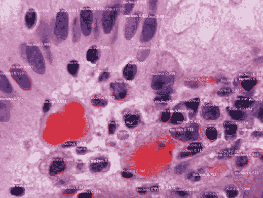

分割细胞核(深紫色。)来源: [matterport/Mask_RCNN](https://github.com/matterport/Mask_RCNN) ，[在显微图像中分割细胞核](https://github.com/matterport/Mask_RCNN/blob/master/samples/nucleus)

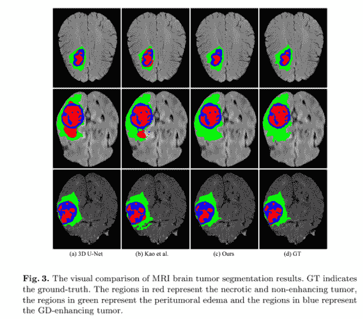

核磁共振成像扫描中的脑肿瘤分割。来源:[陈等 2019 3D 扩张多纤维网络用于 MRI 实时脑肿瘤分割。](https://arxiv.org/pdf/1904.03355.pdf)

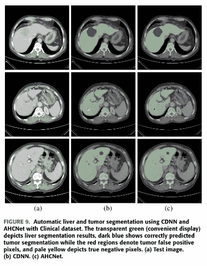

在 CTs 中分割肝脏和肿瘤。来源:[姜等 2019 AHCNet:注意机制和混合连接在 CT 卷肝脏肿瘤分割中的应用](https://github.com/ShawnBIT/Paper-Reading/blob/master/AHCNet.pdf)

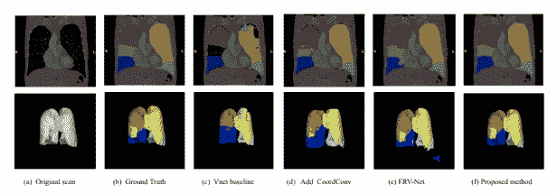

分割肺的不同叶(右上叶、右中叶、右下叶、左上叶、舌部、左下叶)。来源:王等 2019 [利用协同引导的深度神经网络自动分割肺叶。](https://arxiv.org/pdf/1904.09106.pdf)

分割白内障手术器械。来源:[倪等. RAUNet:用于白内障手术器械语义分割的剩余注意 U-Net。](http://xxx.itp.ac.cn/pdf/1909.10360v1)

腹腔镜手术图像的多器官分割。来源: [Haouchine 等人 2016 使用来自点云的结构对术中腹腔镜图像进行分割和标记。](https://hal.archives-ouvertes.fr/hal-01314970/document)

# **视频分割示例**

还可以将分割算法应用到视频中！这里有两个简单的例子:

GIF 来源: [matterport/Mask_RCNN](https://github.com/matterport/Mask_RCNN) 。要观看完整的 30 分钟视频，请参见凯罗尔·马杰克的[Mask RCNN-COCO-instance segmentation。](https://www.youtube.com/watch?v=OOT3UIXZztE)

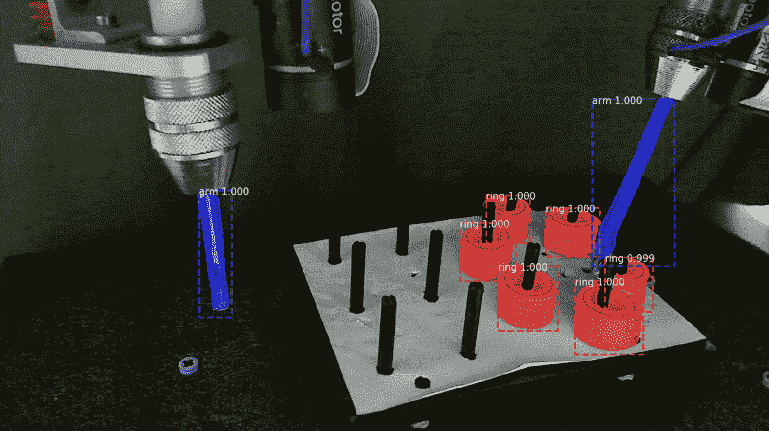

分割手术机器人。来源: [matterport/Mask_RCNN](https://github.com/matterport/Mask_RCNN)

# **总结**

*   在语义分割中，每个像素被分配给一个对象类别；
*   在实例分割中，每个像素被分配给一个单独的对象；
*   U-Net 架构可以用于语义分割；
*   掩模 R-CNN 架构可以用于实例分割。

## **关于特色图片**

专题图片来自面膜 R-CNN 论文:[何等 2018 面膜 R-CNN](https://arxiv.org/pdf/1703.06870.pdf) 。

*最初发表于 2020 年 1 月 21 日*[*http://glassboxmedicine.com*](https://glassboxmedicine.com/2020/01/21/segmentation-u-net-mask-r-cnn-and-medical-applications/)T22。