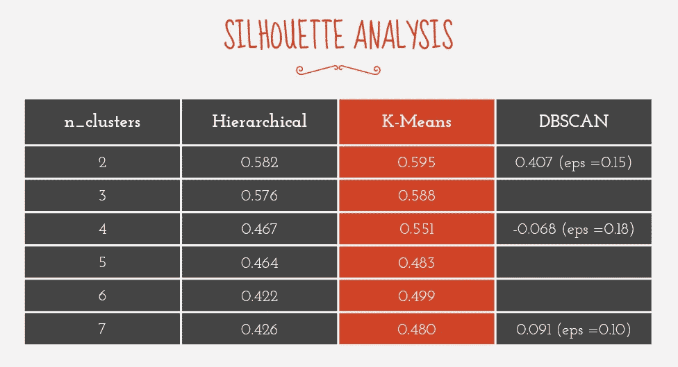
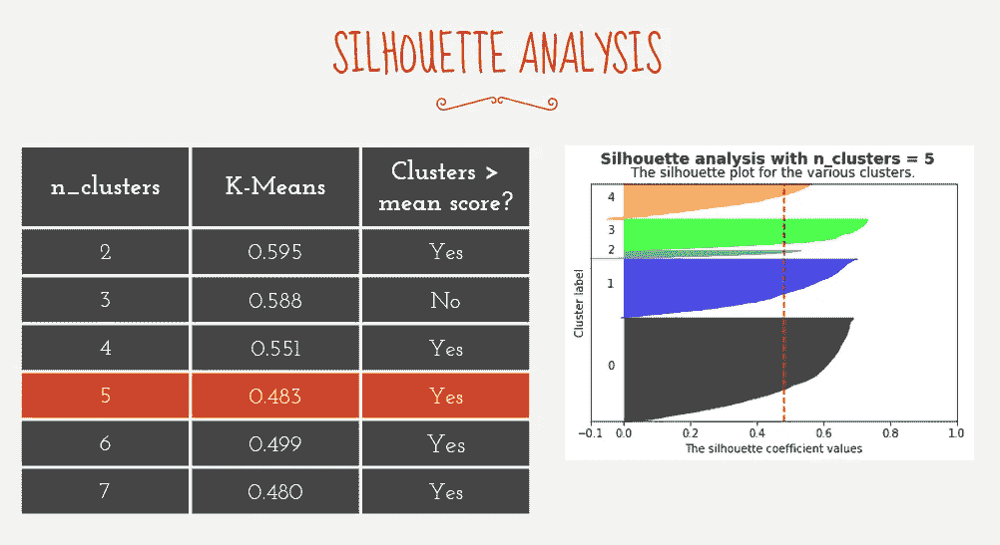
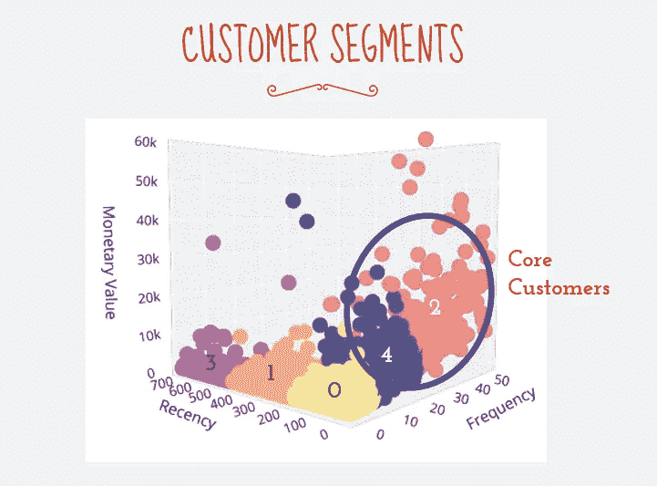
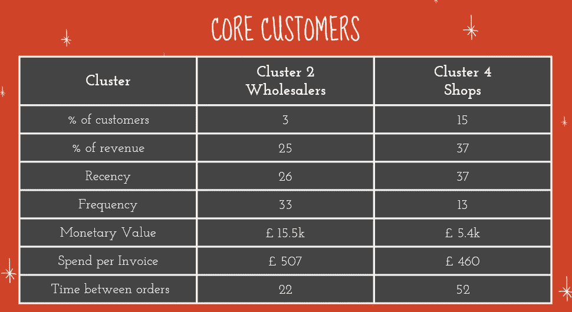
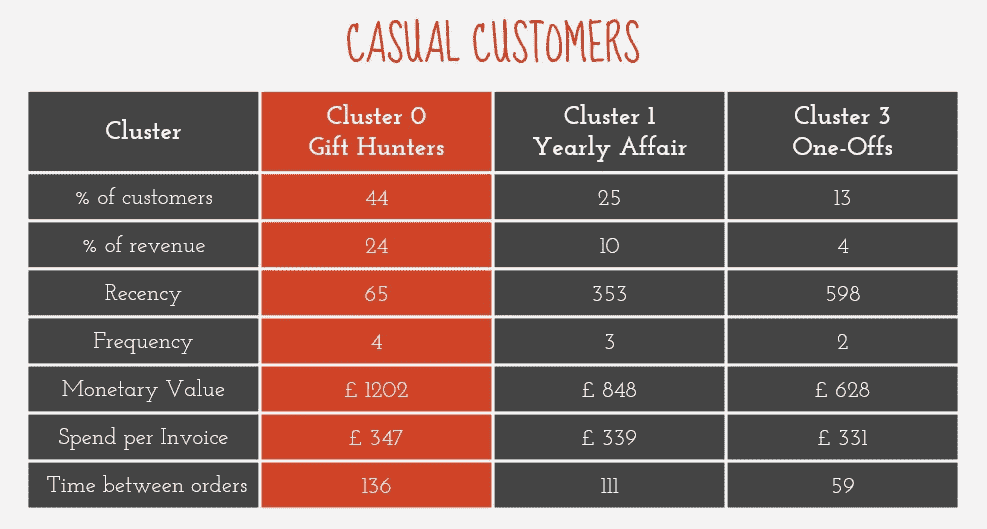

# 使用 K 均值、RFM 和交易记录对客户进行细分

> 原文：<https://towardsdatascience.com/segmenting-customers-using-k-means-and-transaction-records-76f4055d856a?source=collection_archive---------21----------------------->

[rupixen.com](https://unsplash.com/@rupixen?utm_source=medium&utm_medium=referral)在 [Unsplash](https://unsplash.com?utm_source=medium&utm_medium=referral) 上拍照

## 在本文中，我将向您介绍我是如何应用 K-means 和 RFM 分割来根据在线礼品店客户的交易记录对他们进行聚类的。

## 介绍

上大学的时候，我开了一个简单的卖宠物用品的网店。当时，我只收集了足够的客户信息来进行销售，并把我的产品卖给他们。简单来说，我只有他们的交易记录和地址。

当时，我认为我没有足够的信息来进行任何有用的细分。但是，我最近偶然发现了一种叫做 **RFM** ( **R** 频率 **F** 频率 **M** 一元值)的直观分割方法，它可以很容易地应用于基本的客户交易记录。

## 关于 RFM 分割

以下是 RFM**和**的每个字母的含义:

*   **R** ecency:客户上次向您购买产品已经有多长时间了(例如，几天，几个月)？
*   **F** 频率:客户在一段固定时间内(如过去 3 个月、去年)从你这里购买了多少次
*   **M** 一元值:客户在一段固定时间内(应该是为 **F** 频率设置的同一时间段)在您的商店消费了多少钱。

我们可以对客户进行分组，并根据 RFM 分数提出商业建议。例如，您可以提供促销活动来重新吸引最近没有在您的商店购物的顾客。你可以进一步优先考虑你的促销策略，把重点放在那些经常购买并且至少花费平均货币价值的顾客身上。

## 使用 K-Means 代替传统的方法

传统的 RFM 方法要求你手动对客户的 RFM 特征从 1 到 5 进行排名。定义等级的两种方法是创建相等间隔的组(例如，范围/5)，或者基于百分位数对它们进行分类(那些达到第 20 百分位数的将形成等级)。

既然我们是数据科学家，为什么不使用无监督的学习模型来完成这项工作呢？事实上，我们的模型可能比传统方法表现得更好，因为它根据客户的 RFM 值而不是他们的排名对客户进行分组。

## 数据

数据集来自 UCL 的机器学习知识库。该文件包含一家英国在线礼品店在 2009 年至 2010 年以及 2010 年至 2011 年期间的 100 万条客户交易记录。excel 文件中有两张表(每年一张)，每张表都有相同的 8 个特征:

*   客户 ID
*   国家/地区(我没有真正关注这一点，因为大多数客户也来自英国)
*   发票代码
*   发票日期
*   股票代码
*   股票描述
*   单价
*   单位数量

## **数据清理**

由于两个数据集包含相同的要素，我将其中一个附加到另一个上。接下来，我删除了具有以下内容的行:

*   缺少客户 ID
*   缺少库存描述
*   不符合预期格式的异常股票代码，例如以字母开头且少于 5 位数的股票代码。这些往往来自手动输入(股票代码“M”)、邮费(股票代码“DOT”)和取消订单(股票代码以“C”开头)。然而，我保留了以字母结尾的库存代码，因为这些代码倾向于表示产品差异(例如，图案、颜色)。

在为每个客户创建了 RFM 特征之后(参见特征工程)，我还移除了偏离平均值超过 4 个标准差的极端异常值。移除极端异常值非常重要，因为它们会扭曲使用基于距离的测量的无监督学习模型。

## **特色工程**

为了得出客户的最近购买时间，我计算了组合数据集中最近一次购买和客户最后一次购买之间的时间差(以天为单位)。分数越低表示购买时间越近，这对商店越有利。

我通过聚合创建了与每个客户的购买频率(在 2 年内)和总支出(货币价值)相对应的特征:

*   **频率**:统计每个客户的唯一发票代码的数量
*   **货币价值**:所有购买物品的价格总和

我还创建了其他特性，我认为这些特性是有用的集群描述符:

*   每张发票的总支出
*   订单之间的时间(天数)

## 使用轮廓分数选择无监督学习模型

剪影分数可用于评估地面真相未知的无监督学习模型的质量。轮廓分数测量观察值与其自己的聚类相比与其他聚类的相似程度。

值越接近 1 表示聚类分离越好，而值越接近 0 表示聚类重叠。避免负值。

我对数据应用了 3 个无监督学习模型，并选择了 K-Means，因为它具有最佳的轮廓分数，而不管聚类的数量。

基于聚类数的无监督学习模型的轮廓分数

## 选择 K-均值聚类的数目

为了选择簇的数量(n_clusters)，我考虑了每个簇的轮廓分数。最佳情况下，每个聚类的系数值应高于平均轮廓得分(在图中，每个聚类的峰值应超过红色虚线)。我还考虑了每个集群的 RFM 值。

我改变了 K 均值聚类的数量，并检查了模型的 RFM 值和轮廓分数。我决定使用 n_clusters =5，而不是更低的值，尽管剪影得分更低，因为只有当 n_clusters = 5 时，具有良好 RFM 值的重要客户群才会出现。出现在 n_clusters = 5 之外的聚类不太重要，因为它们具有较差的 RFM 分数。

描述 n 个聚类的轮廓分数的表，以及每个聚类的系数值是否高于每个模型内的平均轮廓分数

## 可视化和描述集群

选择了一个无监督的学习模型和适当数量的聚类后，我使用 3D 绘图可视化了这些聚类。

使用 RFM 分割和 K-均值得出的描述客户细分的 3D 图

聚类 4 和聚类 2 具有更好的 RFM 分数，代表商店的核心顾客。其他 3 个群体似乎是购买频率较低的因果型客户。

**核心客户**

根据该数据集，18%的客户是核心客户，他们在过去两年中贡献了 62%的收入。他们花钱多，采购频繁，每一两个月一次，还在和店家接洽。由于在线商店产品的典型价格往往较低，集群的平均支出表明他们正在大量采购，因此他们可能是批发商和转售商店商品的较小商店。

描述核心客户主要特征的表格。非百分比数字代表平均值。

**散客**

至于临时顾客，我想强调一下第 0 类顾客(我称之为礼品猎人)，因为他们对商店来说是最重要的。他们贡献了大约四分之一的收入，这比其他休闲集群多得多。他们倾向于每个季度从商店购买一次少量商品，这表明他们是为特殊场合购买的个人。

描述临时客户主要特征的表格。非百分比数字代表平均值。

## 可以采取的促销策略

鉴于集群的特点，我提出以下针对关键群体的推广策略:

*   **批发商**:考虑到他们的数量很少，让他们直接参与进来建立商誉和忠诚度可能是有意义的。最好用定制的解决方案锁定它们。
*   小商店:探索可以在后续购买中使用的返现折扣。这也将降低他们的成本，鼓励他们花更多的钱。
*   寻找礼物者:在特殊场合前吸引他们，给他们免费礼物，最低消费高于他们目前 347 英镑的平均消费，鼓励他们多花钱。

## **结束掉…**

我认为 RFM 细分与无监督学习模型非常匹配，因为它们消除了营销人员手动细分客户记录的需要。我希望我已经阐明了如何从最基本的客户信息中创造有意义的客户群。更多细节，你可以看看我的[笔记本](https://github.com/adelweiss/RFM_Kmeans)。它包含了我研究的其他模型的代码和细节。

感谢阅读！