# 从多个维度对客户进行细分(或者为葡萄酒爱好者使用 Python)

> 原文：<https://towardsdatascience.com/segmenting-your-customers-on-many-dimensions-or-python-for-wine-lovers-8e7768bf86d6?source=collection_archive---------26----------------------->

## 使用 K-意味着对两个或三个以上的属性进行聚类。

我最近读了一本关于数据分析的书，名为 [Data Smart](https://www.amazon.com/Data-Smart-Science-Transform-Information/dp/111866146X) ，作者是 MailChimp 的产品负责人[约翰·福尔曼](https://www.linkedin.com/in/johnwforeman/)。这本书是一本优秀的商业分析入门书，带你了解各种机器学习用例，包括样本数据集和如何在 Excel 中设置和解决每个案例的详细说明。

有一个案例特别引起了我的注意。它描述了一个虚构的葡萄酒批发企业，该企业希望通过根据购买行为将客户(餐馆和酒店老板)分成不同的群体来优化销售。这是各种各样的企业面临的一个非常普遍的问题，从沃尔玛和塔吉特百货这样的大型零售商到你友好的社区酒类商店。在我看来，这是一个用聚类算法实践我的新 Python 技能的好机会。

提供的数据集包括两个文件，一个列出了一年中提供的大约 36 种产品折扣，另一个列出了客户及其购买细节。目标是找出未来哪种类型的折扣最吸引哪些客户。这是一个典型的客户细分或聚类问题。

每个折扣优惠都有六个属性——月份、葡萄酒品种、最小数量、折扣百分比、原产国和过去的峰值(T/F)。这里列出了 32 种不同的优惠，每种都有不同的属性组合。客户列表包括大约 100 个客户的 324 笔交易。因此，这个挑战涉及的维度比你通常在聚类的机器学习教程中看到的要多得多。

福尔曼先生做了一项出色的工作，带领读者在 Excel 中使用几种类型的成分距离计算方法(欧几里德距离、曼哈顿距离和余弦距离)完成 K 均值聚类过程。这对于小数据集很有效，但是当你进入数十万或数百万行时，Excel 就不管用了。在这本书的最后，福尔曼先生用他最喜欢的大数据语言 R 重新创建了每个分析，但不是用 Python。因此，我尝试为这个集群用例创建一个 Python 教程。我已经上传了完整的 Python 笔记本到我的 [Github 库这里](https://github.com/bnsheehy/Customer_Clustering)。

第一步是使用 pd.read_csv 命令将两个数据文件上传到 Pandas dataframes 中。这是两个数据框架。

优惠:

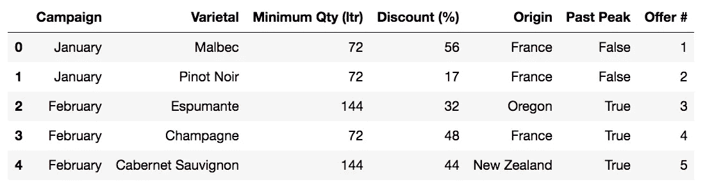

客户/交易:

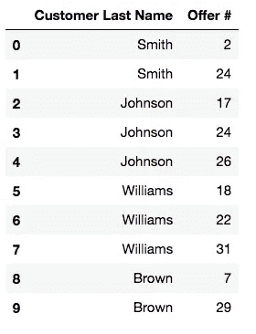

第 2 步是创建一个数据透视表矩阵，它可以被输入到 Python 中的 Scikit Learn 库中提供的 K-means 聚类算法中。该矩阵将显示垂直列为索引的客户，顶部显示报价数字，每笔交易显示为“1”值，所有空值都转换为“0”。下面是代码和对结果矩阵的快速查看。

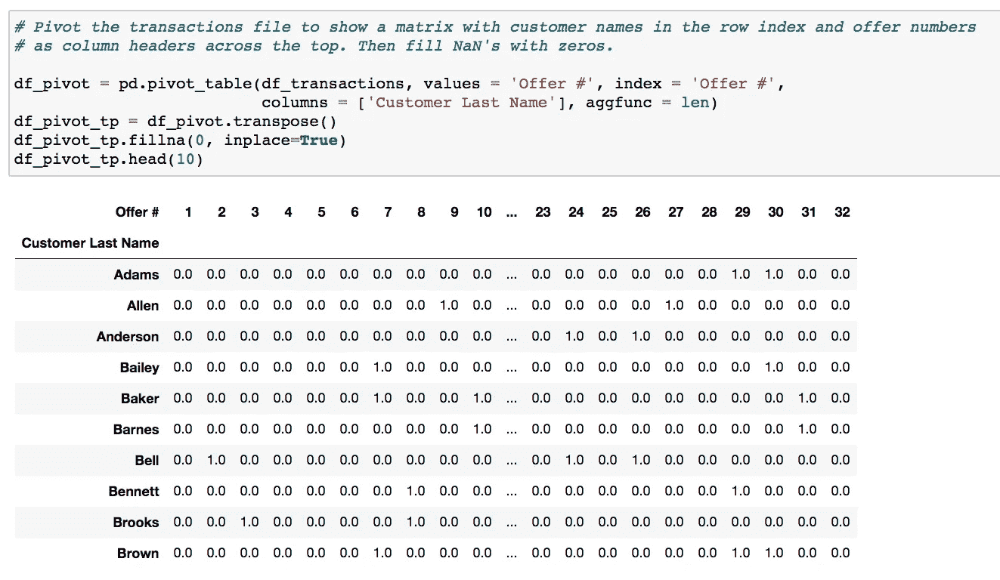

为了开始聚类过程，我们需要选择我们想要开始的聚类的数量，即使我们还不知道最佳数量是多少。最常见的方法是创建一个“Scree 图”,该图显示随着聚类数量的增加，类内误差平方和(WCSSE)即“失真”逐渐减少。你希望看到的是图表上 WCSSE 下降趋于平稳的一点。这就是所谓的“肘点”。下面是代码和最终的 Scree 图。

显然，这个图并没有显示出我们想要看到的真正清晰的“拐点”。我认为这表明这些数据比我们希望的要混乱一些。但这在现实世界中并不罕见。每次给定一个数据集都能快速生成清晰简明的见解是相当不寻常的。尽管如此，如果我们愿意花一些时间研究不同的参数，我们仍然可以做出一些有趣的观察。

在上面的碎石图中，看起来有两个点，在这两个点上，线的斜率减小，分别在 3 个簇和 8 个簇处。让我们尝试另一种过滤技术来帮助确定 K-means 算法的聚类数，[剪影分数](https://scikit-learn.org/stable/auto_examples/cluster/plot_kmeans_silhouette_analysis.html)。

轮廓分数将每个聚类中的数据点之间的平均距离与相邻聚类中的数据点之间的平均距离进行比较。它是一个介于-1 和 1 之间的值。越接近 1 越好。

我已经计算了下面每一组的轮廓分数。

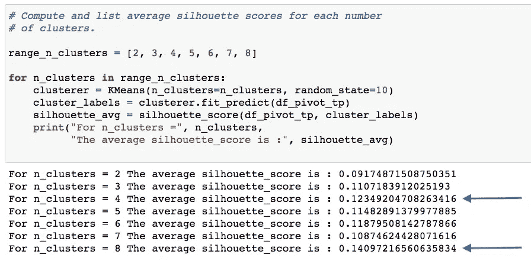

看起来最高的平均分是四类和八类。因此，让我们尝试八个集群，看看会发生什么。

既然我们已经提供了与每个集群的事务计数一致的详细信息，我们就可以按照从大到小的顺序对每个集群进行排序，并观察详细信息中的模式。

在第一个聚类“0”中，我们观察到所有这些买家都是黑皮诺爱好者。

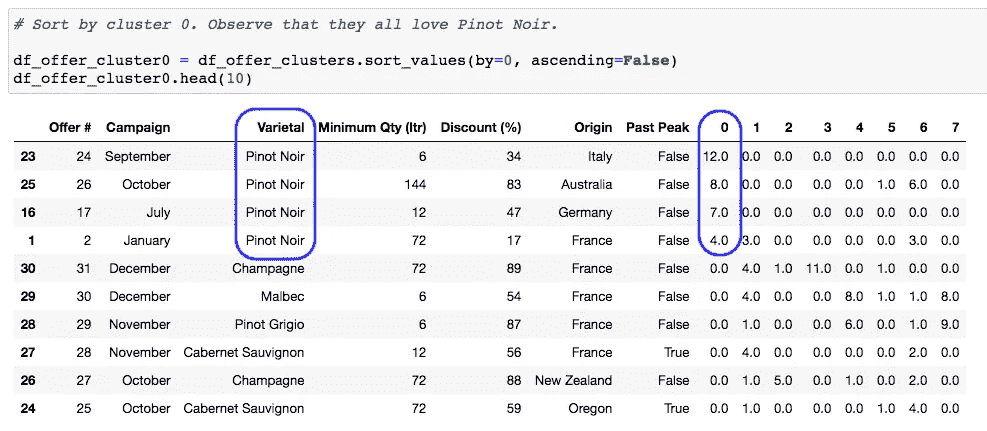

在第二组“1”中，我们观察到这些人是亲法分子。他们喜欢法国制造的任何东西。

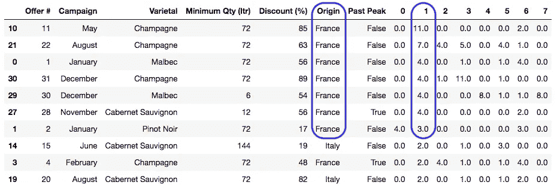

通过聚类“2”，我们找到了所有的起泡酒爱好者。

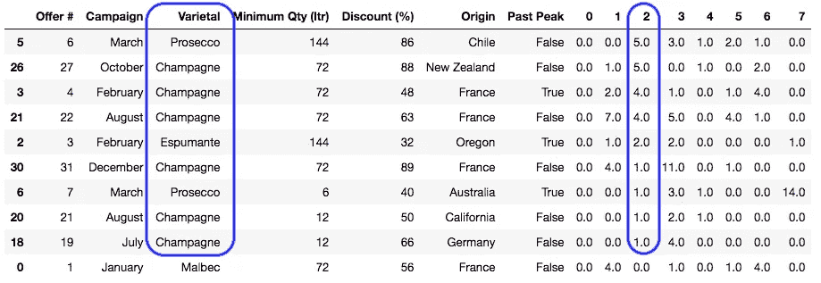

通过聚类“3”，我们找到了更多的起泡酒爱好者。有了这种重叠，也许我们应该合并集群 2 和集群 3？

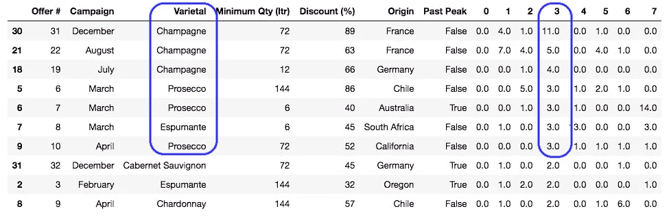

在聚类“4”中，我们观察到不同品种的混合，但大多数购买量较低。因此，这些人可能是我们推销剩余交易的对象。

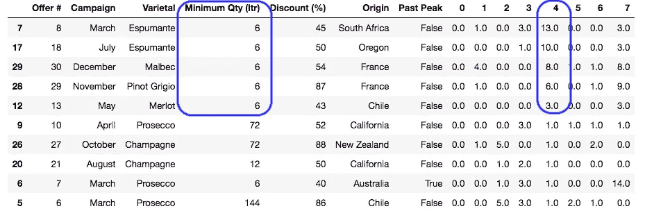

在聚类“5”中，我们看到一些噪音，但是我们可以观察到这些人似乎既喜欢起泡酒又喜欢红酒。

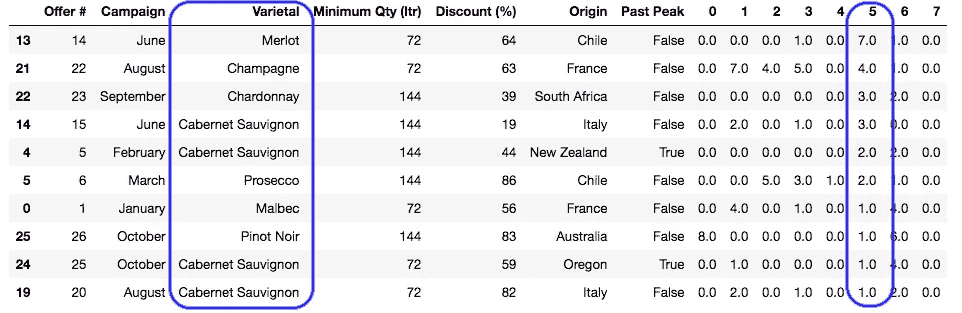

在聚类“6”中，除了霞多丽，这些人似乎也喜欢红酒和起泡酒。也许我们应该合并第五组和第六组？

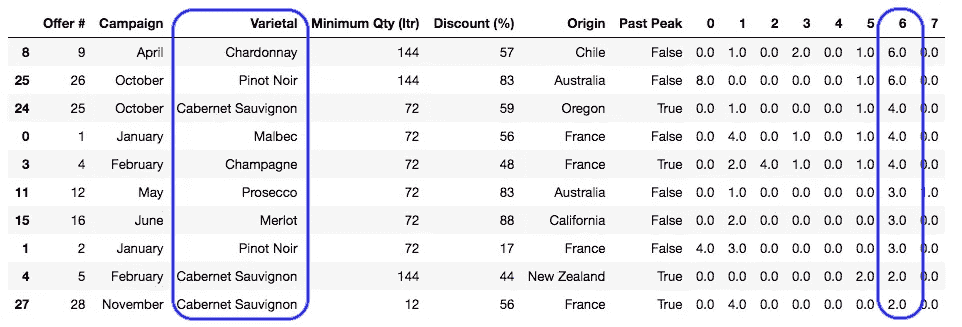

最后，对于聚类“7”，我们观察到更多红酒和起泡酒买家的组合，加上一些“吵闹的”灰皮诺买家。

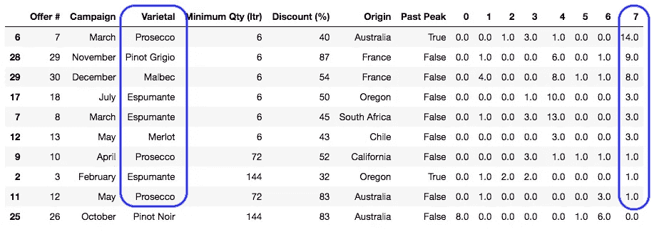

在这八个集群中，我们发现了一些重叠和其他有些嘈杂的结果。那么，如果我们尝试另一个 K-means 算法运行，这次只有四个集群，会发生什么呢？

这一次我们得到了更清晰的结果:

一群香槟和红酒爱好者，大多是亲法人士。

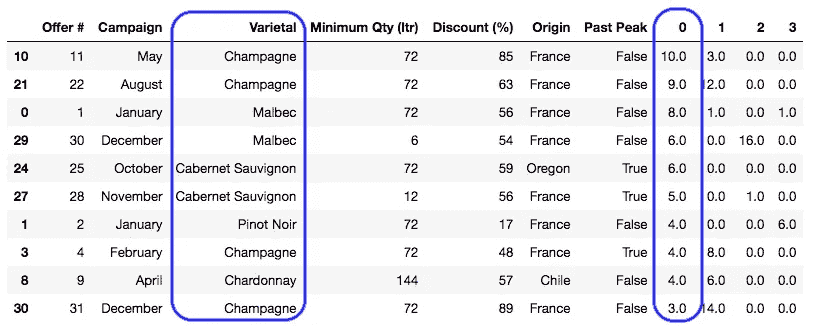

闪闪发光的泡泡风扇。

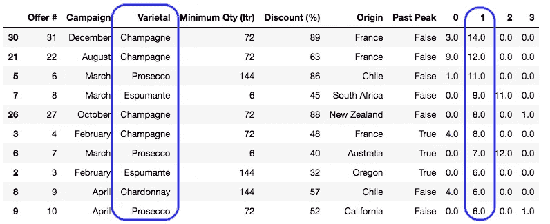

低销量买家。

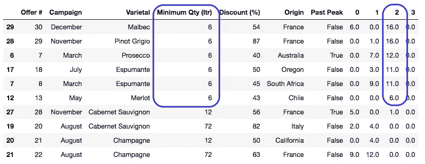

以及我们永远忠诚的黑皮诺爱好者！

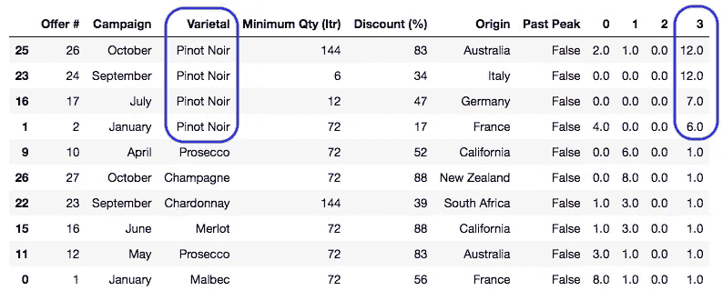

那么我们今天在这里学到了什么？即使是包含许多不同维度的有点嘈杂的数据集，我们也可以使用 K-means 聚类将我们的客户分为不同的组，从而揭示有趣的购买模式，这将为我们提供一些关于未来特殊折扣优惠的想法，以优化我们的销售结果。

具体来说，我们发现了香槟迷、红酒迷、黑皮诺爱好者和低销量买家这几个截然不同的群体来推销我们的剩菜。您可能还会发现，只有一两个属性真正有所不同。在这种情况下，它是葡萄酒品种类别，在较小的程度上，是购买的最小数量。

在这个特殊的用例中，虚构的买家是餐馆和酒类商店的老板，或者“B2B”买家。如果我们面对的是个人零售客户呢？如果我们还可以获得客户的外部数据，让我们有更多的属性进行排序，比如平均收入、生活方式偏好、社会关系或工作类型，这不是很有趣吗？这难道不允许我们将营销计划提升到一个全新的水平吗？

现在有成千上万的数字经济企业在收集这类关于我们的数据。脸书、谷歌和亚马逊是这一群体中最知名的。虽然这听起来有点像“老大哥”，但实际上这和你友好的邻居杂货商几代人以来一直坚持的“了解你最好的顾客”的习惯是一样的。

但是现在随着云计算资源和像 Python 这样容易学习的计算语言的出现，这种聪明的商业思维可以扩大到数百万的数量！欢迎来到大数据的美丽新世界！

如果您有意见或想法要与我分享，请通过 LinkedIn 联系我[。](https://www.linkedin.com/in/bryantsheehy/)