# 选择行时使用。通信线路（LinesofCommunication）

> 原文：<https://towardsdatascience.com/selecting-rows-with-loc-276d217c4ea5?source=collection_archive---------33----------------------->

## 数据科学/ Python 代码片段

## 从熊猫数据框架中选择数据子集的初学者指南。


[丘特尔斯纳普](https://unsplash.com/@chuttersnap?utm_source=unsplash&utm_medium=referral&utm_content=creditCopyText)在 [Unsplash](https://unsplash.com/s/photos/organization?utm_source=unsplash&utm_medium=referral&utm_content=creditCopyText) 上拍照

*作为数据科学家，我们大部分时间都在用熊猫处理数据。在本帖中，我们将关注。根据一些预定义的条件来选择行。*

*我们打开 Jupyter 笔记本，我们来扯皮吧！*

# 数据

我们将使用来自圣安东尼奥市开放数据网站[的 311 服务呼叫数据集来说明不同之处。锁定技术有效。](https://data.sanantonio.gov/dataset/service-calls)

# 家政

在我们开始之前，让我们先做一点家务。

这里没什么特别的。我们只是导入强制的 Pandas 库并设置显示选项，这样当我们检查数据帧时，列和行就不会被 Jupyter 截断。我们将它设置为显示单个单元格中的每个输出，而不仅仅是最后一个。

在上面的代码中，我们定义了一个函数，它将向我们显示缺失值或空值的数量及其百分比。

# 获取数据

让我们将数据加载到数据帧中。

快速浏览一下`df.head()`,我们将看到前五行数据:

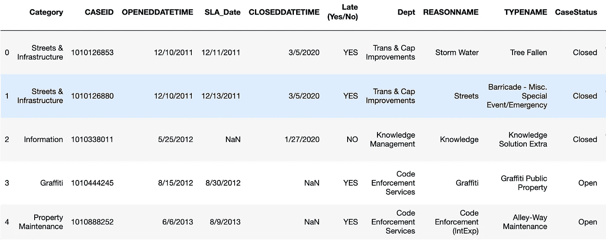

而`df.info()`将让我们看到列的数据类型。

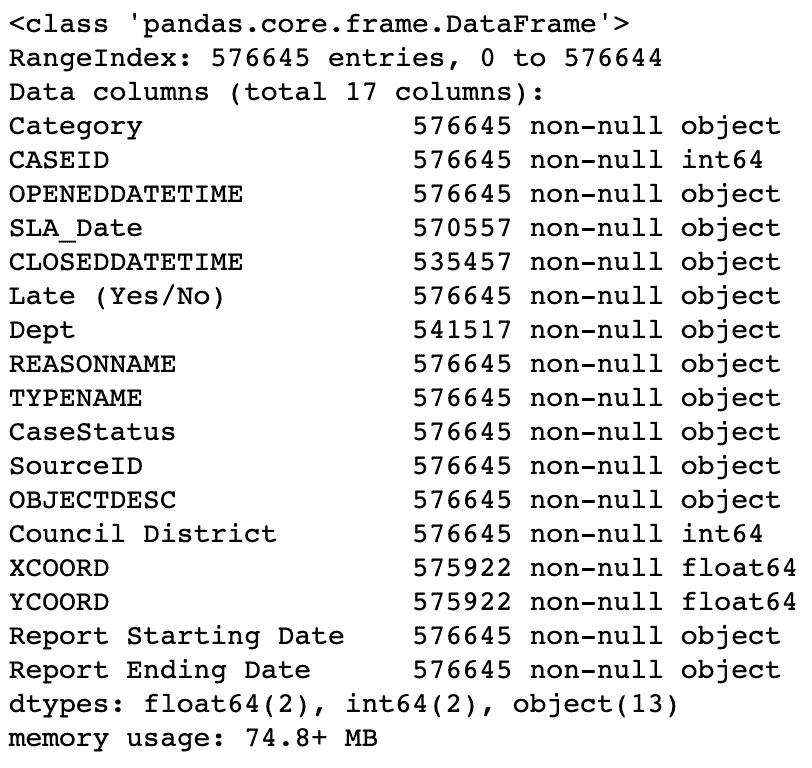

然后，`show_missing(df)`向我们显示数据中是否有丢失的值。

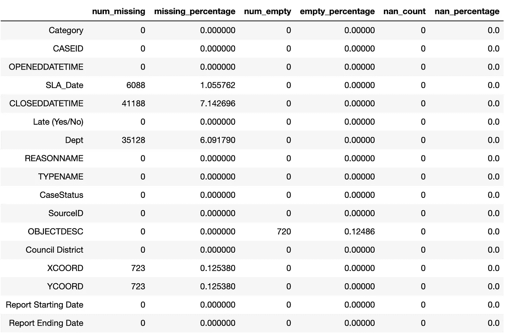

# 选择列是否为空的行。

让我们选择`'Dept'`列有空值的行，并过滤排除了空值的数据帧。

首先，我们对“Dept”列进行了值计数。方法`.value_counts()`返回一个熊猫系列，列出指定列的所有值及其频率。默认情况下，该方法忽略 NaN 值，并且不会列出它。但是，如果您包含参数`dropna=False`，它将在结果中包含任何 NaN 值。

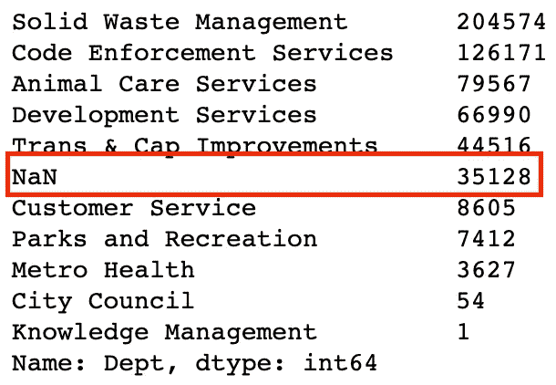

接下来，行`df_null = df.loc[df['Dept'].isnull()]`告诉计算机选择`df`中列`'Dept'`为空的行。产生的数据帧被分配给`df_null`，它的所有行将作为“Dept”列中的值。

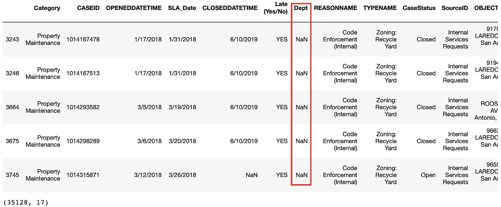

类似地，行`df_notnull = df.loc[df['Dept'].notnull()]`告诉计算机选择`df`中列`'Dept'`不为空的行。产生的数据帧被分配给`df_notnull`，并且它的所有行在‘Dept’列中没有任何 NaN 值。

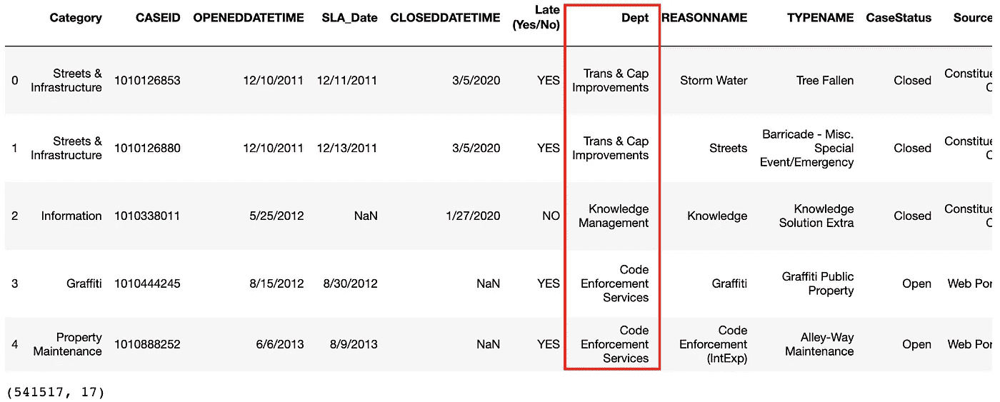

这两种技术的一般语法如下:

```
df_new = df_old.loc[df_old['Column Name'].isnull()]
df_new = df_old.loc[df_old['Column Name'].notnull()]
```

# 选择列为特定值的行。

`'Late (Yes/No)'`专栏看起来很有趣。让我们来看看吧！

同样，我们对`'Late (Yes/No)'`列进行了快速的数值计算。然后，我们过滤掉那些晚于`df_late = df.loc[df['Late (Yes/No)'] == 'YES']`的案例。类似地，我们反其道而行之，将`'YES'`改为`'NO'`，并将其分配给不同的数据帧`df_notlate`。

除了在列和我们想要比较的值之间增加了一个`==`符号之外，语法和前面的例子没有太大的不同。它基本上是针对每一行，询问特定列(左侧)上的值是否与我们指定的值(右侧)相匹配。如果匹配为真，则在结果中包含该行。如果匹配是假的，它忽略它。

以下是`df_late`的结果数据帧:

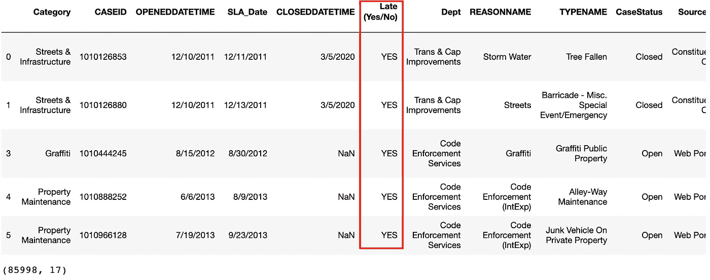

这是给`df_notlate`的:

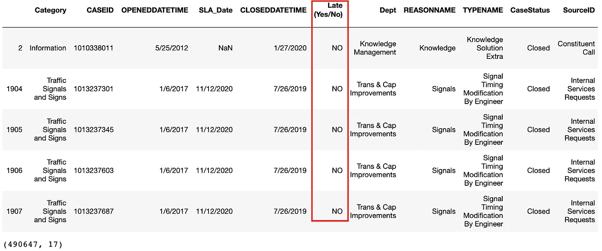

这种技术的一般语法是:

```
df_new = df_old.loc[df_old['Column Name'] == 'some_value' ]
```

# 选择列不是特定值的行。

我们已经学习了如何基于“是”和“否”来选择行，但是如果值不是二进制的呢？例如，让我们看看“类别”列:

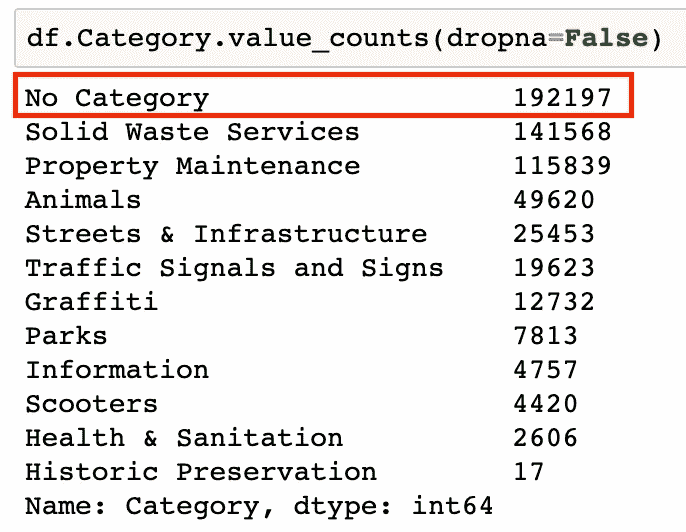

192，197 行或记录没有分配类别，但是我们得到的不是 NaN、empty 或 null 值，而是类别本身。如果我们想过滤掉这些呢？回车:`!=`操作符。

像往常一样，我们对`'Category'`列进行了常规值计数，以查看我们正在处理的内容。然后，我们创建了`df_categorized`数据帧，以包含`df`数据帧中任何在`'Category'`列中没有`'No Category'`值的记录。

下面是对`df_categorized`数据帧的`'Category'`列进行数值计算的结果:

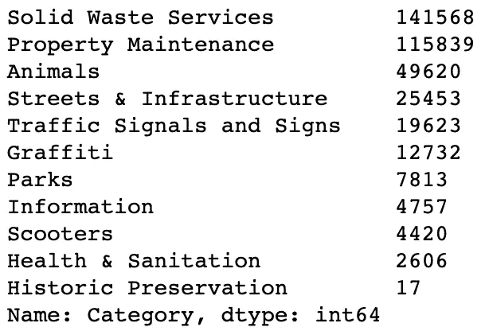

如上面的截图所示，值计数保留了除“无类别”之外的所有内容。

这种技术的一般语法是:

```
df_new = df_old.loc[df_old['Column Name'] != 'some_value' ]
```

# 基于多个条件选择行。

让我们考虑下面的列，`'Late (Yes/No)'`和`'CaseStatus':`

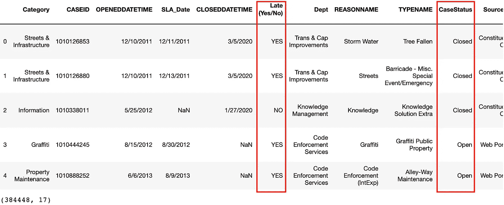

如果我们想知道现在哪些打开的案例已经通过了 SLA(服务级别协议),该怎么办？我们需要使用多个条件来过滤新数据框架中的案例或行。输入`&`符。

语法与前面的相似，除了在括号中引入了`&`操作符。在`df_late_open = df.loc[(df[‘Late (Yes/No)’] == ‘YES’) & (df[‘CaseStatus’] == ‘Open’)]`这条线上，有两个条件:

1.  `(df[‘Late (Yes/No)’] == ‘YES’)`
2.  `(df[‘CaseStatus’] == ‘Open’)`

我们希望这两个都为真来匹配一行，所以我们在它们之间包含了操作符`&`。简单地说，`&`位操作符就是 AND 的意思。其他按位运算符包括表示 or 的管道符号`|`和表示 NOT 的波浪号`~`。我鼓励您尝试使用这些按位运算符，以便更好地了解它们能做什么。只要记住将每个条件用括号括起来，这样就不会混淆 Python。

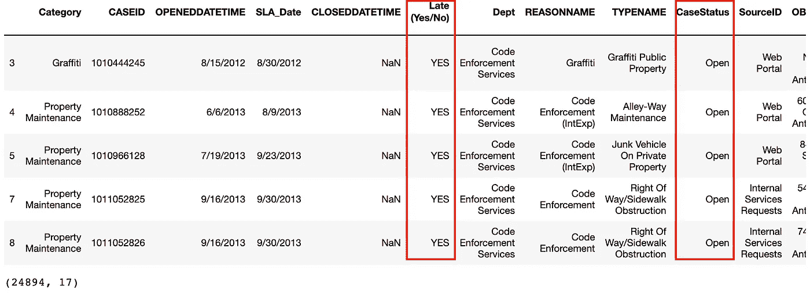

这种技术的一般语法是:

```
df_new = df_old.loc[(df_old['Column Name 1'] == 'some_value_1') & (df['Column Name 2'] == 'some_value_2')]
```

# 选择列值属于某个值列表的行。

让我们看看`'Council District'`列的值计数:

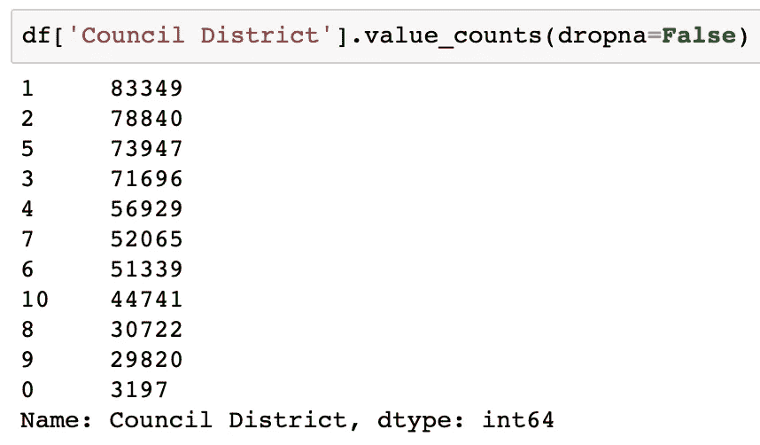

如果我们想把重点放在第 2 区、第 3 区、第 4 区和第 5 区，因为它们位于圣安东尼奥南部，并且以城市服务质量差而闻名，会怎么样？(顺便说一句，这完全是我瞎编的！)在这种情况下，我们可以像这样使用`.isin()`方法:

记得在`.isin()`方法中像`['choice1', 'choice2', 'choice3']`一样传递你的选择，否则会导致错误。对于我们例子中的整数，没有必要包含引号，因为引号只适用于字符串值。

这是我们新数据框架`df_south`的结果:

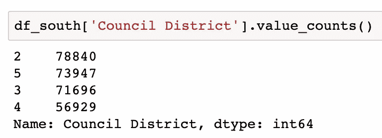

这种技术的一般语法是:

```
df_new = df_old.loc[df_old[Column Name'].isin(['choice1', 'choice2', 'choice3'])]
```

# 结论

就是这样！在本文中，我们将 311 服务调用数据加载到一个数据帧中，并使用`.loc`方法创建了数据子集。

感谢阅读！我希望你喜欢今天的帖子。数据争论，至少对我来说，是一项有趣的练习，因为这是我第一次了解数据的阶段，它给了我一个机会来磨练我在面对真正混乱的数据时解决问题的技能。快乐的争吵的人们！

*敬请期待！*

你可以通过推特或 T2【LinkedIn】联系我。

[1]圣安东尼奥市公开数据。(2020 年 5 月 31 日)。 *311 服务电话。*[https://data.sanantonio.gov/dataset/service-calls](https://data.sanantonio.gov/dataset/service-calls)