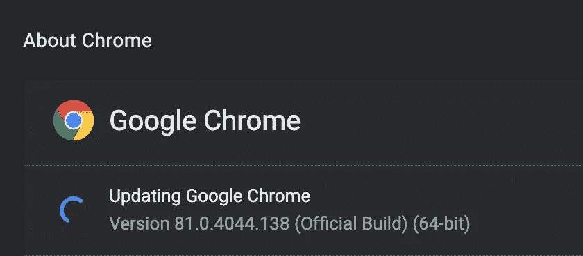
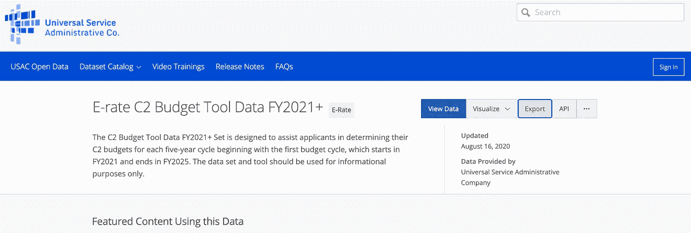
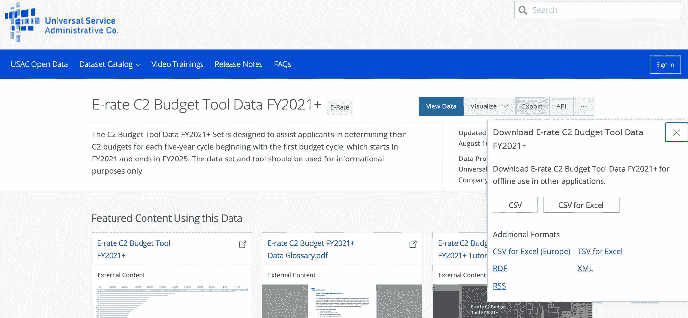
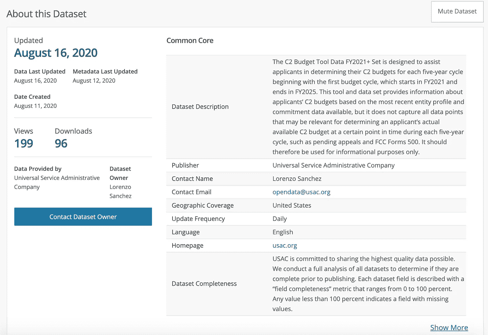

# 硒在起作用

> 原文：<https://towardsdatascience.com/selenium-in-action-2fd56ad91be6?source=collection_archive---------25----------------------->

## 自动化示例

## Python 中的网络抓取和自动化


卡尔·海尔达尔在 [Unsplash](https://unsplash.com/s/photos/web?utm_source=unsplash&utm_medium=referral&utm_content=creditCopyText) 上拍摄的照片

# 1.硒简介

你们中的许多人可能以前在 Python 中玩过 web 抓取。有几个 Python 包可以根据网页(HTML)元素提取网站信息；一些例子是 [BeautifulSoup](https://pypi.org/project/beautifulsoup4/) 、 [Scrapy](https://scrapy.org/) 和 [urllib](https://docs.python.org/3/library/urllib.html) 2。这些包通常依赖 XPATH 或 CSS 等 web 元素来提取数据。它们各有利弊，但它们可以毫无问题地处理来自许多网站的抓取。

然而，越来越多的网站采用 JavaScript 和其他方法来增加抓取的难度，甚至完全阻止抓取。例如， [NYPD 开放数据门户](https://data.cityofnewyork.us/Social-Services/NYPD/fjn5-bxwg)的“下载”按钮直到用户点击“导出”按钮后才会显示。因此，使用 XPATH 或 CSS 的常规抓取方法将无法正常工作，因为直到用户单击按钮时才会找到 web 元素。在你开始拔头发之前，硒来拯救你了！

传统上，Selenium 被设计用于 web 应用程序的自动化测试。这个包的本质是自动化浏览器行为，它可以在很多语言中使用，比如 Java、Python、Ruby 等。因为 Selenium 模仿用户行为，所以一个明显的缺点是速度。然而，由于像人一样自由地行动，Selenium 是一个强大的 web 抓取工具，与传统的 web 抓取包相比，它的限制最少。让我们深入研究一下，看看它是如何工作的。

# 2.设置 Selenium Webdriver

为了部署 Selenium，您需要根据您的操作系统为您的浏览器设置 Webdriver。这里我将以 Chrome 为例。

*   第一步:找到你的 Chrome 版本。你可以在“关于谷歌浏览器”找到你的浏览器版本



关于谷歌浏览器

*   第二步:根据你的 Chrome 版本下载 [**网络驱动**](https://chromedriver.chromium.org/downloads) 。
*   Windows 用户的第 3 步:你需要下载基于你的系统(32 位或 64 位)的 Chrome Webdriver，然后将`chromedriver.exe`放在你的路径中。
*   Mac 用户第三步:下载 Mac 版 Chrome 驱动后，导航到这个目录`/usr/local/`。然后检查`bin`文件夹是否存在。如果不存在，创建一个`bin`文件夹，将驱动程序放在`/usr/local/bin`中。运行`cd ~/bin && chmod +x chromedriver`使其可执行。

# 3.一个例子:USAC 开放数据——电子汇率数据

以下是练习中需要的包。让我们导入它们吧！

```
from selenium import webdriver
from selenium.webdriver.common.keys import Keys
from selenium.webdriver import ActionChains
from bs4 import BeautifulSoup
import requests
from urllib.parse import urljoin
import pandas as pd
import time
```

现在你已经设置好了 Chrome Webdriver 环境，让我们将 Selenium 投入使用吧！在本文中，我将使用 USAC E-Rate 数据门户作为一个例子。假设用户想要下载所有与 E-rate 相关的数据集，让我们在这个数据门户上设计用户路径，然后我们将尝试用 Selenium 复制用户操作。

## 步骤 1:收集所有与 E-Rate 相关的数据集 URL

我们将前往 [USAC 开放数据](https://opendata.usac.org/)搜索 E-rate 数据集。我们发现结果页面只有 2 页，因此我们可以编写以下代码来抓取所有与 E-Rate 数据相关的 URL，供 Selenium 稍后使用。

```
result_links = []
# Get all e-rate URLs from USAC data page
for i in range(2): # 2 is the total number of pages
 url = ‘[https://opendata.usac.org/browse?category=E-rate&limitTo=datasets&page='](https://opendata.usac.org/browse?category=E-rate&limitTo=datasets&page=') + str(i + 1)
 req = requests.get(url)
 soup = BeautifulSoup(req.content)
 erate_links = lambda tag: (getattr(tag, ‘name’, None) == ‘a’ and
 ‘href’ in tag.attrs and
 ‘e-rate’ in tag.get_text().lower())
 results = soup.find_all(erate_links)
 links = [urljoin(url, tag[‘href’]) for tag in results]
 links = [link for link in links if link.startswith(‘[https://opendata.usac.org/E-rate’](https://opendata.usac.org/E-rate'))]
 result_links.extend(links)print(‘In total, there are ‘ + str(len(result_links)) + ‘ links retrieved.’)
```

执行时，会弹出一条消息:“总共检索到 15 个链接。”

## 步骤 2:下载 E-Rate 数据集，用数据字典 pdf 抓取相关元数据

现在我们已经有了想要下载的数据集的所有链接，下一步将是下载它们。如果我们是用户，操作链将是:我们将点击链接，然后点击“导出”按钮，最后选择 CSV 选项进行下载。



导出按钮



CSV 按钮

一些额外的元数据也将有助于数据集文档。在数据集页面上，我们希望获得一些关键项目，包括简介、更新日期、联系人、电子邮件、更新频率和更新 url。这些元数据可以在“关于这个数据集”一节中找到。



元数据部分

这里有一个简单的例子，展示了如何使用 Selenium 来自动化重复性工作和构建数据收集。请注意，睡眠时间是任意的。这里的目标是像人类一样行动，所以确保你的行动链有意义，并分配一个适当的睡眠时间。

```
# set up driver
driver = webdriver.Chrome()# set up dataframe for metadata
metadata = pd.DataFrame(columns = ['Intro', 'Update Date', 'Contact', 'Email', 'Update Freq', 'URL'])for i in range(len(result_links)):
    # extract metadata by XPATH
    data_dict = {}
    driver.get(result_links[i])
    intro = driver.find_element_by_xpath("//*[[@id](http://twitter.com/id)="app"]/div/div[2]/div[1]/section/div[2]/div/div[1]/table/tbody/tr[1]/td[2]/span").text
    update_date = driver.find_element_by_xpath("//*[[@id](http://twitter.com/id)="app"]/div/div[2]/div[1]/section/div[2]/dl/div[1]/div/div[1]/div/dd").text
    contact = driver.find_element_by_xpath("//*[[@id](http://twitter.com/id)="app"]/div/div[2]/div[1]/section/div[2]/dl/div[3]/div/div[2]/dd").text
    email = driver.find_element_by_xpath("//*[[@id](http://twitter.com/id)="app"]/div/div[2]/div[1]/section/div[2]/div/div[1]/table/tbody/tr[4]/td[2]/span/a").text
    update_freq = driver.find_element_by_xpath("//*[[@id](http://twitter.com/id)="app"]/div/div[2]/div[1]/section/div[2]/div/div[1]/table/tbody/tr[6]/td[2]/span").text

    # update data_dict with new metadata
    data_dict.update({'Intro': intro, 'Update Date': update_date,
                     'Contact': contact, 'Email': email, 
                     'Update Freq': update_freq, 'URL': result_links[i]})
    # update dataframe
    metadata = metadata.append(data_dict, ignore_index = True)

    time.sleep(5)
    action = ActionChains(driver)

    # Click Show More
    showmore = driver.find_element_by_xpath("//*[[@id](http://twitter.com/id)="app"]/div/div[2]/div[1]/section/div[2]/div/div[5]/a[1]")
    action.move_to_element(showmore).perform()
    showmore.click()
    time.sleep(5)

    # Download glossary PDFs
    glossary = driver.find_element_by_xpath("//a[contains([@href](http://twitter.com/href), '.pdf')]")
    glossary[0].click()
    time.sleep(5)

    # Click Export
    action = ActionChains(driver)
    exportmenu = driver.find_element_by_xpath("//*[[@id](http://twitter.com/id)="app"]/div/div[1]/div/div/div[1]/div/div[2]/div/div[2]/button")
    action.move_to_element(exportmenu).perform()
    exportmenu.click()

    # Click to download CSV file
    downloadmenu = driver.find_element_by_xpath("//*[[@id](http://twitter.com/id)="export-flannel"]/section/ul/li[1]/a")
    action.move_to_element(downloadmenu).perform()
    downloadmenu.click()
```

如前所述，Selenium 比大多数 web 抓取包都要慢。另一个明显的缺点是，如果网站的所有者改变了设计，所有的 XPATHs 都需要更新。但除此之外，它是一个非常强大的工具，我鼓励你去尝试和探索更多。

我的下一篇文章将是一篇教程，介绍如何使用 Airflow 来调度 Selenium 作业，使其更加强大。敬请期待:)

参考:

1.  [下载 chromedriver 二进制文件并添加到您的自动化功能测试路径中](https://zwbetz.com/download-chromedriver-binary-and-add-to-your-path-for-automated-functional-testing/)
2.  [硒与蟒蛇](https://selenium-python.readthedocs.io/)