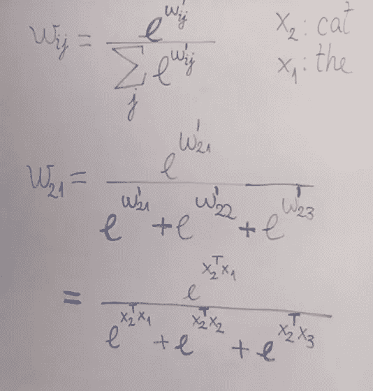

# 1 |自我关注的基础

> 原文：<https://towardsdatascience.com/self-attention-5b95ea164f61?source=collection_archive---------23----------------------->

## [变形金刚，一次一个概念](http://towardsdatascience.com/tagged/TOCAAT)

TL；DR-Transformers 是机器学习(ML)中令人兴奋的(**相对而言**)新的部分，但是在你能够理解它们之前，有很多**概念需要被分解。这是我写的关于他们的专栏的第一篇文章。在这里，我们重点关注基本的自我关注机制是如何工作的，这是 Transformer 模型的第一层。本质上，对于每个输入向量，自我关注产生一个向量，该向量是其邻域中向量的加权和。权重由单词之间的关系或*连通性*决定。这个专栏是针对那些对变形金刚下发生的事情感到好奇的 ML 新手和爱好者的。**

# 内容:

1.  [简介](#cce2)
2.  [自我关注——数学](#2beb)
3.  [参考文献](#c2e8)

# 1.介绍

变压器是一种 ML 架构，已经成功地用于各种 NLP 任务，尤其是序列到序列(seq2seq)任务，如机器翻译和文本生成。在 seq2seq 任务中，目标是获取一组输入(例如英语单词)并产生一组期望的输出(德语中的相同单词)。自 2017 年成立以来，他们已经为 seq2seq 篡夺了当时的主导架构( [LSTMs](https://en.wikipedia.org/wiki/Long_short-term_memory) )，并且几乎无处不在地出现在任何关于 NLP 突破的新闻中(例如 OpenAI 的 [GPT-2 甚至出现在主流](https://www.vox.com/2019/5/15/18623134/openai-language-ai-gpt2-poetry-try-it)媒体上！).

图 1.1 —机器翻译(欧洲→ DE)⁴

本专栏旨在非常温和、渐进地介绍 Transformer 架构背后的数学、代码和概念。没有比注意力机制更好的起点了，因为:

> 最基本的变形金刚完全依靠注意力**机制。**

# 2.自我关注——数学

我们希望 ML 系统能够学习单词之间的重要关系，就像人类理解句子中单词的方式一样。在图 2.1 中，你和我都知道“The”指的是“animal ”,因此应该和那个词有很强的联系。正如图表的颜色编码所示，这个系统知道“动物”、“十字路口”、“街道”和“the”之间有某种联系，因为它们都与句子的主题“动物”的相关。这是通过*自我关注实现的。⁴*

图 2.1—“The”关注*哪些词？⁴*

*在最基本的层面上，自我关注是一个过程，其中一个向量序列 *x* 被**编码**成另一个向量序列 *z* (图 2.2)。每一个原始向量都只是一个数字块**，其中**代表一个单词。**其对应的 *z* 向量既表示原始单词*又表示其**与其周围其他单词的关系**。****

******

***图 2.2:输入向量序列 *x* 变成另一个同样长的向量序列 *z****

***向量代表了空间中的某种东西，比如海洋中的水粒子流或者地球周围任何一点的重力效应。你*能不能*把词想成词的总空间里的向量。每个词向量*的方向意味着*某事。向量之间的异同对应于单词本身之间的异同(我在[这里](https://medium.com/analytics-vidhya/ideas-for-using-word2vec-in-human-learning-tasks-1c5dabbeb72e)之前已经写过这个主题)。***

***让我们先来看看前三个向量，特别是向量 *x2* ，我们的“猫”向量，是如何变成 *z2* 的。所有这些步骤将对输入向量的每个重复*。****

***首先，我们将聚光灯下的向量 *x2* 与一个序列中的所有向量*相乘，包括其自身*。我们将做每个向量和*转置*(对角翻转版本)x2 的乘积(图 2.3)。这与做点积是一样的，你可以把两个向量的点积看作是对它们相似程度的度量。***

******

***图 2.3:转置乘法(上标“T”=“转置”)***

***两个向量的点积与它们之间角度的余弦成正比(图 2.4)，因此它们的方向排列越紧密，点积就越大。如果它们指向完全相同的方向，那么角度 a 就是 0⁰，0⁰的余弦等于 1。如果它们指向相反的方向(因此 A = 180⁰),那么余弦就是-1。***

******

***图 2.4-两个向量的点积***

***作为题外话，注意我们用来得到向量间乘积的*运算*是一个我们可以选择的超参数。点积只是我们拥有的最简单的选项，在 [*中使用的那个选项就是你所需要的全部注意力*](https://arxiv.org/pdf/1706.03762.pdf)*【AIAYN】*。*****

****如果你想在这个问题上有一个额外的直观视角， [Bloem 的](http://www.peterbloem.nl/blog/transformers)帖子讨论了自我关注如何类似于推荐系统确定电影或用户相似性的方式。****

****因此，我们一次将一个单词放在聚光灯下，并从其邻近单词中确定其输出。这里我们只看单词之前和之后，但我们可以选择在未来扩大窗口。****

********

****图 2.5-每个第 j 个向量的原始权重****

****如果聚光灯下的单词是“猫”，我们要复习的单词顺序是“the”，“cat”，“sat”。我们在问**单词“*cat”*应该分别对“ *the”、“cat”*和“*sat”***给予多大的关注(类似于我们在图 2.1 中看到的)。****

****将我们的聚光灯单词向量的转置和它周围的单词序列相乘，将得到一组 3 个*原始权重*(图 2.5) *。每个权重与这两个词在意思上的联系程度成正比。然后，我们需要将它们规范化，以便它们更容易使用。我们将使用 [softmax 公式来完成这项工作(图 2.6)。](https://en.wikipedia.org/wiki/Softmax_function)这将数字序列转换到 0，1 范围内，其中每个输出与输入数字*的*指数成比例。这使得我们的权重更容易使用和解释。*****

********

****图 2.6:通过 softmax 函数归一化原始重量****

****现在我们取归一化的权重(每个向量一个，在 *j* 序列中)，将它们分别与 *x* 输入向量相乘，对乘积求和，然后就成功了！我们有一个输出 *z* 向量，(图 2.5)！当然，这只是 x2 ("cat ")的输出向量**——这一操作将对 *x* 中的每个输入向量重复，直到我们得到如图 2.2 所示的输出序列。******

********

****图 2.7:得到新的向量序列的最后操作， *z*****

****到目前为止，这种解释可能引发了一些问题:****

*   ****我们计算的权重不是高度依赖于我们如何确定原始输入向量吗？****
*   ****为什么我们要依赖向量的相似度？如果我们想在两个‘相异’的单词之间找到联系，比如“猫坐在马特上”的宾语和主语，该怎么办？****

****在下一篇文章中，我们将回答这些问题。我们将为每个不同的用途转换每个向量，从而更精确地定义单词*和*之间的关系，这样我们可以得到更像图 2.8 的输出。****

********

****图 2.8—**橙色栏**与**粉色栏**中的“cross”关注的是哪个词？****

****我希望你喜欢这篇文章，我感谢任何数量的掌声。欢迎在评论中留下任何反馈(积极的或建设性的),我会尽可能快地把它写下来。****

****对我的理解帮助最大，我非常感谢的人是 Peter Bloem(如果你像我一样喜欢数学优先的机器学习方法，他的[帖子](http://www.peterbloem.nl/blog/transformers)是一个很好的开始)和 Jay Alammar(如果你想从自上而下的角度开始，我推荐[他的文章](https://jalammar.github.io/illustrated-transformer/))。****

# ****3.参考****

1.  ****插图变压器。(2018)*[https://jalammar.github.io/illustrated-transformer/](https://jalammar.github.io/illustrated-transformer/)【2020 年 6 月 27 日访问】*****
2.  *****从无到有的变形金刚。(2019)[http://www.peterbloem.nl/blog/transformers](http://www.peterbloem.nl/blog/transformers)。[2020 年 6 月 27 日获取]*****
3.  *****Vaswani A .等人，2017 年 12 月。你所需要的只是关注。第 31 届神经信息处理系统会议(NIPS 2017)，美国加州长滩。[https://papers . nips . cc/paper/7181-attention-is-all-you-need . pdf](https://papers.nips.cc/paper/7181-attention-is-all-you-need.pdf)【2020 年 6 月 27 日访问】。 [arXiv:1706.03762](https://arxiv.org/abs/1706.03762)*****
4.  *****瓦斯瓦尼 a .等人 2018 年 3 月 [arXiv:1803.07416](https://arxiv.org/abs/1803.07416) 。[互动笔记本](https://colab.research.google.com/github/tensorflow/tensor2tensor/blob/master/tensor2tensor/notebooks/hello_t2t.ipynb?authuser=2#scrollTo=OJKU36QAfqOC):【2020 年 6 月 29 日访问】*****