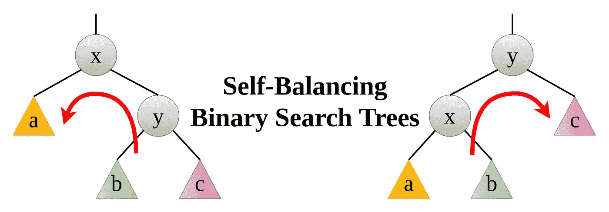
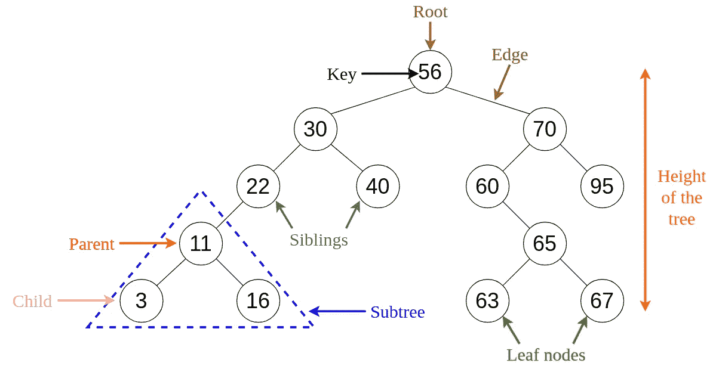
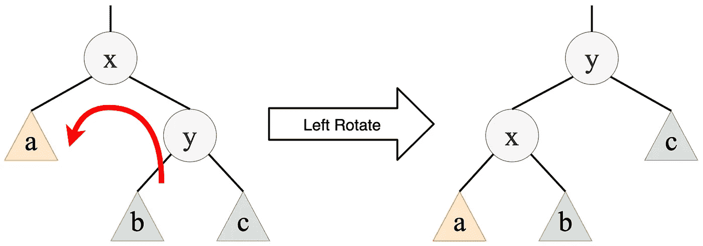
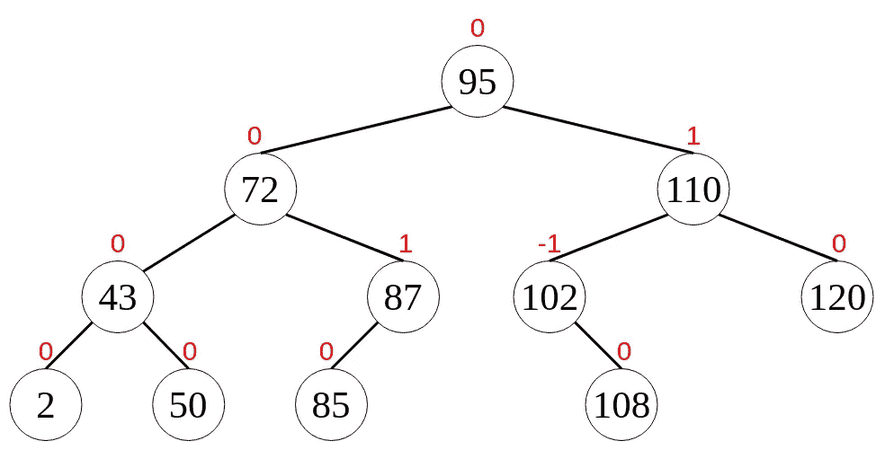
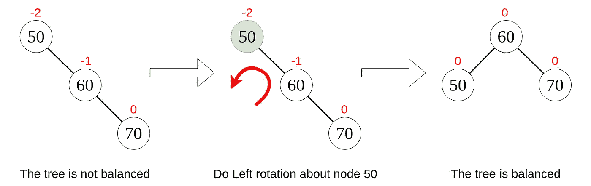
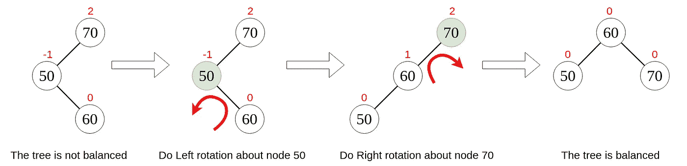
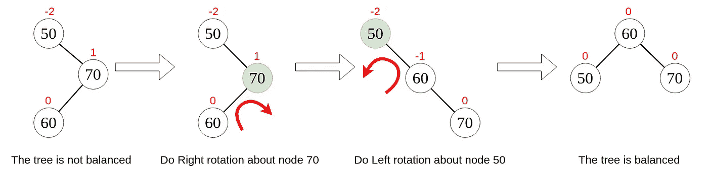
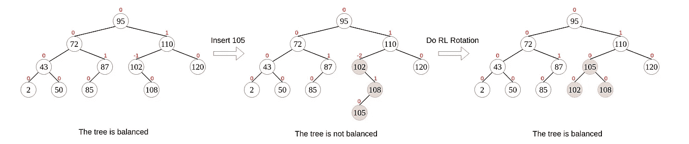

# 自平衡二分搜索法树 101

> 原文：<https://towardsdatascience.com/self-balancing-binary-search-trees-101-fc4f51199e1d?source=collection_archive---------4----------------------->

## 自平衡二分搜索法树简介

**数据结构**是一种在计算机中组织和存储数据的专门方法，通过这种方法，我们可以更有效地对存储的数据执行操作。在现有的众多数据结构中，二分搜索法树在高效操作中扮演着重要角色。由于我的上一篇文章[每个程序员都必须知道的 8 种常见数据结构](/8-common-data-structures-every-programmer-must-know-171acf6a1a42)收到了很多兴趣和友好的回复，所以我将在本文中简要解释一下自平衡二分搜索法树(BST)。

# 什么是二分搜索法树？

如果你读过我之前关于数据结构的文章，你就会知道**二叉查找树(BST)** 是一棵二叉树，其中的数据以层次结构组织。

二叉查找树展示了一个独特的属性，称为**二叉搜索树属性**。

设 **x** 是二叉查找树中的一个节点。

*   如果 **y** 是 x 的**左**子树中的一个节点，那么 **y.key ≤ x.key**
*   如果 **y** 是 x 的**右**子树中的一个节点，那么 **y.key ≥ x.key**

图一。二分搜索法树基本术语的可视化。

# 什么是自平衡二分搜索法树？

自平衡二叉查找树(BST)是一种自动尝试始终保持其高度尽可能小的二叉查找树(即使在执行插入或删除等操作后)。

如果你翻阅过 [Big-O 算法复杂度备忘单](https://www.bigocheatsheet.com/)，可以看到 BST 运算的平均时间复杂度为*θ(h)*，其中 *h* 为树的高度。因此，在执行大量操作时，高度越小越好。因此，引入了自动平衡 BST，它可以自动将高度保持在最小值。然而，您可能认为每次执行操作时都必须进行自平衡是低效的，但这可以通过确保稍后在 BST 上执行大量快速操作来补偿。

高度为 *h* 的二叉树最多可以有`2⁰+2¹+···+2ʰ = 2⁽ʰ⁺¹⁾−1`个节点。

> n≤2⁽ʰ⁺⁾1
> 
> h ≥ ⌈log₂(n+1) - 1⌉ ≥ ⌊log₂(n)⌋

因此，对于自平衡 BSTs，最小高度必须始终是向下舍入的 ***对数* ₂( *n)*** 。此外，如果每个节点的左右子节点的高度相差 **-1** 、 **0** 或 **+1** ，则称二叉树是**平衡的**。该值被称为**平衡系数**。

> **平衡因子=左子树的高度-右子树的高度**

# 自平衡二分搜索法树是如何平衡的？

说到自平衡，BST 在执行插入和删除操作后执行**旋转**。下面给出了两种类型的旋转操作，可以在不违反二叉搜索树属性的情况下执行这两种操作来平衡 BST。

## 1.向左旋转

当我们绕节点 *x* 向左旋转时，节点 *y* 成为子树的新根。节点 *x* 成为节点 *y* 的左子节点，子树 *b* 成为节点 *x* 的右子节点。

图二。在节点 x 上向左旋转

## 2.向右旋转

当我们围绕节点 *y* 向右旋转时，节点 *x* 成为子树的新根。节点 *y* 成为节点 *x* 的右子节点，子树 *b* 成为节点 *y* 的左子节点。

图三。在节点 y 上向右旋转

请注意，一旦您完成了旋转，前一个和最后一个树中节点的有序遍历是相同的，并且二叉搜索树属性保持不变。

# 自平衡二分搜索法树的类型

下面给出了几种自平衡 BST。

1.  AVL 树
2.  红黑色的树
3.  张开树木
4.  Treaps

# 自平衡二分搜索法树的应用

自平衡 BST 用于构建和维护有序列表，如优先级队列。它们也用于[关联数组](https://en.wikipedia.org/wiki/Associative_array)，其中键-值对根据仅基于键的排序插入。

计算几何中的许多算法利用自平衡 BST 来有效地解决问题，例如[线段相交](https://en.wikipedia.org/wiki/Line_segment_intersection)问题。此外，可以扩展自平衡 BST 来执行新的操作，这些操作可用于优化数据库查询或其他列表处理算法。

# AVL 树作为自平衡 BST 的一个例子

*阿德尔森-维尔斯基和兰迪斯* ( **AVL** )树是平衡的二叉树。AVL 树中的所有节点存储它们自己的平衡因子。

> 在 AVL 树中，每个节点的平衡因子是-1、0 或+1。

换句话说，对于 AVL 树中的所有节点，左侧子树的高度和右侧子树的高度之差不能超过 1。

## AVL 树示例

图 4。AVL 树示例

在图 4 中，节点上方红色的值是它们对应的平衡因子。您可以看到，在图 4 所示的 AVL 树的所有节点中都满足了平衡因子条件。

# AVL 树的旋转

在 AVL 树中执行插入或删除后，我们必须检查所有节点是否满足平衡因子条件。如果树不平衡，那么我们必须做**旋转**来使它平衡。

对 AVL 树进行的旋转可以分为四种主要类型，分为两类。他们是，

1.  **单转** — **左(LL)转**和**右(RR)转**
2.  **双旋转** — **左右(LR)旋转**和**左右(RL)旋转**

下面给出的图表将解释每种旋转类型。

## 1.单次向左旋转(LL 旋转)

在这种类型的旋转中，我们将所有节点向左移动一个位置。

图五。LL 旋转

## 2.单次右旋转(右旋转)

在这种类型的旋转中，我们将所有节点向右移动一个位置。

图六。RR 旋转

## 3.左右旋转(左右旋转)

顾名思义，这种类型的旋转包括左旋和右旋。

图 7。左右旋转

## 4.左右旋转(左旋转)

这种类型的旋转包括右旋转和左旋转。

图 8。RL 旋转

# 向 AVL 树中插入元素

考虑图 4 中给出的 AVL 树。我们想给这个树添加一个新的节点 105。图 9 显示了插入新节点和重新平衡树的步骤。

图九。插入和平衡

添加节点 105 后，树中将总共有 12 个节点。如果我们计算出平衡树的可能高度，

> h ≥ ⌈log₂(n+1) — 1⌉
> 
> h ≥ ⌈log₂(12+1) — 1⌉
> 
> h ≥ ⌊log₂(12)⌋ = ⌊3.58496250072⌋ = 3

但是，插入后生成的树的高度为 4。此外，节点 102 的平衡因子是-2。从这些事实可以看出，插入后得到的树是不平衡的。因此，我们必须通过旋转来平衡它。可以看到，应该旋转以节点 102 为根的子树，并且应该使用 RL 旋转。执行这个旋转后，我们得到一个高度为 3 的平衡树。

# 最后的想法

我希望这篇文章作为自平衡二分搜索法树的简单介绍对你有用，在这里我们以 AVL 树为例进行了讨论。我很想听听你的想法。😇

非常感谢你的阅读。😊请继续关注接下来的文章，我将在其中解释更多关于自平衡 BST 的内容。

干杯！😃

# 参考

[1] [CS241 —讲义:自平衡二叉查找树](https://www.cpp.edu/~ftang/courses/CS241/notes/self%20balance%20bst.htm)

[2] [自我平衡的二叉查找树——维基百科](https://en.wikipedia.org/wiki/Self-balancing_binary_search_tree)

[3] [数据结构教程— AVL 树|示例|平衡因子](http://www.btechsmartclass.com/data_structures/avl-trees.html)