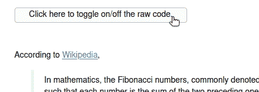
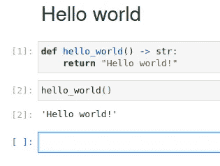
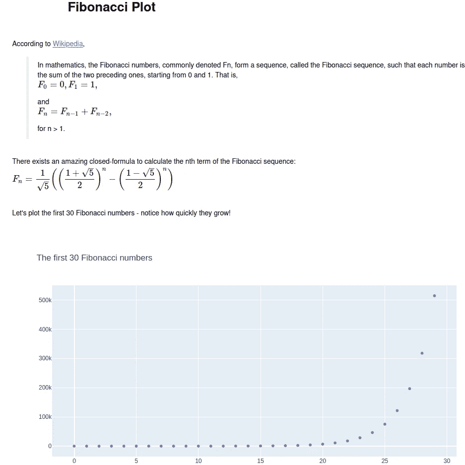
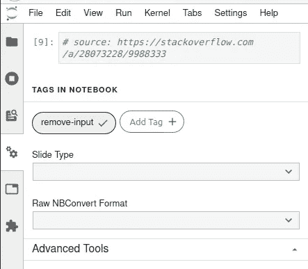
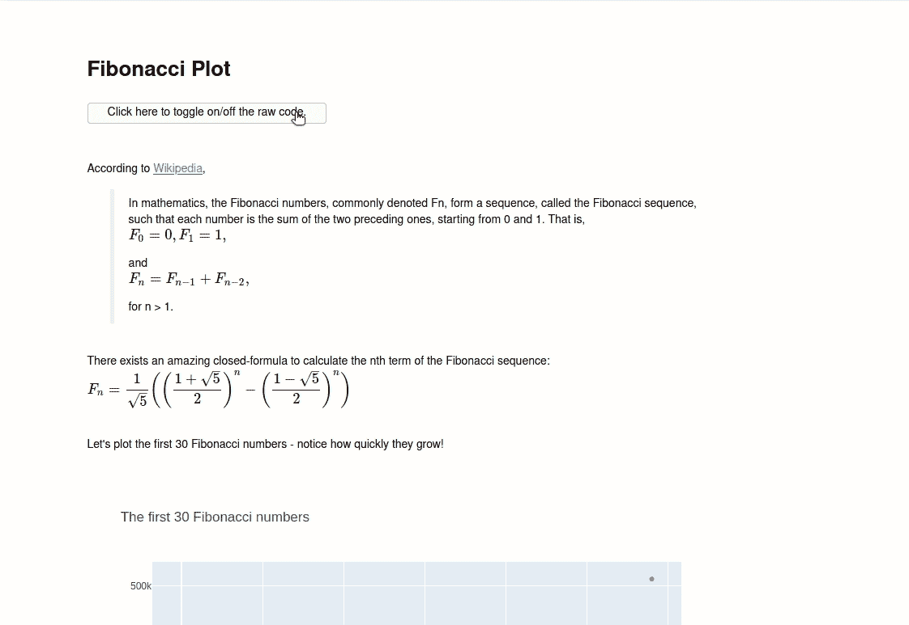

# Jupyter 笔记本中的独立报告

> 原文：<https://towardsdatascience.com/self-contained-reports-from-jupyter-notebooks-219a3887979d?source=collection_archive---------48----------------------->

## 使它们具有交互性和可隐藏的代码单元

# 介绍

你刚刚写了一个非常棒的 Jupyter 笔记本，你想把它发给你的同事。要求他们安装 Jupyter 是不可行的，要求他们提供一台服务器来托管你的页面也是不可行的。你是做什么的？

我将向您展示如何将您的笔记本导出为独立的 html 报告，任何人都可以在浏览器中打开该报告。我将从如何导出 html 报告的最简单的例子开始，然后我将展示如何隐藏输入单元格，最后我将展示如何切换显示/隐藏代码单元格。

可以在[这里](https://github.com/MarcoGorelli/self-contained-report-from-notebook)找到原始资料。

# Hello world 示例

让我们从最简单的例子开始——我们有一个[“hello world”笔记本](https://github.com/MarcoGorelli/self-contained-report-from-notebook/blob/master/notebooks/hello_world.ipynb)，我们希望将它导出为一个自包含的 html 报告。我们可以通过跑步做到这一点

如果查看`build`目录并在浏览器中打开生成的`html`文件，我们会看到

这是一个自包含的文件，您可以将它作为电子邮件附件发送给任何人，他们将能够在他们的浏览器中打开它！

# 斐波那契示例

现在假设我们有一个[笔记本](https://gist.github.com/MarcoGorelli/75c994ad4fc68146a6a2073dd27cbcd4)，它计算前 100 个斐波纳契数并绘制它们。如果我们的最终目标是向非技术同事发送报告，我们可能希望从报告中排除任何代码单元，只保留输出和降价。

我们可以用`--no-input`标签:如果我们跑

然后我们得到一个独立的报告，有一个交互式的情节，没有代码单元，任何人都可以在他们的浏览器中打开它！

# 斐波那契示例—切换显示/隐藏代码单元格

在前面的例子中，所有的代码单元格在报表中都是隐藏的。但是，如果我们仍然希望让我们的最终用户能够有选择地显示或隐藏它们，那该怎么办呢？这需要一点技巧。

*   步骤 2:编辑该单元格的元数据，使其包含标签`remove-input`。您可以通过单击左侧窗格中的属性检查器来编辑单元格的元数据:

*   第三步:如果有任何其他单元格的输入(或输出)你想保持*总是*隐藏，添加`remove-input` (resp。`remove-output`)到它们的元数据；
*   步骤 4:从终端运行

最后，您将得到一个切换按钮，通过它您可以有选择地显示或隐藏您的代码单元格！

# 结论

我已经向您展示了如何从 Jupyter 笔记本中导出包含隐藏代码单元格的自包含交互式报告。如果您需要与他人共享 Jupyter 笔记本，而不必要求他们安装任何额外的工具，这是一个很好的解决方案。原始资料可以在这里找到[。](https://github.com/MarcoGorelli/self-contained-report-from-notebook)

【https://marcogorelli.github.io/】原载于*。*