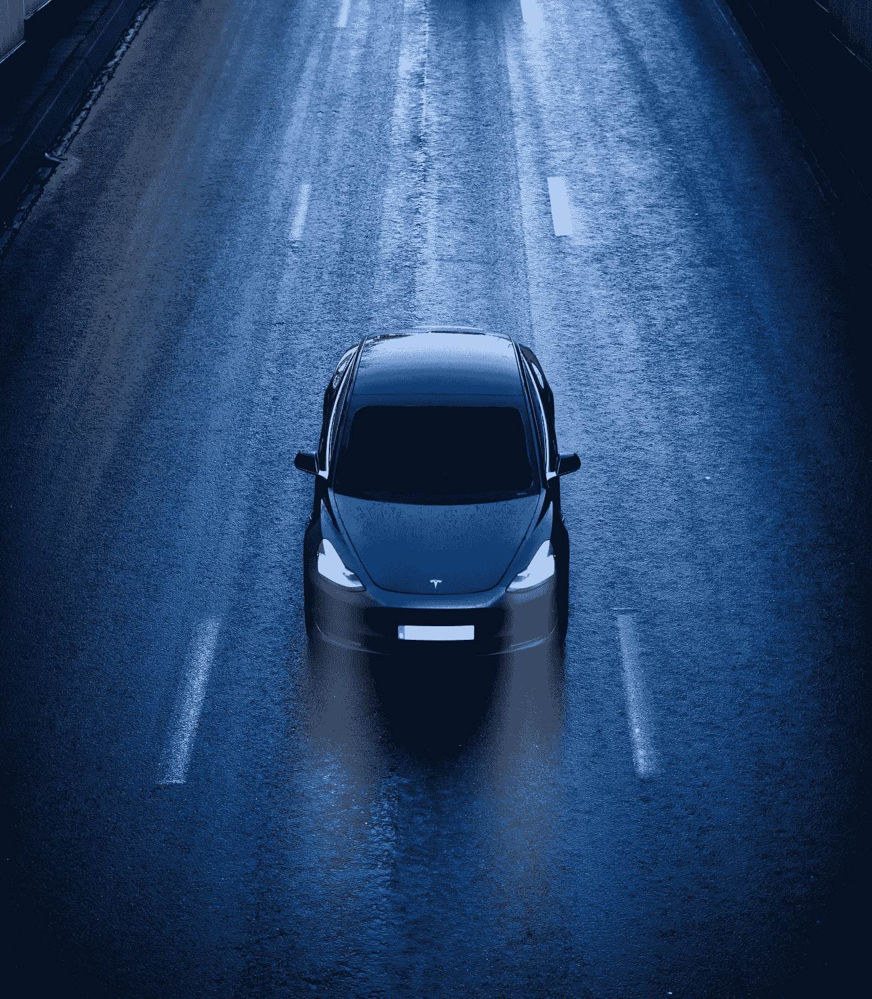
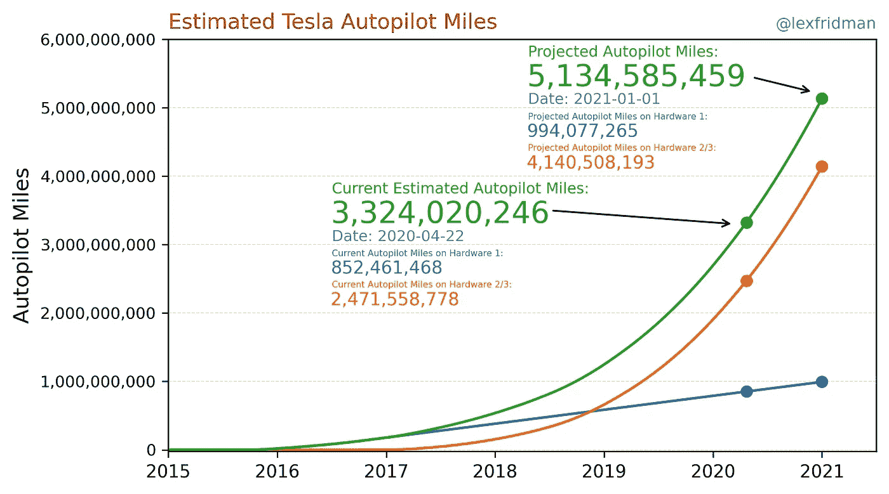
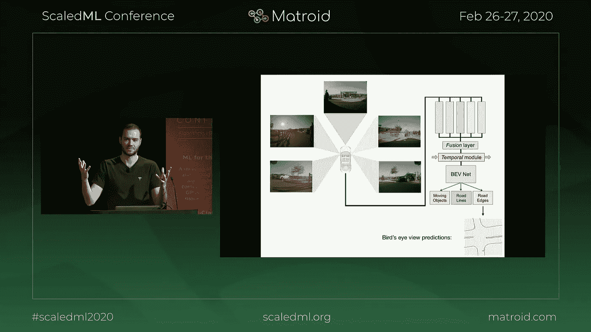
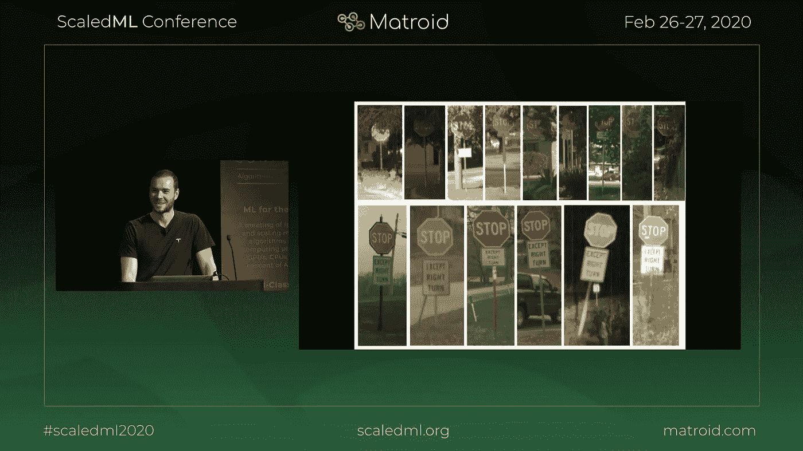
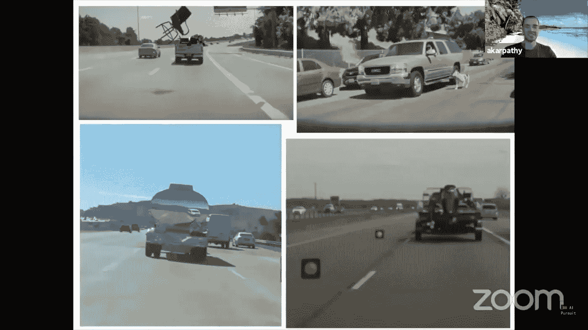
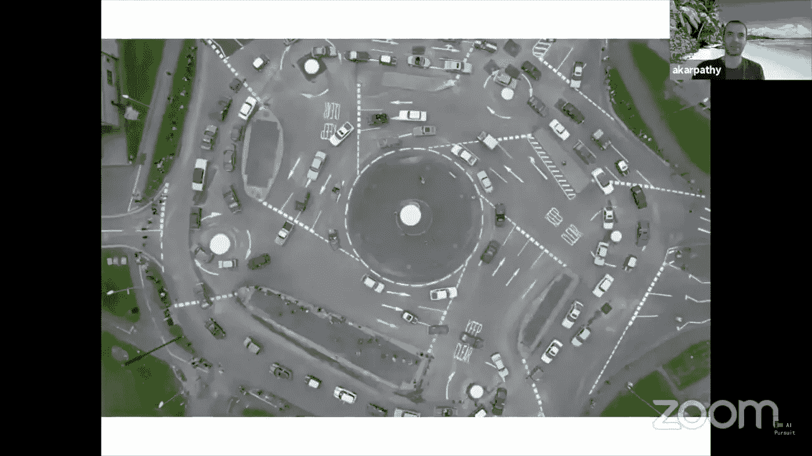

# 自动驾驶汽车:我们离完全自主还有多远？

> 原文：<https://towardsdatascience.com/self-driving-cars-how-close-are-we-from-full-autonomy-ccf31cea771?source=collection_archive---------30----------------------->

## 意见

## 我们现在是在 2020 年。我的机器人出租车在哪里？让我们看看技术的当前状态，做一个有根据的猜测

迪伦·卡勒伊在 [Unsplash](https://unsplash.com/s/photos/tesla?utm_source=unsplash&utm_medium=referral&utm_content=creditCopyText) 上拍摄的照片。

毫无疑问，全自动驾驶技术([或第五级自动驾驶](https://cdn.oemoffhighway.com/files/base/acbm/ooh/document/2016/03/automated_driving.pdf))将是我们未来的一部分。问题是——它什么时候到达？下一个十年？未来五年？明年？明天吗？让我们看看目前的技术水平，做一个预测。

**剧透:**大概不会晚于 2025 年。

# 哪个公司会先到达那里？

如果有谁能在 2025 年前解决完全自动驾驶( [level 5 autonomy](https://cdn.oemoffhighway.com/files/base/acbm/ooh/document/2016/03/automated_driving.pdf) )，那就是特斯拉。你可能听说过 Waymo 机器人出租车，但这些出租车在非常有限的区域内运营，需要高分辨率的地图和路线准备([四级自主](https://cdn.oemoffhighway.com/files/base/acbm/ooh/document/2016/03/automated_driving.pdf))。这是一个很好的尝试，但目前的方法不可扩展。

特斯拉将率先解决完全自动驾驶的主要原因是:

*   **数据:**他们拥有最大的真实世界数据集，驾驶里程数十亿。
*   **高效硬件:**一组智能传感器和一个内部设计的深度学习芯片。
*   **高级软件:**神经网络驱动 Teslas 是一个非常复杂的多任务问题。

在接下来的部分中，我将对这三个主题中的每一个进行阐述，然后我将构建我的预测时间表——让我们开始吧。

# **数据**

有超过 100 万辆汽车在收集数据，特斯拉在竞争中遥遥领先。此外，随着产量的增加，特斯拉车队的规模将在未来几年急剧增加。请看这张图表，它显示了自动驾驶的预计行驶里程。

估计特斯拉自动驾驶里程。莱克斯·弗里德曼拍摄的图片。

在深度学习应用中，拥有大量数据是游戏规则的改变者。特别是对于自驾这种复杂的问题，需要在多任务问题中分析多个传感器的数据。

通常，在现实世界中，可能场景的分布有一个非常长的尾巴——这意味着汽车可能面临的罕见情况的数量几乎是无限的。**拥有一个收集数据的大型车队，可以对逐步改善所需的边缘案例进行采样。**目标是随着时间的推移使模型越来越健壮。

为了收集真实数据，需要一组传感器。这让我想到了下一个话题——硬件。

# 硬件

用于完全自动驾驶的一组硬件通常由几个摄像头、激光雷达传感器、雷达传感器和超声波传感器组成。

*   **摄像头**用于采集车辆周围的图像；
*   **激光雷达**发送快速激光脉冲，这些脉冲在物体上反射，允许以高分辨率制作周围的三维地图；
*   **雷达**类似于激光雷达，但它工作在无线电波长上，允许在雾和灰尘条件下以较低的图像分辨率换取更好的性能；
*   **超声波传感器**用于近距离，非常精确地检测近距离物体的距离。

这个领域的大多数人都非常依赖激光雷达，通过一些摄像头和超声波传感器进行增强。然而，特斯拉正在以不同的方式解决这个问题——不使用任何激光雷达。**这让特斯拉的问题更加棘手！** **他们为什么采用这种方法？**

我们确信基于视觉的方法可以可靠地驾驶汽车——我们每天开车时都会使用两个摄像头传感器(也称为眼睛)。另一个重要的考虑因素是激光雷达传感器价格昂贵。随着时间的推移，价格可能会降低，但在此之前，汽车会明显变得更加昂贵。同样，如果我们可以用眼睛开车，那么人工智能可以通过让更多的眼睛无时无刻不在工作而不受干扰，来学习做得更好。**雷达传感器非常重要，主要是为了即使在有雾和灰尘的情况下也能增强前视能力。再次检查前方物体的距离也很重要。这种传感器与激光雷达相比也更便宜。**

下面的视频清楚地解释了特斯拉为传感器套件采取的方法，以及为什么用埃隆·马斯克的话说:**“任何依赖激光雷达(完全自动驾驶)的人都注定要失败”**。我发现关于使用雷达自动标记数据以利用相机进行深度估计的讨论特别有趣。他们还提到**深度估计可以使用自我监督**在没有标签的情况下实现——这是一种非常有前途的技术，在几个深度学习应用中正在获得动力。

Elon Musk 在相机上对比自动驾驶和自动驾驶汽车的激光雷达。

总的来说，我们看到特斯拉正在通过不依赖激光雷达和直接研究基于视觉的方法来解决一个更困难的问题。**这是一个正确的方法，因为它是可扩展的，并导致更低成本的汽车**，最终将能够提供机器人出租车的最低价格，并加速向电动汽车的过渡。

关于硬件的另一个重要方面是，特斯拉开发了一种深度学习芯片([硬件 3.0](https://www.autopilotreview.com/tesla-custom-ai-chips-hardware-3/) )，它有能力以节能的方式实现完全自动驾驶。**现在只需将软件安装到位，并通过无线更新进行部署。**

聊到软件，我们转到下一个话题，看看特斯拉 autopilot 背后的神经网络。

# 驱动特斯拉汽车的神经网络

在过去的几年里，自动驾驶软件逐渐得到了改进。一些令人兴奋的消息是，特斯拉一直在对神经网络结构进行重大更新，使其能够与 4D 数据一起工作，而不是 2D 图像的组合。**因此，随着特斯拉人工智能团队进一步探索他们计划在 2020 年底部署的系统的潜力，未来几个月的进展速度可能会更快。**

我强烈推荐下面的视频，是特斯拉人工智能总监 Andrej Karpathy 关于全自动驾驶人工智能状态的演讲。我现在将描述一些主要的亮点。

安德烈·卡帕西——全自动驾驶的人工智能。

新的神经网络接收来自所有传感器的输入，并结合神经网络特征空间中的数据(下图中的**融合层**)，创建周围环境的实时三维表示。这种表示然后被提供给一个鸟瞰网络( **BEV Net** )，从该网络中需要预测一组广泛的任务。

特斯拉自动驾驶神经网络。图片来自 Andrej Karpathy 在 [ScaledML 2020](http://scaledml.org/2020/) 会议上的演示，可在 [YouTube](https://youtu.be/hx7BXih7zx8?t=1207) 上查看。(点按 YouTube 链接以转到确切的视频位置)

演示中涉及的另一个非常有趣的主题是他们如何处理边缘情况。下图展示了一个很好的例子——停车标志。**有人会认为神经网络很容易捕捉和学习停车标志。但是如果它们被部分遮挡了呢？或者，如果他们有一个修饰语，如下面的例子**所示，停车处下面的标牌上写着“右转除外”。无人驾驶汽车有望在所有这些场景中发挥作用。

真实世界长尾分布场景的例子。图片来自 Andrej Karpathy 在 [ScaledML 2020](http://scaledml.org/2020/) 会议上的演示，可在 [YouTube](https://youtu.be/hx7BXih7zx8?t=764) 上查看。(点按 YouTube 链接以转到确切的视频位置)

训练巨大的神经网络以在类似上述例子的边缘情况下表现良好的过程包括**以“影子模式”运行一个小型网络，从特斯拉车队中检索类似的样本。**获得的样本随后用于改进训练数据集。那么大的神经网络可以被重新训练以达到更好的精度。对于停车标志的情况，标签“停车标志”需要有修饰语来覆盖边缘情况。

**对于这样一个复杂的多任务问题的验证也是本演示中涉及的一个非常重要的主题。**

在最近 CPRV 2020 会议的主题演讲中，卡帕西做了一个类似的介绍，并增加了一些有趣的例子。从一个边缘案例的好例子开始。我想除了**这些是从特斯拉车队采集的真实图像之外，没有其他评论需要了。**

真实世界长尾分布场景的极端例子。图片来自 Andrej Karpathy 在 CPRV 2020 大会上的演讲，可在 [YouTube](https://youtu.be/X2CpuabzRaY?t=1544) 上获得。(点按 YouTube 链接以转到确切的视频位置)

另一个疯狂的例子是下图。你能应付这样的迂回吗？关于这个例子，Karpathy 提出了一个有趣的观点，他们不需要处理每一个可能的情况。如果无法处理的案例是已知的，一个可能的选择是遵循不同的轨迹来避免特定的情况。作为人类，我肯定会避开下图中的环岛。

极端困难的情况。Andrej Karpathy 在 CPRV 2020 大会上的演讲图片可在 [YouTube](https://youtu.be/X2CpuabzRaY?t=1400) 上获得。(点按 YouTube 链接以转到确切的视频位置)

**我相信上面的图片也暗示了他们正在努力解决环形路和十字路口的问题。**这是继红绿灯和停车标志之后的合理步骤，也是实现功能完整的自动驾驶的重要一步。

# 我的预测时间线

在今年 4 月 12 日的一条推文中，Elon Musk 提到了关于 robotaxi 发布的时间表，**“今年功能看起来仍然不错。监管部门的批准是一个巨大的未知数。然而，埃隆对这些时间表过于乐观。然而，进展是稳步的，我们越来越接近了。**

**现在，让我最后写下我的时间表**，它基于我能找到的关于自动驾驶当前状态的所有公开信息，并试图做出**乐观但现实的**预测:

*   **2020 年末或更有把握的 2021 年:**特斯拉自动驾驶将功能齐全。它将能够在大多数情况下导航，但远非完美。在城市环境中，将一直需要人工监管，人工干预将很常见。
*   **2021/2022:** 随着越来越多的数据被收集并用于改进系统，改进将非常稳定。人为干预将会减少，而无人干预的出行将会逐渐变得更加频繁。
*   **2023:** 自动驾驶仪将能够在大多数情况下完美导航。人类干预将是零星的。大多数旅行不需要任何干预。今年有可能在选定的地方开始 robotaxi 实验——4 级自治。
*   **2024:** 软件将达到一种状态，在无人监管的情况下，可以安全行驶。边缘情况可能仍然存在，但可以通过人类语音命令反馈或通过规划旅程来解决，以避免特定的问题情况。特斯拉将开始一项重要任务，向监管机构展示这项技术在没有人类监管的情况下可以安全地用作 robotaxis 第 5 级自治。
*   **2025/2026:** 特斯拉将逐渐获得监管机构的批准，在越来越多的地区运营。批准可能首先在美国进行(在一些州可能最早在 2024 年)，并逐渐扩展到其他地区。对于欧洲，我预计批准时间会比美国晚一年。

**总而言之，到 2025 年(在欧洲和其他地区可能是 2026 年)，我希望能够在应用程序中安排我的 robotaxi 之旅，去我选择的任何目的地。我期待着那一天！**

# 结束语

这只是我对全自动驾驶未来的设想。没有人知道未来会怎样。等式中有许多不确定因素。我的预测只是我认为最有可能的情况。请在评论中告诉我你的想法。

## 更多关于我的事

 [## 我的 3 年历程:从零 Python 到深度学习竞赛高手

### 自从 2017 年开始学习 Python 以来，我一直遵循的道路是成为一名独自参加 Kaggle 比赛的大师…

towardsdatascience.com](/my-3-year-journey-from-zero-python-to-deep-learning-competition-master-6605c188eec7) 

*感谢阅读！祝您愉快！*