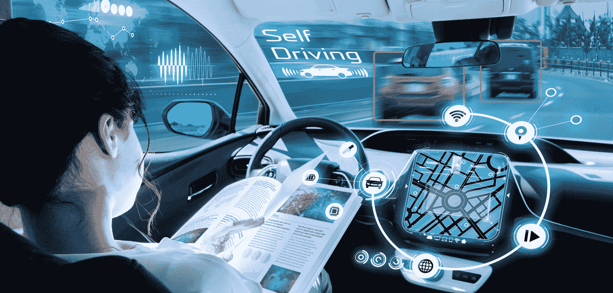

# 无人驾驶汽车——管理项目

> 原文：<https://towardsdatascience.com/self-driving-cars-managing-a-project-57372db4e739?source=collection_archive---------27----------------------->

> 本文已在[https://www.thinkautonomous.ai/blog/?更新 p =自动驾驶汽车管理项目](https://www.thinkautonomous.ai/blog/?p=self-driving-cars-managing-a-project)

[米勒·桑德斯](https://unsplash.com/@millesanders?utm_source=medium&utm_medium=referral)在 [Unsplash](https://unsplash.com?utm_source=medium&utm_medium=referral) 上的照片

> 制造自动驾驶汽车是一项紧张的活动。很多时候，不是一个公司一个人做的事情。特别是，我注意到在项目开发过程中我们经常交流的 3 个不同的概要文件。
> 
> 虽然我从未有过“项目经理”的头衔，但我与 3 名项目经理密切合作，维护并发展了与两家外部供应商的关系，并在 Perception 管理着一个由 7 名实习生组成的团队。它让我对项目管理有了很好的理解，我可以自己做这项工作。
> 
> 如果你正在考虑成为一名自动驾驶汽车项目经理，也许你不知道该期待什么。
> 自动驾驶汽车项目经理日常做什么？

> 鉴于现在有很多项目管理技术(敏捷、Scrum 等等)，我将只讨论**任务**而不是使用的方法或工具**。**
> 还有，由于我在创业环境中工作过，我就从这个角度讲讲我的故事。

*   这个故事是一个系列的一部分！[在此了解**部署服务的 7 个步骤**！](/self-driving-cars-management-7-steps-from-the-garage-to-the-road-dcea4d2bd2a1)

> 📩在我们开始之前，我邀请您[订阅我的私人邮件列表，并接收像这样的每日信息！](https://www.thinkautonomous.ai/email)
> 
> 🚀你也可以[在我的入门课程](https://courses.thinkautonomous.ai/self-driving-cars?coupon=STARTTOTHINKAUTONOMOUS)中开始学习自动驾驶汽车。

项目经理有很多事情要做。在这里，我将确定该角色涉及的每项任务和联系人。

# **开发者**

照片由 [Fabian Grohs](https://unsplash.com/@grohsfabian?utm_source=medium&utm_medium=referral) 在 [Unsplash](https://unsplash.com?utm_source=medium&utm_medium=referral) 上拍摄

**在自动驾驶汽车中，我们很少创造一种可以开到任何地方的车辆。**
总有一个明确的目标，比如“高速公路驾驶”或“市中心送餐”。
这一目标对车辆的开发有影响。

**所需的算法将取决于车辆的任务。**
如果一辆汽车在城市里行驶，它将需要一个交通灯检测系统。在高速公路上不是这样。

项目经理的第一个角色就是意识到这种差异。
当我们创建一个约会 app，想在一个新城市部署，其实并没有那么大的区别。

在无人驾驶汽车中，扩展更加困难，因为它涉及许多新的应用。
澳大利亚的自动驾驶汽车必须开发袋鼠检测模型。
加拿大的自动驾驶汽车必须检测和分割雪域。

> **项目经理必须确定所有这些必要的任务，并与开发人员沟通，以确保及时开发和测试所有东西。**
> 它涉及了解自动驾驶汽车的完整架构，并为每项任务制定详细的时间表。

**在自动驾驶汽车里，时间表是最难定义的！如果你需要试车跑道，你可以从下个月开始租两天。如果算法比计划晚了 7 天，其他一切都有风险。如果机器人化没有及时完成，本地化就无法测试，甚至无法开发。**

**有些模块包括在试车跑道上。**
这是本地化的情况，因为开发人员必须准确地知道 GPS 周围的情况，有哪些地标……
为此，开发人员需要在测试轨道上，并记录场景。

规划每一项任务意味着你可以预见问题。如果汽车在测试中出现电池问题，必须在 2-3 天内修复。否则，开发人员将会浪费时间。

需要了解技术挑战，如果经理了解，他会更好。
但是，我见过对算法一点头绪都没有，而信任工程师的项目经理。根据我的经验，这对项目没有太大影响。我不会建议经理不知道激光雷达是如何工作的，或者为什么我们不能将汽车更新到新的 Ubuntu 版本。

我会告诉你相反的情况。非常接近技术挑战，因为你与开发人员交流的方式可能会帮助他们重新思考情况，并帮助你更好地估计时间。

> 当人们埋头苦干时，最好有一个能帮上忙的人。

*   每天与每个开发人员进行 15-30 分钟的交谈，将有助于更快地解决这些挑战，并让您更接近现实。

> 更精细的项目管理方法被发明出来了，我建议你[看看这个](https://zenkit.com/en/blog/7-popular-project-management-methodologies-and-what-theyre-best-suited-for/)。

> **在更大的范围内，项目经理还与各种服务提供商、客户和潜在客户合作。**

# **供应商**

照片由[i̇rfan·西姆萨尔](https://unsplash.com/@irfansimsar?utm_source=medium&utm_medium=referral)在 [Unsplash](https://unsplash.com?utm_source=medium&utm_medium=referral) 上拍摄

**让我们以一家初创公司为例，它的任务是开发一种自主航天飞机。**如果创业公司不处理开发的一个方面，比如机器人化，它将需要外包。

**项目经理的角色是确定提供商，协商价格，并确保硬件架构符合算法。如果你是一名计算机视觉工程师，你可能知道相机的位置对 3D 渲染很重要。如果相机有某种镜头，它会改变距离感。**

**一切都很重要。**
从买来的传感器类型，到每个传感器的位置。
冷却系统…除了加热计算机和图形处理器…
掌握自动驾驶汽车自动化过程的每个方面是一项需要经验的艰巨任务。

您可能需要处理的提供商有:

*   机器人化和汽车制造商🚘
*   传感器提供商📷
*   算法提供商💻

购买传感器时，你必须确保工程师知道如何使用它。
让我们来看看这样一个现实:一家初创公司无法为每项任务雇佣 50 名工程师。如果你的公司已经雇佣了工程师，发展会受到他们的技能和愿望的影响。

> **购买算法的时候，一定要和团队紧密合作。**
> 如果你的创业公司没有计算机视觉工程师，而你需要一个车道线感知系统，这是一个新项目。
> 
> 创业公司可以为开发者付费，也可以为解决方案付费。

总之，车道线检测系统取决于它将行驶的环境类型，就像几乎所有其他东西一样。这意味着车队也需要使用赛道来测试他们的软件
这是一个你不能使用车辆完成任何其他任务的时间段

> 正如我所说，制定时间表是一项非常困难的任务，它需要对技术挑战有非常好的理解，以及对问题有很好的预见能力。

# **客户**

查尔斯·德鲁维奥在 [Unsplash](https://unsplash.com?utm_source=medium&utm_medium=referral) 上拍摄的照片

**经理接触的最后一类人是客户。**

> 客户给公司钱以换取服务或产品。

如果经理负责与客户的关系，他必须非常清楚正在发生的一切。

对很多人来说，与客户的关系是最难处理的。

客户可以改变很多想法。
他们可能会突然想要一个前一天不需要的功能。
他们可能需要加快截止日期，以配合您不知道的特定媒体活动。经理必须足够灵活，这样一天的轮班不会毁掉一切。

通常，最后期限是由客户设定的。如果期限太短，整个项目可能很难计划。

有时，客户可能需要你做你不理解的事情。客户对经理的信任至关重要。
如果客户觉得和其他人在一起不安全，他可能会要求经理每天都在现场…
这通常是不必要的，而且会危及项目。

**即使不需要，也是客户的条件。**
如果经理接受了，那就成了新的问题需要处理。

*经理必须:*

*   让客户满意
*   但是要确保它不会影响项目本身

> 可能需要一些额外的任务，比如谈判，但在初创公司，通常是直接与首席执行官谈判。

> 项目管理是一项基本任务。许多公司认为他们不需要项目经理，因为开发人员可以应付。**这在自动驾驶汽车创业公司里简直是不可能的。这些工作都非常不同。**
> 
> 项目经理的最后接触是和他的主管。我们不要深究细节。
> 
> 经理必须能够跟上最后期限和进度。客户、提供商和开发者是我们能找到的三个主要的人。

([来源](https://www.autonomousvehicleinternational.com/wp-content/uploads/2019/05/1.1-For-CapGemini-story.gif))

> 杰里米·科恩。

*   这个故事是一个系列的一部分！[在此了解**部署服务的 7 个步骤**！](/self-driving-cars-management-7-steps-from-the-garage-to-the-road-dcea4d2bd2a1)

> 💌[订阅私人邮件列表](https://www.thinkautonomous.ai/email)每天学习自主机器人！
> 
> 🚎如果你想了解更多关于自动驾驶汽车的知识，你可以参加我的课程[自动驾驶汽车:学习将改变我们生活的尖端技术的指南](https://courses.thinkautonomous.ai/self-driving-cars?coupon=STARTTOTHINKAUTONOMOUS)！