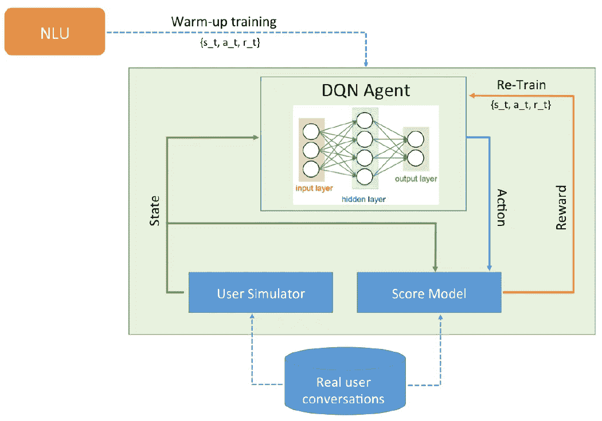
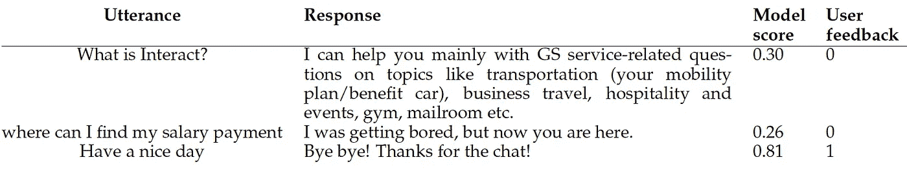
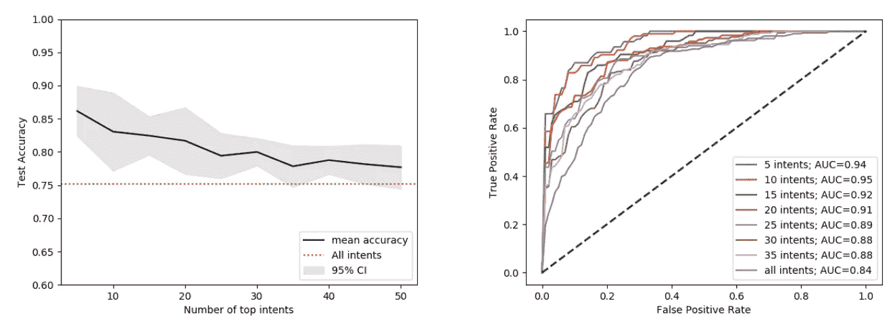
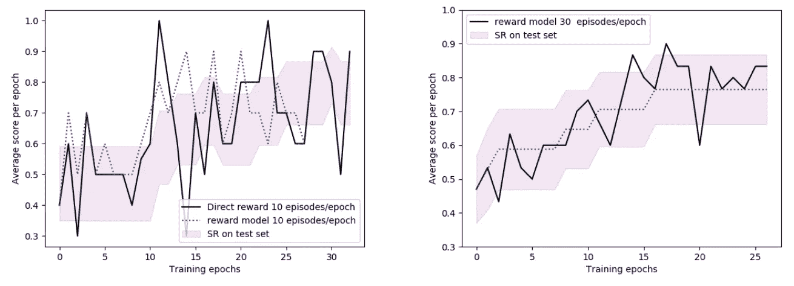

# 基于深度强化学习的自我改进聊天机器人

> 原文：<https://towardsdatascience.com/self-improving-chatbots-based-on-reinforcement-learning-75cca62debce?source=collection_archive---------14----------------------->

## 自我改进聊天机器人的强化学习(RL)模型，专门针对 FAQ 类型的聊天机器人。

埃琳娜·里恰尔代利，德布马尔亚·比斯瓦斯

**摘要。** *我们提出了一个自我改进聊天机器人的强化学习(RL)模型，专门针对 FAQ 类型的聊天机器人。该模型的目的不是从头构建一个对话系统，而是利用用户对话中的数据来提高聊天机器人的性能。我们的方法的核心是一个评分模型，该模型被训练为基于用户反馈对聊天机器人话语响应元组进行评分。由该模型预测的分数被用作对 RL 代理的奖励。策略学习离线进行，这要感谢一个用户模拟器，它从 FAQ 数据库中输入话语。使用具有ε贪婪探索的深度 Q 网络(DQN)代理来实施策略学习，该代理被定制为有效地包括范围外问题的回退答案。从一个企业聊天机器人中提取的一个小案例展示了我们方法的潜力。它表明，在 20-30 个训练周期内，绩效从最初的 50%提高到 75%。*

**发表的**版本的论文可在以下获得，刊登在 2019 年蒙特利尔第四届强化学习与决策多学科会议论文集([RLDM](http://rldm.org/))([论文](https://www.researchgate.net/publication/333203489_Self-improving_Chatbots_based_on_Reinforcement_Learning) ) ( [代码](https://github.com/debmalyabiswas1/ReinforcementLearning_Chatbots))

图 1: RL 模型架构(图片由作者提供)

# 1 导言

企业环境中的大多数对话代理都是特定领域的，由一个自然语言理解(NLU)单元组成，该单元被训练成以受监督的方式识别用户的目标。然而，为生产系统收集一个好的训练集是一个耗时且繁琐的过程。由于意图重叠和混淆，涵盖广泛意图的聊天机器人经常面临糟糕的性能。此外，考虑到来自实际使用或测试阶段的用户反馈，很难自主地重新训练聊天机器人。自我改进的聊天机器人很难实现，主要是因为很难选择和优先考虑聊天机器人性能评估的指标。理想情况下，人们希望对话代理能够从用户的经验中学习并自主改进。

在这项工作中，我们提出了一种自我改进聊天机器人的强化学习方法，特别针对 FAQ 类型的聊天机器人。这种聊天机器人的核心是一个意图识别 NLU，它通过问题变体的硬编码示例进行训练。当没有符合 30%以上置信度的意图时，聊天机器人会返回一个后备答案。对于所有其他情况，NLU 引擎会随响应一起返回相应的可信度。

几篇研究论文[2，3，7，8]显示了 RL 方法在开发对话系统中的有效性。这种方法的关键是选择一个好的奖励模式。一个典型的奖励模型是对每个对话回合实施一个惩罚项。然而，这种奖励只适用于任务完成聊天机器人，其中代理的目的是在最短的时间内满足用户的请求，但它不适合 FAQ 类型的聊天机器人，其中聊天机器人被期望在一个回合中提供一个好的答案。用户的反馈也可以用作在线强化学习中的奖励模型。然而，在实时对话中应用 RL 可能具有挑战性，并且在 RL 失败的情况下可能会产生巨大的成本。

> 对于已部署的系统，更好的方法是离线执行 RL 训练，然后一旦达到令人满意的性能水平就更新 NLU 策略。

# 2 强化学习模型

RL 模型架构如图 1 所示。该模型的各种组件是:NLU 单元，用于在预热阶段最初训练 RL 代理；用户模拟器，其从用户体验数据库中随机提取用户话语；分数模型根据具有反馈的用户对话和基于深度 Q 网络(DQN)网络的 RL 代理进行训练。

## 2.1 对话系统

> 我们在一个 FAQ 类型的聊天机器人上应用了强化学习方法。

在聊天机器人的核心，有一个意图识别 NLU，它是用问题变化的硬编码示例训练的。意图被定义为用户的意图，其通过话语来表达。对于这项工作，我们选择了来自 [Rasa](https://rasa.com/) 的开源 NLU，使用 [TensorFlow](https://www.tensorflow.org/hub) 管道。然而，RL 方法独立于所选的 NLU，对于生产中的系统，它可以很容易地扩展到 NLU 引擎，如 IBM Watson 或 Amazon LEX。

## 2.2 真实用户对话

在我们的工作中，我们使用了在开发实际内部聊天机器人过程中获得的用户反馈。

> 聊天机器人的工作范围是回答员工有关办公大楼设施、人力资源政策和福利等问题。

所有参与测试阶段的 10 名用户都被告知，他们的反馈将用于改善聊天机器人的性能。测试人员在每轮对话后提供一个(二元)反馈，从而对话语-回应元组进行评级。因此，历史数据包含以下格式的四个部分:(话语、响应、NLU 置信度和反馈)。通过移除无效对话(即缺乏反馈或反馈无效的对话)，我们最终得到 550 个用户对话，触发了大约 120 个意图。尽管我们已经在所有对话中测试了评分模型，但 RL 模型仅应用于 155 个对话的子样本，触发了前 5 个意向。在这个子集上，用户的满意度是 50%。

表 1:来自数据库的对话示例，以及由模型和用户提供的分数

## 2.3 奖励功能:分数模型

评估聊天机器人的性能是计算语言学中长期存在的问题。从机器翻译(例如[6])借用的自动度量在短句(例如[4])上表现不佳，例如聊天机器人话语-响应元组。另一方面，人类对聊天机器人的评级是目前评估聊天机器人成功与否的事实上的标准，尽管这些评级往往很难收集，而且成本高昂。

> 为了评估聊天机器人响应的正确性，我们提出了一种新的方法，该方法利用在聊天机器人的开发和测试阶段收集的用户对话日志。每个用户都被要求在每次聊天机器人回合时提供一个二元反馈(正面/负面)。

为了在离线强化学习中使用用户反馈，我们开发了一个分数模型，能够为看不见的话语响应元组的二元反馈建模。在受监督的方式中，分数模型学习如何将话语和响应的向量表示投影到线性变换的空间中，使得相似的向量表示给出高分。至于句子的向量表示，我们通过通用句子编码器[1]计算句子嵌入，该编码器可通过 TensorFlow Hub 获得。为了训练模型，利用 L2 规则对(模型预测和人类反馈之间的)平方误差损失进行优化。为了评估该模型，预测的分数然后被转换成二进制结果并与目标(用户反馈)进行比较。对于那些既具有正反馈又具有接近 1 的 NLU 置信水平的已识别意图的话语对，我们执行数据扩充，给话语和后退意图的组合分配低分。

[4]提出了一种类似的聊天机器人评估方法。作者通过使用一组经过标记的对话对分数进行建模，这些对话还包括通过众包收集的模型和人类生成的响应。

> 我们的方法与上述作者的不同之处在于，它只需要一组带标签的话语响应元组，这些元组在聊天机器人开发和用户测试阶段相对容易收集。

## 2.4 与 DQN 的政策学习

为了学习策略，RL 代理使用 DQN 架构的 Q 学习算法[5]。在 DQN，训练一个神经网络来逼近状态-动作函数 *Q(s_t，a_t，θ)* ，它代表在状态 *s_t* 提供的动作 *a_t* 的质量，而 *θ* 是可训练的参数。至于 DQN 网络，我们采用了[3]提出的方法，使用一个全连接的网络，由一个经验重放池缓冲区提供，它包含话语和响应的一键表示以及相应的奖励。在这种情况下，一次性表示是可能的，因为我们对于话语(由日志中真实用户的问题数量给出)和响应(等于在我们的测试用例中使用的意图数量，5)有有限的可能值。在热身阶段，DQN 在 NLU 上进行训练，使用 NLU 置信度作为奖励。每当状态-动作对具有高于阈值的置信度时，通过将零权重分配给给定状态和所有其他可用动作，DQN 训练集被扩充。因此，在 RL 训练开始时，代理的表现类似于 NLU 单元。

在 RL 训练期间，我们使用ε-贪婪探索，其中根据概率ε探索随机动作。我们使用随时间变化的ε，这有助于在训练开始时进行探索，在最后一个历元期间 *e_t0 = 0.2* 和 *ε_t = 0.05* 。为了在选择随机动作时加速学习，我们还强制更高的概率来获得“没有检测到意图”，因为几个问题实际上不在聊天机器人的范围内，但是它们被 NLU 错误地匹配到错误的意图。在一个时期内，我们模拟一批大小为 *n 集*的对话(在我们的实验中范围为 10 到 30 集)，并用元组 *(s_t，a_t，r_t)* 填充体验重放缓冲区。缓冲区的大小是固定的，当代理性能提高到指定的阈值以上时，它会第一次被刷新。在状态-动作元组获得大于 50%的奖励的那些情节中，我们通过对当前状态的任何其他动作的分配分配零奖励来执行数据扩充。

图 2:分数模型的性能。左侧面板:交叉验证的测试集准确度，对于具有不同意向数量的不同子样本，具有 95%的置信区间。水平红线表示整个样本的性能。右侧面板:不同子样本的 ROC 曲线。

# 3 模型评估

## 3.1 评分模型评估

为了评估模型，我们选择对话的子集，触发前 N 个意图，N 在 5 到 50 之间。图 2 总结了评分模型的结果，显示了测试集的交叉验证(5 倍 CV)准确性和作为意向数量函数的 ROC 曲线。

> 对于整个对话样本，我们获得了 75%的交叉验证准确率和 0.84 的 AUC。

然而，通过仅选择那些触发前 5 个意向的对话，从而包括每个意向的更多示例，我们获得了 86%的准确率和 0.94 的 AUC。对于 RL 模型评估，我们重点关注 5 个意向子集；这确保了我们有最可靠的回报。

## 3.2 强化学习模型评估

RL 训练的学习曲线如图 3 所示。在左侧面板中，我们将 RL 训练和奖励模型与直接奖励(以交互方式)进行的测试进行了比较，显示得分模型给出了与奖励已知的参考案例相似的表现。平均分的大幅波动是由于有限的批量 *(n 集= 10)* 和相对较大的ε。我们还显示了从完整样本中提取的 20 个对话的测试集的成功率，其中为所有话语手动提供了“黄金响应”。

> 在仅仅 30 个时期内，代理成功率从最初的 50%增加到 75%,显示了这种方法的潜力。

在右边的面板中，我们显示了使用 *n 集= 30* 的结果，显示了类似的性能，但具有更平滑的学习曲线。

图 3:学习曲线显示了基于 20 个对话的标记测试集的 DQN 代理的每个训练时期的平均分数(连续黑线)和成功率(紫色阴影区域)。左侧面板:具有互动奖励(黑线)和奖励模型(蓝色虚线)的 direct RL 的学习曲线，每个时期使用 10 集。右侧面板:模型奖励的学习曲线，每个时期使用 30 集。

# 4 个结论

在这项工作中，我们根据用户测试阶段的反馈，展示了强化学习方法在提高 FAQ 类型聊天机器人性能方面的潜力。为了实现这一点，我们开发了一个分数模型，它能够预测用户对话语响应元组的满意度，并实现了一个 DQN 强化模型，使用分数模型预测作为奖励。我们已经在一个小型但真实的测试案例上评估了该模型，展示了有希望的结果。更多时代的进一步培训和包括更多数据，以及对模型超参数的广泛测试正在进行中。我们的方法的价值在于提供了一种实用的工具，以基于用户反馈的自动化方式来改进大规模聊天机器人(具有大量不同的意图)。

最后，我们注意到，虽然本文中提出的强化学习模型适用于 FAQ 类型的聊天机器人，但它可以通过合并更复杂的分数模型来概括包括对话的顺序性质。

# 参考

[1]丹尼尔·瑟尔等人。艾尔。通用句子编码器。CoRR，abs/1803.11175，2018。

[2]李继伟、威尔·门罗、艾伦·里特、米歇尔·格里、高剑锋和丹·茹拉夫斯基。对话生成的深度强化学习。arXiv 预印本 arXiv:1606.01541，2016。

[3]、Yun-Nung Chen、高剑锋和 Asli Celikyilmaz。端到端任务完成神经对话系统。2017 年第八届国际自然语言处理联合会议。

[4]瑞恩·洛威等人。艾尔。走向自动图灵测试:学习评估对话反应。《计算语言学协会第 55 届年会论文集》(第 1 卷:长篇论文)，第 1116-1126 页。计算语言学协会，2017。

[5] Volodymyr Mnih 等。艾尔。通过深度强化学习实现人类水平的控制。《自然》, 2015 年第 2 期，第 518:529 页。

[6]基肖尔·帕皮尼尼、萨利姆·鲁科斯、托德沃德和威-朱婧。Bleu:一种自动评估机器翻译的方法。计算语言学协会第 40 届年会论文集，ACL '02，311-318 页，2002。

[7]彭，，高剑锋，，黄锦辉.Deep dyna-q:任务完成对话策略学习的集成规划。《计算语言学协会第 56 届年会论文集》(第 1 卷:长篇论文)，第 2182-2192 页。计算语言学协会，2018。

[8]尤利安·弗拉德·塞尔班等。艾尔。一个深度强化学习聊天机器人。更正，abs/1709.02349，2017。