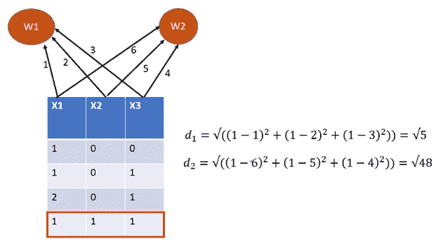
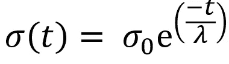
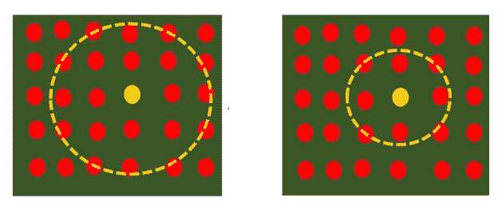
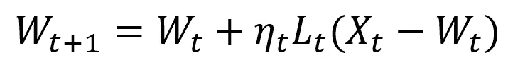
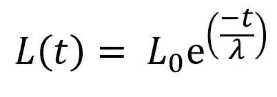
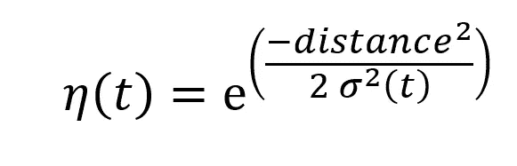

# 自组织地图简介

> 原文：<https://towardsdatascience.com/self-organizing-maps-for-dimension-reduction-data-visualization-and-clustering-ff966edd311c?source=collection_archive---------6----------------------->

## 用于降维、数据可视化和聚类的自组织映射

安德鲁·斯图特斯曼在 [Unsplash](https://unsplash.com?utm_source=medium&utm_medium=referral) 上的照片

S **自组织映射(SOM)** 是一种常见的无监督神经网络模型。SOM 已被广泛用于聚类、降维和特征检测。SOM 是由 Kohonen 教授首先提出的。正因如此，SOM 也叫科霍宁地图。它有许多实际应用，包括机器状态监控、故障识别、卫星遥感过程和机器人控制[1]。此外，SOM 通过利用拓扑相似性属性将高维数据投影到低维空间来用于数据可视化。在模型开发过程中，SOM 利用竞争学习技术，而传统的神经网络通过梯度下降算法的反向传播来应用误差减少过程。在这篇文章中，我分享了我对 SOM 的理解，它是如何学习的，方法，以及 SOM 的局限性。

**SOM 如何学习？**

SOM 的架构非常类似于神经网络架构，但它比人工神经网络(ANN)简单得多。SOM one 包含两层:输入层和输出层(特征地图)。SOM 通过初始化权重向量来开始特征映射。SOM 中的权重与 ANN 中的权重具有完全不同的内涵。在神经网络建模中:将激活函数应用于权重和输入值的线性组合，以产生架构中每个神经元的输出。另一方面，SOM 不应用激活功能。并采用权重作为架构中神经元的特征。权重通常是随机生成的。使用权重向量作为神经元特征的动机是将给定数据的每一行(观察值)推入一个虚拟空间，其中每一行充当一个点。这是高级官员会议的核心。一次，每个数据保存一个输入空间的虚点，然后搜索最近的点(数据)。

假设我们有一个只有四个观察值(行)的三维数据集(特征-x1、x2 和 x3)。我们希望对数据集应用 SOM 方法以达到降维的目的，即我们希望将数据从给定的三维空间转换到二维空间。SOM 中有几个参数，例如神经元的数量。我们选择两个神经元，因为我们想将数据转换到二维空间。这意味着，SOM 包含两层:输入层(3 个神经元/节点)和输出层(2 个神经元/节点)。这里，我们介绍 SOM 的几个步骤:

1.**初始化随机权重向量** —在该步骤中，随机权重向量被初始化。对于像人工神经网络这样的迭代方法来说，良好的初始近似是一个众所周知的挑战。虽然权重的随机初始化是一种常见的做法，但利用数据的第一主成分空间的主成分初始化由于结果的可重复性而获得了极大的欢迎[3]。神经元的权重向量维数/大小应该是输入空间的大小。在这个例子中:神经元 W1 和 W2 分别与权重向量(1，2，3)和(6，5，4)相关联。

2.**随机选择一个输入—** 假设随机选择的输入是最后一行(1，1，1)

winner 神经元的计算过程

3.**使用欧几里德距离计算赢家神经元** —在这一步，计算随机选择的输入和每个神经元之间的欧几里德距离。下表显示了两个神经元的计算。距离最短的神经元是获胜神经元。这里，W1 是获胜神经元。获胜的神经元被称为**最佳匹配单元(BMU)。除了欧几里德距离，我们还可以使用其他距离度量来计算身体质量指数。在此步骤中，计算 BMU 的邻域，其中基于指数衰减函数考虑邻域大小[2]。随着时间的推移，BMU 周围的邻域变小。以下等式显示了指数衰减函数，其中 ***t*** 是当前时间步长，sigma0 是初始时间的半径，是依赖的时间常数，以及该方法的选定迭代次数。**

用于查找邻居大小的指数衰减函数

**BMU 附近半径的缩小**

**4。** **更新神经元权重—** 在此步骤中，调整 BMU 和邻域的权重，以调查与输入向量最相似的神经元，并预期更靠近 BMU 的邻域会有显著变化。离 BMU 越远的邻居了解得越少(权重变化不明显)。以下等式显示了更新神经元的计算:

更新神经元权重的公式

其中 t 是当前时间步长，L 是学习率，也是一个指数衰减函数，与上一个函数类似:

学习率的方程式

***n*** 是影响率(另一个指数衰减函数)，其决定邻域的半径(大小)，并且随着迭代的增加，大小逐渐缩小，并且最终邻域在迭代(训练)结束时缩小到大小为零[2]。下面的等式是影响率的表达式:

影响率方程

这里，距离是每对神经元(W_i 和 W_j)之间的晶格距离。

**5。** **重复 2–4 直到训练结束—** 重复步骤 1–4 直到神经元的位置稳定。

虽然 SOM 是一种广泛使用的易于解释的无监督技术，它允许在低维网格内可视化观察之间的相似性，但它有一些限制:

1.  SOM 需要足够的数据量来生成有意义的聚类，因为不足的或无关的数据可能会给聚类增加额外的随机性。
2.  SOM 遇到分类数据聚类的困难[5]。SOM 通常在将数据转换为指示变量(如二元变量)后应用于分类变量。分类特征之间的相似性属性可能由于转换而丢失有价值的信息，因此，经过训练的 SOM 可能无法呈现数据的正确拓扑属性。

相关文章-

[**机器学习管道中的挑战**](https://medium.com/p/3b4ca7b975c8)

# 阅读默罕默德·马苏姆博士(以及媒体上成千上万的其他作家)的每一个故事。

你的会员费将直接支持和激励穆罕默德·马苏姆和你所阅读的成千上万的其他作家。你还可以在媒体上看到所有的故事—[**https://masum-math8065.medium.com/membership**](https://masum-math8065.medium.com/membership)

**快乐阅读！**

参考:

[1][https://users . ics . Aalto . fi/jhollmen/di PPA/node 28 . html #应用程序](https://users.ics.aalto.fi/jhollmen/dippa/node28.html#applications)

[https://www.saedsayad.com/clustering_som.htm](https://www.saedsayad.com/clustering_som.htm)

[3] A .钱皮，y .莱切维利耶，《大型多层次数据集的聚类:一种基于科霍宁自组织图的方法》，载于 D.A .齐格德、j .科莫洛夫斯基、j .兹特科(编辑。)，PKDD 2000 年，施普林格·LNCS(LNAI)，第 1910 卷，第 353-358 页，2000 年。

[4]h[ttps://www . cs . HMC . edu/~ kpang/nn/som . html #:~:text = The % 20 main % 20 draw back % 20 of % 20 The，be % 20 totally % 20 accurate % 20 or % 20 informationary](https://www.cs.hmc.edu/~kpang/nn/som.html#:~:text=The%20main%20drawback%20of%20the,be%20entirely%20accurate%20or%20informative)。

[5][https://www . comp . NUS . edu . SG/~ rudys/Arnie/tnn-som-categoricaldata . pdf](https://www.comp.nus.edu.sg/~rudys/arnie/tnn-som-categoricaldata.pdf)