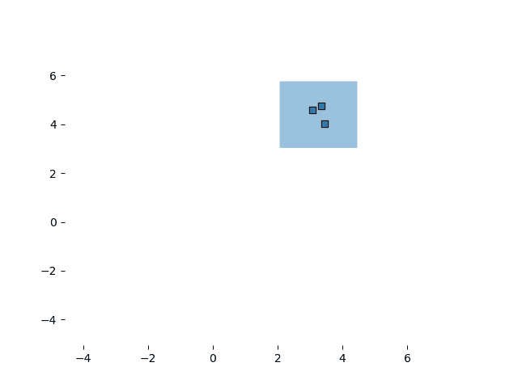
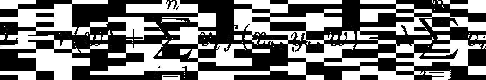
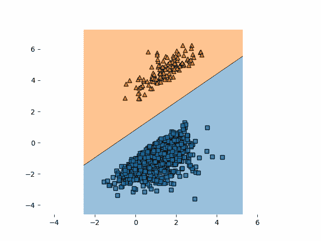

# 用于机器学习的自定进度学习

> 原文：<https://towardsdatascience.com/self-paced-learning-for-machine-learning-f1c489316c61?source=collection_archive---------14----------------------->

## 提高神经网络收敛的聪明方法(并发现异常…)

你通过无情地向你的神经网络灌输数据来折磨它！通常，当用随机梯度下降(SGD)训练机器学习模型时，训练数据集会被打乱。通过这种方式，我们可以确保模型以无特定顺序看到不同的数据点，并且可以均衡地学习任务，而不会陷入局部最优。然而，早在 2009 年，Bengio 等人就证明了某种排序是有益的。他们将他们的方法称为*课程学习*，并表明如果机器学习模型的训练数据按照特定的顺序，它会达到更高的准确性。更准确地说，开头的例子比较容易，结尾的例子比较难。在他们的实验中，他们使用了一个已经训练好的模型，并让这个模型决定什么样的数据点容易或难。然后，一个新的模型在正确排序的数据集上进行训练，并收敛到比随机排序或相反课程训练的模型更高的精度。

在我目前的项目中，我遇到了一种叫做*的自定进度学习* (SPL)的技术。这不是一个新的想法，相应的论文发表于大约 10 年前。无论如何，这种技术非常有趣而且仍然重要，因为它有助于随机梯度下降(SGD)更快地收敛，甚至更高的精度。它会跳过某些被认为太难的数据点。它基于课程学习，但在训练时对数据进行分类。不需要额外的预训练模型来决定排序。因此得名*自学*。


苏珊·d·威廉姆斯在 [Unsplash](https://unsplash.com?utm_source=medium&utm_medium=referral) 上的照片

# SPL 背后的直觉

自定进度学习这个术语起源于人类使用的一种学习技术。它允许你定义自己的速度，以适应你的学习模式。SPL 可以被看作是在学习或训练一项特殊技能，例如数学。当我们开始学习数学时，我们从数数开始，然后是加法、减法等等。我们直到某个年龄才听说矩阵乘法或者导数。同样，机器学习的 SPL 从非常简单的例子开始，一旦学会，就从已经学会的“基础”中受益，继续学习更难的例子。我把 SPL 想象成随着时间的推移缩小任务范围的一种方式。考虑一个二维空间中的简单分类任务和一个需要在正确点分割两个点云的模型。较容易的样本远离相交区域。较硬的样品靠近相交区域。模型的初始状态是这个空间某处的一条线。如果我们只从简单的数据点开始，模型会得到告诉它向某个方向前进的梯度。如果我们只从硬点开始，我们的模型会知道它是错误的，会得到一个方向，但可能会远离另一边。将点缩小到正确的区域有助于模型避免超调并更平滑地收敛，正如我在下面创建的动画中看到的那样。



简单数据集上的自定进度学习

# 该算法

诀窍很简单。它使用一个阈值，我们称之为**λ**。它的存在是为了与训练集中数据点的损失值进行比较。通常，**λ**从一个接近 0 的数开始非常低。对于每个时期，**λ**被乘以一个大于 1 的固定因子。被训练的模型必须计算其训练点的损失值以执行 SGD。通常，这些损失值随着进一步的训练迭代而变得更小，因为模型在训练任务方面变得更好，并且犯的错误更少。阈值**λ**现在确定数据点是被认为*容易*还是*困难*。每当一个数据点的损失低于**λ**时，它就是一个容易的数据点。如果是上面的，那就算辛苦了。在训练期间，反向传播步骤仅在容易的数据点上执行，而困难的数据点被跳过。因此，该模型在训练过程中每当其进展足够大时就增加训练实例的难度。当然，在开始时，模型可能认为没有数据点是容易的，根本不会训练。因此，SPL 的作者引入了一个热身阶段，在这个阶段不允许跳跃，只使用训练集的一小部分。

# 数学



损失函数最小化

SPL 的论文介绍了一种两步学习法。这里，损失函数被训练两次，保持一些变量对于每一步是固定的。给定模型权重“w”和变量“v”，损失函数需要最小化。在损失函数中，我们看到几项。第一项“r(w)”是一个常用的正则项，有助于模型避免过度拟合。这也是其他与 SPL 无关的损失函数的一部分。第二项是我们模型的数据点损失“f(x，y，w)”乘以变量“v”的总和。这个变量“v”稍后将决定当前数据点“(x，y)”是否足够容易进行训练。第三项是所有“v”的总和乘以阈值“lambda ”,我们在前面的章节中已经提到过。变量“v”是整数，只能取值“0”或“1”。在第一学习步骤中，变量“w”是固定的，只有变量“v”根据优化而改变。如果你仔细观察损失函数，我们会发现“λ”确实起到了阈值的作用。如果“f(x，y，w)”小于λ，并且“v”是 1，我们将从正则项中减去一些。因此，在“v=0”的情况下，我们不会减去任何东西，这比减去一些东西要大。如果“f(x，y，w)”大于λ，并且“v=1”，“f(x，y，w)-λ”将为正，我们将添加一些东西。因此，在“v=0”的情况下，我们不会添加任何东西，这比添加一些东西要小。总之，每当“f(x，y，w)”小于“λ”时，第一步通过将“v”设置为“1”来优化“L”，否则设置为“0”。第二步固定之前计算的“v”并优化“w”。如果“v”是“1”，则执行通常的模型更新，例如反向传播。如果“v”是“0”，则“f(x，y，w)”的梯度也将是 0，并且不执行更新(除了正则化项，但是为了更好地理解，现在可以忽略它)。在开始时，将阈值设置为非常低的数字将不会产生任何结果，因为所有的“v”都将是“0 ”,因为没有数据点丢失会低于阈值。因此，SPL 的作者建议在没有 SPL 的情况下进行一定次数的迭代，然后从 SPL 开始。

# PyTorch 实现

在下面的代码示例中，我展示了如何在虚拟数据集上用 PyTorch 实现 SPL。特别是，我们将为我在这篇博文开头展示的动画进行训练。首先，我们将定义一个非常简单的模型，接受 2 个特征并输出两个数字，这两个数字定义了每个类别的概率。输出告诉我们模型认为它看到的是什么类。为了将输出转换成概率，我们使用了 softmax 函数。不过，在代码中，我使用了 log_softmax 函数。这是由于我稍后使用的损失函数。最后，模型以同样的方式训练。

```
**import** torch
**import** torch.nn **as** nn

**class** Model(nn.Module):
    **def** __init__(self, input_size, output_size):
        super(Model, self).__init__()
        self.input_layer = nn.Linear(input_size, output_size)

    **def** forward(self, x):
        x = self.input_layer(x)
        **return** torch.log_softmax(x, dim=1)
```

损失函数代码可以在下一节看到。这里我们计算每个点的损耗，也就是 NLL 损耗。如果损失小于阈值，我们将损失乘以 1，否则乘以 0。因此，零乘损失对训练没有任何影响。

```
**import** torch
**from** torch **import** Tensor
**import** torch.nn **as** nn

**class** SPLLoss(nn.NLLLoss):
    **def** __init__(self, *args, n_samples=0, **kwargs):
        super(SPLLoss, self).__init__(*args, **kwargs)
        self.threshold = 0.1
        self.growing_factor = 1.3
        self.v = torch.zeros(n_samples).int()

    **def** forward(self, input: Tensor, target: Tensor, index: Tensor) -> Tensor:
        super_loss = nn.functional.nll_loss(input, target, reduction=**"none"**)
        v = self.spl_loss(super_loss)
        self.v[index] = v
        **return** (super_loss * v).mean()

    **def** increase_threshold(self):
        self.threshold *= self.growing_factor

    **def** spl_loss(self, super_loss):
        v = super_loss < self.threshold
        **return** v.int()
```

最终，训练函数看起来和往常一样。我们加载一个数据加载器，初始化模型和优化器，并开始多次遍历数据集。为了简单起见，我省略了动画的绘图功能。

```
**import** torch.optim **as** optim

**from** model **import** Model
**from** dataset **import** get_dataloader
**from** loss **import** SPLLoss

**def** train():
    model = Model(2, 2, 2, 0)
    dataloader = get_dataloader()
    criterion = SPLLoss(n_samples=len(dataloader.dataset))
    optimizer = optim.Adam(model.parameters())

    **for** epoch **in** range(10):
        **for** index, data, target **in** dataloader:
            optimizer.zero_grad()
            output = model(data)
            loss = criterion(output, target, index)
            loss.backward()
            optimizer.step()
        criterion.increase_threshold()
    **return** model
```

整个项目可以在我的 [GitHub 库](https://github.com/wenig/spl)中找到。你可以随意摆弄它。此外，绘图功能可以在那里找到。

# 异常检测

由于 SPL 方法是以某种方式根据基于损失的硬度对数据点进行排序，所以我有了用它进行异常检测的想法。异常是指与数据集中的任何其他数据点都不相似的数据点，距离很远，可能是错误输入或系统错误的结果。如果数据集中出现异常，其损失应该高于正常点的损失，因为机器学习模型不能概括错误，如果它们很少出现。SPL 的方法最终应该会越过异常点。这样，通过观察数据点的“激活”顺序，我们可以很容易地将它们归类为异常，即认为它们很容易。

对于这个实验，我使用了前面提到的代码，并且没有运行固定数量的时期。相反，只要有超过阈值的 5 个数据点，我就运行训练，因此被认为是困难的。一旦我有 5 个或更少，我就停止训练，把它们标为红点。正如你在下面的动画中看到的，算法在蓝云的左下部分发现了异常。我添加了这个异常，从橙色质心取最远的点，并将其类改为“橙色”。



最后用红点表示异常

当然，这个例子并不难，但它说明了异常检测面临的问题。如果维度多于 2 或 3，任务会变得更加复杂，并且会出现明显的异常，就像我们的例子中发现的那样不容易。

# 结论

为什么不是每个人都用 SPL？找到阈值的正确起始因子值和增长因子值需要一些时间，因为这不是通用的，会因模型、损失函数和数据集而异。对于我在这篇文章中使用的例子，我不得不多次尝试，最终找到正确的配置。假设你有一个非常大的数据集和一个非常大的模型。在你开始实际训练之前，多次检查整个进度基本上是不可行的。然而，还有多种适合不同培训设置的其他课程学习技巧。尽管有这些观点，目前的想法是一个非常直观的想法，很容易掌握，工作起来也很有趣。它基本上只是你需要优化的另一组超参数；-)

# 资源

## 链接

*   [带有示例的 GitHub 库](https://github.com/wenig/spl)

## 报纸

*   [课程学习](https://dl.acm.org/doi/abs/10.1145/1553374.1553380?casa_token=ep1KmLpw4FIAAAAA:_-S1hEHrOehjJkn164s4y1RAkDyNUmL5PG1YvpdwtunO06HQ7L53kGLc9TgIVvPBTOouvTY3zMsW)
*   [潜在变量模型的自定步调学习](https://papers.nips.cc/paper/3923-self-paced-learning-for-latent-variable-models)