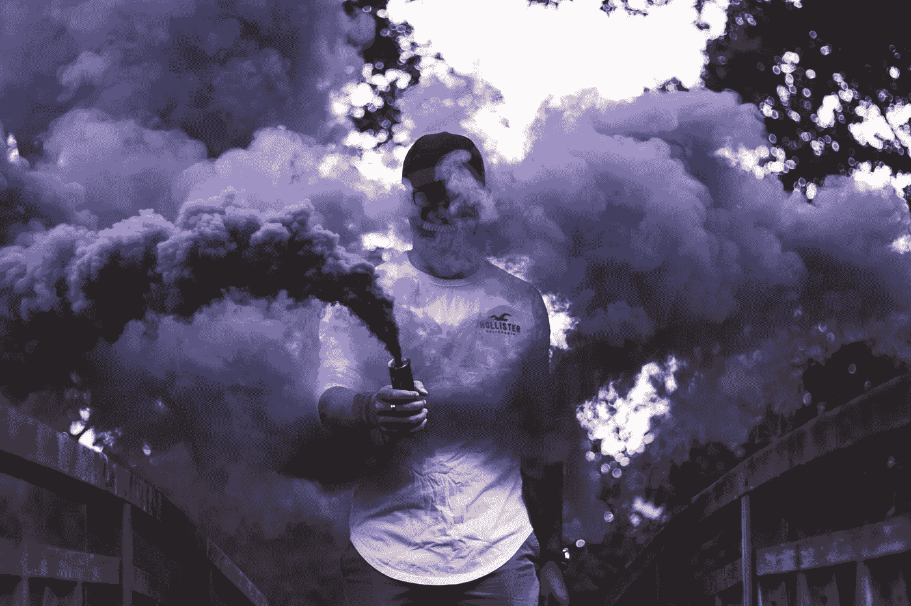
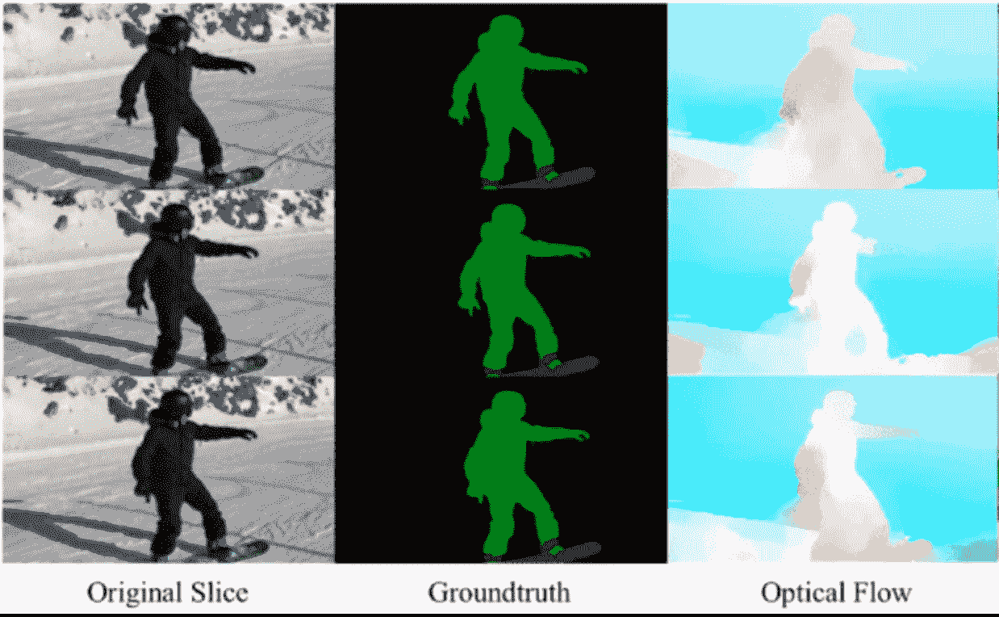
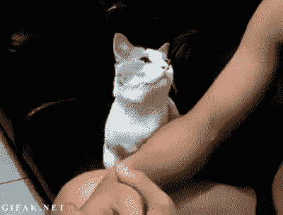
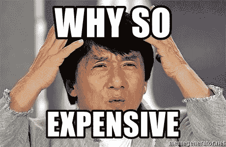

# 用于密集光流估计的自监督注意机制

> 原文：<https://towardsdatascience.com/self-supervised-attention-mechanism-for-dense-optical-flow-estimation-b7709af48efd?source=collection_archive---------30----------------------->

## 内部人工智能

## 使用自监督深度学习的多目标跟踪

在我们进入自我监督注意力的含义之前，让我们先了解一下光流估计的直觉，以及它如何作为人类和计算机视觉系统跟踪物体的一种方法。

[来源](https://unsplash.com/@gwendal)

人们一致认为，物体跟踪是人类婴儿在大约两到三个月的早期发展起来的基本能力。然而，在神经生理学的水平上，人类视觉系统的实际工作机制仍然有些模糊。与人类视觉系统类似，计算机视觉系统也广泛用于各种应用，如视频监控和自动驾驶。跟踪算法的目标是在给定的视频序列中重新定位在初始帧中已经识别的一组特定的对象。在与跟踪相关的研究文献中，它在两个主要类别下被研究，即视觉对象跟踪(VOT)和半监督视频对象分割(半 VOS)。第一种(VOT)旨在通过在整个视频序列中重新定位对象边界框来跟踪对象。而后者(半 VOS)通过像素级分割掩模在更细粒度的级别上跟踪对象。在这篇博客中，我们将讨论后一种方法背后的原始想法，即密集光流估计，以及这种密集跟踪方法是如何通过自我监督的注意机制实现的。

# 密集光流估计

稠密光流是光流概念的范畴之一。光流可以定义为视频序列的连续帧之间的物体运动，是物体和摄像机之间相对运动的结果。用科学的语言来解释，我们可以说，光流是图像中亮度模式的表观运动速度的分布，它是由物体和观察者的相对运动产生的。光流研究为*稀疏光流*和*密集光流*。*稀疏光流*导出帧中仅几个感兴趣像素的流矢量，这些流矢量描绘了对象的某个边缘或角落。另一方面，*密集光流*导出给定帧中所有像素的流矢量，从而以更多的计算和更低的速度为代价给出更高的精度。

网球运动员的密集光流估计

密集光流为视频序列中的每一帧的每个像素计算一个光流向量。与稀疏光流不同，这种方法为视频分割和运动结构学习等应用提供了更合适的输出。密集光流可以通过各种方法实现。其中，使用最简单的算法之一是 Farneback 方法。它基于 Gunner Farneback 的算法，Gunner Farneback 在 2003 年的“基于多项式展开的两帧运动估计”中解释了该算法。OpenCV 为这个算法提供了代码函数来寻找密集光流。要快速体验 Farneback 的算法是什么，请运行下面的代码片段。

运行上述代码后，您将在视频(Dense-optical-flow.mp4)中获得以下输出(右侧)

在下面的 GIF 中描述了可视化的光流。(重 gif，可能需要时间加载)

Farneback 算法是一种通过比较视频序列中的两个连续帧来估计某些图像特征的运动的有效技术。该算法首先使用[*多项式展开变换*](https://en.wikipedia.org/wiki/Polynomial_expansion) 通过二次多项式逼近图像帧的窗口。多项式展开变换是专门在空间域中设计的信号变换，并且可以用于任何维度的信号。该方法观察多项式变换的平移，以从多项式展开系数估计位移场。该方法然后在一系列迭代改进之后计算密集光流。在实现代码中，该算法从一个双通道流向量阵列(dx/dt，dy/dt)计算光流的方向和大小。然后，计算的方向和大小通过 HSV 颜色表示的值可视化，该值被设置为最大值 255 以获得最佳可见性。

# 用于密集光流估计的深度学习

从历史上看，光流问题是一个优化问题。在深度学习的最近发展之后，许多研究人员已经应用深度学习来解决这个优化问题，通过处理连续的视频帧作为输入来计算运动物体的光流。尽管这些方法一次只处理两个连续的帧，但是视频的本质仍然在这两个帧中被捕获。视频与图像的主要区别在于，除了图像的空间结构之外，视频还拥有时间结构。然而，视频也有其他形式，如声音，但它们在这种情况下没有用。因此，连续的帧流可以被解释为以特定时间分辨率(fps)操作的图像的集合。这意味着视频中的数据不仅在空间上编码，而且在顺序上编码，这使得对视频进行分类非常有趣，同时也具有挑战性。

[来源](https://www.researchgate.net/figure/Optical-flow-estimation-and-supervoxel-segmentation-for-multiple-temporal-frames-on-DAVIS_fig4_325867096)

通常，深度神经网络需要大量的训练数据来学习和优化逼近函数。但是在光流估计的情况下，训练数据尤其难以获得。这背后的主要原因是难以将图像中每一点的精确运动精确标记到亚像素精度。因此，为了解决标记视频数据的问题，计算机图形被用于通过指令来模拟大量的现实世界。由于指令是已知的，所以视频帧序列中每个像素的运动也是已知的。试图解决光流问题的一些最近的研究是 PWC-Nets、ADLAB-PRFlow 和 FlowNet。光流被许多应用广泛继承，如通过基于特征的光流技术从固定的摄像机或附着在车辆上的摄像机进行目标检测和多目标跟踪的车辆跟踪和交通分析。

# 用于跟踪的自我监督深度学习

如前所述，在视频分析领域，视觉跟踪对于许多任务都是不可或缺的，如识别、交互和几何。但与此同时，由于对标记视频数据的巨大需求，使用深度学习来完成这些任务变得不可行。无论如何，为了实现高性能，大规模跟踪数据集变得必要，这反过来需要大量的努力，从而使深度学习方法更加不切实际和昂贵。牢记这一点，最近的研究人员将他们的信心放在了一种有前途的方法上，通过利用大量未标记和原始视频数据，使机器在没有人类监督的情况下进行学习(标记数据)。这种对自我监督学习的追求始于谷歌研究团队的一项研究提案，该提案建议通过在视频彩色化的代理任务上训练一个模型来制作一个视觉跟踪系统，这不需要任何额外的标记数据(自我监督)。然而，研究表明，不是让模型预测输入灰度帧的颜色，而是它必须学会从一组参考帧中复制颜色，从而导致能够在时间设置中跟踪视频序列的空间特征的指向机制的出现。这些自我监督方法的可视化和实验表明，尽管在没有任何人工监督的情况下训练了网络，但是在网络内部自动出现了用于视觉特征跟踪的机制。在对从互联网上收集的未标记视频进行大量训练后，自监督模型能够跟踪视频帧序列的初始帧中指定的任何分割区域。然而，自我监督的深度学习方法是在假设帧序列中的颜色是时间稳定的情况下训练的。显然，也有例外，比如视频中的彩灯可以打开和关闭。

在视频着色代理任务上训练的指针机制- [来源](https://arxiv.org/abs/1806.09594)

跟踪中的自监督学习的目标是学习适合于沿着视频的帧序列匹配对应的特征嵌入。通过利用帧序列中的自然时空一致性来学习对应流。对应流可以理解为连续帧之间存在的特征相似流。用简单的语言来说，这种方法学习一种指针机制，它可以通过从一组参考帧中复制像素信息来重建目标图像。因此，要制作这样的模型，研究人员在设计架构时必须谨记一些注意事项。首先，我们必须防止模型学习该任务的琐碎解决方案(例如，基于低级颜色特征匹配连续帧)。第二，我们必须使跟踪器漂移不那么严重。跟踪器漂移(TD)主要是由于对象的遮挡、复杂的对象变形和随机的光照变化引起的。TD 通常通过在具有周期一致性和预定采样的长时间窗口上训练递归模型来处理。

对应流匹配视频上帧之间的对应关系— [来源](https://pythonawesome.com/self-supervised-learning-for-video-correspondence-flow/)

最后，在我们深入了解这个指针机制之前，让我们先了解一下上面提到的在设计这种模型时必须考虑的一些要点。首先，重要的是要记住，对应匹配是这些模型的基本构件。因此，在通过逐像素匹配进行帧重建时，模型很有可能会学习平凡解。为了防止模型过度适应一个平凡的解决方案，添加颜色抖动和通道方向的丢失是很重要的，这样该模型被迫依赖于低级别的颜色信息，并且必须对任何类型的颜色抖动都是鲁棒的。最后，如前所述，为了处理 TD，在具有前后一致性和预定采样的长时间窗口上进行递归训练是减轻跟踪器漂移问题的最佳方式。如果我们应用上述方法，我们可以确定模型的鲁棒性将增加，并且该方法将能够利用视频的时空一致性，并且颜色将能够充当用于学习对应关系的可靠的监督信号。

# 引擎盖下自我监督的注意力

如果你更深入地观察这里所学的指针机制，你会得出结论，它是一种注意力机制。是的，它最终是著名的 QKV 三重奏(查询-关键-值，大多数注意力机制的基础)。

[来源](https://www.kdnuggets.com/2020/02/illustrating-reformer.html)

正如我们所知，自监督模型的目标是通过有效地编码特征表示来学习鲁棒的对应匹配。简单地说，有效复制的能力是通过对代理任务的训练来实现的，其中模型通过线性组合来自参考帧的像素数据来学习重建目标帧，权重测量像素之间的对应强度。然而，分解这个过程，我们发现我们处理的每个输入帧都有一个三元组(Q，K，V)。Q、K、V 指的是查询、键和值。为了重建 T 帧中的像素 I，注意机制被用于从原始序列中的先前帧的子集复制像素。只是，在这种情况下，查询向量(q)是当前帧(I)的特征嵌入(目标帧)，关键向量是先前的 frame's(I⁰)特征嵌入(参考帧)。现在如果我们计算点积。)并取计算乘积的 softmax，我们可以得到当前帧(I)和先前参考帧(I⁰).)之间的相似性当在推断期间与参考实例分割掩模(V)相乘时，该计算的相似性矩阵将为我们的目标帧提供指针，从而实现密集光流估计。因此，这个指针只是 Q、K 和 V 的组合，是在这个自我监督系统下工作的实际注意力机制。

每个人都需要关注— [来源](https://media.giphy.com/media/eO5AL3tjtv5jq/giphy.gif)

注意力机制训练的一个关键要素是建立一个适当的信息瓶颈。为了避开注意力机制可能求助的任何学习捷径，使用了前面提到的有意丢弃输入颜色信息和通道丢失的技术。然而，颜色空间的选择仍然在通过自我监督训练这些注意机制中起着重要作用。许多研究工作已经验证了使用去相关颜色空间导致自监督密集光流估计的更好特征表示的推测。简单地说，使用 LAB 格式的图像比 RGB 格式的效果更好。这是因为所有 RGB 通道都包含一个亮度表示，使其与 Lab 中的亮度高度相关，因此成为一个微弱的信息瓶颈。

# 限制对最小化物理内存成本的关注

上面提出的注意机制通常伴随着高的物理存储成本。因此，处理用于对应匹配的高分辨率信息会导致较大的存储器需求和较慢的速度。

[来源](https://memegenerator.net/instance/62174526/jackie-chan-why-so-expensive)

为了避免存储开销，ROI 定位用于从存储体中非局部地估计候选窗口。直观上，我们可以说，对于时间上接近的帧，时空一致性自然存在于帧序列中。这种 ROI 定位导致注意力受限，因为现在目标帧中的像素仅与参考帧的空间相邻像素进行比较。可比较像素的数量由注意力被限制的扩大窗口的大小决定。窗口的扩展速率与存储体中当前帧和过去帧之间的时间距离成比例。在计算受限注意区域的亲和度矩阵之后，可以以非局部方式计算细粒度匹配分数。因此，通过提出的记忆增强的限制注意机制，该模型可以有效地处理高分辨率信息，而不会导致大量的物理内存开销。

# 结论

在这篇博客中，我们首先介绍了光流的概念，并研究了它在物体跟踪中的应用。我们还研究了这个概念如何启发了深度学习跟踪系统，以及自我监督和视觉注意力如何在制作这些系统中发挥关键作用。计算出的光流矢量开启了无数可能的应用，这些应用需要对视频进行如此深入的场景理解。所讨论的技术主要应用于行人跟踪、自主车辆导航和许多更新颖的应用。可以应用光流的各种应用仅受限于其设计者的独创性。

我个人认为，由于自我监督的普遍性和灵活性，它将很快成为被监督的对手的有力竞争者。在看不见的物体类别上，自我监督轻而易举地超越了大多数监督方法，这反映了它在未来的时间里的重要性和力量，因为我们正在朝着解决人类智能的方向前进。

我的博客反映了我的工作，并简单地传达了我对这些话题的理解。我对深度学习的解读可以和你不一样，但我的解读只能和我一样无误。

# 参考

[1] [1981-AI，Horn-Schunck 方法]确定光流

[2] [2003-SCIA，法内贝克流]基于多项式展开的两帧运动估计

[3] [2007-DAGM，TVL1 方法]一种基于对偶的实时 tv-l1 光流方法

[4]赖，子航，，谢."视频通信流的自我监督学习."*ArXiv*ABS/1905.00875(2019):n . PAG。

[5]赖，郑，陆，鄂，谢，魏(2020).主追踪器:记忆增强自我监督追踪器。 *ArXiv，abs/2002.07793* 。

[6]冯德里克、施里瓦斯塔瓦、法蒂、瓜达拉马和墨菲(2018 年)。跟踪是通过给视频着色而出现的。 *ArXiv，abs/1806.09594* 。